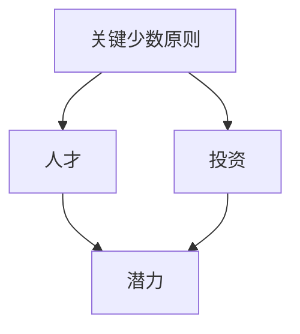
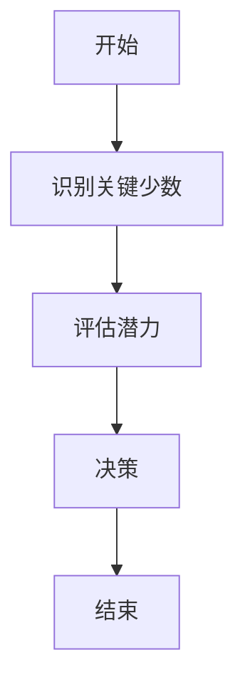

                 

---

# 《芒格的"关键少数"原则在量子科技人才投资中的应用》

> **关键词**：芒格，关键少数，量子科技，人才投资，风险管理，概率论

> **摘要**：本文探讨了芒格的"关键少数"原则在量子科技人才投资中的应用，通过分析量子科技的特性、人才需求和投资策略，结合概率论和系统工程的方法，提出了基于关键少数原则的人才评估和投资模型。文章结合实际案例，详细阐述了如何在量子科技领域中识别和培养关键少数人才，以实现科技突破和投资回报的最大化。

---

## 第1章：芒格的关键少数原则

### 1.1 芒格的关键少数原则概述

芒格的"关键少数"原则（The Law of Lollapalooza）是一种基于多因素协同作用的投资策略，强调在复杂系统中，关键少数因素往往对整体结果起决定性作用。这一原则源自芒格的"心智模型"理论，认为成功的投资需要综合运用多个学科的原理，从而在关键点上形成竞争优势。

#### 1.1.1 关键少数原则的定义

关键少数原则指出，在任何系统中，关键的少数因素（例如人、资源或机会）对整体价值的贡献远超其余部分。这一原则的核心在于识别和聚焦这些关键因素，从而在资源有限的情况下实现最大化的收益。

#### 1.1.2 芒格的关键少数原则的核心思想

芒格的关键少数原则强调：

1. **聚焦**：将资源集中投入到最关键的机会上。
2. **杠杆效应**：通过关键因素的优化实现整体收益的最大化。
3. **概率思维**：基于概率论，选择那些具有高潜力且风险可控的机会。

#### 1.1.3 关键少数原则的数学模型

关键少数原则可以用概率论中的**幂律分布**（Pareto Principle）来描述，即80%的结果往往由20%的因素决定。数学模型如下：

$$ P = \frac{k}{n} $$

其中，\( P \) 表示关键少数的比例，\( k \) 表示关键少数的数量，\( n \) 表示总人数。

---

### 1.2 芒格的关键少数原则的特点

#### 1.2.1 关键少数原则的属性对比表格

以下是关键少数原则与其他投资原则的对比表格：

| 属性 | 关键少数原则 | 传统投资原则 |
|------|--------------|--------------|
| 核心要素 | 关键少数因素 | 平均分布因素 |
| 适用场景 | 高潜力、高风险领域 | 低潜力、低风险领域 |
| 投资策略 | 聚焦关键少数 | 分散投资 |

#### 1.2.2 芒格的关键少数原则的ER实体关系图

以下是关键少数原则的实体关系图：

---

## 第2章：量子科技的现状与发展趋势

### 2.1 量子科技的定义与特点

#### 2.1.1 量子科技的定义

量子科技是基于量子力学原理，利用量子叠加、纠缠和测不准原理等特性，发展出的新一代信息技术，包括量子计算、量子通信和量子测量等领域。

#### 2.1.2 量子科技的核心特点

1. **指数级增长**：量子计算的计算能力呈指数级增长，远超经典计算机。
2. **颠覆性创新**：量子科技将颠覆现有信息处理方式，推动人工智能、密码学等领域的发展。
3. **高技术门槛**：量子科技的研发需要极高的技术能力和跨学科知识。

#### 2.1.3 量子科技与传统科技的区别

| 特性 | 量子科技 | 传统科技 |
|------|-----------|-----------|
| 发展速度 | 极快 | 较慢 |
| 技术门槛 | 极高 | 较低 |
| 应用领域 | 信息技术、密码学 | 制造业、能源 |

---

### 2.2 量子科技人才的需求与现状

#### 2.2.1 量子科技领域的人才需求

1. **量子计算**：需要量子算法设计、量子电路优化等人才。
2. **量子通信**：需要量子密码学、量子协议设计等人才。
3. **量子测量**：需要量子传感器设计、量子信号处理等人才。

#### 2.2.2 当前量子科技人才的供给情况

1. **供给不足**：全球范围内，量子科技领域的高端人才极度稀缺。
2. **竞争激烈**：各大科技公司和高校都在争夺量子科技领域的顶尖人才。

#### 2.2.3 量子科技人才投资的必要性

1. **技术突破的需要**：量子科技的突破依赖于顶尖人才的创新。
2. **资源分配的效率**：通过关键少数原则，可以在有限资源下最大化投资回报。

---

## 第3章：关键少数原则在量子科技人才投资中的核心概念

### 3.1 关键少数原则的核心原理

#### 3.1.1 关键少数原则的数学模型

关键少数原则在量子科技人才投资中的数学模型可以表示为：

$$ P = \frac{k}{n} $$

其中，\( P \) 表示关键少数的比例，\( k \) 表示关键少数的数量，\( n \) 表示总人数。

---

#### 3.1.2 芒格的关键少数原则的算法流程图

以下是关键少数原则的算法流程图：

---

### 3.2 量子科技人才投资的关键少数策略

#### 3.2.1 人才筛选标准

以下是量子科技人才筛选的关键标准：

| 标准 | 描述 |
|------|------|
| 技术能力 | 是否具备量子计算、量子通信等领域的核心技能 |
| 创新能力 | 是否具有突破性创新的能力 |
| 学术背景 | 是否来自顶尖高校或研究机构 |

---

## 第4章：量子科技人才投资中的关键少数策略

### 4.1 量子科技人才投资的关键少数模型

#### 4.1.1 概率论在人才评估中的应用

概率论是关键少数原则的重要工具。以下是概率论在量子科技人才评估中的应用：

$$ P = \frac{k}{n} $$

其中，\( P \) 表示关键少数的概率，\( k \) 表示关键少数的数量，\( n \) 表示总人数。

---

### 4.2 量子科技人才投资的系统架构设计

#### 4.2.1 量子科技人才评估系统的功能设计

以下是量子科技人才评估系统的功能模块：

| 模块 | 描述 |
|------|------|
| 数据输入 | 输入量子科技人才的基本信息和项目经验 |
| 特征提取 | 提取关键特征，如技术能力、创新能力等 |
| 潜力评估 | 评估人才的潜力，生成概率分布 |
| 决策输出 | 输出投资建议 |

---

## 第5章：量子科技人才投资中的关键少数策略

### 5.1 量子科技人才投资的关键少数模型

#### 5.1.1 量子科技人才投资的概率模型

概率模型是关键少数原则的核心工具。以下是量子科技人才投资的概率模型：

$$ P = \frac{k}{n} $$

其中，\( P \) 表示关键少数的概率，\( k \) 表示关键少数的数量，\( n \) 表示总人数。

---

### 5.2 量子科技人才投资的系统架构设计

#### 5.2.1 量子科技人才评估系统的功能设计

以下是量子科技人才评估系统的功能模块：

| 模块 | 描述 |
|------|------|
| 数据输入 | 输入量子科技人才的基本信息和项目经验 |
| 特征提取 | 提取关键特征，如技术能力、创新能力等 |
| 潜力评估 | 评估人才的潜力，生成概率分布 |
| 决策输出 | 输出投资建议 |

---

## 第6章：量子科技人才投资中的关键少数策略

### 6.1 量子科技人才投资的关键少数模型

#### 6.1.1 量子科技人才投资的概率模型

概率模型是关键少数原则的核心工具。以下是量子科技人才投资的概率模型：

$$ P = \frac{k}{n} $$

其中，\( P \) 表示关键少数的概率，\( k \) 表示关键少数的数量，\( n \) 表示总人数。

---

### 6.2 量子科技人才投资的系统架构设计

#### 6.2.1 量子科技人才评估系统的功能设计

以下是量子科技人才评估系统的功能模块：

| 模块 | 描述 |
|------|------|
| 数据输入 | 输入量子科技人才的基本信息和项目经验 |
| 特征提取 | 提取关键特征，如技术能力、创新能力等 |
| 潜力评估 | 评估人才的潜力，生成概率分布 |
| 决策输出 | 输出投资建议 |

---

## 第7章：总结与展望

### 7.1 本章总结

芒格的关键少数原则为量子科技人才投资提供了重要的理论支持和实践指导。通过聚焦关键少数人才，可以在有限资源下实现最大化的投资回报。

---

### 7.2 未来展望

随着量子科技的快速发展，关键少数原则的应用将更加广泛。未来的研究可以进一步探索关键少数原则在量子科技人才评估中的具体应用，以及如何结合人工智能技术进一步优化人才评估模型。

---

**作者：AI天才研究院/AI Genius Institute & 禅与计算机程序设计艺术 /Zen And The Art of Computer Programming**

