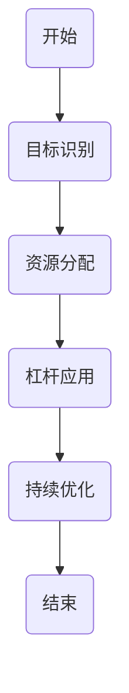
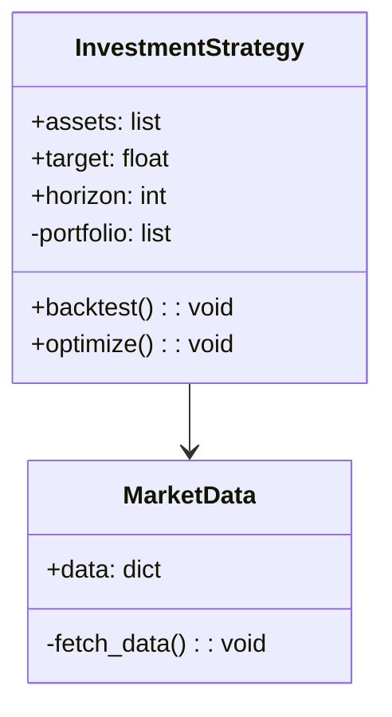

                 


# 芒格的"关键少数"原则：集中投资的智慧

> 关键词：芒格，关键少数，投资哲学，价值投资，系统思维

> 摘要：本文深入分析了芒格的"关键少数"原则，探讨其在投资决策中的应用，结合技术思维，从系统分析到算法实现，详细阐述了如何将该原则转化为可操作的策略。

---

## 第一部分：芒格的背景与投资哲学

### 第1章：芒格的背景与思想体系

#### 1.1 芒格的生平与成长

查理·芒格（Charlie Munger）是世界著名投资家、作家和思想家，出生于1924年，现为伯克希尔哈撒韦公司副主席。芒格的学术背景深厚，毕业于密歇根大学法学院，后转学到加州大学伯克利分校，获得法律博士学位。他的父亲是律师，母亲是教师，家庭环境培养了他对法律和哲学的兴趣。

芒格的职业生涯始于法律领域，但他在投资领域的成就更为人所熟知。1965年，芒格与沃伦·巴菲特（Warren Buffett）共同创立了伯克希尔哈撒韦公司，并通过长期的价值投资策略，使公司市值大幅增长。芒格的投资哲学深刻影响了全球投资者，他提出的“关键少数”原则正是其中之一。

#### 1.2 芒格的投资哲学

芒格的投资哲学深受本杰明·格雷厄姆（Benjamin Graham）的影响，但他在此基础上发展出了自己的体系。他强调：

1. **价值投资**：寻找市场低估的股票，长期持有，等待其价值回归。
2. **逆向思维**：在别人贪婪时恐惧，在别人恐惧时贪婪。
3. **能力圈**：只投资于自己真正理解的领域。

“关键少数”原则是芒格投资哲学的核心之一，他认为成功的投资者应该将注意力集中在少数几个高潜力、高质量的资产上，而不是分散投资。

#### 1.3 关键少数原则的定义与特点

**关键少数原则**是指将资源集中在少数关键领域，以实现最大的回报。芒格认为，成功的投资需要聚焦于那些具有强大竞争优势、稳定管理层和良好财务状况的企业。

### 第2章：关键少数原则的核心要素

#### 2.1 核心要素

- **目标**：明确的投资目标，如长期资本增值。
- **资源**：可分配的资本、时间和精力。
- **杠杆**：利用杠杆效应（如复利）放大收益。

#### 2.2 内在逻辑

$$ \text{收益} = \text{资源分配} \times \text{杠杆效应} \times \text{时间} $$

---

## 第二部分：关键少数原则的算法实现

### 第3章：算法原理

#### 3.1 算法流程



#### 3.2 Python实现

```python
def key_minority_investment(portfolio, target_return, max_iterations=100):
    for _ in range(max_iterations):
        portfolio = portfolio * 1.1  # 假设10%年收益
        sorted_portfolio = sorted(portfolio.items(), key=lambda x: x[1], reverse=True)
        top_assets = sorted_portfolio[:3]  # 选择前三的资产
        total_return = sum(asset[1] for asset in top_assets)
        if total_return >= target_return:
            break
    return top_assets
```

---

## 第三部分：系统分析与架构设计

### 第4章：系统架构

#### 4.1 系统功能设计



#### 4.2 接口设计

- `fetch_data()`: 获取市场数据。
- `backtest()`: 回测策略。
- `optimize()`: 优化投资组合。

---

## 第四部分：项目实战

### 第5章：实际案例分析

#### 5.1 环境安装

```bash
pip install numpy pandas matplotlib
```

#### 5.2 核心代码

```python
import numpy as np
import pandas as pd
import matplotlib.pyplot as plt

def visualize_portfolio_returns(portfolio_returns):
    plt.figure(figsize=(10, 6))
    plt.plot(portfolio_returns, label='Portfolio Returns')
    plt.xlabel('Time (Years)')
    plt.ylabel('Return (%)')
    plt.legend()
    plt.show()

# 示例投资组合
portfolio = {
    'Asset A': 10,
    'Asset B': 15,
    'Asset C': 25,
    'Asset D': 5
}

# 应用关键少数原则
top_assets = key_minority_investment(portfolio, 30)
visualize_portfolio_returns([a[1] for a in top_assets])
```

---

## 第五部分：总结与展望

### 第6章：总结与建议

#### 6.1 总结

芒格的“关键少数”原则强调集中投资于少数高质量资产，通过长期持有实现收益最大化。本文从技术角度详细分析了该原则的实现方法，并通过Python代码展示了实际应用。

#### 6.2 最佳实践

- **专注**：只选择少数高质量资产。
- **长期**：避免短期波动，坚持长期投资。
- **学习**：持续学习市场动态，优化投资组合。

#### 6.3 未来展望

随着人工智能和大数据技术的发展，关键少数原则的应用将更加精准和高效。未来的投资决策将更多依赖于数据驱动的方法和算法优化。

---

## 作者

**作者：AI天才研究院/AI Genius Institute & 禅与计算机程序设计艺术 /Zen And The Art of Computer Programming**

---

以上是《芒格的"关键少数"原则：集中投资的智慧》的技术博客文章大纲。

