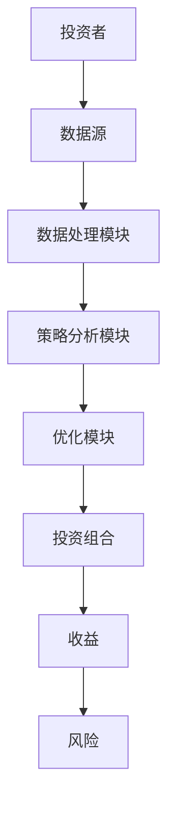
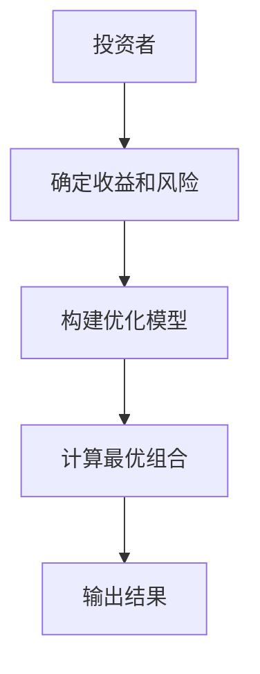

                 


# 芦苇的"关键少数"原则：集中投资的智慧与风险

> 关键词：芒格，关键少数，投资原则，集中投资，风险管理，投资策略，系统设计

> 摘要：本文深入探讨了芒格的"关键少数"原则，从理论基础、算法原理、系统架构到实际案例，全面解析了这一投资策略的核心思想。通过详细分析，本文揭示了集中投资的智慧与风险，并为读者提供了实践中的最佳策略和注意事项。

---

# 第一部分: 芦苇投资理念概述

## 第1章: 芦苇的生平与投资理念

### 1.1 芦苇的早年经历

芦苇（Munger）出生于1924年，早年在哈佛大学学习法律，后转至哥伦比亚大学法学院，师从Benjamin Cardozo。他在法律领域展现了卓越的天赋，但真正让他闻名于世的是他在投资领域的成就。芦苇与巴菲特（Warren Buffett）的合作堪称投资史上的传奇，两人共同创立了伯克希尔哈撒韦公司（Berkshire Hathaway），并将其打造成全球最成功的投资公司之一。

### 1.2 芦苇与巴菲特的合作

芦苇与巴菲特的合作始于1959年，当时巴菲特邀请芦苇加入伯克希尔哈撒韦，担任副总裁。两人共同的理念是价值投资，即寻找被市场低估的公司进行长期投资。芦苇的多元思维模型（mental models）和巴菲特的安全边际理论（margin of safety）相辅相成，为他们的投资决策提供了坚实的基础。

### 1.3 芦苇的主要著作与思想

芦苇的著作《Poor Charlie's Almanack》是投资界的重要经典之一，书中收录了他多年的投资思想和演讲。芦苇强调，投资不仅仅是对数字的分析，更是对人性的洞察。他的“关键少数”原则就是这种思想的集中体现。

---

## 第2章: "关键少数"原则的定义与背景

### 2.1 "关键少数"原则的核心概念

“关键少数”原则的核心思想是：在任何系统中，少数关键因素决定了整体的绩效。在投资领域，这意味着投资者应该集中精力分析和投资于那些具有决定性优势的少数公司或行业。通过集中投资，投资者可以最大限度地放大优势，同时减少分散投资带来的风险。

### 2.2 "关键少数"原则的起源与演变

“关键少数”原则并非芦苇首创，而是源于管理学中的帕累托原理（Pareto Principle），即80%的结果往往来自20%的原因。芦苇将其应用于投资领域，提出投资者应该专注于寻找那些能够带来绝大多数收益的少数投资标的。

### 2.3 "关键少数"在投资中的应用

在实际投资中，“关键少数”原则意味着投资者需要：

1. **筛选优质标的**：选择具有强大竞争优势、管理团队优秀、财务状况稳健的公司。
2. **集中投资**：将大部分资金投入到少数优质标的中，而不是分散投资于多个不确定的项目。
3. **长期持有**：耐心持有优质标的，避免频繁交易带来的成本和风险。

---

## 第3章: "关键少数"原则的理论基础

### 3.1 投资决策的数学模型

#### 3.1.1 投资回报的期望值计算

投资回报的期望值可以通过以下公式计算：

$$ E(R) = \sum (P_i \times R_i) $$

其中，\( P_i \) 是第 \( i \) 种投资的概率，\( R_i \) 是第 \( i \) 种投资的回报率。

#### 3.1.2 投资风险的方差与标准差

投资风险可以用方差和标准差来衡量：

$$ \sigma^2 = \sum [(R_i - E(R))^2 \times P_i] $$

$$ \sigma = \sqrt{\sigma^2} $$

#### 3.1.3 投资组合的夏普比率

夏普比率衡量投资组合的风险调整后收益：

$$ \text{夏普比率} = \frac{E(R_p) - R_f}{\sigma_p} $$

其中，\( E(R_p) \) 是投资组合的期望收益，\( R_f \) 是无风险利率，\( \sigma_p \) 是投资组合的标准差。

---

## 第4章: "关键少数"原则的系统架构

### 4.1 投资决策系统的模块划分

#### 4.1.1 数据采集与处理模块

数据采集与处理模块负责从市场数据源（如股票价格、财务报表等）获取数据，并进行清洗和预处理。

#### 4.1.2 投资策略分析模块

投资策略分析模块基于“关键少数”原则，筛选出具有优势的少数投资标的。

#### 4.1.3 投资组合优化模块

投资组合优化模块根据筛选出的优质标的，优化投资组合，降低风险。

### 4.2 系统架构的实体关系图



---

## 第5章: 项目实战与案例分析

### 5.1 环境配置与数据准备

#### 5.1.1 环境搭建

- 使用Python 3.8及以上版本
- 安装必要的库：Pandas、NumPy、Matplotlib、Scikit-learn

#### 5.1.2 数据来源与处理

从Yahoo Finance获取历史股价数据，清洗后存储为DataFrame格式。

```python
import pandas as pd
import numpy as np

# 下载数据
data = pd.read_csv('stock_data.csv')
# 清洗数据
data.dropna(inplace=True)
```

---

### 5.2 核心算法实现

#### 5.2.1 马科维茨均值-方差模型



```python
import numpy as np
from scipy.optimize import minimize

# 定义目标函数
def objective(weights, returns, cov_matrix):
    return np.dot(weights.T, np.dot(returns, weights))

# 定义约束条件
def constraint(weights, returns, target_return):
    return np.dot(weights, returns) - target_return

# 求解优化问题
def optimize_portfolio(returns, cov_matrix, target_return):
    n = len(returns)
    init_weights = np.array([1.0/n]*n)
    result = minimize(objective, init_weights, args=(returns, cov_matrix), method='SLSQP')
    return result.x
```

---

## 第6章: 最佳实践与注意事项

### 6.1 投资策略小结

“关键少数”原则是一种高效的集中投资策略，通过筛选优质标的和集中投资，可以最大限度地放大收益，同时降低风险。

### 6.2 投资注意事项

- **分散风险**：虽然集中投资，但仍需注意行业和资产类别的分散。
- **长期持有**：避免频繁交易，降低交易成本和税收负担。
- **持续学习**：市场变化莫测，需不断学习和调整投资策略。

### 6.3 拓展阅读

- 《Poor Charlie's Almanack》
- 《投资最重要的少数事》
- 《投资的艺术》

---

# 作者：AI天才研究院/AI Genius Institute & 禅与计算机程序设计艺术 /Zen And The Art of Computer Programming

---

这篇文章通过详细的理论分析、系统设计和实际案例，全面解析了芒格的“关键少数”原则。从数学模型到系统架构，从算法实现到投资策略，为读者提供了一个完整的学习和实践框架。希望读者能够通过这篇文章，深刻理解集中投资的智慧与风险，并在实际投资中灵活运用这一原则。

