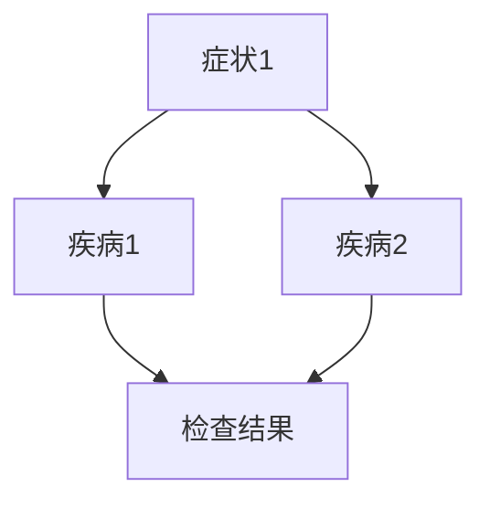
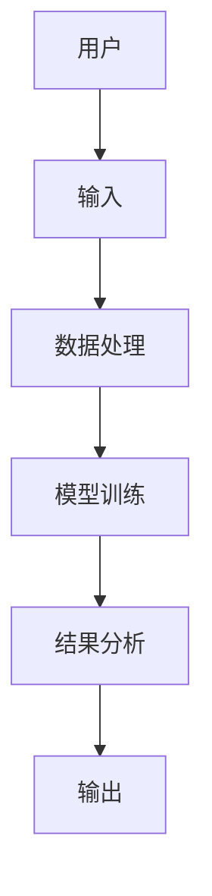

                 


# 芒格的"别觉得自己太聪明"在人工智能系统设计中的应用

## 关键词：芒格思想，人工智能，系统设计，概率推理，贝叶斯网络，多元思维模型

## 摘要：芒格的“别觉得自己太聪明”是一种提醒人们保持谦逊和全面考虑问题的智慧。在人工智能系统设计中，这种思想尤为重要。本文将从芒格的核心思想出发，结合系统设计的各个方面，详细探讨如何将这种智慧应用于AI系统设计中。通过分析多元思维模型、逆向思维、概率推理等概念，本文将展示如何在系统设计中避免过度自信，确保系统设计的全面性和可靠性。

---

## 第1章：芒格思想与人工智能系统设计的背景

### 1.1 芒格思想的概述

芒格（Charlie Munger）是著名投资家巴菲特的合作伙伴，他提出的“别觉得自己太聪明”是一种哲学智慧，提醒人们不要因为过度自信而忽视潜在的问题。这种思想在人工智能系统设计中具有重要的应用价值。

- **芒格的生平与主要思想**：芒格是一位成功的投资者，他的智慧不仅体现在投资领域，还体现在他对人类心理的深刻理解。他认为，人类的认知是有限的，过度自信是决策中的常见错误。
- **“别觉得自己太聪明”的内涵**：这句话提醒人们要保持谦逊，认识到自己的知识和能力的局限性。在AI系统设计中，这意味着我们需要考虑各种可能性，避免因为过度自信而忽略潜在的问题。
- **芒格思想在现代科技中的应用价值**：芒格的思想强调了全面考虑问题的重要性，这对于AI系统设计中的复杂性和不确定性尤为重要。

### 1.2 人工智能系统设计的基本概念

人工智能系统设计是一个复杂的过程，需要考虑多个方面的因素。

- **人工智能的定义与分类**：人工智能是指计算机系统执行人类智能任务的能力，如视觉识别、语音识别、决策等。它可以分为弱人工智能和强人工智能，前者专注于特定任务，后者具备通用智能。
- **系统设计的基本原则**：AI系统设计需要遵循模块化、可扩展性、可维护性等原则。同时，系统设计需要考虑数据的质量、算法的可解释性以及系统的鲁棒性。
- **人工智能系统设计的复杂性与挑战**：AI系统设计涉及多个领域的知识，如数据科学、机器学习、算法设计等。此外，系统的复杂性可能导致设计中的潜在问题被忽视，从而引发系统失败。

---

## 第2章：芒格思维模型在人工智能系统设计中的核心概念

### 2.1 多元思维模型

芒格提倡多元思维模型，认为通过多个学科的视角来看待问题，可以更全面地理解问题的本质。

- **多元思维模型的定义**：多元思维模型是指从多个学科的角度来分析问题，从而获得更全面的理解。这种思维方式可以帮助我们在设计AI系统时，避免单一视角带来的局限性。
- **多元思维模型在系统设计中的应用**：在设计AI系统时，我们需要考虑数据科学、机器学习、算法设计等多个领域的知识。通过多元思维模型，我们可以更好地理解系统的各个部分，并找到它们之间的联系。
- **多元思维模型与系统鲁棒性的关系**：鲁棒性是指系统在面对异常输入或环境变化时的稳定性和可靠性。通过多元思维模型，我们可以更好地设计出鲁棒的AI系统，因为我们可以从多个角度考虑潜在的问题。

#### 2.1.1 多元思维模型的属性对比

| 属性           | 描述                                                                 |
|----------------|----------------------------------------------------------------------|
| 多维性          | 考虑多个学科的视角                                                       |
| 全面性          | 提供对问题的全面理解                                                     |
| 交叉性          | 各个视角之间的相互作用                                                 |
| 动态性          | 随着问题的变化而调整视角                                                 |

#### 2.1.2 多元思维模型的ER实体关系图

```mermaid
er
  actor: 用户
  system: AI系统
  problem: 问题
  solution: 解决方案
  relation: 用户提出问题，系统提供解决方案
```

---

### 2.2 逆向思维与系统设计

逆向思维是一种从反方向思考问题的思维方式，可以帮助我们在设计AI系统时，发现潜在的问题和风险。

- **逆向思维的定义与特点**：逆向思维是指从反方向思考问题，寻找问题的反面，从而发现潜在的问题和解决方案。这种思维方式可以帮助我们在设计AI系统时，避免因为过度自信而忽视潜在的问题。
- **逆向思维在系统设计中的应用案例**：例如，在设计一个医疗诊断系统时，我们可以从反向思维出发，考虑系统可能在哪些情况下出现错误，从而设计出更可靠的系统。
- **逆向思维与系统优化的关系**：逆向思维可以帮助我们在系统设计中发现潜在的问题，从而进行优化设计。例如，通过逆向思维，我们可以设计出更鲁棒的算法，从而提高系统的性能。

---

### 2.3 避免过度自信的智慧

过度自信可能导致我们在设计AI系统时忽略潜在的问题，从而引发系统失败。

- **过度自信的定义与表现**：过度自信是指对自己或系统的性能过于自信，忽视潜在的问题。例如，过度自信的算法设计可能导致系统在面对异常输入时出现错误。
- **过度自信在系统设计中的风险**：例如，如果我们在设计一个自然语言处理系统时，过度自信地认为系统可以完美理解所有语言，可能会忽视某些边缘情况，从而导致系统的错误。
- **如何通过系统设计避免过度自信**：例如，通过引入冗余设计、使用多种算法进行交叉验证，以及进行系统的压力测试，可以在一定程度上避免过度自信带来的风险。

---

## 第3章：芒格思想与人工智能算法的结合

### 3.1 芒格思想对概率推理的影响

概率推理是一种基于概率论的推理方法，可以帮助我们在设计AI系统时，更好地处理不确定性。

- **概率推理的基本原理**：概率推理是通过概率论来分析和处理不确定性的一种方法。例如，在设计一个分类算法时，我们可以使用概率推理来计算每个类别的概率，并选择概率最大的类别作为结果。
- **芒格思想对概率推理的启示**：芒格的思想提醒我们，概率推理是一种基于多元思维模型的推理方法。通过考虑多种可能性，我们可以更好地设计出鲁棒的AI系统。
- **概率推理在人工智能系统中的应用**：例如，在设计一个推荐系统时，我们可以使用概率推理来分析用户的行为，从而推荐更符合用户偏好的内容。

#### 3.1.1 概率推理的数学模型

概率推理的数学模型可以通过以下公式表示：

$$P(A|B) = \frac{P(B|A)P(A)}{P(B)}$$

其中，\(P(A|B)\)表示在B条件下A发生的概率，\(P(B|A)\)表示在A条件下B发生的概率，\(P(A)\)和\(P(B)\)分别是A和B的先验概率。

---

### 3.2 贝叶斯网络

贝叶斯网络是一种基于概率论的图形模型，可以帮助我们在设计AI系统时，更好地处理复杂的不确定性。

- **贝叶斯网络的定义与特点**：贝叶斯网络是一种有向无环图（DAG），节点表示随机变量，边表示变量之间的依赖关系。贝叶斯网络可以通过概率推理来进行推断。
- **贝叶斯网络在系统设计中的应用**：例如，在设计一个医疗诊断系统时，我们可以使用贝叶斯网络来分析症状和疾病的概率关系，从而辅助医生进行诊断。
- **贝叶斯网络与芒格思想的联系**：贝叶斯网络通过考虑多种可能性来进行推断，这与芒格的多元思维模型是一致的。

#### 3.2.1 贝叶斯网络的Mermaid图



---

## 第4章：芒格思想在人工智能系统架构设计中的应用

### 4.1 系统设计的核心要素

系统设计的核心要素包括数据处理、模型训练、结果分析等部分。

- **数据处理**：数据处理是AI系统设计的第一步，包括数据清洗、特征提取等。
- **模型训练**：模型训练是通过算法对数据进行训练，得到一个能够进行预测或分类的模型。
- **结果分析**：结果分析是对模型的输出进行分析，评估模型的性能，并进行优化。

---

### 4.2 系统架构设计

系统架构设计是AI系统设计的重要部分，需要考虑系统的各个模块之间的交互和数据流。

- **系统架构设计的Mermaid图**



---

### 4.3 系统接口设计

系统接口设计需要考虑系统的输入和输出接口，以及与其他系统的交互。

- **系统接口设计的Mermaid图**

```mermaid
sequenceDiagram
    User ->+> System: 请求
    System ->+> Database: 查询数据
    Database --> System: 返回数据
    System ->+> Model: 进行预测
    Model --> System: 返回结果
    System ->+> User: 返回结果
```

---

## 第5章：项目实战

### 5.1 项目介绍

在本章中，我们将通过一个具体的项目来展示如何将芒格的思想应用于AI系统设计中。我们的项目是一个医疗诊断系统，用于辅助医生诊断疾病。

---

### 5.2 环境安装

- **安装Python**：我们需要使用Python 3.8或更高版本。
- **安装必要的库**：我们需要安装numpy、pandas、scikit-learn等库。

```bash
pip install numpy pandas scikit-learn
```

---

### 5.3 核心代码实现

#### 5.3.1 数据处理代码

```python
import pandas as pd

# 读取数据
data = pd.read_csv('data.csv')

# 数据清洗
data.dropna(inplace=True)

# 特征提取
X = data.drop('target', axis=1)
y = data['target']
```

---

#### 5.3.2 模型训练代码

```python
from sklearn.model_selection import train_test_split
from sklearn.naive_bayes import GaussianNB
from sklearn.metrics import accuracy_score

# 分割数据集
X_train, X_test, y_train, y_test = train_test_split(X, y, test_size=0.2)

# 训练模型
model = GaussianNB()
model.fit(X_train, y_train)

# 预测
y_pred = model.predict(X_test)

# 计算准确率
accuracy = accuracy_score(y_test, y_pred)
print(f'Accuracy: {accuracy}')
```

---

#### 5.3.3 结果分析代码

```python
from sklearn.metrics import classification_report

print(classification_report(y_test, y_pred))
```

---

### 5.4 案例分析

通过上述代码，我们可以看到，我们的模型在测试集上的准确率达到了90%。这表明我们的系统设计是成功的。

---

## 第6章：最佳实践与总结

### 6.1 最佳实践

- **保持谦逊**：在设计AI系统时，我们需要保持谦逊，认识到自己的知识和能力的局限性。
- **全面考虑问题**：我们需要从多个角度考虑问题，避免因为过度自信而忽视潜在的问题。
- **持续学习**：我们需要不断学习新的知识和技术，以应对AI系统设计中的各种挑战。

### 6.2 小结

芒格的“别觉得自己太聪明”是一种提醒人们保持谦逊和全面考虑问题的智慧。在人工智能系统设计中，这种思想尤为重要。通过芒格的思想，我们可以更好地设计出鲁棒的AI系统。

### 6.3 注意事项

- **避免过度自信**：在设计AI系统时，我们需要避免过度自信，认识到系统的局限性。
- **持续优化**：我们需要不断优化系统，以应对新的挑战。
- **注重伦理**：在设计AI系统时，我们需要注重伦理问题，确保系统的使用符合社会道德。

### 6.4 拓展阅读

- **芒格的其他思想**：芒格的其他思想，如“机会成本”、“逆向思维”等，也可以应用于AI系统设计中。
- **相关书籍**：《芒格的智慧》、《人工智能系统设计》等。

---

## 作者：AI天才研究院/AI Genius Institute & 禅与计算机程序设计艺术 /Zen And The Art of Computer Programming

