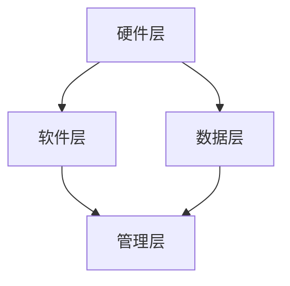

                 

# 芒格的"别觉得自己太聪明"在量子科技创新管理中的应用

## 关键词
芒格思想, 量子科技, 创新管理, 决策制定, 风险管理

## 摘要
本文探讨了芒格"别觉得自己太聪明"的思想在量子科技创新管理中的应用。通过分析量子科技的基本原理、管理特点以及芒格思想的核心理念，本文揭示了如何将芒格的智慧应用于量子科技创新管理的实践中。文章从量子科技的基本概念、芒格思想的管理启示、量子科技创新管理的核心要素、芒格思想与量子科技创新管理的结合、量子科技创新管理中的决策与风险管理等方面展开论述，结合实际案例和系统架构设计，提出了具体的实施路径和应用策略。

---

## 第1章: 芒格思想与量子科技创新管理的结合

### 1.1 芒格思想的背景与形成

#### 1.1.1 芒格思想的背景
芒格思想由查理·芒格提出，强调“别觉得自己太聪明”，即在决策过程中保持谦逊和理性，避免过度自信和盲目决策。这一思想源于芒格对心理学、经济学和管理学的深刻理解。

#### 1.1.2 "别觉得自己太聪明"的核心内涵
- **谦逊与理性**：芒格认为，人类的决策过程容易受到认知偏差的影响，因此在决策时需要保持谦逊，避免过度自信。
- **多元思维模型**：芒格强调通过多学科思维模型来分析问题，避免单一维度的思考。
- **风险管理**：芒格的思想注重在决策中考虑潜在风险，并制定相应的应对策略。

#### 1.1.3 芒格思想在管理学中的应用价值
- **提升决策质量**：芒格的思想帮助管理者避免认知偏差，做出更理性的决策。
- **增强风险管理能力**：芒格的风险管理理念为复杂系统的管理提供了重要启示。
- **促进团队协作**：芒格的谦逊态度有助于团队协作和知识共享。

### 1.2 量子科技的基本概念与特点

#### 1.2.1 量子科技的基本概念
- **量子力学**：研究微观粒子的行为规律，是量子科技的理论基础。
- **量子计算**：利用量子叠加和量子纠缠原理进行计算，具有强大的并行计算能力。
- **量子通信**：利用量子纠缠实现信息的高速传输和加密通信。

#### 1.2.2 量子科技的特点
- **非线性**：量子系统的行为不符合经典物理的线性叠加原理。
- **不确定性**：量子系统的状态具有概率性，难以精确预测。
- **复杂性**：量子系统的行为依赖于系统的整体状态，而非单独部分。

### 1.3 芒格思想与量子科技的关联性

#### 1.3.1 量子科技创新管理的复杂性
- 量子科技的研发涉及多个学科领域，具有高度的复杂性。
- 量子科技的不确定性使得传统的管理方法难以直接应用。

#### 1.3.2 芒格思想在量子科技管理中的潜在应用
- **风险管理**：芒格的多元思维模型可以帮助管理者识别和应对量子科技研发中的不确定性。
- **决策制定**：芒格的谦逊态度和理性决策理念可以指导量子科技创新中的重大决策。
- **团队协作**：芒格的思想有助于构建跨学科的协作团队，促进知识共享。

---

## 第2章: 量子科技创新管理的基本原理

### 2.1 量子科技创新管理的核心要素

#### 2.1.1 量子科技创新的组织结构特点
- **扁平化结构**：量子科技研发需要快速响应和灵活调整，因此采用扁平化的组织结构。
- **跨学科团队**：量子科技的研发需要物理学家、计算机科学家和工程师的协作。
- **实验与理论结合**：量子科技创新需要实验验证和理论分析的结合。

#### 2.1.2 量子科技创新的决策机制
- **基于数据的决策**：量子科技的实验结果需要通过数据分析来支持决策。
- **动态调整**：由于量子科技的不确定性，决策需要动态调整。
- **专家共识**：量子科技创新的决策需要依赖专家的知识和经验。

### 2.2 量子科技创新的风险管理

#### 2.2.1 量子科技创新的主要风险
- **技术失败风险**：量子科技的研发可能失败，导致资源浪费。
- **竞争风险**：量子科技的快速发展可能导致竞争加剧。
- **伦理风险**：量子科技的应用可能引发伦理问题。

#### 2.2.2 芒格思想在风险管理中的应用
- **多元思维模型**：通过多学科视角识别潜在风险。
- **概率思维**：基于概率分析评估风险的可能性和影响。
- **应急预案**：制定应对不同风险的应急预案。

### 2.3 量子科技创新的系统架构设计

#### 2.3.1 量子科技创新的系统架构
- **硬件层**：量子计算机、量子通信设备等。
- **软件层**：量子算法、量子编程语言。
- **管理层**：项目管理、风险管理、团队协作。

#### 2.3.2 系统架构的mermaid图

---

## 第3章: 芒格思想与量子科技创新管理的结合

### 3.1 芒格思想在量子科技创新管理中的应用背景

#### 3.1.1 量子科技创新的复杂性
- 量子科技的研发涉及多个学科，具有高度的复杂性。
- 量子科技的不确定性使得传统的管理方法难以直接应用。

#### 3.1.2 芒格思想在量子科技创新中的意义
- 芒格的谦逊态度可以帮助管理者避免过度自信。
- 芒格的多元思维模型可以提高决策的科学性。

### 3.2 芒格思想与量子科技创新管理的结合

#### 3.2.1 芒格思想在决策制定中的应用
- **理性决策**：芒格的思想强调理性分析，避免情绪化决策。
- **多元思维模型**：芒格的多元思维模型可以帮助管理者全面分析问题。

#### 3.2.2 芒格思想在风险管理中的应用
- **概率思维**：芒格的概率思维可以帮助管理者评估风险的可能性。
- **应急预案**：芒格的思想强调制定应急预案，以应对潜在风险。

### 3.3 量子科技创新管理中的芒格思想实践案例

#### 3.3.1 量子计算项目管理中的芒格思想应用
- **背景**：某公司正在研发量子计算机，面临技术失败和竞争风险。
- **应用**：管理者采用芒格的多元思维模型，从技术、市场、法律等多个角度分析风险。
- **结果**：通过芒格思想的应用，公司成功识别了潜在风险，并制定了应急预案。

---

## 第4章: 量子科技创新管理中的决策与风险管理

### 4.1 芒格思想对量子科技创新决策的影响

#### 4.1.1 芒格思想在决策制定中的作用
- **理性分析**：芒格的思想强调理性分析，避免决策中的认知偏差。
- **多学科视角**：芒格的多元思维模型可以帮助管理者全面分析问题。

#### 4.1.2 芒格思想对量子科技创新决策的启示
- **保持谦逊**：在量子科技创新中，管理者需要保持谦逊，避免过度自信。
- **动态调整**：由于量子科技的不确定性，决策需要动态调整。

### 4.2 量子科技创新中的风险管理

#### 4.2.1 量子科技创新的主要风险
- **技术失败风险**：量子科技的研发可能失败，导致资源浪费。
- **竞争风险**：量子科技的快速发展可能导致竞争加剧。
- **伦理风险**：量子科技的应用可能引发伦理问题。

#### 4.2.2 芒格思想在风险管理中的应用
- **多元思维模型**：通过多学科视角识别潜在风险。
- **概率思维**：基于概率分析评估风险的可能性和影响。
- **应急预案**：制定应对不同风险的应急预案。

### 4.3 量子科技创新管理中的决策与风险管理策略

#### 4.3.1 决策策略
- **理性分析**：在决策前进行充分的理性分析。
- **动态调整**：根据实际情况动态调整决策。
- **专家共识**：依赖专家的知识和经验制定决策。

#### 4.3.2 风险管理策略
- **概率分析**：通过概率分析评估风险的可能性。
- **应急预案**：制定应对不同风险的应急预案。
- **知识共享**：通过知识共享降低风险。

---

## 第5章: 结论与展望

### 5.1 本书的核心结论
- 芒格的"别觉得自己太聪明"思想在量子科技创新管理中有重要的应用价值。
- 通过芒格思想的应用，可以提高量子科技创新管理的决策质量和风险管理能力。

### 5.2 未来研究方向
- 进一步研究芒格思想在其他高科技领域的应用。
- 探讨量子科技创新管理中的新问题和新挑战。

---

## 作者：AI天才研究院/AI Genius Institute & 禅与计算机程序设计艺术 /Zen And The Art of Computer Programming

