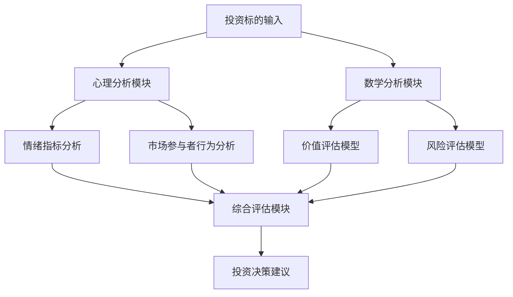
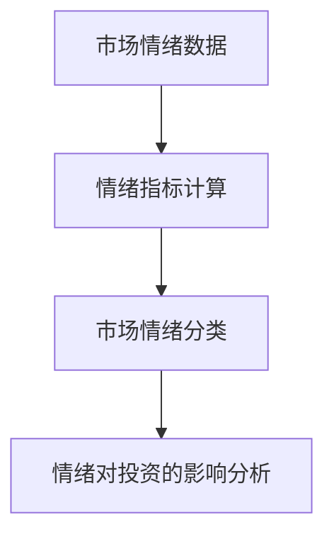
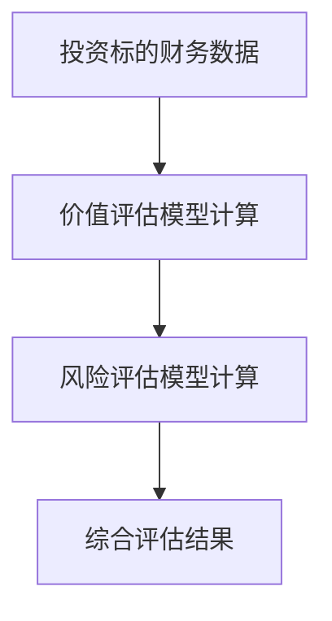

                 


# 芒格的"双轨分析"在投资决策中的应用

---

## 关键词：
双轨分析，芒格投资，系统架构，算法实现，数学模型，Python代码，风险管理

---

## 摘要：
本文深入探讨了芒格的“双轨分析”在投资决策中的应用，从理论背景到系统架构，从算法实现到数学模型，结合实际案例，全面解析了这一投资方法的核心原理和应用场景。文章还提供了Python代码实现和系统架构设计，帮助读者理解并掌握双轨分析的实际应用。

---

# 第一部分：芒格的“双轨分析”概述

## 第1章：双轨分析法的背景与核心概念

### 1.1 芒格的双轨分析法简介
芒格的“双轨分析”是一种结合心理分析和数学分析的投资方法，旨在通过心理层面和数学层面的双重评估，帮助投资者做出更科学的投资决策。

### 1.2 双轨分析的核心概念
- **心理分析轨道**：关注市场参与者的心理行为，分析情绪波动对投资决策的影响。
- **数学分析轨道**：基于数学模型和数据分析，评估投资标的的内在价值和风险。

---

## 第2章：双轨分析法的核心原理

### 2.1 心理分析轨道的原理
心理分析轨道关注市场参与者的心理行为，通过分析情绪波动、市场情绪指标等，预测市场的短期波动。

### 2.2 数学分析轨道的原理
数学分析轨道基于数学模型和数据分析，评估投资标的的内在价值和风险，通过概率模型和统计分析优化投资决策。

### 2.3 双轨分析的综合原理
双轨分析通过结合心理分析和数学分析，实现对投资标的的全面评估，帮助投资者在复杂市场环境中做出更明智的决策。

---

# 第二部分：双轨分析法的系统架构

## 第3章：系统架构设计

### 3.1 系统功能模块划分
- 心理分析模块：情绪指标分析、市场参与者行为分析。
- 数学分析模块：价值评估模型、风险评估模型。
- 综合评估模块：双轨分析结果整合、投资决策建议。

### 3.2 系统架构图


---

## 第4章：算法实现与数学模型

### 4.1 心理分析轨道的算法流程


### 4.2 数学分析轨道的算法流程


### 4.3 双轨分析的数学模型
- 心理分析模型：概率模型和期望值计算。
- 数学分析模型：收益模型和风险模型。

---

## 第5章：项目实战与案例分析

### 5.1 项目实战
1. **环境安装**：安装Python、numpy、pandas等依赖库。
2. **代码实现**：
   ```python
   import numpy as np
   import pandas as pd

   def心理分析轨道(data):
       # 情绪指标计算
      情绪指标 = data['情绪指标'].mean()
       return 情绪指标

   def数学分析轨道(data):
       # 价值评估模型
       价值评估 = data['价值评估'].mean()
       return 价值评估

   # 综合评估
   def双轨分析(data):
       心理分析结果 = 心理分析轨道(data)
       数学分析结果 = 数学分析轨道(data)
       综合结果 = (心理分析结果 + 数学分析结果) / 2
       return 综合结果

   # 示例数据
   data = pd.DataFrame({
       '情绪指标': [0.8, 0.6, 0.7],
       '价值评估': [1.2, 0.9, 1.1]
   })
   print(双轨分析(data))
   ```

### 5.2 案例分析
通过具体案例分析，展示双轨分析法在实际投资中的应用，验证其有效性和优势。

---

# 第三部分：最佳实践与小结

## 第6章：最佳实践与注意事项

### 6.1 最佳实践
- 结合市场实际情况调整分析模型。
- 定期更新数据和模型参数。
- 多维度验证分析结果。

### 6.2 注意事项
- 避免过度依赖单一分析轨道。
- 注意数据质量和模型的适用性。
- 保持对市场的持续关注和学习。

---

## 第7章：总结与展望

### 7.1 总结
芒格的双轨分析法通过结合心理分析和数学分析，帮助投资者做出更科学的投资决策。本文从理论到实践，详细介绍了双轨分析的核心原理、系统架构、算法实现和实际案例。

### 7.2 展望
未来，随着人工智能和大数据技术的发展，双轨分析法将更加智能化和精准化，为投资者提供更强大的决策支持。

---

## 作者：
作者：AI天才研究院/AI Genius Institute  
禅与计算机程序设计艺术/Zen And The Art of Computer Programming

