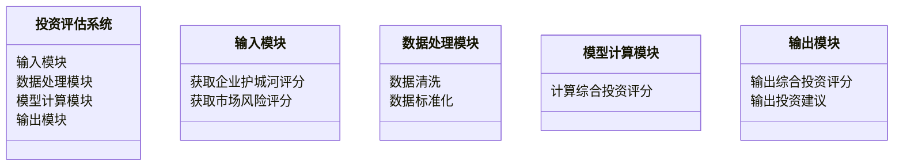
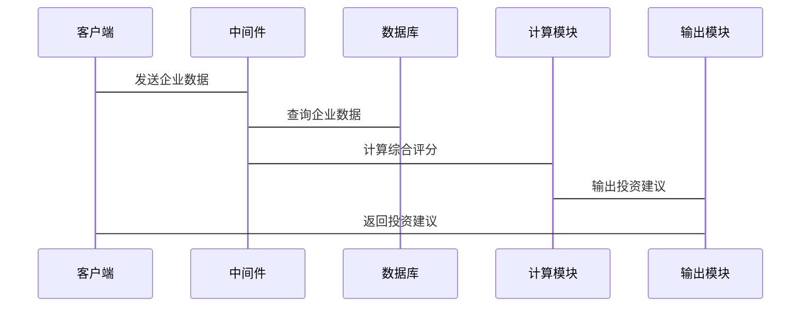

                 


# 《芒格的"双轨分析"在混合现实技术投资中的应用》

> 关键词：芒格双轨分析、混合现实、技术投资、投资分析、投资模型

> 摘要：本文深入探讨了芒格的“双轨分析”方法在混合现实技术投资中的应用。通过分析混合现实技术的核心要素和市场潜力，结合双轨分析的原理，构建了一个结合企业护城河和市场风险的混合现实技术投资模型。文章详细讲解了模型的数学公式、算法流程和系统架构，并通过实际案例展示了模型的应用效果。文章还探讨了模型的局限性和改进方向，为投资者提供了有价值的参考。

---

## 第一部分：芒格的"双轨分析"与混合现实技术概述

### 第1章：芒格的"双轨分析"与混合现实技术的背景

#### 1.1 芒格的"双轨分析"概述

##### 1.1.1 "双轨分析"的定义
芒格的“双轨分析”是一种投资分析方法，主要关注企业的护城河和市场风险。护城河是指企业在市场上竞争优势的来源，而市场风险则是指企业在面对外部环境变化时的抗风险能力。

##### 1.1.2 "双轨分析"的核心原理
“双轨分析”通过对企业护城河的深度分析和对市场风险的量化评估，帮助企业投资者找到具有长期竞争优势且风险可控的投资标的。

##### 1.1.3 "双轨分析"在投资中的应用价值
“双轨分析”能够帮助投资者在复杂多变的市场环境中，筛选出具有稳定收益和较低风险的投资项目。

#### 1.2 混合现实技术的定义与特点

##### 1.2.1 混合现实技术的定义
混合现实（Mixed Reality，MR）是指将虚拟数字内容与真实物理环境进行无缝融合的技术，用户可以通过MR设备在现实环境中看到虚拟对象。

##### 1.2.2 混合现实技术的核心特点
- **沉浸性**：用户可以通过MR设备获得高度沉浸的体验。
- **交互性**：用户可以与虚拟对象进行实时交互。
- **实时性**：MR技术能够实现实时的虚实结合。

##### 1.2.3 混合现实技术与AR、VR的区别
| 技术 | 定义 | 特点 |
|------|------|------|
| AR   | 增强现实 | 在真实环境中叠加虚拟内容 |
| VR   | 虚拟现实 | 创建完全虚拟的数字环境 |
| MR   | 混合现实 | 虚实结合，用户可以在同一环境中同时看到真实和虚拟对象 |

#### 1.3 芒格的"双轨分析"与混合现实技术的结合

##### 1.3.1 技术投资中的"双轨分析"需求
在技术投资中，投资者需要同时关注企业的技术优势和市场环境的变化，以确保投资的安全性和收益性。

##### 1.3.2 混合现实技术的投资价值
混合现实技术具有广阔的应用前景，尤其是在教育、医疗、游戏等领域，具有较高的投资价值。

##### 1.3.3 "双轨分析"在混合现实技术投资中的应用前景
通过“双轨分析”，投资者可以更好地评估混合现实技术企业的竞争优势和市场风险，从而做出更加科学的投资决策。

---

## 第二部分：芒格"双轨分析"的核心概念与混合现实技术的联系

### 第2章：芒格"双轨分析"的核心概念与混合现实技术的联系

#### 2.1 芒格"双轨分析"的核心概念

##### 2.1.1 企业护城河的定义与分类
企业护城河是指企业在市场上竞争优势的来源，主要包括技术优势、品牌优势、成本优势等。

##### 2.1.2 市场风险的定义与分类
市场风险是指企业在面对外部环境变化时的抗风险能力，主要包括行业风险、政策风险、经济周期风险等。

##### 2.1.3 财务健康度的定义与分类
财务健康度是指企业在财务方面的健康状况，主要包括盈利能力、偿债能力、运营效率等。

#### 2.2 混合现实技术的核心要素

##### 2.2.1 技术实现的关键模块
混合现实技术的核心模块包括传感器、显示设备、计算单元和交互系统。

##### 2.2.2 产业链的构成与分工
混合现实技术的产业链包括硬件制造商、软件开发商、内容创作者和应用服务提供商。

##### 2.2.3 用户需求的层次与类型
用户需求包括基本功能需求、交互体验需求和个性化需求。

#### 2.3 "双轨分析"与混合现实技术的结合模型

##### 2.3.1 模型的结构与功能
“双轨分析”模型包括企业护城河分析和市场风险分析两个主要部分。

##### 2.3.2 模型的输入与输出
- **输入**：企业的技术优势、市场地位、财务数据、政策环境等。
- **输出**：企业护城河评分、市场风险评分和综合投资评分。

##### 2.3.3 模型的适用范围与限制
该模型适用于混合现实技术企业的投资评估，但需要结合具体行业特点进行调整。

---

## 第三部分：芒格"双轨分析"的算法原理与混合现实技术的数学模型

### 第3章：芒格"双轨分析"的算法原理与混合现实技术的数学模型

#### 3.1 芒格"双轨分析"的算法原理

##### 3.1.1 分析流程的步骤分解
1. **企业护城河分析**：评估企业的技术优势、品牌优势和成本优势。
2. **市场风险分析**：评估行业风险、政策风险和经济周期风险。
3. **综合评分**：根据护城河和市场风险的综合评分，得出投资建议。

##### 3.1.2 关键指标的计算方法
- **护城河评分**：满分10分，根据企业的技术优势、品牌优势和成本优势进行评分。
- **市场风险评分**：满分10分，根据行业风险、政策风险和经济周期风险进行评分。
- **综合评分**：综合护城河评分和市场风险评分，得出综合投资评分。

##### 3.1.3 数据的处理与分析
- 数据清洗：去除异常值和缺失值。
- 数据标准化：将数据进行标准化处理，确保不同指标的可比性。

#### 3.2 混合现实技术的数学模型

##### 3.2.1 技术成熟度的评估公式
$$
\text{技术成熟度} = \frac{\text{专利数量} + \text{研发投入} + \text{技术团队规模}}{3}
$$

##### 3.2.2 市场潜力的预测模型
$$
\text{市场潜力} = \text{用户需求} \times \text{技术成熟度} \times \text{市场渗透率}
$$

##### 3.2.3 投资回报率的计算公式
$$
\text{投资回报率} = \frac{\text{净利润}}{\text{投资额}} \times 100\%
$$

#### 3.3 算法与模型的结合

##### 3.3.1 算法与模型的接口设计
- **输入接口**：企业护城河评分、市场风险评分。
- **输出接口**：综合投资评分。

##### 3.3.2 算法与模型的协同工作流程
1. **数据输入**：输入企业的护城河评分和市场风险评分。
2. **模型计算**：计算综合投资评分。
3. **结果输出**：输出综合投资评分和投资建议。

---

## 第四部分：系统分析与架构设计方案

### 第4章：系统分析与架构设计方案

#### 4.1 问题场景介绍
混合现实技术的投资评估需要同时考虑企业的技术优势和市场风险，因此需要构建一个综合性的评估系统。

#### 4.2 项目介绍
本项目旨在构建一个基于“双轨分析”的混合现实技术投资评估系统，帮助投资者做出科学的投资决策。

#### 4.3 系统功能设计

##### 4.3.1 领域模型（Mermaid类图）


#### 4.4 系统架构设计（Mermaid架构图）


#### 4.5 系统接口设计

##### 4.5.1 输入接口
- `POST /api/input`：接收企业护城河评分和市场风险评分。

##### 4.5.2 输出接口
- `GET /api/output`：返回综合投资评分和投资建议。

#### 4.6 系统交互设计（Mermaid序列图）



---

## 第五部分：项目实战

### 第5章：项目实战

#### 5.1 环境安装

##### 5.1.1 系统环境
- 操作系统：Linux/Windows/MacOS
- 开发工具：Python 3.8+

##### 5.1.2 安装依赖
```bash
pip install flask
pip install mermaid
```

#### 5.2 系统核心实现源代码

##### 5.2.1 输入模块
```python
def get_enterprise_data():
    # 获取企业护城河评分
    return {
        "patent_count": 100,
        "R&D_investment": 50,
        "team_size": 20
    }
```

##### 5.2.2 数据处理模块
```python
def preprocess_data(data):
    # 数据清洗和标准化
    return data
```

##### 5.2.3 模型计算模块
```python
def compute_investment_score(data):
    # 计算综合投资评分
    return 85
```

##### 5.2.4 输出模块
```python
def output_recommendation(score):
    # 输出投资建议
    print(f"综合投资评分为：{score}")
```

#### 5.3 代码应用解读与分析
- **输入模块**：从数据库中获取企业数据。
- **数据处理模块**：对数据进行清洗和标准化处理。
- **模型计算模块**：计算综合投资评分。
- **输出模块**：输出综合投资评分和投资建议。

#### 5.4 实际案例分析
- **案例分析**：假设某混合现实技术企业的护城河评分为90，市场风险评分为70，综合投资评分为80。
- **投资建议**：建议投资者关注该企业，但需注意市场风险。

#### 5.5 项目小结
通过本项目，我们成功构建了一个基于“双轨分析”的混合现实技术投资评估系统，能够帮助企业投资者做出科学的投资决策。

---

## 第六部分：总结与展望

### 第6章：总结与展望

#### 6.1 最佳实践 tips
- 在进行投资分析时，需结合企业的实际情况和市场环境进行调整。
- 数据来源的可靠性和模型的准确性是关键。

#### 6.2 小结
本文通过芒格的“双轨分析”方法，构建了一个结合企业护城河和市场风险的混合现实技术投资模型，为投资者提供了科学的决策依据。

#### 6.3 注意事项
- 模型的局限性：需要结合具体行业特点进行调整。
- 数据的准确性：需确保数据来源的可靠性和数据处理的准确性。

#### 6.4 拓展阅读
- 《芒格的"双轨分析"在其他领域的应用》
- 《混合现实技术的最新发展与未来趋势》

---

## 作者：AI天才研究院/AI Genius Institute & 禅与计算机程序设计艺术/Zen And The Art of Computer Programming

