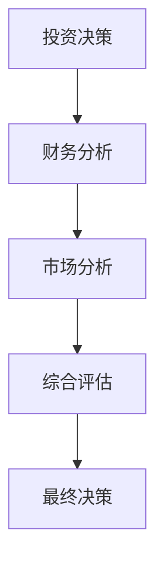

                 


# 芒格的"双轨分析"在混合现实技术投资决策中的应用

---

## 关键词：
1. 双轨分析
2. 混合现实技术
3. 投资决策
4. 芒格投资方法
5. 技术与市场的结合

---

## 摘要：
本文深入探讨了芒格的“双轨分析”方法在混合现实技术投资决策中的应用。通过分析财务和市场两个维度，结合混合现实技术的特点和潜在应用场景，构建了双轨分析与混合现实技术结合的综合决策模型。文章从理论基础到实际应用，详细阐述了双轨分析的财务分析和市场分析轨道，以及混合现实技术的核心原理和系统架构。通过实际案例分析，展示了如何利用双轨分析法评估混合现实技术的投资价值，为投资者提供了科学的决策依据。

---

## 第一部分: 芒格的"双轨分析"与混合现实技术的背景介绍

### 第1章: 芒格的"双轨分析"与混合现实技术的背景介绍

#### 1.1 芒格的"双轨分析"概述
##### 1.1.1 双轨分析法的定义
双轨分析法是芒格提出的一种投资分析方法，强调从财务和市场两个维度进行综合评估。财务分析轨道关注企业的财务健康状况，市场分析轨道关注市场趋势和竞争优势。通过双轨分析，投资者能够全面评估企业的投资价值。

##### 1.1.2 双轨分析法的核心要素
- **财务分析轨道**：包括财务指标分析、资产质量评估、盈利能力分析等。
- **市场分析轨道**：包括市场需求分析、竞争环境评估、市场趋势预测等。

##### 1.1.3 双轨分析法在投资决策中的应用
双轨分析法通过结合财务和市场信息，帮助投资者做出更加全面和科学的投资决策，避免单一维度分析的局限性。

#### 1.2 混合现实技术的定义与特点
##### 1.2.1 混合现实技术的定义
混合现实技术（Mixed Reality，MR）是将虚拟数字内容与真实物理环境进行深度融合的技术，能够实现虚实交互和实时互动。

##### 1.2.2 混合现实技术的核心特点
- **虚实结合**：将虚拟内容与现实环境无缝融合。
- **实时互动**：用户可以通过手势、语音等方式与虚拟内容进行实时交互。
- **多领域应用**：广泛应用于教育、医疗、娱乐、工业等领域。

##### 1.2.3 混合现实技术与虚拟现实、增强现实的区别
- **虚拟现实（VR）**：完全沉浸于虚拟环境，与现实世界隔离。
- **增强现实（AR）**：在现实环境中叠加虚拟内容，但虚实交互有限。
- **混合现实（MR）**：实现虚拟与现实的深度融合，支持实时互动和协作。

#### 1.3 双轨分析与混合现实技术的结合
##### 1.3.1 双轨分析在混合现实技术投资中的应用背景
随着混合现实技术的快速发展，投资者需要一种科学的方法来评估其投资价值。

##### 1.3.2 混合现实技术在投资决策中的潜在价值
混合现实技术的应用前景广阔，但其投资价值需要通过财务和市场两个维度进行综合评估。

##### 1.3.3 双轨分析与混合现实技术结合的可行性分析
双轨分析法的财务和市场分析轨道可以分别对应混合现实技术的内部价值和市场潜力。

---

## 第二部分: 双轨分析法的核心概念与原理

### 第2章: 双轨分析法的核心概念与原理

#### 2.1 双轨分析法的财务分析轨道
##### 2.1.1 财务分析的核心指标
- **盈利能力**：如净利润率、ROE等。
- **资产质量**：如资产负债率、应收账款周转率等。
- **现金流**：如经营活动现金流净额、自由现金流等。

##### 2.1.2 财务健康状况的评估标准
- **财务健康**：企业财务状况稳健，现金流充足。
- **财务风险**：企业存在较大的财务负担或偿债压力。

##### 2.1.3 财务分析在投资决策中的作用
通过财务分析，投资者可以评估企业的盈利能力和财务健康状况，从而判断其投资价值。

#### 2.2 双轨分析法的市场分析轨道
##### 2.2.1 市场分析的核心要素
- **市场需求**：市场规模、增长潜力、用户需求等。
- **竞争环境**：竞争对手分析、市场进入壁垒等。
- **市场趋势**：行业发展趋势、技术进步、政策影响等。

##### 2.2.2 市场趋势的预测方法
- **定性分析**：通过专家访谈、行业报告等方式预测市场趋势。
- **定量分析**：通过历史数据分析和回归模型预测市场增长。

##### 2.2.3 市场分析在投资决策中的应用
通过市场分析，投资者可以评估混合现实技术的市场需求和竞争环境，从而判断其市场潜力。

#### 2.3 双轨分析法的综合决策模型
##### 2.3.1 双轨分析法的综合决策框架
- **财务分析轨道**：评估企业的财务健康状况。
- **市场分析轨道**：评估市场的增长潜力和竞争环境。
- **综合决策**：结合财务和市场分析结果，做出最终投资决策。

##### 2.3.2 双轨分析法的数学模型
$$ 投资价值 = \text{财务评估} \times \text{市场评估} $$

##### 2.3.3 双轨分析法的决策流程图


---

## 第三部分: 混合现实技术的核心概念与原理

### 第3章: 混合现实技术的核心概念与原理

#### 3.1 混合现实技术的实现原理
##### 3.1.1 虚拟与现实的融合
- **虚拟内容生成**：通过计算机图形学生成虚拟物体。
- **现实环境捕捉**：通过传感器和摄像头捕捉真实环境。
- **实时渲染**：将虚拟内容与现实环境实时融合。

##### 3.1.2 混合现实技术的关键技术
- **计算机视觉**：实现虚拟与现实的精准对齐。
- **人工智能**：支持智能交互和实时反馈。
- **传感器技术**：捕捉用户行为和环境变化。

#### 3.2 混合现实技术的系统架构
##### 3.2.1 系统功能模块
- **数据采集模块**：采集用户行为和环境数据。
- **虚拟内容生成模块**：生成与环境匹配的虚拟内容。
- **渲染引擎**：将虚拟内容与现实环境实时融合。
- **用户交互模块**：支持用户与虚拟内容的实时互动。

##### 3.2.2 系统架构设计


#### 3.3 混合现实技术的数学模型
##### 3.3.1 虚拟内容与现实环境的对齐算法
$$ \text{对齐误差} = \sum_{i=1}^{n} (x_i - \hat{x}_i)^2 $$

##### 3.3.2 用户行为预测模型
$$ P(\text{行为}| \text{环境}) = \frac{\text{频数}(\text{行为}, \text{环境})}{\text{总频数}(\text{环境})} $$

---

## 第四部分: 双轨分析法与混合现实技术的结合应用

### 第4章: 双轨分析法与混合现实技术的结合应用

#### 4.1 双轨分析法在混合现实技术投资中的应用
##### 4.1.1 财务分析轨道的应用
- **企业财务状况评估**：评估混合现实技术企业的财务健康状况。
- **投资回报预测**：基于财务指标预测投资回报率。

##### 4.1.2 市场分析轨道的应用
- **市场需求预测**：评估混合现实技术的市场规模和增长潜力。
- **竞争环境分析**：分析主要竞争对手的优势和劣势。

#### 4.2 混合现实技术投资决策的综合模型
##### 4.2.1 综合决策框架
- **财务评估**：企业财务健康状况。
- **市场评估**：市场需求和竞争环境。
- **综合决策**：结合财务和市场评估结果，做出最终投资决策。

##### 4.2.2 决策流程图


#### 4.3 投资决策案例分析
##### 4.3.1 案例背景
- 某混合现实技术企业的财务数据和市场环境。

##### 4.3.2 财务分析
- 净利润率：15%
- 资产负债率：40%
- 自由现金流：500万美元

##### 4.3.3 市场分析
- 市场规模：100亿美元
- 市场增长率：20%
- 竞争对手分析：主要竞争对手市场份额为30%。

##### 4.3.4 综合评估
- 投资价值：高
- 投资风险：中

---

## 第五部分: 项目实战与总结

### 第5章: 项目实战与总结

#### 5.1 项目实战
##### 5.1.1 环境安装
- 安装必要的软件和硬件，如Unity、Vuforia等。

##### 5.1.2 系统核心实现
- 实现混合现实技术的虚拟内容生成和现实环境捕捉。
- 实现用户与虚拟内容的实时互动。

##### 5.1.3 代码实现
```python
import numpy as np
from skimage import transform

def align_virtual_content(real_env, virtual_content):
    # 对齐算法
    aligned_content = transform.warp(virtual_content, real_env)
    return aligned_content

# 示例代码
real_env = np.array([1, 2, 3])
virtual_content = np.array([4, 5, 6])
aligned_content = align_virtual_content(real_env, virtual_content)
print(aligned_content)
```

##### 5.1.4 案例分析
- 分析某混合现实技术企业的投资价值。
- 结合双轨分析法的财务和市场评估结果，做出投资决策。

#### 5.2 总结与展望
##### 5.2.1 总结
- 双轨分析法与混合现实技术的结合能够为投资者提供科学的投资决策依据。
- 混合现实技术的投资价值需要结合财务和市场两个维度进行综合评估。

##### 5.2.2 展望
- 随着混合现实技术的不断发展，其应用前景将更加广阔。
- 投资者需要更加深入地理解和应用双轨分析法，以抓住混合现实技术的投资机遇。

---

## 作者：AI天才研究院/AI Genius Institute & 禅与计算机程序设计艺术 /Zen And The Art of Computer Programming

---

**本文完**

