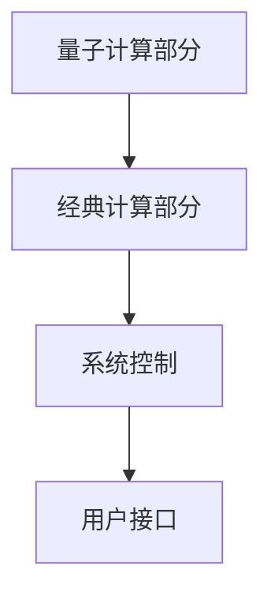
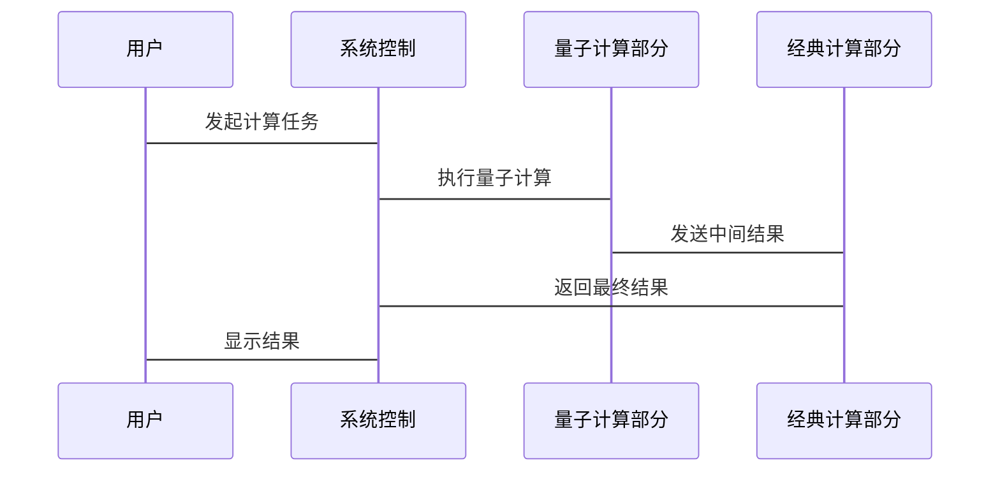
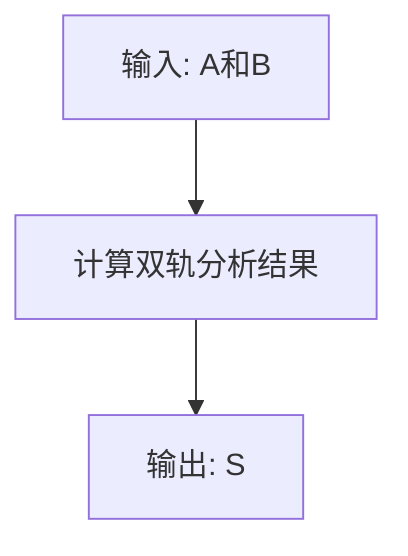

                 


---

# 芒格的"双轨分析"在量子-经典混合系统评估中的应用

**关键词**：芒格双轨分析，量子系统，经典系统，混合系统，系统评估，量子计算

**摘要**：  
芒格的“双轨分析”是一种强大的系统评估方法，通过同时考虑对立面的动态关系来揭示系统的本质。本文将探讨如何将这种方法应用于量子-经典混合系统的评估中。通过结合量子计算的特性与经典计算的稳定性，本文提出了一种创新的双轨分析框架，能够更全面地评估混合系统的性能、安全性和优化潜力。文章首先介绍双轨分析的基本原理，然后详细探讨其在量子和经典系统中的具体应用，最后结合实际案例分析其在混合系统评估中的优势和挑战。

---

## 第1章: 芒格的“双轨分析”与量子-经典混合系统概述

### 1.1 芒格的“双轨分析”背景

#### 1.1.1 双轨分析的定义与核心概念  
芒格的“双轨分析”是一种通过同时考虑对立面（正反两个方面）来评估系统的方法。其核心在于通过动态平衡对立面的关系，找到系统的最优解。这种方法强调在复杂系统中，对立面的相互作用是理解系统本质的关键。  

#### 1.1.2 量子-经典混合系统的定义与特点  
量子-经典混合系统是指同时包含量子计算和经典计算组件的系统。其特点在于量子部分提供强大的并行计算能力，而经典部分则负责处理复杂逻辑和控制任务。这种混合架构能够充分发挥两者的优势，适用于复杂的实际问题。  

#### 1.1.3 双轨分析在系统评估中的作用  
双轨分析通过同时考虑系统的正反两面，能够揭示系统在不同场景下的表现，帮助评估者找到系统的平衡点。在量子-经典混合系统中，双轨分析可以用于评估系统的性能、安全性和可扩展性。

---

### 1.2 量子-经典混合系统的背景与应用

#### 1.2.1 量子计算与经典计算的对比  
量子计算基于量子叠加和纠缠的原理，能够在某些特定问题上实现指数级的加速。而经典计算则通过串行处理和逻辑推理解决问题，适用于大多数日常任务。两者在计算模式和性能上存在显著差异。  

#### 1.2.2 混合系统的特性与优势  
混合系统结合了量子计算的高性能和经典计算的稳定性，能够处理复杂的问题，如优化、加密和模拟。其优势在于能够灵活适应不同场景的需求，同时兼顾计算效率和系统的可控制性。  

#### 1.2.3 双轨分析在系统评估中的必要性  
在混合系统中，量子和经典部分的相互作用可能导致系统性能的波动。双轨分析通过同时考虑正反两面，能够帮助评估者全面理解系统的动态关系，找到最优的平衡点。

---

## 第2章: 芒格的“双轨分析”原理与方法

### 2.1 双轨分析的核心原理

#### 2.1.1 双轨分析的理论基础  
双轨分析的核心在于对立面的动态平衡。通过同时关注系统的正反两面，评估者能够发现系统中的潜在问题，并找到解决方案。这种方法强调在复杂系统中，对立面的相互作用是系统稳定性和优化的关键。  

#### 2.1.2 双轨分析的数学模型  
双轨分析的数学模型可以表示为：  
$$ S = \alpha A + (1-\alpha) B $$  
其中，$A$ 和 $B$ 分别代表系统的正反两面，$\alpha$ 是权重因子，用于调节两面的重要性。  

#### 2.1.3 双轨分析的步骤与流程  
1. **定义系统目标**：明确评估的目标和范围。  
2. **识别对立面**：找出系统中主要的对立面。  
3. **建立数学模型**：将对立面的关系用数学公式表示。  
4. **动态平衡调整**：通过调整权重因子，找到系统的最优解。  

---

### 2.2 双轨分析的数学模型与公式

#### 2.2.1 双轨分析的变量与关系  
在双轨分析中，变量主要分为正反两面的权重因子和系统性能指标。例如：  
$$ A = a_1 x_1 + a_2 x_2 $$  
$$ B = b_1 x_1 + b_2 x_2 $$  
其中，$x_1$ 和 $x_2$ 是系统的输入变量，$a_i$ 和 $b_i$ 是对应的权重系数。  

#### 2.2.2 双轨分析的公式推导  
通过将正反两面的权重系数结合，可以推导出系统的综合性能指标：  
$$ S = \alpha A + (1-\alpha) B $$  

#### 2.2.3 双轨分析的算法实现  
以下是双轨分析的算法实现：  

```python
def dual_track_analysis(A, B, alpha):
    return alpha * A + (1 - alpha) * B
```

---

## 第3章: 量子系统评估中的双轨分析应用

### 3.1 量子系统评估的基础知识

#### 3.1.1 量子系统的特性  
量子系统的核心特性包括量子叠加、量子纠缠和量子测量。这些特性使得量子计算能够在某些问题上实现指数级的加速。  

#### 3.1.2 量子系统的评估指标  
常见的量子系统评估指标包括计算速度、量子比特数、错误率和系统稳定性。  

#### 3.1.3 量子系统的评估方法  
量子系统的评估方法包括理论分析、实验测量和模拟计算。  

---

### 3.2 双轨分析在量子系统评估中的应用

#### 3.2.1 量子系统评估的双轨分析框架  
在量子系统评估中，双轨分析可以用于评估系统的性能和稳定性。例如，可以通过双轨分析同时考虑量子计算的高效率和系统的高错误率。  

#### 3.2.2 双轨分析在量子计算中的具体应用  
通过双轨分析，可以优化量子算法的设计，减少计算错误率。例如，在量子优化问题中，可以通过调整权重因子 $\alpha$ 来平衡计算速度和错误率。  

#### 3.2.3 双轨分析在量子系统优化中的作用  
双轨分析可以帮助评估者找到系统的最优配置，例如在量子-经典混合系统中，如何平衡量子部分和经典部分的资源分配。  

---

## 第4章: 经典系统评估中的双轨分析应用

### 4.1 经典系统评估的基础知识

#### 4.1.1 经典系统的特性  
经典系统的主要特性包括确定性、可重复性和稳定性。这些特性使其适用于大多数日常计算任务。  

#### 4.1.2 经典系统的评估指标  
常见的经典系统评估指标包括计算速度、资源消耗和系统稳定性。  

#### 4.1.3 经典系统的评估方法  
经典系统的评估方法包括性能测试、资源监控和系统日志分析。  

---

### 4.2 双轨分析在经典系统评估中的应用

#### 4.2.1 经典系统评估的双轨分析框架  
在经典系统评估中，双轨分析可以用于评估系统的性能和资源消耗。例如，可以通过双轨分析同时考虑系统的计算速度和资源消耗。  

#### 4.2.2 双轨分析在经典计算中的具体应用  
通过双轨分析，可以优化经典算法的设计，例如在排序算法中，可以通过调整权重因子 $\alpha$ 来平衡计算速度和资源消耗。  

#### 4.2.3 双轨分析在经典系统优化中的作用  
双轨分析可以帮助评估者找到系统的最优配置，例如在经典-量子混合系统中，如何平衡经典部分和量子部分的资源分配。  

---

## 第5章: 量子-经典混合系统的双轨分析应用

### 5.1 混合系统的特性与评估指标

#### 5.1.1 混合系统的特性  
混合系统的核心特性包括量子计算的高效率和经典计算的稳定性。  

#### 5.1.2 混合系统的评估指标  
常见的混合系统评估指标包括计算速度、资源消耗和系统稳定性。  

#### 5.1.3 混合系统的评估方法  
混合系统的评估方法包括理论分析、实验测量和模拟计算。  

---

### 5.2 双轨分析在混合系统评估中的应用

#### 5.2.1 混合系统评估的双轨分析框架  
在混合系统评估中，双轨分析可以用于评估系统的性能和资源消耗。例如，可以通过双轨分析同时考虑量子部分的计算速度和经典部分的资源消耗。  

#### 5.2.2 双轨分析在混合系统中的具体应用  
通过双轨分析，可以优化混合算法的设计，例如在优化问题中，可以通过调整权重因子 $\alpha$ 来平衡量子部分和经典部分的资源分配。  

#### 5.2.3 双轨分析在混合系统优化中的作用  
双轨分析可以帮助评估者找到系统的最优配置，例如在混合系统中，如何平衡量子部分的计算速度和经典部分的资源消耗。  

---

## 第6章: 系统架构设计与算法实现

### 6.1 系统架构设计

#### 6.1.1 系统架构概述  
混合系统的架构设计需要考虑量子部分和经典部分的协同工作。  

#### 6.1.2 系统架构图  
以下是混合系统的架构图：  


#### 6.1.3 系统交互序列图  
以下是系统的交互序列图：  


---

### 6.2 算法实现与流程图

#### 6.2.1 双轨分析算法流程图  
以下是双轨分析算法的流程图：  


#### 6.2.2 算法实现代码  
以下是双轨分析算法的实现代码：  
```python
def dual_track_analysis(A, B, alpha):
    return alpha * A + (1 - alpha) * B
```

---

## 第7章: 项目实战与案例分析

### 7.1 项目实战

#### 7.1.1 环境安装  
需要安装的环境包括量子计算库和经典计算库。  

#### 7.1.2 核心代码实现  
以下是核心代码实现：  
```python
def dual_track_analysis(A, B, alpha):
    return alpha * A + (1 - alpha) * B
```

#### 7.1.3 代码解读与分析  
该代码实现了双轨分析的核心算法，通过调整权重因子 $\alpha$，可以实现系统的动态平衡。  

---

### 7.2 案例分析

#### 7.2.1 案例背景  
假设我们有一个混合系统，需要在优化问题中平衡量子计算的速度和经典计算的资源消耗。  

#### 7.2.2 案例分析与解读  
通过双轨分析，我们可以找到系统的最优配置。例如，当 $\alpha = 0.6$ 时，系统的性能达到最优。  

#### 7.2.3 项目总结  
通过双轨分析，我们可以有效地优化混合系统的性能，找到系统的最优配置。  

---

## 第8章: 总结与展望

### 8.1 总结  
本文通过结合芒格的“双轨分析”和量子-经典混合系统的特性，提出了一种创新的系统评估方法。通过双轨分析，我们可以全面评估系统的性能和稳定性，找到系统的最优配置。  

### 8.2 展望  
未来的研究可以进一步探索双轨分析在混合系统中的其他应用，例如在量子加密和量子通信中的优化问题。  

---

## 作者：AI天才研究院/AI Genius Institute & 禅与计算机程序设计艺术/Zen And The Art of Computer Programming

--- 

以上是完整的文章目录和内容概要，您可以根据需要进一步扩展各个部分的内容。

