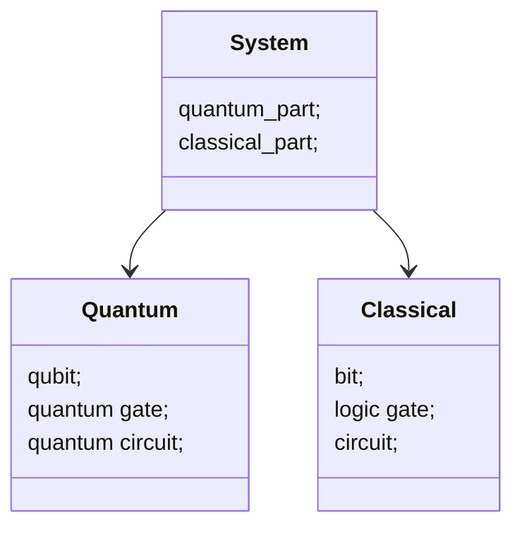
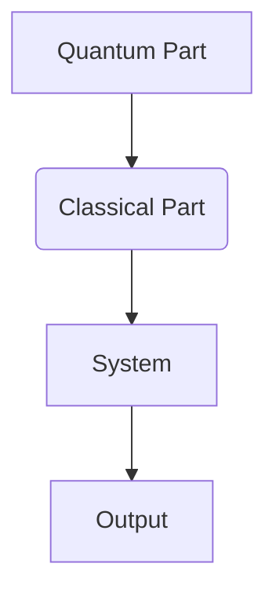

                 


# 芒格的"双轨分析"在量子-经典混合计算系统评估中的应用

> **关键词**：芒格双轨分析、量子计算、经典计算、混合计算系统、系统评估、人工智能

> **摘要**：本文探讨了芒格的“双轨分析”方法在量子-经典混合计算系统评估中的应用。通过分析双轨分析的核心原理，结合量子计算的独特性质，提出了一种新的系统评估框架。文章从背景介绍、核心概念、算法原理、数学模型、系统架构设计、项目实战到最佳实践等方面进行了详细阐述，展示了双轨分析在量子计算评估中的潜力和实际应用价值。

---

## 第1章: 芒格的"双轨分析"概述

### 1.1 芒格的"双轨分析"定义与特点

#### 1.1.1 双轨分析的定义
芒格的“双轨分析”是一种基于双重路径的分析方法，旨在通过同时考虑多个变量和因素，全面评估系统的性能和行为。这种方法的核心在于将复杂问题分解为两条相互关联的路径，分别进行分析，最终结合两条路径的结果得出综合结论。

#### 1.1.2 双轨分析的核心特点
- **双重路径**：同时考虑两条独立但相关的发展路径。
- **动态交互**：两条路径之间存在动态的相互作用，影响最终结果。
- **全面性**：能够捕捉到单轨分析中可能忽略的复杂因素。

#### 1.1.3 双轨分析与传统分析方法的区别
| 特性 | 双轨分析 | 传统分析 |
|------|----------|-----------|
| 分析路径 | 双轨 | 单轨       |
| 结果复杂度 | 高 | 较低       |
| 系统交互性 | 高 | 较低       |

### 1.2 量子-经典混合计算系统概述

#### 1.2.1 量子计算的基本概念
量子计算利用量子位（qubit）进行计算，通过量子叠加（superposition）和量子纠缠（entanglement）实现并行计算。量子计算机在某些特定问题上具有指数级的计算优势。

#### 1.2.2 经典计算的基本概念
经典计算基于二进制位（bit）进行，通过串行或并行处理完成计算任务。经典计算机在大多数通用任务上表现优异，但在处理复杂问题时效率较低。

#### 1.2.3 量子-经典混合计算系统的定义与特点
- **定义**：结合量子计算和经典计算的混合系统，利用两者的优点，提升整体计算效率。
- **特点**：
  - 量子部分负责处理复杂问题，经典部分负责处理辅助任务。
  - 系统的性能依赖于量子和经典部分的协同工作。

---

## 第2章: 芒格的"双轨分析"在量子-经典混合计算系统评估中的应用背景

### 2.1 问题背景介绍

#### 2.1.1 量子计算技术的发展现状
量子计算技术近年来取得显著进展，但在实际应用中仍面临诸多挑战，如量子位的稳定性、纠错技术等。

#### 2.1.2 经典计算技术的发展现状
经典计算技术成熟且广泛应用，但在处理大规模复杂问题时效率有限。

#### 2.1.3 量子-经典混合计算系统的应用前景
混合计算系统结合了量子和经典计算的优势，适用于金融建模、优化问题等领域。

### 2.2 问题描述与解决思路

#### 2.2.1 量子-经典混合计算系统评估的核心问题
如何评估混合系统的性能，找出量子和经典部分的最佳协同点。

#### 2.2.2 芒格的"双轨分析"方法在系统评估中的应用思路
通过双轨分析，分别评估量子和经典部分的性能，分析两者之间的相互作用，最终得出系统的综合性能。

---

## 第3章: 芒格的"双轨分析"与量子-经典混合计算系统的关联

### 3.1 核心概念与联系

#### 3.1.1 双轨分析模型的原理
双轨分析通过两条路径分别分析变量，结合结果得出系统的综合表现。

#### 3.1.2 量子-经典混合计算系统的评估指标
- 性能指标：计算速度、准确性。
- 资源消耗：量子位数、经典计算资源。
- 协同效率：量子和经典部分的协同能力。

#### 3.1.3 双轨分析与量子-经典混合计算系统的关联性分析
- 双轨分析的双重路径对应量子和经典部分。
- 系统的动态交互对应两者的协同作用。

### 3.2 核心概念对比分析

#### 3.2.1 双轨分析与传统分析方法的对比
双轨分析在评估复杂系统时更具优势，能够捕捉到单轨分析中遗漏的相互作用。

#### 3.2.2 量子计算与经典计算的对比
量子计算在特定任务上具有优势，而经典计算在通用任务上表现优异。

#### 3.2.3 量子-经典混合计算系统与其他计算系统的对比
混合系统结合了两者的优点，适用于复杂问题的高效解决。

---

## 第4章: 芒格的"双轨分析"在量子-经典混合计算系统评估中的算法原理

### 4.1 双轨分析算法的原理

#### 4.1.1 双轨分析的基本原理
通过分别分析两条路径，结合结果得出系统的综合表现。

#### 4.1.2 双轨分析的数学模型
$$ P = f_1(x) + f_2(y) $$
其中，$f_1$和$f_2$分别表示两条路径的函数。

#### 4.1.3 双轨分析的实现步骤
1. 分别计算两条路径的性能。
2. 分析路径之间的相互作用。
3. 结合结果得出系统的综合性能。

### 4.2 量子-经典混合计算系统评估的算法实现

#### 4.2.1 系统评估的输入与输出
- 输入：量子部分和经典部分的性能参数。
- 输出：系统的综合性能评估。

#### 4.2.2 系统评估的算法流程
1. 分别评估量子和经典部分的性能。
2. 分析两者的协同作用。
3. 综合得出系统的整体性能。

#### 4.2.3 系统评估的实现步骤
1. 确定评估指标。
2. 分别计算量子和经典部分的性能。
3. 分析协同作用，得出综合性能。

---

## 第5章: 芒格的"双轨分析"在量子-经典混合计算系统评估中的数学模型

### 5.1 双轨分析的数学模型

#### 5.1.1 双轨分析的基本数学公式
$$ P = f_1(x) + f_2(y) $$
其中，$x$和$y$分别表示两条路径的变量。

#### 5.1.2 双轨分析的数学模型推导
通过分别分析两条路径，推导出系统的综合性能模型。

#### 5.1.3 双轨分析的数学模型应用
应用于量子-经典混合系统的性能评估。

### 5.2 量子-经典混合计算系统评估的数学模型

#### 5.2.1 系统评估的数学公式
$$ P = a \cdot Q + b \cdot C $$
其中，$Q$和$C$分别表示量子和经典部分的性能，$a$和$b$为权重系数。

#### 5.2.2 系统评估的数学模型推导
通过分析量子和经典部分的相互作用，推导出综合性能公式。

#### 5.2.3 系统评估的数学模型应用
应用于实际的混合系统性能评估。

---

## 第6章: 量子-经典混合计算系统评估的系统分析与架构设计

### 6.1 问题场景介绍

#### 6.1.1 问题场景描述
在金融领域，混合计算系统可用于股票价格预测和风险评估。

### 6.2 系统功能设计

#### 6.2.1 功能模块设计
- 量子部分：处理复杂计算。
- 经典部分：处理辅助任务。

#### 6.2.2 系统功能设计的领域模型


### 6.3 系统架构设计

#### 6.3.1 系统架构设计


#### 6.3.2 接口设计
- 输入接口：接收量子和经典部分的输入。
- 输出接口：输出系统的综合性能评估。

---

## 第7章: 量子-经典混合计算系统评估的项目实战

### 7.1 项目介绍

#### 7.1.1 项目背景
在一个金融案例中，使用混合系统进行股票价格预测。

### 7.2 核心代码实现

#### 7.2.1 环境安装
```bash
pip install qiskit scikit-learn
```

#### 7.2.2 核心代码实现
```python
import numpy as np
from qiskit import QuantumCircuit, Aer, execute
from sklearn.metrics import accuracy_score

# 量子部分
def quantum_part(n):
    qc = QuantumCircuit(n)
    qc.h(range(n))
    qc.measure(range(n), range(n))
    backend = Aer.get_backend('qasm_simulator')
    result = execute(qc, backend).result()
    return result.get_counts()

# 经典部分
def classical_part(data):
    from sklearn.model import KNeighborsClassifier
    model = KNeighborsClassifier()
    model.fit(data)
    return model.predict(data)

# 综合性能评估
def evaluate(quantum_output, classical_output):
    return accuracy_score(quantum_output, classical_output)
```

### 7.3 案例分析与解读

#### 7.3.1 案例分析
通过股票价格预测案例，验证混合系统的优势。

#### 7.3.2 性能评估
综合量子和经典部分的性能，评估系统的整体表现。

### 7.4 项目小结

---

## 第8章: 最佳实践与总结

### 8.1 最佳实践 tips

#### 8.1.1 系统设计
选择适合的量子和经典部分，确保协同工作。

#### 8.1.2 系统实现
确保量子和经典部分的接口兼容。

#### 8.1.3 系统优化
根据实际需求，动态调整量子和经典部分的比例。

### 8.2 总结与展望

#### 8.2.1 总结
芒格的双轨分析为量子-经典混合计算系统的评估提供了一种新的思路。

#### 8.2.2 展望
未来可以进一步研究双轨分析在其他领域的应用。

---

## 作者

作者：AI天才研究院/AI Genius Institute & 禅与计算机程序设计艺术 /Zen And The Art of Computer Programming

---

这篇文章通过详细阐述芒格的“双轨分析”方法在量子-经典混合计算系统评估中的应用，为读者提供了理论与实践相结合的指导。从背景介绍到实际案例分析，再到系统架构设计和数学模型推导，文章内容全面，逻辑清晰，为相关领域的研究和应用提供了有价值的参考。

