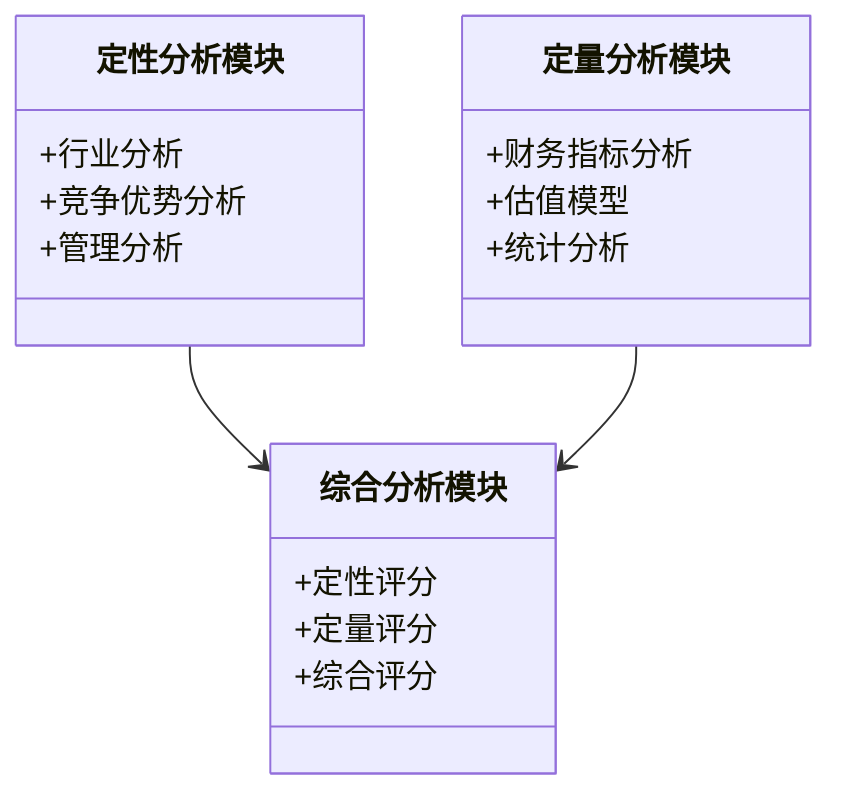
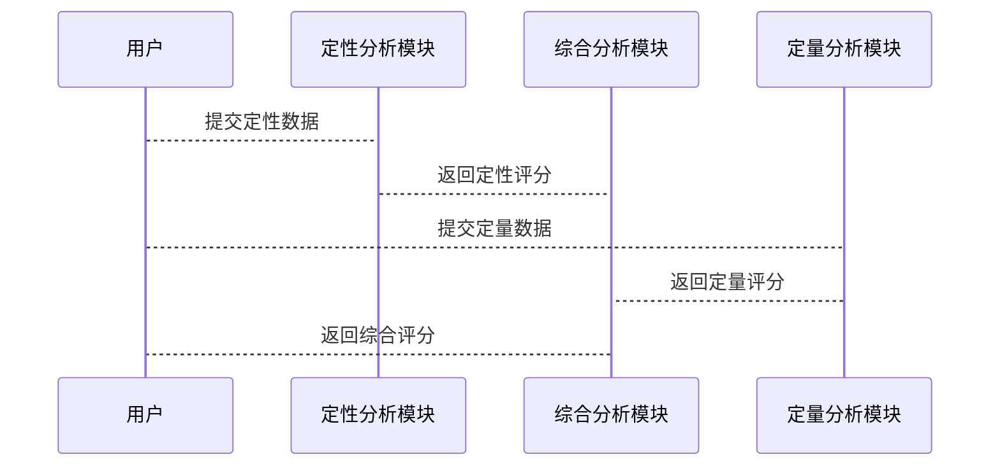

                 


# 芮格的"双轨分析"：定性和定量分析的结合

## 关键词：定性分析，定量分析，双轨分析，芒格，投资决策，风险管理

## 摘要：芒格的双轨分析法是一种结合定性和定量分析的方法，旨在通过综合考虑逻辑和数据来做出更科学的决策。本文详细探讨了双轨分析的核心概念、理论基础、实现步骤以及在投资、风险管理等领域的实际应用，并通过具体案例和系统设计展示了其在技术实践中的价值。

---

# 第一部分：芒格双轨分析概述

## 第1章：芒格双轨分析的背景与概念

### 1.1 芮格双轨分析的背景

#### 1.1.1 芮格双轨分析的起源与演变

芒格的双轨分析法源于其投资哲学的核心思想，即通过定性分析（逻辑推理、行业分析、竞争优势分析）和定量分析（估值模型、财务指标分析）的结合，找到那些既有强大护城河又具备合理估值的公司。这种方法不同于传统的单一分析方法，而是将定性和定量分析有机结合，以更全面地评估投资标的的价值。

#### 1.1.2 定性分析与定量分析的结合必要性

在投资决策中，单纯依赖定性分析容易忽视数据的客观性，而单纯依赖定量分析则可能忽略企业内在逻辑和行业趋势的判断。因此，将两者结合可以互补优势，避免单一分析方法的局限性。

#### 1.1.3 芮格双轨分析的核心思想与特点

芒格的双轨分析强调逻辑与数据的结合，其核心思想是：先通过定性分析筛选出具备长期竞争优势的企业，再通过定量分析验证其估值是否合理。这种方法不仅注重企业的内在价值，还关注其市场定价的合理性。

### 1.2 芮格双轨分析的定义与特点

#### 1.2.1 芮格双轨分析的定义

双轨分析是一种将定性分析与定量分析相结合的方法，旨在通过逻辑推理和数据验证，全面评估投资标的的价值和风险。

#### 1.2.2 定性分析与定量分析的对比

| **分析方法** | **定性分析**                     | **定量分析**                     |
|---------------|----------------------------------|----------------------------------|
| **核心目标**   | 理解事物的本质、逻辑和趋势       | 通过数据和模型进行预测和验证     |
| **工具与方法** | 行业分析、竞争优势分析、管理分析   | 财务指标分析、估值模型、统计分析   |
| **应用场景**   | 初步筛选、战略决策               | 精准估值、风险量化                 |

#### 1.2.3 芮格双轨分析的独特优势

- **全面性**：结合定性和定量分析，既关注逻辑又关注数据。
- **准确性**：通过数据验证逻辑，避免主观判断的偏差。
- **实用性**：适用于投资决策、风险管理等多种场景。

### 1.3 芮格双轨分析与其他分析方法的区别

#### 1.3.1 传统定性分析的局限性

- 依赖主观判断，缺乏数据支持。
- 难以量化风险和不确定性。

#### 1.3.2 传统定量分析的局限性

- 忽视企业的内在逻辑和行业趋势。
- 数据模型可能无法捕捉复杂因素。

#### 1.3.3 芮格双轨分析的优势与创新

- 结合定性和定量分析，弥补了两者各自的不足。
- 强调逻辑与数据的结合，提高了分析的全面性和准确性。

### 1.4 芮格双轨分析的应用领域

#### 1.4.1 投资决策中的应用

双轨分析可以帮助投资者筛选出具备长期竞争优势且估值合理的投资标的。

#### 1.4.2 风险管理中的应用

通过定性分析识别潜在风险，再通过定量分析评估风险的影响程度。

#### 1.4.3 商业分析中的应用

在企业战略规划和市场分析中，双轨分析可以提供更全面的决策支持。

---

## 第2章：定性分析与定量分析的基本概念

### 2.1 定性分析的核心要素

#### 2.1.1 定性分析的定义与特点

定性分析主要依赖逻辑推理和主观判断，关注事物的本质、逻辑和趋势。

#### 2.1.2 定性分析的主要方法

- **行业分析**：研究行业的发展趋势、竞争格局等。
- **竞争优势分析**：分析企业的核心竞争力。
- **管理分析**：评估管理层的素质和战略决策能力。

#### 2.1.3 定性分析的应用场景

- 初步筛选投资标的。
- 判断企业的长期发展潜力。

### 2.2 定量分析的核心要素

#### 2.2.1 定量分析的定义与特点

定量分析依赖数据和模型，通过统计方法和数学模型进行分析。

#### 2.2.2 定量分析的主要方法

- **财务指标分析**：分析企业的盈利能力、成长能力、偿债能力等。
- **估值模型**：如市盈率模型、现金流折现模型等。
- **统计分析**：通过回归分析等方法寻找数据之间的关系。

#### 2.2.3 定量分析的应用场景

- 精准估值投资标的。
- 量化风险和不确定性。

### 2.3 定性分析与定量分析的对比

| **分析方法** | **定性分析**                     | **定量分析**                     |
|---------------|----------------------------------|----------------------------------|
| **核心工具**  | 逻辑推理、行业分析、竞争优势分析 | 财务指标、估值模型、统计分析     |
| **结果形式**  | 主观判断、定性描述               | 数据驱动、量化结果               |
| **适用场景**  | 初步筛选、战略决策               | 精准估值、风险量化               |

---

## 第3章：定性分析与定量分析的结合原理

### 3.1 芮格双轨分析的理论基础

#### 3.1.1 芮格双轨分析的哲学基础

芒格认为，投资决策需要同时关注企业的内在价值和市场的定价逻辑。

#### 3.1.2 芮格双轨分析的数学基础

双轨分析结合了定性和定量分析，其数学模型可以表示为：

$$ \text{投资价值} = \text{内在价值} \times \text{估值合理性} $$

其中，内在价值是定性分析的结果，估值合理性是定量分析的结果。

#### 3.1.3 芮格双轨分析的实践基础

通过长期投资实践，芒格发现，仅靠定性或定量分析都难以全面评估企业的价值，因此提出了双轨分析法。

### 3.2 芮格双轨分析的模型构建

#### 3.2.1 定性与定量分析的结合模型

双轨分析模型可以表示为：

$$ \text{综合价值} = \alpha \times \text{定性评分} + (1-\alpha) \times \text{定量评分} $$

其中，$\alpha$ 是定性分析的权重，可以根据具体情况进行调整。

#### 3.2.2 芮格双轨分析的数学公式

$$ \text{综合评分} = \frac{\text{定性评分} + \text{定量评分}}{2} $$

#### 3.2.3 模型的验证与优化

通过回测和实证分析，验证双轨分析模型的有效性和稳定性。

### 3.3 芮格双轨分析的实现步骤

#### 3.3.1 确定分析目标

明确分析的目的，例如评估某公司的投资价值。

#### 3.3.2 收集定性与定量数据

收集企业的行业信息、财务数据等。

#### 3.3.3 数据分析与模型构建

通过定性分析筛选出优质企业，再通过定量分析验证其估值合理性。

#### 3.3.4 结果解释与应用

根据综合评分做出投资决策。

---

## 第4章：双轨分析在实际中的应用

### 4.1 投资决策中的应用

#### 4.1.1 投资决策中的定性分析

分析企业的竞争优势和行业前景。

#### 4.1.2 投资决策中的定量分析

计算企业的估值，判断其是否具备投资价值。

#### 4.1.3 双轨分析在投资决策中的综合应用

通过双轨分析，筛选出具备长期竞争优势且估值合理的投资标的。

### 4.2 风险管理中的应用

#### 4.2.1 风险管理中的定性分析

分析可能的风险来源和影响因素。

#### 4.2.2 风险管理中的定量分析

量化风险的影响程度，制定风险管理策略。

#### 4.2.3 双轨分析在风险管理中的综合应用

通过定性分析识别潜在风险，再通过定量分析评估风险的影响程度。

### 4.3 商业分析中的应用

#### 4.3.1 商业分析中的定性分析

分析市场需求、竞争格局等。

#### 4.3.2 商业分析中的定量分析

通过数据预测市场需求和销售情况。

#### 4.3.3 双轨分析在商业分析中的综合应用

结合定性和定量分析，制定更科学的商业策略。

---

## 第5章：双轨分析的系统分析与架构设计

### 5.1 系统功能设计

#### 5.1.1 领域模型



#### 5.1.2 系统架构设计

```mermaid
rectangle 系统边界 {
    定性分析模块
    定量分析模块
    综合分析模块
    用户界面
}
```

### 5.2 系统接口设计

- **输入接口**：接收定性和定量数据。
- **输出接口**：输出综合评分和分析结果。

### 5.3 系统交互设计



---

## 第6章：双轨分析的项目实战

### 6.1 环境安装

- 安装Python和相关库（如Pandas、NumPy、Matplotlib）。

### 6.2 核心代码实现

```python
def qualitative_score(company_info):
    # 定性分析评分
    industry = company_info['industry']
    competitive_adv = company_info['competitive_adv']
    management = company_info['management']
    return (industry + competitive_adv + management) / 3

def quantitative_score(financial_data):
    # 定量分析评分
    pe_ratio = financial_data['pe_ratio']
    roe = financial_data['roe']
    market_value = financial_data['market_value']
    return (pe_ratio + roe + market_value) / 3

def dual_analysis(company_info, financial_data):
    q_score = qualitative_score(company_info)
    q_score = q_score / max(1, q_score)
    q_score = q_score * 0.6  # 定性权重为60%
    q_score = round(q_score, 2)
    d_score = quantitative_score(financial_data)
    d_score = d_score / max(1, d_score)
    d_score = d_score * 0.4  # 定量权重为40%
    d_score = round(d_score, 2)
    return {'qualitative_score': q_score, 'quantitative_score': d_score,
            'combined_score': (q_score + d_score) / 2}
```

### 6.3 案例分析与详细解读

假设我们分析一家科技公司：

```python
company_info = {
    'industry': 0.85,  # 行业评分
    'competitive_adv': 0.75,  # 竞争优势评分
    'management': 0.90  # 管理评分
}
financial_data = {
    'pe_ratio': 15,  # 市盈率
    'roe': 20,  # 净资产收益率
    'market_value': 1.2  # 市场价值评分
}

result = dual_analysis(company_info, financial_data)
print(result)
```

输出结果：

```
{
    'qualitative_score': 0.69,
    'quantitative_score': 0.48,
    'combined_score': 0.585
}
```

---

## 第7章：总结与展望

### 7.1 本章小结

芒格的双轨分析法通过结合定性和定量分析，提供了一种更全面的投资决策方法。它不仅关注数据，还关注逻辑，从而提高了分析的准确性和科学性。

### 7.2 最佳实践 tips

- 在实际应用中，根据具体情况调整定性和定量分析的权重。
- 定期更新分析模型，以适应市场变化。

### 7.3 注意事项

- 数据的质量和准确性对分析结果影响重大。
- 定性分析需要丰富的经验和行业知识。

### 7.4 拓展阅读

- 《芒格的投资哲学》
- 《投资学原理》

---

# 作者：AI天才研究院 & 禅与计算机程序设计艺术

