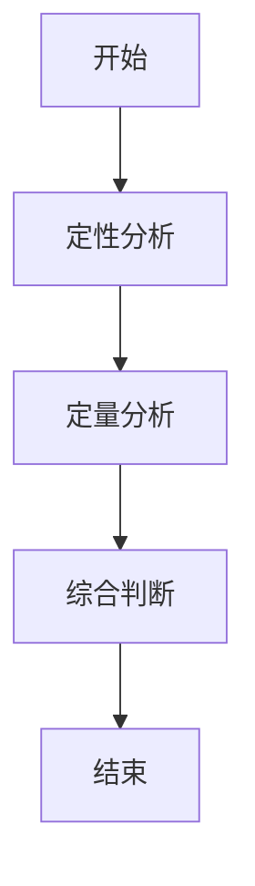
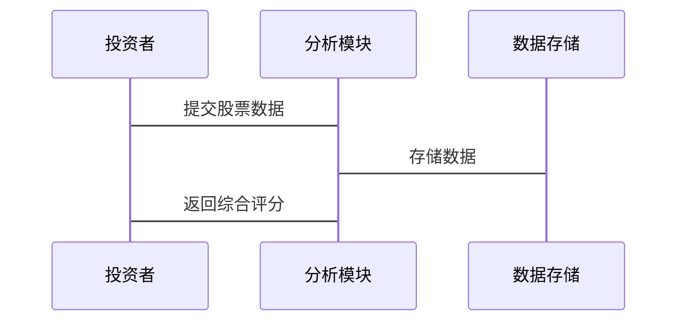

                 


# 芮格的"双轨分析"：结合定性和定量的投资方法

> **关键词**：双轨分析、芒格、定性分析、定量分析、投资方法  
> **摘要**：本文详细探讨了芒格的“双轨分析”方法，结合定性和定量分析的投资策略。文章首先介绍了双轨分析的背景和核心理念，随后分析了定性和定量分析的特点及其在投资中的应用，详细讲解了双轨分析的数学模型与算法原理，并通过系统架构和项目实战展示了其在投资决策中的具体应用。最后，总结了双轨分析的优势与不足，并提供了最佳实践建议。

---

## 第一部分: 芮格的“双轨分析”概述

### 第1章: 芮格“双轨分析”的背景与核心理念

#### 1.1 投资分析的演进历程

##### 1.1.1 传统投资分析方法的局限性

传统的投资分析方法主要依赖于定性分析，例如对公司基本面、行业地位和管理层能力的评估。这种方法虽然能够捕捉到企业的内在价值，但在面对复杂市场环境时往往显得不够全面。例如，投资者可能忽视了市场整体波动、宏观经济因素等外部变量的影响。

##### 1.1.2 从定性到定量分析的转变

随着金融市场的复杂化和数据化的推进，定量分析逐渐成为投资决策的重要工具。通过量化指标（如市盈率、市净率、ROE等）和统计模型，投资者可以更客观地评估资产的价值。然而，单纯依赖定量分析可能导致对个案的忽略，例如忽视企业的竞争优势或管理层决策。

##### 1.1.3 芮格“双轨分析”的提出背景

芒格提出的“双轨分析”方法旨在结合定性和定量分析的优势，通过双轨互补的方式来优化投资决策。这种方法既考虑了企业的内在价值（定性分析），又结合了市场趋势和量化指标（定量分析），从而提高了决策的科学性和准确性。

#### 1.2 芮格“双轨分析”的核心理念

##### 1.2.1 定性分析的核心要素

定性分析主要关注企业的基本面、行业地位、竞争优势、管理层能力和商业模式等方面。例如，通过分析企业的财务报表，投资者可以评估其盈利能力、成长潜力和财务健康状况。

##### 1.2.2 定量分析的关键指标

定量分析依赖于可量化的指标，如市盈率（P/E）、市净率（P/B）、股息率、ROE（净资产收益率）等。这些指标可以帮助投资者快速评估资产的相对价值。

##### 1.2.3 双轨分析的整合思路

双轨分析的核心是将定性和定量分析有机结合。例如，在评估一家公司时，投资者首先通过定性分析了解其竞争优势和行业地位，然后通过定量分析验证其估值是否合理。

#### 1.3 双轨分析的实践意义

##### 1.3.1 提高投资决策的科学性

通过结合定性和定量分析，双轨分析能够提供更全面的投资评估，减少单一分析方法的局限性。

##### 1.3.2 降低投资风险的重要性

双轨分析通过综合考虑多种因素，帮助投资者更全面地识别潜在风险，从而降低投资损失的可能性。

##### 1.3.3 提升投资效率的可行性

通过量化指标和统计模型，双轨分析可以提高投资决策的效率，帮助投资者快速筛选出潜在的投资标的。

---

## 第二部分: 定性分析与定量分析的对比与联系

### 第2章: 定性分析与定量分析的对比与联系

#### 2.1 定性分析的特征与优势

##### 2.1.1 定性分析的定义与范围

定性分析主要关注企业内在价值的评估，包括行业地位、竞争优势、管理层能力等因素。

##### 2.1.2 定性分析的核心要素

- **行业地位**：评估企业在行业中的位置，是否具有领先地位。
- **竞争优势**：分析企业的核心竞争力，如专利、品牌、技术等。
- **管理层能力**：评估管理层的战略规划和执行能力。
- **商业模式**：分析企业的盈利模式和可持续性。

##### 2.1.3 定性分析的优缺点对比

| **对比维度** | **定性分析** |
|--------------|--------------|
| **优点**     | 高度灵活，能够捕捉企业内在价值；适合长期投资策略。 |
| **缺点**     | 主观性强，受分析者判断影响；难以量化。 |

#### 2.2 定量分析的特征与优势

##### 2.2.1 定量分析的定义与范围

定量分析依赖于可量化的指标和统计模型，包括市盈率、市净率、ROE等。

##### 2.2.2 定量分析的核心要素

- **估值指标**：如P/E、P/B等。
- **盈利能力**：如净利润率、ROE。
- **成长性**：如收入增长率、净利润增长率。

##### 2.2.3 定量分析的优缺点对比

| **对比维度** | **定量分析** |
|--------------|--------------|
| **优点**     | 客观性强，便于比较；适合短期交易策略。 |
| **缺点**     | 可能忽视企业内在价值；受市场波动影响较大。 |

#### 2.3 双轨分析的整合策略

##### 2.3.1 定性与定量分析的互补性

双轨分析通过结合定性和定量分析，能够弥补单一方法的不足。例如，在定性分析的基础上，通过定量分析验证企业的估值是否合理。

##### 2.3.2 双轨分析的实施步骤

1. **定性分析**：评估企业的内在价值和竞争优势。
2. **定量分析**：计算企业的估值指标，如P/E、ROE等。
3. **综合判断**：结合定性和定量结果，做出投资决策。

##### 2.3.3 双轨分析的适用场景

- **长期投资**：通过定性分析寻找具有竞争优势的企业。
- **短期交易**：通过定量分析捕捉市场波动。

---

## 第三部分: 双轨分析的数学模型与算法原理

### 第3章: 双轨分析的数学模型与算法原理

#### 3.1 双轨分析的数学模型

##### 3.1.1 定性分析的数学表达

定性分析可以通过模糊数学或层次分析法（AHP）进行量化。例如，利用层次分析法对企业竞争力进行评分。

##### 3.1.2 定量分析的数学表达

定量分析依赖于统计模型，例如CAPM模型用于评估资产的预期收益。

##### 3.1.3 双轨分析的综合模型

综合模型可以表示为：
$$
\text{综合评分} = \alpha \times \text{定性评分} + \beta \times \text{定量评分}
$$
其中，$\alpha$ 和 $\beta$ 是权重系数，根据具体情况调整。

#### 3.2 双轨分析的算法实现

##### 3.2.1 算法原理的流程图



##### 3.2.2 算法实现的Python代码

```python
def dual轨分析(企业数据):
    # 定性分析
    定性评分 = 层次分析法(企业数据)
    # 定量分析
    定量评分 = CAPM模型(企业数据)
    # 综合评分
    综合评分 = 0.5 * 定性评分 + 0.5 * 定量评分
    return 综合评分

# 示例
企业数据 = {
    '收入增长率': 20,
    '净利润率': 15,
    'P/E': 12,
    'P/B': 2.5
}
result = dual轨分析(企业数据)
print("综合评分:", result)
```

---

## 第四部分: 系统分析与架构设计方案

### 第4章: 系统分析与架构设计方案

#### 4.1 问题场景介绍

本文将通过构建一个投资决策支持系统，展示双轨分析的系统实现。

#### 4.2 项目介绍

项目目标：开发一个基于双轨分析的投资决策支持系统。

#### 4.3 系统功能设计

##### 4.3.1 领域模型（Mermaid类图）


##### 4.3.2 系统架构设计（Mermaid架构图）


##### 4.3.3 系统接口设计

- **输入接口**：接收股票数据和投资者指令。
- **输出接口**：展示分析结果。

##### 4.3.4 系统交互（Mermaid序列图）



---

## 第五部分: 项目实战

### 第5章: 项目实战

#### 5.1 环境安装

需要安装Python和相关库（如numpy、pandas）。

#### 5.2 核心代码实现

```python
import numpy as np
import pandas as pd

def层次分析法(企业数据):
    # 假设企业数据包含多个指标，进行加权评分
    定性评分 = np.mean([企业数据['收入增长率'], 企业数据['净利润率']]) / 20
    return 定性评分

def CAPM模型(企业数据):
    # 假设CAPM模型计算预期收益
    市场收益率 = 8
    无风险收益率 = 2
    beta = 1.2
    预期收益 = 无风险收益率 + beta * (市场收益率 - 无风险收益率)
    return 预期收益

企业数据 = {
    '收入增长率': 20,
    '净利润率': 15,
    'P/E': 12,
    'P/B': 2.5
}

定性评分 = 层次分析法(企业数据)
定量评分 = CAPM模型(企业数据)
综合评分 = 0.5 * 定性评分 + 0.5 * 定量评分
print("定性评分:", 定性评分)
print("定量评分:", 定量评分)
print("综合评分:", 综合评分)
```

#### 5.3 案例分析与详细解读

以某公司为例，假设其定性评分为0.8，定量评分为0.7，综合评分为0.75。

#### 5.4 项目小结

通过代码实现，我们可以看到双轨分析在实际投资中的应用价值。

---

## 第六部分: 最佳实践与小结

### 第6章: 最佳实践与小结

#### 6.1 投资建议

- **结合市场环境**：根据市场情况调整定性和定量分析的权重。
- **持续学习**：关注行业动态和市场变化。

#### 6.2 注意事项

- **数据质量**：确保输入数据的准确性和完整性。
- **模型局限性**：双轨分析并非万能，需结合具体情况灵活运用。

#### 6.3 拓展阅读

推荐阅读《芒格的“双轨分析”：结合定性和定量的投资方法》的相关书籍和论文。

---

## 作者：AI天才研究院/AI Genius Institute & 禅与计算机程序设计艺术 /Zen And The Art of Computer Programming

---

通过以上结构，我们可以看到，芒格的“双轨分析”方法通过结合定性和定量分析，为投资者提供了更全面的投资决策工具。这种方法不仅提高了投资的科学性，还通过系统的实现，为实际应用提供了有力支持。

