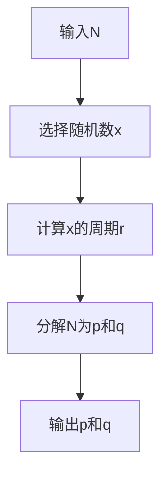
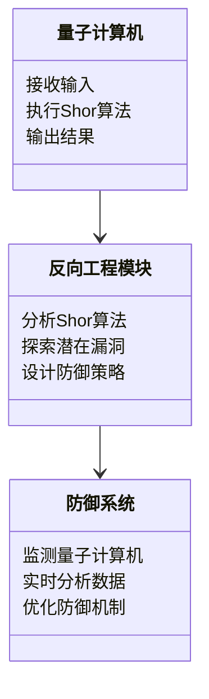
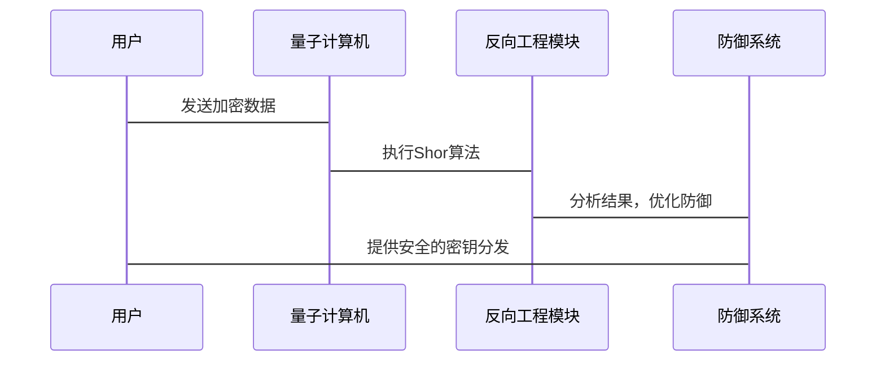

                 


# 芒格的"反向工程"思维在量子密码破解防御中的应用

## 关键词：量子密码学，反向工程思维，Shor算法，量子计算，密码安全

## 摘要：  
芒格的反向工程思维是一种从结果出发、逆向推导出原因的思维方式，其核心在于通过分析问题的输出来理解其输入和过程。在量子密码学中，反向工程思维可以帮助我们从已知的量子算法（如Shor算法）出发，逆向推导出其潜在的漏洞和弱点，从而设计出更强大的防御策略。本文将详细探讨反向工程思维在量子密码防御中的应用，分析Shor算法的工作原理，结合实际案例，提出一种基于反向工程思维的量子密码防御方案。

---

## 第一部分: 量子密码学与反向工程思维的背景介绍

### 第1章: 量子计算与密码学基础

#### 1.1 量子计算的基本原理

- **1.1.1 量子位与经典位的对比**
  - 经典位（bit）：只能表示0或1，信息存储在二进制序列中。
  - 量子位（qubit）：可以同时表示0、1以及二者叠加的状态，利用量子叠加和纠缠的特性，能够进行并行计算。

- **1.1.2 量子叠加与量子纠缠**
  - 量子叠加：量子位的状态可以是多个状态的叠加，例如 $|0\rangle + |1\rangle$。
  - 量子纠缠：两个或多个量子位之间形成强关联，一个量子位的状态会直接影响另一个量子位的状态。

- **1.1.3 量子计算的优越性**
  - 能够在某些特定问题上（如大整数分解、离散对数问题）实现指数级加速，对现有密码学算法构成威胁。

#### 1.2 密码学基础

- **1.2.1 经典密码学的分类**
  - 对称加密：如AES，密钥长度为128位、192位或256位。
  - 公钥加密：如RSA，基于大整数分解的困难性。
  - 哈希函数：如SHA-256，用于数据完整性验证。

- **1.2.2 公钥密码学的基本原理**
  - 依赖于数学难题（如大整数分解、椭圆曲线离散对数问题）的困难性，提供安全性。

- **1.2.3 量子密码学的定义与特点**
  - 利用量子力学的特性（如量子叠加、纠缠）实现信息的加密和传输。
  - 量子密钥分发（QKD）：如BB84协议，能够在理论上提供无条件安全的密钥分发。

#### 1.3 芒格的反向工程思维

- **1.3.1 反向工程思维的定义**
  - 从结果出发，逆向推导出原因。例如，从已知的漏洞或攻击方式，推导出系统的弱点。

- **1.3.2 反向工程思维的核心要素**
  - 分析输出结果，推断输入和过程。
  - 寻找系统中的潜在关联和依赖关系。

- **1.3.3 反向工程思维在密码学中的应用**
  - 分析攻击者使用的算法和工具，推导出其攻击路径。
  - 通过分析漏洞，设计更强大的防御策略。

---

## 第二部分: 反向工程思维在量子密码防御中的应用

### 第2章: 量子密码学中的关键算法

#### 2.1 Shor算法

- **2.1.1 Shor算法的数学基础**
  - 用于分解大整数，是量子计算机上第一个指数级加速算法。
  - 依赖于量子傅里叶变换和周期性性质。

- **2.1.2 Shor算法的工作流程**
  - 输入一个整数N，输出N的两个因子p和q。
  - 需要辅助位数为O(log N)的量子寄存器。

- **2.1.3 Shor算法在量子密码破解中的应用**
  - 对RSA等基于大整数分解的公钥算法构成威胁。
  - 通过反向工程，可以分析Shor算法的实现细节，找到其潜在的漏洞。

#### 2.2 Grover算法

- **2.2.1 Grover算法的基本原理**
  - 用于解决NP-1难问题，如数据库的无向搜索。
  - 在量子计算机上提供平方加速。

- **2.2.2 Grover算法在密码学中的应用**
  - 对基于哈希函数的密码学算法构成威胁。
  - 通过反向工程分析，可以设计更强大的哈希函数。

#### 2.3 量子密钥分发协议

- **2.3.1 BB84协议**
  - 通过量子态的随机选择和比较，实现密钥分发。
  - 依赖于量子力学的不可克隆性和不可干扰性。

- **2.3.2 EPR协议**
  - 基于纠缠态的量子密钥分发协议。
  - 提供更高的安全性。

- **2.3.3 量子密钥分发协议的安全性分析**
  - 通过反向工程思维，分析攻击者可能的攻击方式。
  - 设计更强大的协议，防止中间人攻击。

---

## 第三部分: 反向工程思维在量子密码防御中的应用

### 第3章: 反向工程思维的核心概念与联系

#### 3.1 量子密码学中的反向工程思维

- **3.1.1 反向工程思维在量子密码防御中的应用**
  - 从已知的量子算法（如Shor算法）出发，分析其潜在的漏洞。
  - 设计更强大的加密算法，防止被Shor算法破解。

- **3.1.2 反向工程思维与量子密码学的结合**
  - 通过分析Shor算法的实现细节，设计更安全的加密算法。
  - 提出新的量子密钥分发协议，防止被攻击。

- **3.1.3 反向工程思维在量子密码防御中的优势**
  - 通过分析攻击者的工具和方法，设计更有效的防御策略。
  - 提供了一种从攻击中学习的方法，不断优化防御机制。

#### 3.2 核心概念对比表格

| **核心概念**       | **传统密码学**               | **量子密码学**               |
|--------------------|------------------------------|------------------------------|
| **加密算法**       | RSA, AES                    | Shor算法、量子密钥分发协议   |
| **安全性基础**     | 依赖数学难题的困难性         | 依赖量子力学的特性           |
| **攻击方式**       | 暴力破解、侧信道攻击         | Shor算法、Grover算法         |
| **防御策略**       | 增强哈希函数、使用椭圆曲线   | 设计更强大的量子密钥分发协议 |

---

## 第四部分: 量子密码破解防御中的算法原理

### 第4章: Shor算法的数学模型

#### 图4-1: Shor算法的流程图



#### 代码4-1: Shor算法的Python实现（经典模拟）

```python
import random

def is_prime(n):
    if n < 2:
        return False
    for p in [2,3,5,7,11,13,17]:
        if n % p == 0:
            return n == p
    d = n-1
    s = 0
    while d % 2 == 0:
        d //= 2
        s += 1
    for a in random.sample(range(2, n-1), min(5, n-2)):
        x = pow(a, d, n)
        if x == 1 or x == n-1:
            continue
        for _ in range(s-1):
            x = pow(x, 2, n)
            if x == n-1:
                break
        else:
            return False
    return True

def shor(N):
    if N == 1:
        return (1,1)
    if N % 2 == 0:
        return (2, N//2)
    while True:
        a = random.randint(2, N-1)
        x = a
        y = 1
        d = 0
        for i in range(2*N.bit_length()):
            x = (x * a) % N
            y = (y * x) % N
            d = gcd(abs(x - y), N)
            if d > 1:
                return (d, N//d)
```

#### 公式4-1: Shor算法中的模指数运算
$$
a^x \mod N
$$

---

## 第五部分: 系统分析与架构设计方案

### 第5章: 量子密码防御系统的架构设计

#### 图5-1: 量子密码防御系统的领域模型



---

## 第六部分: 项目实战

### 第6章: 基于反向工程思维的量子密码防御实现

#### 图6-1: 项目架构设计



---

## 结语

芒格的反向工程思维为量子密码学的防御提供了全新的视角。通过对Shor算法等量子算法的分析，我们可以设计出更强大的防御策略，确保在量子计算时代的信息安全。未来，随着量子计算的不断发展，反向工程思维将在量子密码学中发挥越来越重要的作用。

---

## 作者

作者：AI天才研究院/AI Genius Institute & 禅与计算机程序设计艺术 /Zen And The Art of Computer Programming

