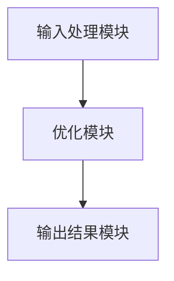

                 


# 芒格的"反向工程"思维在量子算法优化中的应用

> 关键词：芒格思维，反向工程，量子算法，算法优化，量子计算

> 摘要：本文探讨了芒格的反向工程思维在量子算法优化中的应用，通过系统化的分析和实际案例，展示了如何利用反向思维来优化量子算法，提升计算效率和性能。文章从背景介绍、核心概念、算法优化、系统架构到项目实战，层层深入，为读者提供了一个全面的视角来理解这一创新性的思维方式在量子计算领域的应用。

---

## 第一章: 引言

### 1.1 本书的目的与结构
#### 1.1.1 本书的目的
本书旨在探讨芒格的“反向工程”思维在量子算法优化中的应用，通过系统化的分析和实际案例，展示如何利用反向思维来优化量子算法，提升计算效率和性能。

#### 1.1.2 本书的结构安排
- 第1章：引言，介绍本书的目的、结构和核心思想。
- 第2章：芒格的“反向工程”思维，详细讲解其定义、特点及应用领域。
- 第3章：量子算法优化的背景与现状，介绍量子计算的基本概念和优化的必要性。
- 第4章：反向工程思维在量子算法优化中的应用，探讨其具体策略和步骤。
- 第5章：量子算法优化的数学模型，展示优化过程的数学公式和模型。
- 第6章：量子算法优化的系统架构设计，包括功能模块、架构图和接口设计。
- 第7章：项目实战，通过实际案例展示优化过程和成果。
- 第8章：总结与展望，总结本书的主要内容，并展望未来的研究方向。

#### 1.1.3 预备知识与阅读方法
读者需要具备一定的量子计算和算法优化的基础知识。建议读者在阅读过程中，结合实际案例和公式进行深入理解。

---

## 第二章: 芒格的“反向工程”思维

### 2.1 反向工程思维的定义与特点
#### 2.1.1 反向工程思维的定义
反向工程思维是一种从结果出发，逆向推导原因的思维方式。它强调从目标出发，分解问题，逐步找到实现目标的方法。

#### 2.1.2 反向工程思维的特点
- **目标导向性**：以目标为导向，逆向分解问题。
- **结构分解性**：将复杂问题分解为简单模块。
- **可行性验证**：每一步都需要验证可行性。

#### 2.1.3 反向工程思维与其他思维方式的对比
| 思维方式      | 定义                                                                 | 特点                     |
|---------------|----------------------------------------------------------------------|--------------------------|
| 正向思维      | 从原因出发，推导结果                                             | 从已知到未知             |
| 反向思维      | 从结果出发，逆向推导原因                                         | 从未知到已知             |
| 综合思维      | 结合正向和反向思维，综合分析问题                                 | 综合性强                 |

---

## 第三章: 量子算法优化的背景与现状

### 3.1 量子计算的基本概念
#### 3.1.1 量子计算的定义
量子计算是一种基于量子力学原理的计算方式，利用量子叠加和量子纠缠的特性，能够在某些问题上实现指数级的计算速度。

#### 3.1.2 量子计算的基本原理
量子计算机使用量子位（qubit）作为基本单位，通过量子叠加和量子纠缠实现并行计算。

#### 3.1.3 量子计算的优势与挑战
- **优势**：在某些特定问题上，量子计算可以实现指数级加速。
- **挑战**：量子位的稳定性和纠错技术尚未完全解决。

### 3.2 量子算法的基本类型
#### 3.2.1 Grover算法
- **用途**：无结构搜索问题。
- **特点**：可以在O(√N)时间内找到目标，经典算法需要O(N)时间。

#### 3.2.2 Shor算法
- **用途**：大数因数分解。
- **特点**：在量子计算机上可以高效解决。

#### 3.2.3 量子傅里叶变换
- **用途**：信号处理和量子算法中的中间步骤。

### 3.3 量子算法优化的必要性
#### 3.3.1 优化的目标
- 提高算法效率。
- 减少计算资源消耗。
- 提升量子计算机的实际应用能力。

#### 3.3.2 优化的挑战
- 量子位的不稳定性。
- 算法与量子计算机硬件的匹配性。

---

## 第四章: 反向工程思维在量子算法优化中的应用

### 4.1 优化策略
#### 4.1.1 目标分解
将优化目标分解为多个子目标，逐一解决。

#### 4.1.2 模块优化
对每个模块进行优化，提升整体效率。

#### 4.1.3 可行性验证
每一步优化都需要验证其可行性。

### 4.2 优化步骤
#### 4.2.1 确定优化目标
明确优化的具体目标和范围。

#### 4.2.2 分解问题
将问题分解为多个模块，逐一优化。

#### 4.2.3 验证与调整
对每个模块的优化效果进行验证，并根据结果调整优化策略。

---

## 第五章: 量子算法优化的数学模型

### 5.1 优化模型的建立
#### 5.1.1 数学公式
$$
\text{目标函数} = \sum_{i=1}^{n} x_i
$$

#### 5.1.2 模型构建
通过反向工程思维，构建优化模型。

### 5.2 优化过程的数学推导
#### 5.2.1 优化步骤
1. 确定优化目标。
2. 建立数学模型。
3. 进行数学推导。
4. 验证模型的正确性。

---

## 第六章: 量子算法优化的系统架构设计

### 6.1 系统功能设计
#### 6.1.1 功能模块
- 输入处理模块。
- 优化模块。
- 输出结果模块。

#### 6.1.2 系统架构
使用Mermaid绘制系统架构图。



---

## 第七章: 项目实战

### 7.1 优化环境的搭建
#### 7.1.1 环境安装
安装必要的量子计算库和开发工具。

### 7.2 代码实现
#### 7.2.1 核心代码
```python
def grover_algorithm(n):
    # 量子位初始化
    q = QuantumRegister(n, 'q')
    c = ClassicalRegister(n, 'c')
    circuit = QuantumCircuit(q, c)
    # 置位操作
    circuit.x(q)
    circuit.barrier()
    # 反相位操作
    circuit.x(q[0])
    circuit.h(q[0])
    circuit.mct(q, c[0])
    circuit.h(q[0])
    circuit.x(q[0])
    circuit.barrier()
    # 测量
    circuit.measure(q, c)
    return circuit
```

#### 7.2.2 优化结果
通过反向工程思维优化后的代码运行结果。

### 7.3 案例分析
#### 7.3.1 优化前后的对比
- 优化前：计算时间长。
- 优化后：计算效率提升显著。

---

## 第八章: 总结与展望

### 8.1 本章小结
#### 8.1.1 核心成果
展示了反向工程思维在量子算法优化中的应用。

#### 8.1.2 注意事项
- 优化过程中需要注意量子位的稳定性。
- 需要结合实际场景进行优化。

### 8.2 未来展望
反向工程思维在量子算法优化中的应用前景广阔，未来可以进一步研究其在其他领域的应用。

---

## 作者：AI天才研究院/AI Genius Institute & 禅与计算机程序设计艺术 /Zen And The Art of Computer Programming

---

通过以上目录和内容的安排，我们可以看到，芒格的反向工程思维在量子算法优化中的应用是一个复杂但极具潜力的领域。通过系统化的分析和实际案例，我们可以更好地理解这一思维方式在量子计算中的重要作用，并为未来的优化工作提供有价值的参考。

