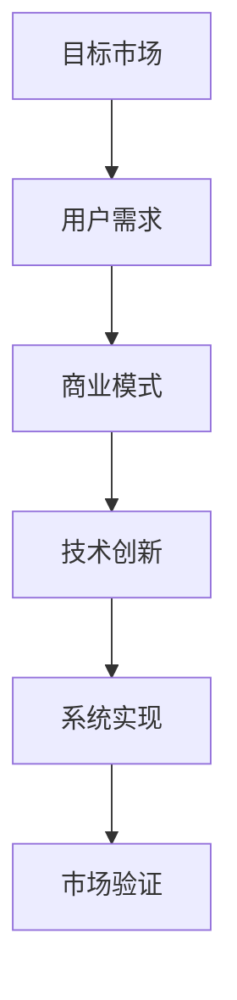
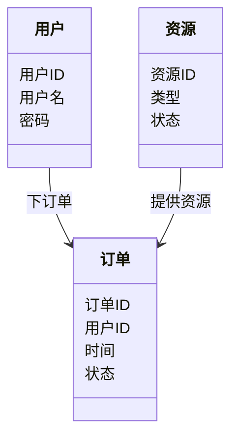
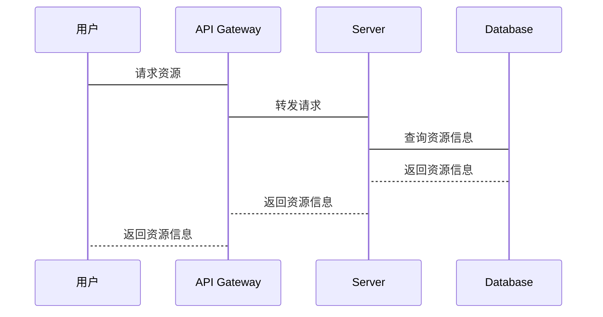

                 


# 芒格的"反向工程"思维在颠覆性创新分析中的应用

> 关键词：反向工程思维，颠覆性创新，芒格思维，创新分析，系统架构设计

> 摘要：本文探讨了芒格的“反向工程”思维在颠覆性创新分析中的应用。通过详细分析“反向工程”思维的核心概念、颠覆性创新的理论基础，以及两者结合的系统架构设计，本文展示了如何利用芒格的思维方式来优化创新过程，特别是在技术、商业模式和用户需求方面。通过实际案例分析和系统设计，本文为创新者提供了一套基于“反向工程”的分析框架，以更好地应对复杂的创新挑战。

---

## 第一部分：芒格的“反向工程”思维基础

### 第1章：芒格的“反向工程”思维概述

#### 1.1 芒格“反向工程”思维的定义

**1.1.1 什么是“反向工程”思维**

“反向工程”思维是一种从结果出发，逆向推理问题解决路径的方法。与传统的“正向思维”不同，它强调从目标出发，逐步分解问题，寻找实现目标的关键路径。芒格的“反向工程”思维强调从结果出发，思考问题的根源和解决方法。

**1.1.2 芒格思维的核心特点**

- **逆向思维**：从结果出发，寻找问题的根源和解决路径。
- **系统性**：关注问题的全局性，注重各要素之间的关联。
- **简洁性**：在复杂的系统中，寻找最简化的解决方案。

**1.1.3 “反向工程”思维的适用场景**

- **复杂问题分析**：适用于解决复杂问题，尤其是需要在有限时间内找到解决方案的情况。
- **创新过程优化**：通过逆向思考，优化创新路径，降低试错成本。
- **系统设计**：在系统设计中，从目标出发，逆向设计系统架构。

#### 1.2 “反向工程”思维与传统思维的对比

**1.2.1 传统思维的特点**

- **正向推理**：从已知条件出发，逐步推导出结果。
- **线性思考**：注重因果关系的线性推理。
- **局部优化**：关注单一问题的优化，忽视全局性。

**1.2.2 “反向工程”思维的独特优势**

- **全局视角**：从结果出发，关注整体系统的优化。
- **高效性**：通过逆向思考，快速找到问题的关键点。
- **创新性**：在解决问题时，能够突破常规思维的限制。

**1.2.3 两种思维模式的优劣势对比**

| 思维模式 | 优势 | 劣势 |
|----------|------|------|
| 正向思维 | 简单直接，易于操作 | 面对复杂问题时效率较低 |
| 反向思维 | 高效性，全局视角 | 需要较高的系统性思考能力 |

#### 1.3 芒格思维在创新中的应用价值

**1.3.1 创新问题的复杂性**

创新过程通常涉及多个变量的相互作用，传统的正向思维难以在有限时间内找到最优解。芒格的“反向工程”思维通过从目标出发，快速定位关键问题，显著提高了创新效率。

**1.3.2 “反向工程”思维在创新中的独特作用**

- **优化创新路径**：通过逆向思考，减少不必要的尝试，降低创新成本。
- **增强系统性**：从整体出发，确保各个模块的协调配合。
- **提升创新成功率**：通过系统性思考，降低创新过程中的不确定性。

---

## 第二部分：颠覆性创新的理论基础

### 第2章：颠覆性创新的定义与特征

#### 2.1 颠覆性创新的定义

颠覆性创新是指通过引入新的技术、商业模式或用户需求，从根本上改变现有市场规则或产品形态的创新。它通常以非传统的方式进入市场，最终取代或颠覆现有的主流产品或服务。

#### 2.2 颠覆性创新的核心特征

- **非连续性**：颠覆性创新通常与渐进式创新不同，它通过引入全新的价值主张或技术路径，实现市场的重新定义。
- **破坏性**：颠覆性创新往往会对现有的市场结构、商业模式和用户习惯产生根本性的影响。
- **低进入门槛**：颠覆性创新通常以低成本、低技术门槛的方式进入市场，通过提供新的价值点逐步扩大市场份额。

#### 2.3 颠覆性创新与渐进式创新的区别

| 创新类型 | 颠覆性创新 | 渐进式创新 |
|----------|------------|------------|
| 定义 | 通过全新的价值主张或技术路径改变市场规则 | 在现有技术或商业模式基础上进行小幅改进 |
| 影响 | 根本性改变市场结构 | 对市场结构影响较小 |
| 风险 | 高风险，不确定性大 | 风险较低，可控性较强 |

---

## 第三部分：“反向工程”思维与颠覆性创新的结合

### 第3章：“反向工程”思维在颠覆性创新中的应用

#### 3.1 颠覆性创新的“反向工程”分析框架

**3.1.1 分析目标的确定**

在“反向工程”思维中，颠覆性创新的分析目标通常包括：

- 确定创新的核心价值主张。
- 分析现有市场的痛点和未满足的需求。
- 识别潜在的颠覆性技术或商业模式。

**3.1.2 关键问题的识别**

通过逆向思考，从目标出发，逐步分解问题，识别实现目标的关键路径。例如：

1. 确定目标市场：通过分析现有市场的痛点，确定颠覆性创新的目标用户群体。
2. 识别关键创新点：通过逆向思考，寻找能够实现目标市场的关键技术和商业模式。
3. 设计解决方案：基于关键创新点，设计实现目标市场的具体方案。

**3.1.3 解决方案的设计与验证**

- 设计颠覆性创新的具体方案，例如新的商业模式或技术架构。
- 通过小范围试点验证方案的有效性，逐步优化创新路径。

#### 3.2 颠覆性创新的系统架构设计

**3.2.1 系统功能设计**

通过“反向工程”思维，设计颠覆性创新的系统功能。例如：

- 技术创新：设计能够实现颠覆性创新的关键技术模块。
- 商业模式创新：设计能够满足目标市场需求的商业模式。
- 用户体验优化：设计能够提升用户满意度的交互界面。

**3.2.2 系统架构设计**

通过Mermaid流程图，展示颠覆性创新系统的架构设计：



---

## 第四部分：颠覆性创新的系统分析与架构设计

### 第4章：颠覆性创新的系统分析

#### 4.1 颠覆性创新的系统分析

**4.1.1 问题场景介绍**

假设我们正在分析一个新兴的共享经济平台，该平台希望通过技术创新和商业模式创新，颠覆现有的共享经济市场。我们需要设计一个能够快速响应市场需求的系统架构。

**4.1.2 系统功能设计**

通过Mermaid类图，展示系统的核心功能模块：



**4.1.3 系统架构设计**

通过Mermaid架构图，展示系统的整体架构：


**4.1.4 系统接口设计**

通过Mermaid序列图，展示系统接口的设计：



---

## 第五部分：项目实战与最佳实践

### 第5章：项目实战

#### 5.1 环境安装

安装必要的开发工具和依赖项，例如：

```bash
pip install flask
pip install requests
```

#### 5.2 系统核心实现源代码

以下是颠覆性创新系统的核心实现代码：

```python
from flask import Flask
import requests

app = Flask(__name__)

@app.route('/')
def home():
    return "颠覆性创新系统"

@app.route('/api')
def api():
    response = requests.get('https://example.com')
    return response.text

if __name__ == '__main__':
    app.run()
```

#### 5.3 代码应用解读与分析

- **代码功能**：上述代码实现了一个简单的颠覆性创新系统，包括一个基本的Web界面和API接口。
- **代码结构**：通过Flask框架实现Web服务，使用requests库进行API调用。
- **代码优化**：可以根据实际需求，进一步优化代码结构，例如增加错误处理机制。

#### 5.4 实际案例分析

以共享经济平台为例，分析如何通过“反向工程”思维实现颠覆性创新：

1. **确定目标市场**：选择共享经济市场。
2. **识别关键创新点**：设计新的商业模式，例如通过区块链技术实现资源的可信共享。
3. **设计解决方案**：开发一个基于区块链的共享经济平台。
4. **市场验证**：通过小范围试点，验证解决方案的有效性。

---

## 第六部分：总结与展望

### 第6章：总结与展望

#### 6.1 小结

通过本文的分析，我们展示了芒格的“反向工程”思维在颠覆性创新分析中的应用。通过从目标出发，逆向思考问题解决路径，我们能够快速定位关键问题，优化创新过程，降低创新成本。

#### 6.2 注意事项

- 在实际应用中，需要结合具体场景，灵活调整分析框架。
- 颠覆性创新的实现需要系统性思考，确保各个模块的协调配合。

#### 6.3 拓展阅读

建议进一步阅读以下内容：

- 《创新者的窘境》——深入分析颠覆性创新的理论与实践。
- 《反向工程的艺术》——系统性地学习“反向工程”思维的应用方法。

---

## 作者：AI天才研究院/AI Genius Institute & 禅与计算机程序设计艺术/Zen And The Art of Computer Programming

---

通过以上结构，我们可以系统地分析芒格的“反向工程”思维在颠覆性创新中的应用，从理论到实践，为创新者提供一套高效的分析框架和方法。

