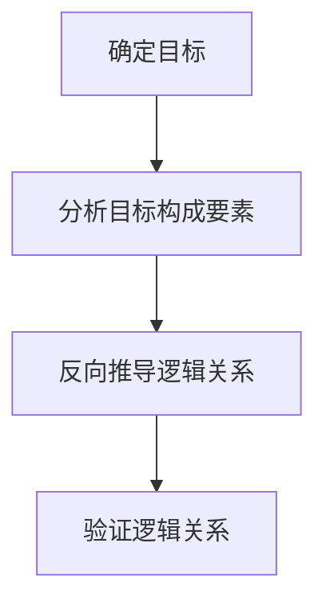
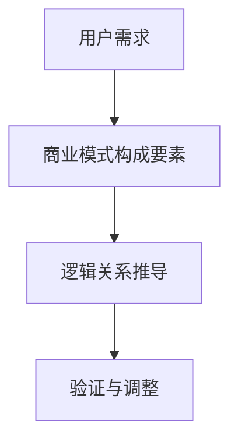

                 


# 《芒格的"反向工程"思维在颠覆性商业模式分析中的应用》

> 关键词：芒格、反向工程、商业模式、颠覆性、商业分析、系统架构

> 摘要：本文深入探讨了芒格的“反向工程”思维在分析颠覆性商业模式中的应用，结合实际案例、数学模型和系统架构，详细分析了这种思维方式如何帮助我们理解和设计更具创新性和破坏性的商业模式。文章从背景介绍、核心概念、算法原理、系统架构到项目实战，层层递进，为读者提供了全面的理论与实践指导。

---

## 第一部分：背景介绍

### # 第1章：芒格的"反向工程"思维

#### 1.1 芒格的生平与思想
- **芒格的基本信息**：查理·芒格（Charlie Munger）是美国著名的投资家、作家和思想家，以价值投资和理性决策闻名。
- **芒格的主要思想**：芒格强调逆向思维（反向工程思维），即从结果反推原因，这种方法在商业分析和决策中具有重要意义。
- **反向工程思维的起源**：芒格在投资和商业分析中发现，传统的正向思维（从原因推导结果）往往难以预测和应对复杂的市场变化，而反向工程思维则能够帮助人们更好地理解问题的本质。

#### 1.2 颠覆性商业模式的定义与特征
- **颠覆性商业模式的定义**：颠覆性商业模式是指通过创新的方式重新定义行业规则，从而取代或颠覆传统商业模式的商业策略。
- **颠覆性商业模式的特征**：
  - **创新性**：通过新技术、新方法或新理念改变行业现状。
  - **破坏性**：对传统行业格局产生重大影响，甚至取代传统模式。
  - **可扩展性**：能够快速复制和推广，形成规模化效应。
- **颠覆性商业模式与传统商业模式的区别**：
  | 特性 | 颠覆性商业模式 | 传统商业模式 |
  |------|----------------|--------------|
  | 核心逻辑 | 创新驱动 | 传统驱动 |
  | 目标客户 | 创新者、早期用户 | 传统客户 |
  | 价值主张 | 高度差异化 | 标准化 |

---

### # 第2章：反向工程思维的核心原理

#### 2.1 反向工程思维的定义与特点
- **反向工程思维的定义**：从结果出发，反向推导原因或过程，通过分析结果的构成要素来理解问题的本质。
- **反向工程思维的特点**：
  - **逆向性**：从结果出发，而不是从原因出发。
  - **系统性**：注重整体性分析，而非单一因素。
  - **实践性**：注重实际应用，通过案例分析来验证理论。

#### 2.2 反向工程思维在商业模式分析中的作用
- **帮助发现商业模式的本质**：通过分析商业模式的结果，反向推导其构成要素和逻辑。
- **预测未来趋势**：通过分析当前商业模式的结果，推测未来的可能变化。
- **优化现有模式**：通过反向分析，找到现有模式的不足，并提出改进方案。

---

## 第二部分：反向工程思维与颠覆性商业模式的结合

### # 第3章：颠覆性商业模式的反向工程分析

#### 3.1 颠覆性商业模式的反向工程方法
- **确定目标**：明确需要分析的商业模式及其目标。
- **分析结果**：从商业模式的结果出发，分析其表现和影响。
- **反向推导**：通过分析结果，反向推导商业模式的构成要素和逻辑。
- **验证与调整**：验证推导出的逻辑是否合理，并根据实际情况进行调整。

#### 3.2 颠覆性商业模式的反向工程案例分析
- **苹果公司的颠覆性商业模式分析**：
  - **结果**：苹果通过创新的产品设计和生态系统，颠覆了传统电子产品行业。
  - **反向推导**：苹果的成功在于其独特的设计理念、垂直整合的供应链和封闭的生态系统。
  - **验证**：通过分析苹果的商业模式，可以发现其成功的逻辑在于创新和用户体验的极致追求。

- **特斯拉的颠覆性商业模式分析**：
  - **结果**：特斯拉通过电动汽车和可再生能源技术，颠覆了传统汽车行业。
  - **反向推导**：特斯拉的成功在于其技术创新、成本控制和可持续发展理念。
  - **验证**：通过分析特斯拉的商业模式，可以发现其成功的逻辑在于技术驱动和市场定位。

---

### # 第4章：反向工程思维的算法原理与数学模型

#### 4.1 反向工程思维的算法原理
- **反向工程思维的步骤**：
  1. 确定目标（商业模式的结果）。
  2. 分析目标的构成要素。
  3. 反向推导构成要素的逻辑关系。
  4. 验证逻辑关系的合理性。

- **反向工程思维的流程图**：


#### 4.2 颠覆性商业模式的数学模型
- **收益模型**：
  $$ \text{收益} = \text{价格} \times \text{销量} $$
- **成本模型**：
  $$ \text{成本} = \text{固定成本} + \text{变动成本} \times \text{销量} $$
- **利润模型**：
  $$ \text{利润} = \text{收益} - \text{成本} $$

---

### # 第5章：系统架构与项目实战

#### 5.1 系统架构设计
- **系统功能模块**：
  - 用户需求分析模块
  - 商业模式构成要素分析模块
  - 逻辑关系推导模块
  - 验证与调整模块

- **系统架构图**：


#### 5.2 项目实战
- **环境配置**：
  - 安装Python和相关库（如numpy、pandas、scikit-learn）。
- **核心模块实现**：
  ```python
  def reverse_engineer_business_model(revenue, cost):
      profit = revenue - cost
      return profit

  # 示例数据
  revenue = 1000000
  cost = 800000
  print(reverse_engineer_business_model(revenue, cost))  # 输出：200000
  ```
- **代码解读**：
  - 通过函数 `reverse_engineer_business_model` 计算商业模式的利润，验证其合理性。

---

## 第三部分：总结与展望

### # 第6章：总结与最佳实践

#### 6.1 总结
- 本文通过芒格的反向工程思维，分析了颠覆性商业模式的核心要素和逻辑关系，结合实际案例和数学模型，为读者提供了全面的理论与实践指导。

#### 6.2 最佳实践 tips
- 在商业模式分析中，始终关注结果和构成要素的关系。
- 使用数学模型和系统架构图来验证和优化商业模式。
- 结合实际案例，不断调整和改进商业模式。

#### 6.3 未来展望
- 随着技术的进步和市场的变化，反向工程思维在商业模式分析中的应用将更加广泛和深入。
- 结合人工智能和大数据分析，进一步优化商业模式的设计和预测。

---

## 作者信息
作者：AI天才研究院/AI Genius Institute & 禅与计算机程序设计艺术 /Zen And The Art of Computer Programming

