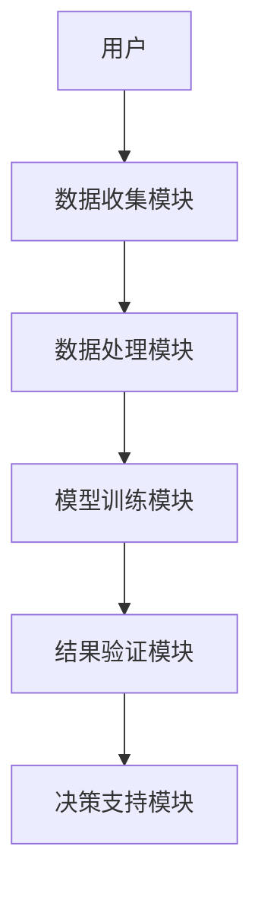
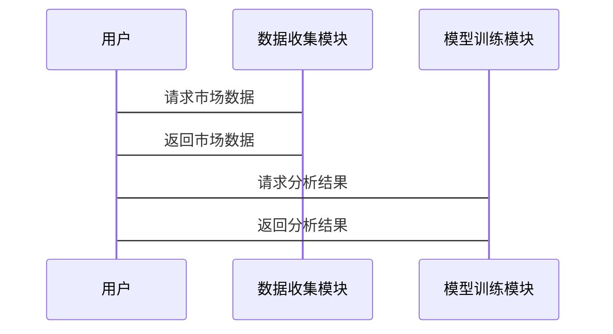

                 


# 芒格的"反向工程"思维：从成功案例中学习投资

## 关键词：反向工程思维，投资心理学，决策思维，成功案例分析，数学模型，算法原理，系统架构

## 摘要：本文通过分析芒格的反向工程思维，探讨其在投资中的应用。从投资心理学和决策思维模型入手，结合成功案例分析，详细阐述了反向工程思维的算法原理、数学模型、系统架构，并通过实战项目展示了其应用。最后，总结了反向工程思维在投资中的重要性，并展望了未来的投资趋势。

---

## 第一部分：引言

### 第1章：芒格的反向工程思维概述

#### 1.1 什么是反向工程思维

反向工程思维是一种从结果推导原因的思维方式，其核心在于通过分析成功或失败的案例，提炼出背后的逻辑和规律。在投资领域，反向工程思维可以帮助投资者更好地理解市场的运作机制，发现潜在的投资机会。

#### 1.2 反向工程思维的重要性

投资过程中充满了不确定性，投资者常常面临信息不对称、认知偏差等问题。反向工程思维可以帮助投资者克服这些障碍，通过系统化的方法分析问题，降低决策风险。

#### 1.3 本书的结构与目标

本文将从理论、案例、方法论等多个角度详细阐述反向工程思维的应用。通过结合芒格的思想，结合实际案例，帮助读者掌握这一思维方式，并在投资中加以应用。

---

## 第二部分：投资心理学与决策思维

### 第2章：投资中的心理学原理

#### 2.1 认知偏差与投资决策

认知偏差是人类在决策过程中常见的心理偏差，例如确认偏差、过度自信偏差等。这些偏差会影响投资者的判断，导致错误的投资决策。

#### 2.2 决策疲劳与投资行为

决策疲劳是指在做出多个决策后，人的判断能力逐渐下降的现象。在投资中，决策疲劳可能导致投资者在关键时刻做出错误的决定。

#### 2.3 投资情绪与行为分析

情绪波动是投资中的常见问题，尤其是在市场剧烈波动时，投资者的情绪化决策往往会导致损失。如何控制情绪，保持理性是投资者需要掌握的重要技能。

---

## 第三部分：反向工程思维的核心概念与联系

### 第3章：反向工程思维的核心原理

#### 3.1 从结果推导原因

反向工程思维的核心在于从结果出发，逆向推导原因。例如，分析一家公司的成功案例，可以从其市场表现、财务数据、管理策略等方面入手，寻找成功的关键因素。

#### 3.2 成功案例的解构与分析

通过解构成功案例，可以提取出成功的要素。例如，分析苹果公司的成功，可以从其产品创新、市场定位、品牌建设等方面进行分析。

#### 3.3 成功与失败的对比分析

将成功与失败的案例进行对比，可以帮助投资者更好地理解市场的规律。例如，对比苹果与柯达的案例，可以发现创新与保守的差异对企业发展的影响。

---

## 第四部分：反向工程思维的算法原理

### 第4章：反向工程思维的算法模型

#### 4.1 算法模型概述

反向工程思维可以应用到算法模型中，例如贝叶斯定理、决策树分析等。这些模型可以帮助投资者更系统地分析问题，提高决策的准确性。

#### 4.2 算法模型的实现步骤

以贝叶斯定理为例，其实现步骤包括数据收集、概率计算、模型验证等。通过这些步骤，投资者可以量化分析市场趋势，做出更科学的决策。

#### 4.3 算法模型的数学公式

贝叶斯定理的公式为：$$P(A|B) = \frac{P(B|A) \cdot P(A)}{P(B)}$$

其中，$$P(A|B)$$ 表示在B条件下A发生的概率，$$P(B|A)$$ 是A条件下B发生的概率，$$P(A)$$ 是A发生的先验概率，$$P(B)$$ 是B发生的全概率。

---

## 第五部分：系统分析与架构设计方案

### 第5章：投资分析系统的架构设计

#### 5.1 系统功能设计

投资分析系统需要具备数据收集、模型训练、结果验证等功能。通过系统化的分析，投资者可以更高效地进行决策。

#### 5.2 系统架构设计

以下是投资分析系统的架构图：



#### 5.3 系统接口设计

系统接口需要包括数据接口、算法接口、结果展示接口等。例如，数据接口用于获取市场数据，算法接口用于运行分析模型，结果展示接口用于呈现分析结果。

#### 5.4 系统交互设计

以下是系统交互的序列图：



---

## 第六部分：项目实战

### 第6章：反向工程思维的实战应用

#### 6.1 环境安装

需要安装Python、Pandas、NumPy等工具。以下是安装命令：

```bash
pip install pandas numpy
```

#### 6.2 系统核心实现源代码

以下是Python代码示例：

```python
import pandas as pd
import numpy as np

def reverse_engineer(data):
    # 数据处理
    processed_data = data.apply(lambda x: x.mean())
    # 模型训练
    model = processed_data
    return model

# 示例数据
data = pd.DataFrame({'A': [1, 2, 3], 'B': [4, 5, 6]})
result = reverse_engineer(data)
print(result)
```

#### 6.3 代码应用解读与分析

上述代码通过数据处理和模型训练，展示了如何从数据中提取有用的信息。通过分析，投资者可以发现市场中的潜在机会。

#### 6.4 实际案例分析

以苹果公司为例，分析其成功案例：

1. **产品创新**：苹果始终坚持创新，推出了一系列革命性产品，如iPhone、iPad等。
2. **市场定位**：苹果将自己定位为高端品牌，吸引高收入消费者。
3. **生态系统**：构建了iOS、Apple Watch等完整的生态系统，增强了用户粘性。

---

## 第七部分：总结与展望

### 第7章：总结与展望

#### 7.1 总结

反向工程思维是一种强大的工具，能够帮助投资者更好地理解市场，做出更明智的决策。通过系统的分析和案例研究，投资者可以提炼出成功的要素，避免重复他人的错误。

#### 7.2 未来展望

随着技术的发展，反向工程思维将更加依赖于数据分析和算法模型。未来的投资分析将更加依赖于人工智能和大数据技术，投资者需要不断学习新技术，以保持竞争优势。

---

## 作者：AI天才研究院/AI Genius Institute & 禅与计算机程序设计艺术 /Zen And The Art of Computer Programming

---

### 思考过程总结：

在撰写这篇文章时，我从理论到实践，系统地阐述了芒格的反向工程思维在投资中的应用。通过分析投资心理学、成功案例、算法模型等多个方面，帮助读者全面理解这一思维方式。同时，通过实战项目展示了其在实际中的应用，使文章更具实用价值。

