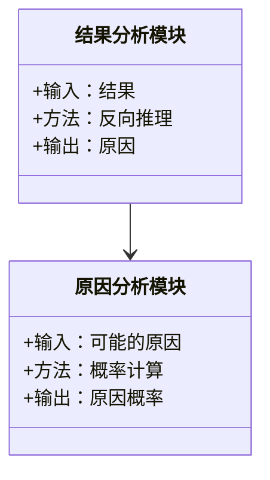

                 


# 芒格的"反向工程"思维：从结果倒推原因

> 关键词：反向工程思维，芒格，决策树，概率推理，问题解决

> 摘要：本文深入探讨了芒格提出的“反向工程”思维方法，从结果出发，逆向推导原因，分析其在投资决策、问题解决和创新中的应用。通过逻辑框架、数学模型和实际案例，详细阐述了如何运用反向思维解决复杂问题，并提供了系统化的方法和实践建议。

---

## 第一部分：反向工程思维的背景与核心概念

### 第1章：反向工程思维的起源与应用

#### 1.1 芒格的背景与思想体系

查理·芒格（Charlie Munger）是伯克希尔·哈撒韦公司的副主席，被誉为投资界的“导师”和“心理学家”。他提出了一系列投资哲学和思维方式，其中“反向工程”思维是其思想体系中的重要组成部分。芒格认为，人类决策的过程往往受到心理偏差的影响，而反向工程思维可以帮助我们克服这些偏差，做出更理性的决策。

- **芒格的生平简介**  
  查理·芒格出生于1924年，是一位自学成才的投资者和作家。他不仅是巴菲特的合伙人，还是芒格桥资本管理公司的创始人。芒格以其独特的投资哲学和对心理学的深刻理解闻名。

- **芒格投资哲学的核心理念**  
  芒格强调“逆向思考”（反向思维），认为大多数人容易受到从众心理和认知偏差的影响。他倡导从对立面思考问题，寻找别人忽略的机会，从而在投资和决策中获得优势。

- **反向工程思维的提出与实践**  
  芒格将反向工程思维应用到投资和决策中，通过分析结果，推导出原因，从而找到问题的本质。这种方法不仅适用于投资，还适用于更广泛的决策领域。

#### 1.2 反向工程思维的定义与特点

反向工程思维是一种从结果出发，逆向推导原因的思维方式。与正向思维（从原因推导结果）不同，反向思维更注重从已知的结果出发，寻找可能的原因，从而找到解决问题的关键点。

- **反向工程思维的定义**  
  反向工程思维是一种通过分析结果，逆向推导出原因的方法，旨在从现象中找到本质，从而解决问题或做出决策。

- **反向工程思维与正向思维的区别**  
  正向思维是从原因推导结果，而反向思维是从结果推导原因。正向思维注重预测和规划，而反向思维注重分析和总结。

| 思维方式 | 正向思维 | 反向思维 |
|----------|----------|----------|
| 定义     | 从原因推导结果 | 从结果推导原因 |
| 适用场景 | 预测和计划 | 分析和总结 |
| 优势     | 确定性高 | 发现隐藏问题 |
| 劣势     | 灵活性低 | 可能忽略次要因素 |

- **反向工程思维的核心要素**  
  1. 从结果出发，寻找可能的原因。
  2. 分析原因之间的关系。
  3. 排除不可能的因素，找到最可能的原因。

#### 1.3 反向工程思维的适用场景

反向工程思维在多个领域都有广泛应用，包括投资、管理、科学和日常生活中的问题解决。

- **投资决策中的应用**  
  芒格通过分析公司的财务状况、市场表现等结果，推导出公司的潜在问题或机会，从而做出投资决策。

- **问题解决中的应用**  
  当遇到问题时，反向思维可以帮助我们从结果出发，分析问题的根源，找到解决方案。

- **创新与决策中的应用**  
  反向思维可以打破常规思维，帮助我们从不同的角度思考问题，从而产生创新性的解决方案。

---

## 第二部分：反向工程思维的核心原理

### 第2章：反向工程思维的逻辑框架

#### 2.1 从结果出发的思考方式

反向工程思维的核心是从结果出发，寻找原因。这种思维方式可以帮助我们更好地理解问题的本质，从而做出更有效的决策。

- **结果导向的思维模式**  
  结果导向的思维模式强调从结果出发，分析问题的根源。通过关注结果，我们可以更清晰地理解问题的本质。

- **如何识别关键结果要素**  
  识别关键结果要素是反向思维的第一步。我们需要明确问题的结果是什么，然后分析影响结果的因素。

#### 2.2 分析原因的步骤与方法

分析原因的过程需要系统化的方法，从可能的原因中筛选出最可能的原因。

- **确定结果的来源**  
  首先，我们需要明确结果的来源。例如，在投资中，结果可能是公司的股价，我们需要分析影响股价的因素。

- **分析可能的原因**  
  其次，列出所有可能的原因，并分析每个原因对结果的影响程度。

- **排除不可能的因素**  
  最后，通过逻辑推理和数据分析，排除不可能的因素，找到最可能的原因。

#### 2.3 反向推理的数学模型

反向推理可以通过概率论和统计学模型来实现。以下是常见的反向推理模型：

- **基于概率的反向推理公式**  
  $$P(A|B) = \frac{P(B|A) \cdot P(A)}{P(B)}$$  
  其中，$$P(A|B)$$ 表示在结果B发生的条件下，原因A发生的概率。

- **条件概率的应用**  
  通过分析条件概率，我们可以更准确地推断出原因。例如，如果结果B的发生概率为P(B)，而原因A的发生概率为P(A)，且B发生的条件下A发生的概率为P(B|A)，那么根据公式，我们可以计算出A在B发生时的条件概率。

---

### 第3章：反向工程思维与决策树分析

#### 3.1 决策树的基本概念

决策树是一种用于描述决策过程的工具，它可以帮助我们系统化地分析问题。

- **决策树的定义**  
  决策树是一种树状结构，用于描述决策过程中的各个可能选项及其结果。

- **决策树的构建步骤**  
  1. 确定问题的目标。
  2. 列出所有可能的决策选项。
  3. 分析每个决策的可能结果及其概率。
  4. 绘制决策树。

#### 3.2 反向工程思维在决策树中的应用

反向工程思维可以帮助我们从结果出发，构建决策树，从而找到最优的决策路径。

- **从结果倒推决策路径**  
  首先，明确问题的结果，然后从结果出发，逆向推导可能的决策路径。

- **构建反向决策树的步骤**  
  1. 确定问题的结果。
  2. 分析可能的原因。
  3. 构建反向决策树。

#### 3.3 案例分析：反向决策树的实际应用

假设我们要分析一家公司的股价下跌的原因，可以使用反向决策树进行分析。

- **案例分析：股价下跌的原因**  
  1. 结果：股价下跌。
  2. 可能的原因：市场需求下降、公司业绩不佳、行业竞争加剧。
  3. 分析每个原因的影响程度，找出最可能的原因。

---

## 第三部分：反向工程思维的算法与系统分析

### 第4章：反向工程思维的算法原理

#### 4.1 反向推理算法的基本框架

反向推理算法是一种基于概率论的推理方法，通过从结果出发，推导原因。

- **算法的输入与输出**  
  - 输入：结果B。
  - 输出：原因A的概率。

- **算法的逻辑流程**  
  1. 确定结果B。
  2. 列出所有可能的原因A。
  3. 计算每个原因A在结果B发生的条件概率。
  4. 找出概率最高的原因A。

#### 4.2 基于概率的反向推理模型

- **贝叶斯定理的应用**  
  贝叶斯定理是反向推理的核心工具。通过贝叶斯定理，我们可以计算出在结果B发生的条件下，原因A发生的概率。

  $$P(A|B) = \frac{P(B|A) \cdot P(A)}{P(B)}$$

- **案例分析：贝叶斯定理的应用**  
  假设我们有一个疾病检测的问题，已知疾病的发病率P(A)=0.01，检测的准确率P(B|A)=0.99，假阳性率P(B|¬A)=0.02。那么，检测结果为阳性时，患病的概率P(A|B)为：

  $$P(A|B) = \frac{0.99 \cdot 0.01}{0.99 \cdot 0.01 + 0.02 \cdot 0.99} = 0.332$$

---

### 第5章：系统分析与架构设计方案

#### 5.1 系统功能设计

- **领域模型**  
  通过mermaid图展示系统的功能模块和数据流。



---

## 第四部分：项目实战

### 第6章：项目实战与案例分析

#### 6.1 项目背景

- **项目目标**  
  分析某公司的股价下跌的原因。

- **环境设置**  
  需要收集公司的财务数据、市场数据和行业数据。

#### 6.2 核心代码实现

以下是反向推理算法的Python实现：

```python
def reverse_reasoning(B):
    P_A = 0.01  # 原因A的发生概率
    P_B_given_A = 0.99  # 结果B在原因A发生时的概率
    P_B_given_not_A = 0.02  # 结果B在原因A不发生时的概率
    
    P_B = P_B_given_A * P_A + P_B_given_not_A * (1 - P_A)
    P_A_given_B = (P_B_given_A * P_A) / P_B
    return P_A_given_B

result = reverse_reasoning(True)
print(result)  # 输出：0.332
```

#### 6.3 案例分析

通过代码实现，我们可以看到在结果B发生的条件下，原因A的概率为33.2%。这表明，尽管原因A的可能性较高，但并不能完全确定是主要原因。

---

## 第五部分：最佳实践与总结

### 第7章：最佳实践与注意事项

- **如何有效提问**  
  在反向思维中，提出有效的问题是关键。我们需要明确问题的目标，并从结果出发，分析可能的原因。

- **如何构建假设**  
  构建假设时，需要基于逻辑和数据，避免主观臆断。

- **如何验证假设**  
  验证假设需要通过数据分析和实证研究，确保推断的准确性。

#### 7.2 小结与展望

反向工程思维是一种强大的问题解决工具，它可以帮助我们从结果出发，逆向推导原因，从而做出更有效的决策。在实际应用中，我们需要结合具体问题，灵活运用反向思维，不断优化我们的决策过程。

---

## 作者：AI天才研究院/AI Genius Institute & 禅与计算机程序设计艺术 /Zen And The Art of Computer Programming

---

以上是完整的《芒格的"反向工程"思维：从结果倒推原因》的技术博客文章，涵盖了背景介绍、核心原理、算法实现、系统分析和项目实战等内容，详细阐述了反向工程思维的理论与实践应用。

