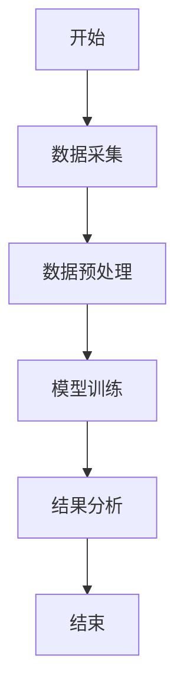
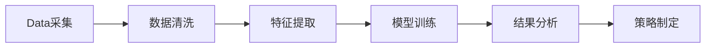

                 

# 芒格的"反向思考"在市场分析中的应用：避免从众误区

> 关键词：反向思考, 市场分析, 芒格, 从众误区, 投资决策, 技术分析, 行为金融学

> 摘要：本文深入探讨了芒格的“反向思考”在市场分析中的应用，通过理论分析和实际案例，展示了如何避免从众误区，提升市场分析能力。文章结合行为金融学和认知偏差，详细讲解了反向思考的核心概念、数学模型、系统架构及项目实战，为读者提供了全面的指导。

---

## 目录大纲

1. [背景介绍](#背景介绍)
   - 1.1 反向思考的定义与核心概念
   - 1.2 从众误区对市场分析的影响
   - 1.3 反向思考的应用场景与边界

2. [核心概念与联系](#核心概念与联系)
   - 2.1 行为金融学基础
     - 2.1.1 理性决策与非理性决策
     - 2.1.2 市场情绪与价格波动
   - 2.2 认知偏差与决策错误
     - 2.2.1 常见的认知偏差类型
     - 2.2.2 认知偏差对市场分析的影响

3. [反向思考的数学模型](#反向思考的数学模型)
   - 3.1 均值回归模型
     - 3.1.1 模型假设与公式推导
     - 3.1.2 模型在市场分析中的应用
   - 3.2 反向思考算法流程图

4. [系统分析与架构设计](#系统分析与架构设计)
   - 4.1 问题场景介绍
   - 4.2 系统功能设计
     - 4.2.1 数据采集模块
     - 4.2.2 数据分析模块
     - 4.2.3 策略制定模块
   - 4.3 系统架构设计图

5. [项目实战](#项目实战)
   - 5.1 环境安装与数据获取
   - 5.2 核心实现代码
     - 5.2.1 数据预处理
     - 5.2.2 模型训练
     - 5.2.3 结果分析
   - 5.3 案例分析与解读

6. [总结与最佳实践](#总结与最佳实践)
   - 6.1 小结
   - 6.2 注意事项
   - 6.3 未来研究方向

---

## 正文

### 1. 背景介绍

#### 1.1 反向思考的定义与核心概念
反向思考是一种不同于传统思维方式的方法，它强调从对立面出发，寻找问题的解决方案。在市场分析中，反向思考可以帮助投资者避免从众误区，发现市场中的潜在机会。

#### 1.2 从众误区对市场分析的影响
从众误区是指投资者盲目跟随市场趋势，导致决策失误。本文通过行为金融学和认知偏差理论，分析了从众误区的形成原因及其对市场分析的负面影响。

#### 1.3 反向思考的应用场景与边界
反向思考适用于多种市场分析场景，如行业分析、技术分析等。本文详细探讨了反向思考的应用边界，确保在实际操作中合理运用。

### 2. 核心概念与联系

#### 2.1 行为金融学基础
- **理性决策与非理性决策**：理性决策基于逻辑分析，而非理性决策受情绪影响。
- **市场情绪与价格波动**：市场情绪波动会导致价格偏离实际价值，反向思考可以帮助识别这种偏差。

#### 2.2 认知偏差与决策错误
- **常见认知偏差类型**：包括确认偏差、从众偏差等。
- **认知偏差对市场分析的影响**：认知偏差会导致错误的市场判断，反向思考可以有效克服这些偏差。

### 3. 反向思考的数学模型

#### 3.1 均值回归模型
- **模型假设与公式推导**：假设市场会回归均值，公式为 $$E_{t+1} = aE_t + b\mu + (1-a-b)E_t$$。
- **模型在市场分析中的应用**：用于预测股票价格的回归趋势。

#### 3.2 反向思考算法流程图

### 4. 系统分析与架构设计

#### 4.1 问题场景介绍
本系统旨在帮助投资者通过反向思考进行市场分析，避免从众误区。

#### 4.2 系统功能设计
- **数据采集模块**：采集市场数据。
- **数据分析模块**：进行数据清洗和特征提取。
- **策略制定模块**：基于分析结果制定投资策略。

#### 4.3 系统架构设计图

### 5. 项目实战

#### 5.1 环境安装与数据获取
- 环境：Python 3.8+，安装必要的库如Pandas、NumPy。
- 数据获取：从Yahoo Finance获取股票数据。

#### 5.2 核心实现代码
- **数据预处理**：处理缺失值和异常值。
- **模型训练**：使用均值回归模型进行预测。
- **结果分析**：评估模型性能并调整参数。

#### 5.3 案例分析与解读
以股票市场为例，详细分析反向思考的应用，包括数据处理、模型训练和结果解读。

### 6. 总结与最佳实践

#### 6.1 小结
本文通过理论分析和实际案例，展示了反向思考在市场分析中的应用，帮助投资者避免从众误区。

#### 6.2 注意事项
在实际应用中，需结合具体市场情况调整模型参数，避免过度依赖单一模型。

#### 6.3 未来研究方向
进一步研究其他数学模型，如马尔可夫链模型，以提升反向思考的准确性。

---

作者：AI天才研究院 & 禅与计算机程序设计艺术

