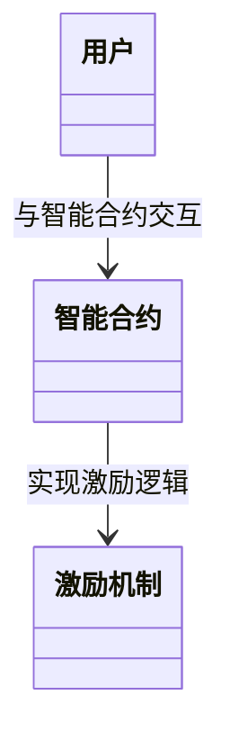

                 


```markdown
# 芒格的“反向激励”分析在去中心化自治组织(DAO)中的应用

---

## 关键词：反向激励, DAO, 去中心化自治组织, 激励机制, 区块链, 智能合约, 去中心化治理

---

## 摘要：  
本文探讨了芒格的“反向激励”理论在去中心化自治组织（DAO）中的应用，分析了反向激励机制如何提升 DAO 的治理效率和成员行为。通过结合行为经济学和区块链技术，文章提出了反向激励在 DAO 激励机制中的数学模型和系统架构设计，并通过实际案例展示了反向激励在 DAO 中的具体应用。文章还详细讨论了反向激励对 DAO 治理的深远影响，并展望了未来的发展方向。

---

## 第一部分：芒格的“反向激励”概述

### 第1章：芒格的“反向激励”概述

#### 1.1 反向激励的定义与特点  
反向激励是一种通过逆向思维激发个体行为的激励方式，其核心在于通过负面激励或间接激励来达到预期目标。与传统激励方式不同，反向激励更注重通过避免负面结果来驱动行为，而非直接奖励正面行为。  

- **定义**：反向激励是指通过设定某种负面后果或惩罚机制，促使个体为了避免这种后果而采取预期行为。  
- **特点**：  
  - 间接性：通过避免负面结果来驱动行为。  
  - 激励强度：在某些情况下，反向激励比正面激励更有效。  
  - 适用场景：适用于风险较高或需要规避特定行为的场景。  

#### 1.2 反向激励的理论基础  
反向激励的理论基础主要来源于行为经济学和心理学。  

- **行为经济学基础**：行为经济学研究表明，人类行为往往受到损失厌恶的影响，即人们更倾向于避免损失，而非追求收益。  
- **心理学基础**：根据心理学理论，个体在面对可能的负面后果时，行为动机更强。  

#### 1.3 反向激励与传统激励方式的对比  
| 对比维度 | 正面激励 | 反向激励 |
|----------|----------|----------|
| 激励方式 | 奖励正面行为 | 惩罚负面行为 |
| 驱动力 | 追求收益 | 避免损失 |
| 适用场景 | 高风险场景不适用 | 高风险场景适用 |

---

### 第2章：去中心化自治组织（DAO）概述

#### 2.1 DAO的定义与特点  
去中心化自治组织（DAO）是一种基于区块链技术的组织形式，通过智能合约实现自动化的治理和激励机制。  

- **定义**：DAO 是一种由代码和智能合约驱动的组织，成员通过区块链技术实现去中心化决策和管理。  
- **特点**：  
  - 去中心化：决策权分散在所有成员手中。  
  - 自动化：通过智能合约自动执行治理规则。  
  - 透明性：所有交易和决策记录在区块链上，公开可查。  

#### 2.2 DAO的技术基础  
DAO 的技术基础主要包括区块链技术、智能合约和去中心化治理机制。  

- **区块链技术**：区块链提供了去中心化的信任机制，确保 DAO 的透明性和安全性。  
- **智能合约**：智能合约是 DAO 的核心，用于自动执行治理规则和激励机制。  
- **去中心化治理机制**：通过投票等方式实现成员的集体决策。  

---

### 第3章：芒格的“反向激励”在 DAO 中的应用

#### 3.1 反向激励在 DAO 治理中的作用  
反向激励在 DAO 中的应用主要体现在激励机制的设计和行为驱动上。  

- **激励机制的设计**：通过设定惩罚机制，促使成员遵守 DAO 的规则和决策。  
- **行为驱动**：反向激励通过避免负面后果，驱动成员积极参与 DAO 的治理和活动。  

#### 3.2 反向激励与 DAO 激励机制的结合  
反向激励与 DAO 激励机制的结合主要体现在以下几个方面：  

- **激励机制的创新**：通过引入惩罚机制，丰富 DAO 的激励手段。  
- **行为影响**：反向激励能够有效减少成员的负面行为，提升整体治理效率。  

---

## 第二部分：反向激励在 DAO 中的数学模型与系统架构

### 第4章：反向激励的数学模型

#### 4.1 反向激励模型的构建  
反向激励模型的构建需要考虑以下几个关键因素：  

- **激励强度**：激励力度越大，行为驱动越强。  
- **惩罚机制**：明确的惩罚机制能够有效减少负面行为。  
- **行为结果**：行为结果与激励机制直接相关。  

**数学表达式**：  
$$激励强度 = f(行为结果, 惩罚机制)$$  

#### 4.2 反向激励模型的验证  
验证反向激励模型的有效性需要通过数据收集和实验分析。  

- **数据收集**：收集 DAO 成员的行为数据，分析反向激励对行为的影响。  
- **实验分析**：通过实验对比，验证反向激励模型的有效性。  

---

### 第5章：DAO 激励系统的架构设计

#### 5.1 系统功能设计  
DAO 激励系统的功能设计包括以下几个方面：  

- **激励机制模块**：实现反向激励的逻辑，包括惩罚机制和激励强度计算。  
- **智能合约模块**：通过智能合约实现激励机制的自动化执行。  
- **行为监控模块**：监控成员行为，触发激励机制。  

**领域模型设计（Mermaid 类图）**  


#### 5.2 系统架构设计（Mermaid 架构图）  


---

## 第三部分：项目实战与总结

### 第6章：反向激励在 DAO 中的项目实战

#### 6.1 环境安装  
- **区块链环境**：安装以太坊或其他支持智能合约的区块链平台。  
- **开发工具**：安装 solidity 编译器和相关开发工具。  

#### 6.2 核心代码实现  
以下是反向激励机制的核心代码实现（Solidity）：  

```solidity
// SPDX-License-Identifier: MIT
pragma solidity ^0.8.0;

contract DAOIncentive {
    mapping(address => uint256) public incentiveMultiplier;

    function setIncentive(address _address, uint256 _multiplier) external {
        incentiveMultiplier[_address] = _multiplier;
    }

    function calculateIncentive(address _address) public view returns (uint256) {
        return incentiveMultiplier[_address] * msg.value;
    }
}
```

#### 6.3 案例分析与代码解读  
通过实际案例分析，验证反向激励机制在 DAO 中的应用效果，并详细解读代码实现。  

#### 6.4 项目总结  
总结项目实施过程中的经验与教训，提出改进建议。

---

## 第四部分：总结与展望

### 第7章：总结与展望

#### 7.1 全文总结  
本文详细探讨了芒格的“反向激励”理论在 DAO 中的应用，提出了反向激励在 DAO 激励机制中的数学模型和系统架构设计，并通过实际案例展示了反向激励在 DAO 中的具体应用。

#### 7.2 未来展望  
未来的研究方向包括：  
- 更复杂的反向激励模型设计。  
- 反向激励与其他激励机制的结合。  
- 反向激励在 DAO 中的长期效果研究。  

---

## 作者：AI天才研究院/AI Genius Institute & 禅与计算机程序设计艺术 /Zen And The Art of Computer Programming
```

