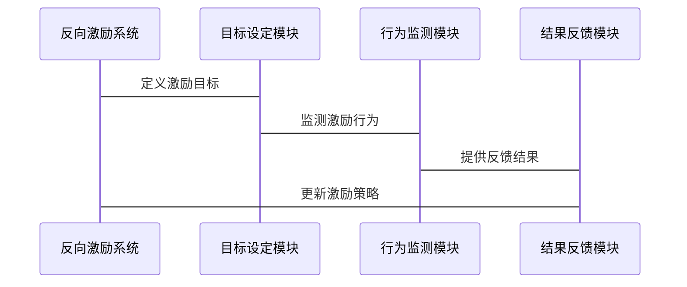

                 


# 目录大纲：芒格的"反向激励"分析在科技创业生态系统中的应用

---

## # 第一部分：引言

## ## 第1章：引言

### ### 1.1 问题背景
- 科技创业生态系统的复杂性
- 传统激励机制的局限性
- 反向激励的概念与重要性

### ### 1.2 问题描述
- 创业生态系统中的激励挑战
- 芒格反向激励的提出背景
- 反向激励的目标与意义

### ### 1.3 问题解决
- 反向激励的核心思想
- 反向激励与传统激励的对比
- 反向激励在科技创业中的应用潜力

### ### 1.4 边界与外延
- 反向激励的适用范围
- 反向激励的局限性
- 反向激励与其他管理理论的结合

### ### 1.5 概念结构与核心要素
- 反向激励的定义
- 核心要素：目标、行为、结果
- 反向激励与创业生态系统的关系

---

## # 第二部分：芒格的反向激励理论

## ## 第2章：芒格反向激励的核心概念

### ### 2.1 反向激励的理论基础
- 芒格反向激励的来源
- 反向激励的核心原理
- 反向激励与心理学的结合

### ### 2.2 反向激励的核心要素
- 激励目标
- 激励行为
- 激励结果

### ### 2.3 反向激励与传统激励的对比
- 对比表格：传统激励 vs 反向激励
- 优缺点分析

---

## # 第三部分：反向激励在科技创业生态系统中的应用

## ## 第3章：反向激励在科技创业中的应用场景

### ### 3.1 领导力与团队激励
- 反向激励在领导力中的应用
- 团队激励的创新模式

### ### 3.2 创业者与投资者关系
- 反向激励在投资者关系管理中的作用
- 创业者与投资者的利益平衡

### ### 3.3 产品开发与市场反馈
- 反向激励在产品开发中的应用
- 市场反馈的反向激励机制

---

## # 第四部分：系统分析与架构设计

## ## 第4章：反向激励系统的架构设计

### ### 4.1 系统功能设计
- 领域模型：反向激励系统类图（Mermaid）
```mermaid
classDiagram
    class 反向激励系统 {
        +目标设定模块
        +行为监测模块
        +结果反馈模块
    }
    反向激励系统 -> 目标设定模块: 定义激励目标
    反向激励系统 -> 行为监测模块: 监测激励行为
    反向激励系统 -> 结果反馈模块: 提供反馈结果
```

### ### 4.2 系统架构设计
- 系统架构图（Mermaid）


### ### 4.3 系统接口设计
- 系统接口设计说明

### ### 4.4 系统交互流程图（Mermaid）


---

## # 第五部分：项目实战

## ## 第5章：项目实战

### ### 5.1 环境安装
- 安装步骤说明

### ### 5.2 核心代码实现
- 核心代码示例（Python）
```python
def reverse_incentive_system():
    target = define_target()
    behavior = monitor_behavior(target)
    result = feedback_result(behavior)
    return result

def define_target():
    # 定义激励目标
    pass

def monitor_behavior(target):
    # 监测激励行为
    pass

def feedback_result(behavior):
    # 提供反馈结果
    pass
```

### ### 5.3 案例分析
- 具体案例分析与解读

### ### 5.4 项目总结
- 项目成果与经验教训

---

## # 第六部分：最佳实践

## ## 第6章：最佳实践

### ### 6.1 关键点总结
- 反向激励的核心要点
- 科技创业中的应用策略

### ### 6.2 小结
- 对反向激励的全面回顾
- 对科技创业生态系统的深入理解

### ### 6.3 注意事项
- 反向激励的实施风险
- 注意事项与规避策略

### ### 6.4 拓展阅读
- 推荐书籍与资源
- 进一步学习的方向

---

## # 附录

## ## 附录A：术语表
- 专业术语解释

## ## 附录B：参考文献
- 相关文献与资料来源

## ## 附录C：代码库链接
- 项目代码托管地址

---

## # 作者

**作者：AI天才研究院/AI Genius Institute & 禅与计算机程序设计艺术 /Zen And The Art of Computer Programming**

---

### 说明
以上是一个详细的大纲，涵盖了从理论到实践的各个方面，确保内容全面且结构清晰。每个部分都细化到三级，便于逐步展开和深入讨论。通过理论分析、案例研究和系统设计，读者可以全面理解芒格反向激励在科技创业生态系统中的应用，并通过实战项目掌握具体实施方法。

