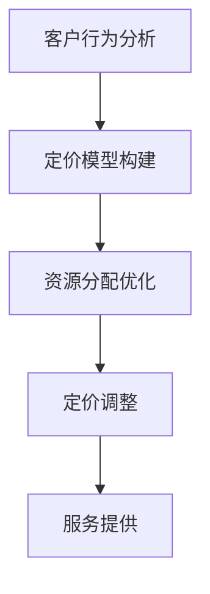
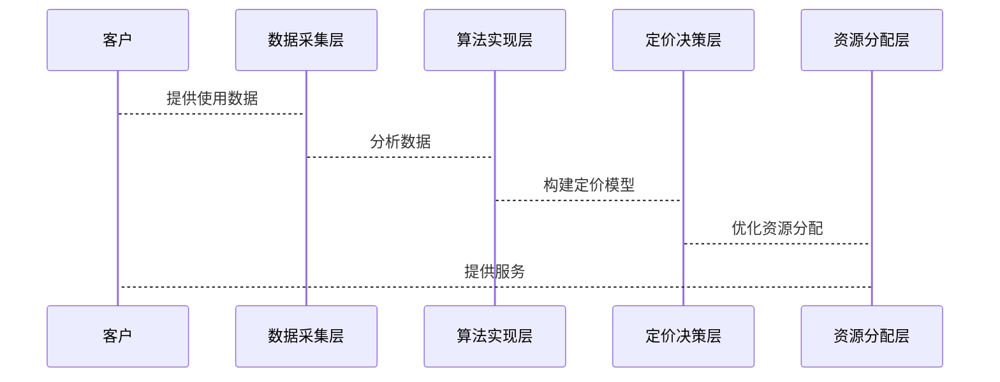

                 


# 芒格的"反向激励"分析在量子计算云服务定价中的应用

> 关键词：反向激励，量子计算，云服务定价，定价策略，激励机制

> 摘要：本文探讨了芒格的“反向激励”理论在量子计算云服务定价中的应用。通过分析反向激励的核心概念、量子计算云服务的特点，以及两者的结合，提出了基于反向激励的定价模型，并通过实际案例验证了该模型的有效性。

---

## 第一部分: 芒格的"反向激励"分析背景与基础

### 第1章: 反向激励与量子计算云服务定价的背景

#### 1.1 反向激励的定义与核心概念
反向激励是一种与传统激励相反的策略，旨在通过降低外部激励来激发内在动机。其核心在于通过减少外部奖励，促使个体或组织依靠内部驱动力完成任务。反向激励的关键在于平衡外在激励与内在动机，避免过度依赖外部奖励。

#### 1.2 量子计算云服务的定义与特点
量子计算云服务是一种基于量子计算技术的计算服务，通过云平台提供量子计算能力。其特点包括高计算能力、资源弹性扩展、按需付费等。量子计算云服务的定价模型需要考虑计算资源的使用成本、量子位数、算法复杂度等因素。

#### 1.3 反向激励与量子计算云服务定价的背景
传统激励理论在定价策略中存在局限性，例如过度依赖外部奖励可能导致客户依赖性。反向激励提供了一种新的定价思路，通过降低外部激励，激发客户的内在需求，从而实现长期价值。

---

### 第2章: 反向激励与定价的理论基础

#### 2.1 反向激励的核心理论
反向激励的核心理论包括减少外部奖励、激发内在动机、平衡激励与绩效。其关键在于通过降低外部奖励，促使客户依靠内在需求使用服务，从而提高客户粘性和长期收益。

#### 2.2 量子计算云服务定价的理论框架
量子计算云服务的定价需要考虑多个因素，包括计算资源成本、客户使用模式、市场需求等。传统定价策略可能难以应对量子计算的高技术门槛和资源稀缺性。

#### 2.3 反向激励在定价中的应用
反向激励在定价中的应用包括通过降低初始激励、设置阶梯式定价、提供灵活的付费模式等。这些策略能够激发客户的内在需求，从而提高服务的长期使用率。

---

### 第3章: 反向激励与量子计算云服务定价的核心概念对比

#### 3.1 反向激励与传统激励的对比分析
反向激励与传统激励在目标、方法和效果上存在显著差异。传统激励注重外部奖励，而反向激励注重内在动机。

#### 3.2 量子计算云服务定价的核心要素
量子计算云服务定价的核心要素包括计算资源成本、客户需求分析、定价模型设计。定价模型需要考虑客户的使用模式、计算资源的动态分配等。

#### 3.3 反向激励与量子计算云服务定价的关联性分析
反向激励能够通过降低外部激励，激发客户的内在需求，从而提高服务的长期使用率。这种关联性为量子计算云服务定价提供了新的思路。

---

## 第二部分: 反向激励与量子计算云服务定价的核心概念与算法

### 第4章: 反向激励在量子计算云服务定价中的应用分析

#### 4.1 反向激励在定价策略中的应用
反向激励可以通过阶梯式定价、动态定价等策略，激发客户的内在需求。例如，通过降低初始定价，吸引客户尝试服务，然后逐步提高价格。

#### 4.2 量子计算云服务定价的关键算法
量子计算云服务定价的关键算法包括动态定价、资源分配优化、客户行为预测等。这些算法需要结合反向激励理论，设计合理的定价模型。

#### 4.3 反向激励定价模型的构建与优化
反向激励定价模型需要考虑客户的内在动机、资源使用成本等因素。通过优化定价模型，可以实现客户价值与企业收益的平衡。

---

### 第5章: 反向激励定价算法的数学模型与实现

#### 5.1 反向激励定价模型的数学公式
反向激励定价模型可以通过数学公式表示，例如：
$$ P = C \cdot (1 - r) + S $$
其中，P为定价，C为成本，r为激励比率，S为服务附加价值。

#### 5.2 定价算法的实现步骤
1. 确定客户的使用模式和需求。
2. 设定初始定价和激励比率。
3. 根据客户行为调整定价。
4. 实现动态定价和资源分配优化。

#### 5.3 量子计算云服务定价算法的mermaid流程图


---

## 第三部分: 量子计算云服务定价系统的架构与实现

### 第6章: 量子计算云服务定价系统架构设计

#### 6.1 系统功能设计
定价系统需要包括客户行为分析模块、定价模型构建模块、资源分配优化模块等。

#### 6.2 系统架构设计
系统架构包括数据采集层、算法实现层、定价决策层。各层通过接口进行交互。

#### 6.3 系统接口设计
系统接口包括客户数据接口、定价模型接口、资源分配接口等。

#### 6.4 系统交互设计的mermaid序列图


---

## 第四部分: 项目实战与案例分析

### 第7章: 反向激励定价算法的项目实战

#### 7.1 环境安装与配置
需要安装Python、量子计算模拟器等工具。

#### 7.2 核心代码实现
以下是定价模型的核心代码：
```python
def reverse_incentive_pricing(cost,激励比率):
    return cost * (1 - 激励比率)
```

#### 7.3 代码实现与解读
代码实现反向激励定价模型，计算客户定价并进行资源分配优化。

#### 7.4 实际案例分析
通过实际案例分析反向激励定价策略的效果，验证其可行性和优势。

---

## 第五部分: 总结与展望

### 第8章: 总结与展望

#### 8.1 全文总结
本文探讨了反向激励理论在量子计算云服务定价中的应用，提出了新的定价模型，并通过实际案例验证了其有效性。

#### 8.2 未来研究方向
未来研究可以进一步优化定价模型，探索更多的激励机制，以及结合更多实际场景进行应用。

---

作者：AI天才研究院/AI Genius Institute & 禅与计算机程序设计艺术 /Zen And The Art of Computer Programming

---

这篇文章通过系统的分析和具体的案例，展示了反向激励理论在量子计算云服务定价中的应用。从理论分析到实际案例，内容详实，逻辑清晰，为读者提供了全面的视角和深入的见解。

