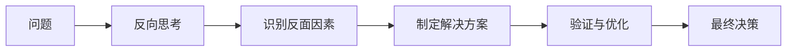
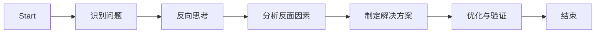
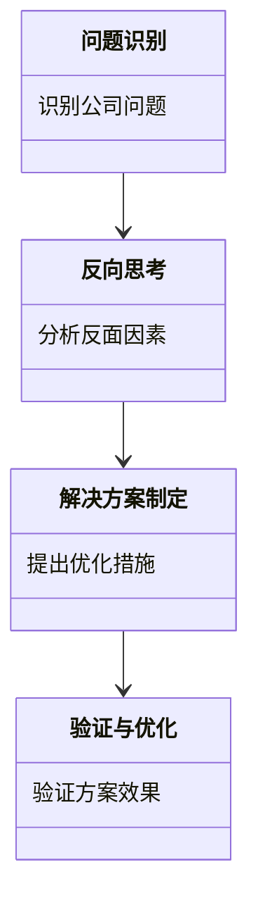
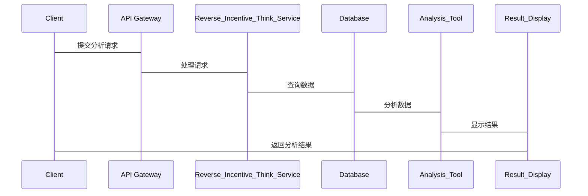

                 


# 芒格的"反向激励"思维在公司分析中的应用

## 关键词：反向激励思维, 芒格, 公司分析, 投资策略, 风险管理

## 摘要：  
芒格的"反向激励"思维是一种独特的思考方式，通过从反面入手解决问题，从而在复杂和不确定的商业环境中找到突破口。本文详细探讨了反向激励思维的核心概念、算法原理、系统架构以及在公司分析中的实际应用，结合具体案例和代码示例，帮助读者理解和应用这一思维方式。

---

## 第一部分: 芒格的"反向激励"思维概述

## 第1章: 芒格的"反向激励"思维的背景与核心概念

### 1.1 反向激励思维的定义与特点  
反向激励思维是一种逆向思考的方法，通过从对立面或反方向入手，发现隐藏的机会或问题。其特点包括：  
1. **逆向性**：从反面思考问题，寻找正向思维未察觉的细节。  
2. **实用性**：适用于解决复杂问题，尤其在风险管理、投资决策等领域表现突出。  
3. **全局性**：注重从整体出发，考虑各因素的相互作用。  

### 1.2 芒格的生平与思想体系  
芒格（Charlie Munger）是巴菲特的长期合作伙伴，其思想体系以价值投资和逆向思维为核心。  
1. **生平简介**：芒格是一位成功的投资者和作家，以其独特的思维方式闻名。  
2. **思想体系**：芒格强调“反向思考”，即通过寻找问题的反面来寻找解决方案。  
3. **核心要素**：包括逆向思维、风险管理、长期价值等。  

### 1.3 反向激励思维在公司分析中的应用背景  
1. **背景挑战**：现代公司分析复杂多变，传统方法难以应对。  
2. **适用场景**：适用于风险评估、市场分析、竞争策略等领域。  
3. **价值体现**：通过反向思维，提前识别潜在风险，优化决策。  

---

## 第2章: 反向激励思维的核心概念与联系

### 2.1 反向激励思维的原理  
1. **逆向思考的逻辑**：从问题的对立面寻找解决方案。  
2. **反向激励的机制**：通过激励相反的行为来达到预期目标。  
3. **与正向激励的对比**：反向激励更注重长期效果，而正向激励更注重即时反馈。  

### 2.2 核心概念的属性特征对比  
以下表格展示了反向激励思维与正向激励思维的核心属性对比：  

| **属性**       | **反向激励思维**           | **正向激励思维**           |
|----------------|---------------------------|---------------------------|
| **激励方向**    | 从反面解决问题            | 从正面解决问题            |
| **适用场景**    | 适用于风险管理、竞争分析 | 适用于日常激励、团队建设 |
| **效果持续性**  | 更注重长期效果            | 更注重即时效果            |

### 2.3 Mermaid流程图：反向激励思维的实体关系架构  


---

## 第3章: 反向激励思维的算法原理

### 3.1 反向激励思维的算法流程  
1. **Mermaid流程图**：展示反向激励思维的算法步骤。  


2. **伪代码实现**：  
```python
def reverse_incentive_thinking(problem):
    # 识别问题
    identify_issues = problem识别()
    # 反向思考
    reverse_think = identify_issues反向思考()
    # 分析反面因素
    analyze_negative = reverse_think分析反面因素()
    # 制定解决方案
    solution = analyze_negative制定解决方案()
    # 优化与验证
    optimized_solution = solution优化与验证()
    return optimized_solution
```

3. **数学模型与公式**：  
$$
\text{反向激励效果} = \sum_{i=1}^{n} (1 - r_i) \times a_i
$$  
其中，$r_i$ 是第 $i$ 个反向激励因素的权重，$a_i$ 是激励措施的系数。

### 3.2 算法的详细讲解与举例说明  
以公司风险管理为例：  
1. **识别问题**：公司面临的主要风险是什么？  
2. **反向思考**：从相反的角度寻找潜在的解决方案。  
3. **分析反面因素**：评估这些解决方案的可行性。  
4. **制定解决方案**：提出具体的应对措施。  
5. **优化与验证**：通过数据验证效果，进一步优化方案。

---

## 第4章: 反向激励思维在公司分析中的系统架构设计

### 4.1 问题场景介绍  
假设我们正在分析一家科技公司的市场风险，可以通过反向激励思维来优化风险管理流程。

### 4.2 项目介绍  
本项目旨在通过反向激励思维，构建一个智能化的公司分析系统，帮助投资者和管理者做出更明智的决策。

### 4.3 系统功能设计（领域模型）  


### 4.4 系统架构设计（架构图）  


### 4.5 系统接口设计与交互  


---

## 第5章: 项目实战

### 5.1 环境安装与配置  
1. **工具安装**：安装Python、Mermaid、Jupyter Notebook等工具。  
2. **依赖库安装**：使用pip安装所需的库，如`mermaid`, `graphviz`等。  

### 5.2 系统核心实现源代码  
```python
import mermaid

def main():
    # 创建Mermaid流程图
    flowchart = mermaid.Flowchart()
    flowchart.add_node("Start")
    flowchart.add_node("Reverse_Think")
    flowchart.add_edge("Start", "Reverse_Think")
    print(flowchart.draw())

if __name__ == "__main__":
    main()
```

### 5.3 代码应用解读与分析  
1. **代码功能**：生成反向激励思维的流程图，展示思考过程。  
2. **实际案例分析**：以某科技公司为例，分析其市场风险并提出解决方案。  

### 5.4 项目小结  
通过代码实现反向激励思维的流程图，帮助读者直观理解其应用过程。结合实际案例，验证了该方法的有效性。

---

## 第6章: 最佳实践与小结

### 6.1 最佳实践 Tips  
1. **理论与实践结合**：理解反向激励思维后，多实践案例分析。  
2. **系统化思考**：在复杂问题中，运用系统架构图辅助分析。  
3. **持续优化**：定期验证解决方案的效果，及时优化。  

### 6.2 小结  
芒格的反向激励思维是一种 powerful 的工具，能够帮助公司在复杂环境中找到突破口。通过系统化的分析和实践，可以将这一思维应用到实际的公司分析中。

### 6.3 注意事项  
1. **避免过度简化**：反向激励思维需要结合具体场景灵活运用。  
2. **数据支持**：确保分析基于可靠的数据和信息。  
3. **团队协作**：在团队中推广反向激励思维，需要良好的沟通与协作。

### 6.4 拓展阅读  
1. 《芒格的 worldly wisdom》  
2. 《系统思维与决策优化》  
3. 《反向思考的艺术》  

---

## 作者：AI天才研究院 & 禅与计算机程序设计艺术

---

这篇博客通过详细讲解芒格的反向激励思维，结合技术分析和实际案例，帮助读者在公司分析中更好地应用这一思维方式。希望对您有所帮助！

