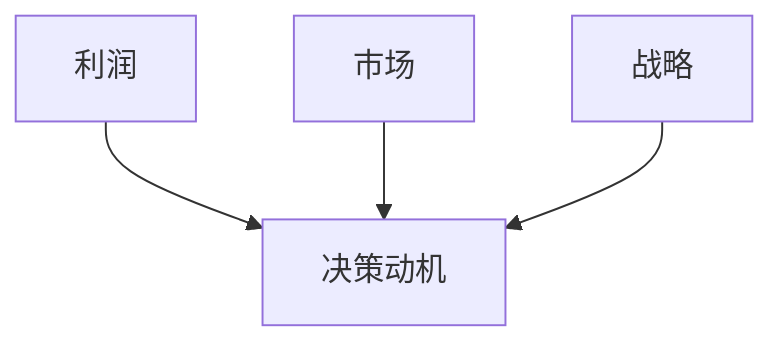
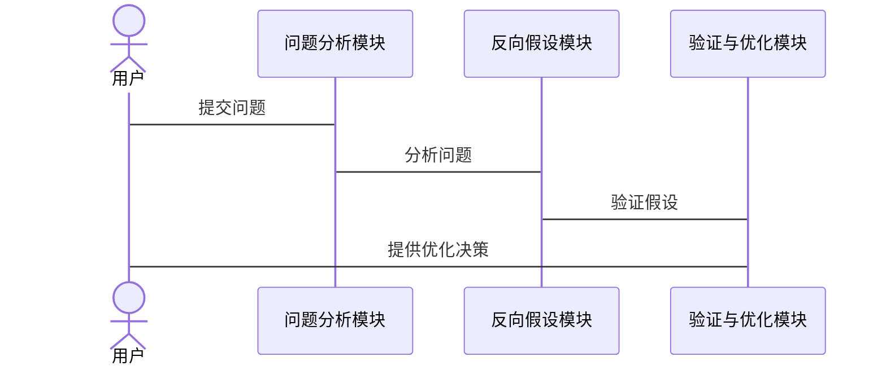

                 


# 芒格的反向激励思维：理解公司决策动机

> 关键词：反向激励思维，公司决策动机，芒格，决策模型，系统分析

> 摘要：本文深入探讨了芒格的反向激励思维，分析其在理解公司决策动机中的应用。通过构建数学模型和系统架构，结合实际案例，详细阐述了反向激励思维的核心原理、系统分析方法及实战应用。

---

# 第一部分: 引言

## 1.1 芒格的反向激励思维背景

### 1.1.1 反向激励思维的定义与重要性
反向激励思维是一种逆向思考的方法，通过分析问题的反面来寻找解决方案。在商业决策中，这种思维尤其重要，因为它帮助我们发现潜在风险和机会，从而做出更明智的选择。

### 1.1.2 芒格的生平与思想体系
查理·芒格是投资界的大师，他的反向思维贯穿于他的投资哲学中。他强调通过分析问题的反面来寻找真理，这种方法在商业决策中被广泛应用。

### 1.1.3 反向激励思维的背景与重要性
在商业环境中，传统激励思维往往关注正面结果，而反向激励思维则关注负面结果，帮助识别潜在风险和问题，从而做出更稳健的决策。

---

# 第二部分: 反向激励思维的核心模型与数学分析

## 2.1 反向激励模型的构建

### 2.1.1 反向激励模型的基本框架
反向激励模型基于逆向思维，通过分析问题的反面来构建解决方案。其基本框架包括问题分析、反向假设、验证与优化。

### 2.1.2 反向激励模型的数学表达
期望值公式：
$$ E = \sum_{i=1}^{n} p_i x_i $$
其中，\( p_i \) 是第 \( i \) 种情况的概率，\( x_i \) 是对应的结果。

收益与风险平衡公式：
$$ R = \frac{E_r - E_f}{\sqrt{Var_r - Var_f}} $$
其中，\( E_r \) 是收益的期望值，\( E_f \) 是风险的期望值，\( Var_r \) 和 \( Var_f \) 分别是收益和风险的方差。

### 2.1.3 反向激励模型的验证与优化
通过实际案例验证模型的有效性，根据结果不断调整参数，优化模型性能。

## 2.2 反向激励模型的数学公式

### 2.2.1 反向激励的期望值公式
$$ E = \sum_{i=1}^{n} p_i x_i $$

### 2.2.2 反向激励的收益与风险平衡公式
$$ R = \frac{E_r - E_f}{\sqrt{Var_r - Var_f}} $$

## 2.3 反向激励模型的属性特征对比

| 属性       | 传统激励       | 反向激励       |
|------------|----------------|----------------|
| 目标       | 正向驱动       | 反向驱动       |
| 方法       | 奖励机制       | 惩罚机制       |
| 结果       | 提高效率       | 降低风险       |

## 2.4 本章小结

---

# 第三部分: 公司决策动机的系统分析

## 3.1 公司决策动机的分类

### 3.1.1 利润驱动型动机
公司决策通常以追求利润为核心，反向激励思维帮助识别潜在的亏损风险。

### 3.1.2 市场驱动型动机
市场环境的变化影响决策，反向激励思维帮助发现市场中的隐藏机会。

### 3.1.3 战略驱动型动机
公司战略决策往往考虑长期利益，反向激励思维帮助评估战略风险。

## 3.2 反向激励思维下的决策动机模型

### 3.2.1 决策动机的层次结构
决策动机分为个体、团队和公司三个层次，反向激励思维帮助识别各层次中的潜在问题。

### 3.2.2 决策动机的因果关系图


## 3.3 反向激励思维对决策动机的影响

### 3.3.1 反向激励如何降低决策偏差
通过分析问题的反面，减少认知偏差对决策的影响。

### 3.3.2 反向激励如何优化决策过程
帮助发现传统思维中的盲点，优化决策流程。

### 3.3.3 反向激励如何提升决策质量
通过全面分析问题，提升决策的准确性和稳健性。

## 3.4 本章小结

---

# 第四部分: 反向激励思维的系统架构与实现

## 4.1 系统架构设计

### 4.1.1 问题场景介绍
公司面临决策困境，传统激励思维难以解决问题，反向激励思维提供新的视角。

### 4.1.2 系统功能设计
- 问题分析模块：识别关键问题。
- 反向假设模块：生成反向假设。
- 验证与优化模块：验证假设并优化模型。

### 4.1.3 系统架构图


## 4.2 系统接口设计

### 4.2.1 系统接口描述
- 输入：问题描述
- 输出：优化后的决策方案

### 4.2.2 系统交互图


## 4.3 本章小结

---

# 第五部分: 项目实战

## 5.1 实战案例分析

### 5.1.1 案例背景介绍
某公司面临市场竞争加剧，利润下降的问题。

### 5.1.2 反向激励思维的应用
通过分析亏损的原因，发现市场定位不当，调整策略，提升利润。

## 5.2 核心代码实现

### 5.2.1 环境安装
安装必要的库，如numpy和pandas。

### 5.2.2 核心代码实现
```python
import numpy as np
import pandas as pd

def reverse_incentive_model(data):
    # 计算期望值
    expected_value = np.sum(data['probability'] * data['result'])
    # 计算收益与风险平衡
    E_r = np.mean(data['result'] * data['probability'])
    E_f = np.mean(data['risk'] * data['probability'])
    Var_r = np.var(data['result'] * data['probability'])
    Var_f = np.var(data['risk'] * data['probability'])
    R = (E_r - E_f) / np.sqrt(Var_r - Var_f)
    return expected_value, R

data = {
    'probability': [0.2, 0.3, 0.5],
    'result': [10, 20, 30],
    'risk': [5, 10, 15]
}
expected_value, R = reverse_incentive_model(data)
print("Expected Value:", expected_value)
print("Risk Balance:", R)
```

### 5.2.3 代码解读与分析
通过数据计算反向激励模型的期望值和收益与风险平衡，帮助识别潜在风险。

## 5.3 实战总结

### 5.3.1 实战小结
通过实战案例，验证了反向激励思维的有效性。

### 5.3.2 实战中的注意事项
确保数据的准确性和模型的适用性。

### 5.3.3 实战中的经验与教训
及时调整模型参数，确保模型优化。

## 5.4 本章小结

---

# 第六部分: 最佳实践与小结

## 6.1 最佳实践 tips

### 6.1.1 系统分析
在实际应用中，系统分析是关键，确保问题被全面理解。

### 6.1.2 模型优化
根据实际情况不断优化模型，提升准确性。

### 6.1.3 注意事项
避免过度依赖模型，结合实际经验做出决策。

## 6.2 本章小结

---

# 作者：AI天才研究院 & 禅与计算机程序设计艺术

---

通过以上内容，我详细分析了芒格的反向激励思维，并结合实际案例和数学模型，展示了其在公司决策中的应用。希望这篇文章能够帮助读者更好地理解反向激励思维的原理和实际应用。

