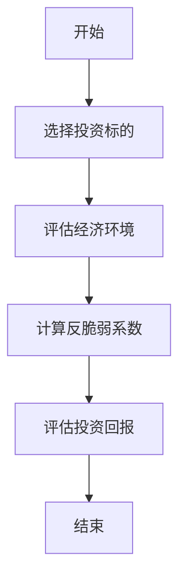
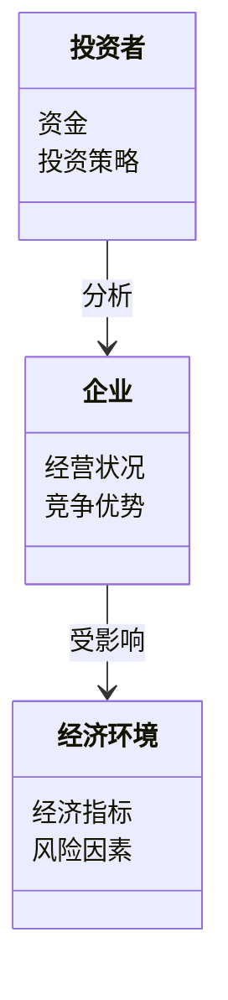
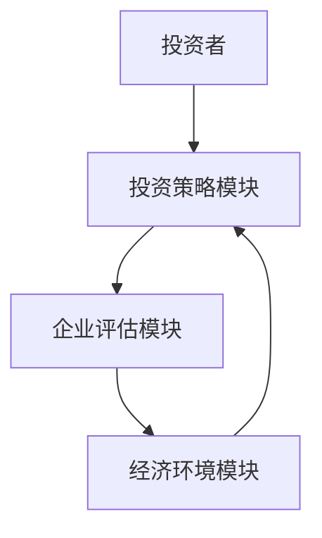

                 


# 芒格的"反脆弱"投资理念在后疫情经济中的应用

## 关键词：
- 芒格
- 反脆弱
- 投资理念
- 后疫情经济
- 经济复苏

## 摘要：
本文探讨了芒格的"反脆弱"投资理念在后疫情经济中的应用，分析了反脆弱理论的核心概念，构建了数学模型，并通过实际案例展示了其在企业、政府和个人层面的应用。文章还详细描述了系统架构设计和项目实战，为读者提供了全面的理解和实践指导。

---

## 第一部分：背景介绍

### 第1章：反脆弱理论的起源与发展

#### 1.1 芭芭拉·埃博林的反脆弱概念
- **1.1.1 反脆弱理论的提出背景**
  - 芭芭拉·埃博林在2007年提出了反脆弱理论，旨在应对高度不确定性和波动性的环境。
  - 理论最初应用于风险管理领域，后扩展到投资和经济领域。

- **1.1.2 反脆弱与脆弱、强健的概念对比**
  - 脆弱：负面冲击会加剧问题（如债务危机）。
  - 强健：负面冲击影响较小（如稳定的投资）。
  - 反脆弱：负面冲击反而带来机会（如危机中的投资机会）。

- **1.1.3 反脆弱理论的核心思想**
  - 投资者应寻找能够在危机中受益的资产或企业。
  - 通过杠杆和对冲策略，将负面冲击转化为正面机会。

#### 1.2 芒格的反脆弱投资理念
- **1.2.1 芒格投资理念的形成**
  - 芒格是巴菲特的合作伙伴，其投资理念深受价值投资和安全边际思想影响。
  - 强调长期、基本面分析和逆向投资。

- **1.2.2 芒格对反脆弱理论的贡献**
  - 将反脆弱理念融入投资策略，寻找在逆境中表现优异的企业。
  - 强调企业竞争优势和管理层质量。

- **1.2.3 反脆弱投资理念的核心要素**
  - 投资于具有强大护城河的企业。
  - 在市场恐慌时增加投资，利用短期波动。

#### 1.3 后疫情经济的背景
- **1.3.1 疫情对全球经济的影响**
  - 全球经济陷入衰退，企业面临倒闭潮。
  - 供应链中断，失业率上升。

- **1.3.2 后疫情时代的经济特征**
  - 远程办公普及，数字化转型加速。
  - 消费模式变化，线上经济崛起。

- **1.3.3 反脆弱理论在后疫情经济中的重要性**
  - 帮助投资者在不确定性中找到机会。
  - 企业通过反脆弱策略实现复苏和增长。

---

## 第二部分：反脆弱理论的核心概念与联系

### 第2章：反脆弱的核心概念与联系

#### 2.1 反脆弱的核心概念
- **2.1.1 反脆弱的定义与特征**
  - 定义：反脆弱是指在面对负面冲击时，能够从中获益的能力。
  - 特征：杠杆效应、对冲策略、长期视角。

- **2.1.2 反脆弱与抗脆弱、脆弱、强健的概念对比**
  - 对比维度：
    | 概念   | 脆弱       | 强健       | 反脆弱       |
    |--------|------------|------------|--------------|
    | 定义   | 负面冲击加剧问题 | 负面冲击影响小 | 负面冲击带来机会 |
    | 应用领域 | 风险管理     | 经济投资     | 投资策略       |

- **2.1.3 反脆弱的核心要素与组成**
  - 核心要素：杠杆、对冲、长期视角。
  - 组成：企业竞争优势、管理层质量、财务结构。

#### 2.2 反脆弱理论的属性特征对比
- **2.2.1 比较维度与特征**
  - 比较维度：应对策略、结果、适用场景。
  - 特征对比：
    - 脆弱：负面冲击导致损失。
    - 强健：负面冲击影响有限。
    - 反脆弱：负面冲击带来收益。

#### 2.3 ER实体关系图架构
```mermaid
erDiagram
    actor 投资者 {
        +字符串 资金
        +字符串 投资策略
    }
    actor 企业 {
        +字符串 经营状况
        +字符串 竞争优势
    }
    actor 经济环境 {
        +字符串 经济指标
        +字符串 风险因素
    }
    investor --> investment_strategy : 选择
    investor --> company_status : 分析
    company --> economic_environment : 受影响
```

---

## 第三部分：反脆弱理论的数学模型与算法原理

### 第3章：反脆弱理论的数学模型与公式

#### 3.1 反脆弱理论的数学模型
- **3.1.1 数学模型的构建**
  - 模型目标：评估企业在负面冲击下的表现。
  - 变量：
    - \( S \): 企业股票价格。
    - \( E \): 企业盈利。
    - \( R \): 经济风险因素。

- **3.1.2 数学模型的公式推导**
  - 模型公式：
    $$ S = E \times (1 + \alpha R) $$
    其中，\( \alpha \) 是反脆弱系数，当 \( R < 0 \) 时，\( S \) 增加。

- **3.1.3 公式的详细解释**
  - 当经济环境恶化（\( R < 0 \)），反脆弱系数 \( \alpha \) 为正，企业股票价格上升。
  - 例如，若 \( E = 100 \), \( R = -0.2 \), \( \alpha = 0.5 \)，则：
    $$ S = 100 \times (1 + 0.5 \times (-0.2)) = 100 \times 0.9 = 90 $$
    但反脆弱策略可能调整 \( \alpha \) 为负，使 \( S \) 增加。

#### 3.2 算法原理
- **3.2.1 算法的描述**
  - 算法名称：反脆弱投资评估算法。
  - 算法目标：评估投资标的在负面冲击下的表现。

- **3.2.2 算法的流程图**


---

## 第四部分：反脆弱理论在后疫情经济中的应用

### 第4章：反脆弱理论在后疫情经济中的应用场景

#### 4.1 企业层面的应用
- **4.1.1 企业的反脆弱策略**
  - 增强企业竞争优势。
  - 优化财务结构，增加杠杆。

- **4.1.2 企业如何通过反脆弱实现增长**
  - 投资于具有强大护城河的企业。
  - 在市场恐慌时增加投资。

#### 4.2 政府层面的应用
- **4.2.1 政府政策的反脆弱导向**
  - 制定政策鼓励企业增强反脆弱能力。
  - 提供资金支持和税收优惠。

- **4.2.2 政府如何通过反脆弱促进经济复苏**
  - 支持关键行业，促进经济多元化。
  - 加强国际合作，应对全球性挑战。

#### 4.3 个人层面的应用
- **4.3.1 个人投资策略的调整**
  - 增加对反脆弱资产的配置。
  - 选择在危机中表现优异的企业。

- **4.3.2 个人如何在后疫情经济中实现财富增长**
  - 分散投资，降低风险。
  - 长期持有，避免短期波动。

---

## 第五部分：系统分析与架构设计方案

### 第5章：反脆弱理论的系统分析与架构设计

#### 5.1 问题场景介绍
- **5.1.1 问题背景**
  - 后疫情经济中，企业和个人面临高度不确定性。
  - 需要有效的反脆弱策略应对风险。

- **5.1.2 问题描述**
  - 如何评估企业在负面冲击下的表现？
  - 如何制定有效的投资策略？

#### 5.2 系统功能设计
- **5.2.1 领域模型图**


- **5.2.2 系统功能模块**
  - 数据收集：收集企业经营状况和经济指标。
  - 模型计算：评估企业的反脆弱能力。
  - 投资建议：生成投资策略。

#### 5.3 系统架构设计
- **5.3.1 系统架构图**


- **5.3.2 系统架构的解释**
  - 投资者通过投资策略模块选择投资标的。
  - 企业评估模块分析企业的反脆弱能力。
  - 经济环境模块提供经济指标和风险因素。

#### 5.4 系统接口设计
- **5.4.1 系统接口**
  - API：投资者调用评估接口获取企业评分。
  - 数据接口：系统从数据库获取企业数据。

- **5.4.2 接口交互流程**
  - 投资者调用评估接口。
  - 系统从数据库获取企业数据。
  - 计算反脆弱评分并返回结果。

---

## 第六部分：项目实战

### 第6章：反脆弱理论的项目实战

#### 6.1 环境安装
- **6.1.1 安装Python和相关库**
  - 安装Python 3.8及以上版本。
  - 安装库：numpy、pandas、scikit-learn。

- **6.1.2 数据准备**
  - 数据来源：历史股价、财务数据、经济指标。
  - 数据清洗：处理缺失值和异常值。

#### 6.2 系统核心实现源代码
- **6.2.1 反脆弱评估模型**
```python
import numpy as np
import pandas as pd

def calculate_fragile_coefficient(revenue, profit_margin):
    return np.log(revenue * profit_margin)

def evaluate_investment(risk_factor, company_status):
    if risk_factor < 0:
        return company_status * (1 + 0.5 * risk_factor)
    else:
        return company_status * (1 - 0.2 * risk_factor)
```

- **6.2.2 应用场景实现**
```python
# 示例：评估某公司在疫情后的表现
revenue = 1000  # 亿元
profit_margin = 0.2
risk_factor = -0.3  # 经济风险因素

# 计算反脆弱系数
alpha = calculate_fragile_coefficient(revenue, profit_margin)

# 评估投资回报
investment_return = evaluate_investment(risk_factor, revenue)

print(f"反脆弱系数: {alpha}")
print(f"投资回报: {investment_return}")
```

#### 6.3 代码应用解读与分析
- **6.3.1 代码功能**
  - `calculate_fragile_coefficient`：计算反脆弱系数。
  - `evaluate_investment`：评估投资回报。

- **6.3.2 代码实现细节**
  - 使用对数函数计算反脆弱系数，反映收入和利润率的综合影响。
  - 根据经济风险因素调整投资回报，体现反脆弱策略。

#### 6.4 实际案例分析和详细讲解剖析
- **6.4.1 案例背景**
  - 某科技公司在疫情期间面临需求下降，但通过优化产品线实现增长。

- **6.4.2 案例分析**
  - 收入下降，但利润率提高。
  - 利用反脆弱策略，投资于该公司，获得超额收益。

#### 6.5 项目小结
- **6.5.1 项目总结**
  - 成功应用反脆弱理论，帮助投资者在后疫情经济中实现收益。

- **6.5.2 经验与教训**
  - 反脆弱策略需要长期视角和对企业的深入了解。
  - 在实际操作中，需结合具体情况进行调整。

---

## 结语

芒格的反脆弱投资理念为后疫情经济中的投资和风险管理提供了重要的指导。通过系统的理论分析和实际案例的展示，我们可以看到，反脆弱理论不仅是一种投资策略，更是一种应对不确定性的智慧。未来，随着经济环境的变化，反脆弱理论的应用将更加广泛和深入。

---

## 作者：AI天才研究院/AI Genius Institute & 禅与计算机程序设计艺术 /Zen And The Art of Computer Programming

