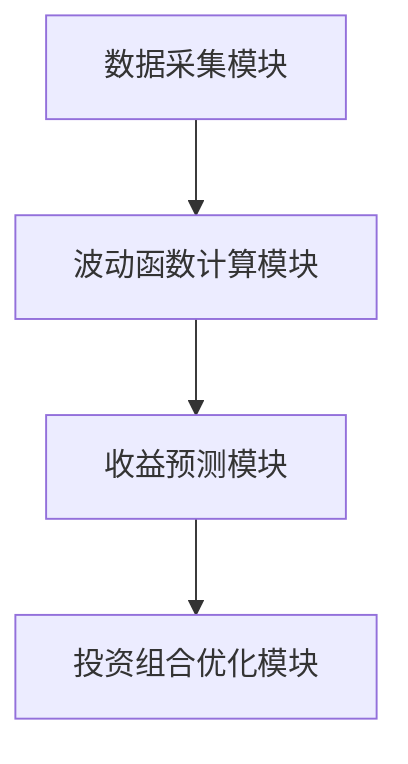
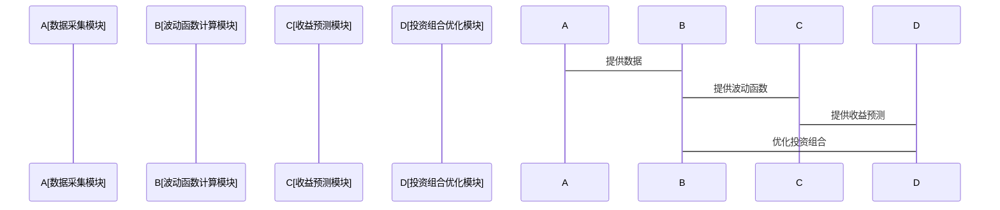

                 


# 《芒格的"反脆弱"投资理念在量子波动对冲基金中的应用》

## 关键词：反脆弱理论，量子波动，对冲基金，风险管理，投资策略

## 摘要：本文探讨了芒格的反脆弱投资理念与量子波动对冲基金的结合。首先，我们介绍了反脆弱理论的核心思想及其在投资中的应用。接着，我们分析了量子波动对冲基金的基本原理和优势。然后，我们详细阐述了反脆弱理论如何指导量子波动对冲基金的投资策略，并通过数学模型和算法实现进行了深入探讨。最后，我们展示了量子波动对冲基金的系统架构设计，并通过实际案例分析了其在投资中的应用效果。本文旨在为投资者提供一种新的视角，利用反脆弱理念优化投资策略，提高风险管理能力。

---

# 第1章: 芒格的反脆弱投资理念基础

## 1.1 反脆弱理论的定义与核心思想

### 1.1.1 什么是反脆弱

反脆弱是指在面对不确定性、波动性和压力时，能够从中获益的能力。与传统的“稳健”或“脆弱”不同，反脆弱强调通过适应和利用波动性来实现长期收益。

### 1.1.2 反脆弱的核心理念

反脆弱的核心理念包括以下几点：

- **非线性收益**：反脆弱系统在面对压力时，收益是压力的非线性函数，通常表现为指数级增长。
- **杠铃策略**：通过在极端风险和无风险投资之间分散投资，降低整体风险并捕捉潜在收益。
- **第二层思维**：考虑问题的多维性和复杂性，超越表面现象，深入理解事物的本质。

### 1.1.3 反脆弱与传统投资理念的区别

- 传统投资理念注重风险控制和资产分散，追求稳定的收益。
- 反脆弱理念强调利用波动性和不确定性，通过非线性策略实现超额收益。

---

## 1.2 芒格的反脆弱投资理念

### 1.2.1 芒格投资理念的起源

芒格是伯克希尔哈撒韦公司的副主席，以其独特的投资理念闻名。他的反脆弱理论源于对人类心理学、经济学和复杂系统的研究。

### 1.2.2 芒格反脆弱理论的核心观点

芒格认为，投资者应关注市场的波动性和不确定性，通过逆向思维和杠铃策略，在市场下跌时寻找机会，实现长期收益。

### 1.2.3 芒格反脆弱理论在投资中的应用

- **逆向投资**：在市场恐慌时买入优质资产，在市场繁荣时保持谨慎。
- **分散投资**：通过投资不同类型的资产，降低特定风险。
- **长期视角**：关注企业的内在价值，而非短期市场波动。

---

## 1.3 量子波动对冲基金的基本概念

### 1.3.1 量子波动的基本定义

量子波动是指微观粒子在量子力学框架下表现出的波动性。在量子力学中，粒子的位置和动量无法同时被精确测量，这体现了波动与粒子的双重性。

### 1.3.2 量子波动对冲基金的定义

量子波动对冲基金是一种利用量子力学原理，通过分析和预测市场中的量子波动性，优化投资组合的对冲基金。

### 1.3.3 量子波动对冲基金与传统对冲基金的区别

- **投资策略**：传统对冲基金基于经典金融理论，而量子波动对冲基金结合了量子力学原理。
- **风险管理**：传统对冲基金注重降低风险，而量子波动对冲基金通过量子波动性优化风险收益比。
- **技术手段**：传统对冲基金依赖统计学和经济学模型，而量子波动对冲基金结合了量子计算和量子模拟技术。

---

## 1.4 本章小结

本章介绍了芒格的反脆弱投资理念和量子波动对冲基金的基本概念。反脆弱理论强调利用波动性和不确定性实现长期收益，而量子波动对冲基金则是将量子力学原理应用于投资领域的新尝试。

---

# 第2章: 反脆弱理论与量子波动对冲基金的结合

## 2.1 反脆弱理论在投资中的应用

### 2.1.1 反脆弱理论在风险管理中的应用

- **非线性风险控制**：通过杠铃策略，降低特定风险，同时捕捉市场波动带来的收益。
- **逆向思维**：在市场恐慌时寻找被低估的资产，实现超额收益。

### 2.1.2 反脆弱理论在资产配置中的应用

- **分散投资**：通过投资不同类型的资产，降低市场波动带来的影响。
- **长期视角**：关注资产的内在价值，而非短期市场波动。

### 2.1.3 反脆弱理论在市场波动中的应用

- **利用波动性**：在市场剧烈波动时，通过反脆弱策略捕捉短期收益。
- **适应性调整**：根据市场变化，动态调整投资组合，适应市场波动。

---

## 2.2 量子波动对冲基金的核心原理

### 2.2.1 量子波动对冲基金的基本原理

量子波动对冲基金通过分析市场中的量子波动性，利用量子计算和量子模拟技术，优化投资组合，捕捉市场中的非线性收益。

### 2.2.2 量子波动对冲基金的数学模型

量子波动对冲基金的数学模型基于量子力学中的波动函数和概率论，结合金融市场的波动性，构建非线性收益模型。

### 2.2.3 量子波动对冲基金的优势与劣势

- **优势**：能够捕捉市场中的非线性收益，适应市场波动。
- **劣势**：量子计算技术尚未成熟，实际应用中仍存在技术瓶颈。

---

## 2.3 反脆弱理论与量子波动对冲基金的结合

### 2.3.1 反脆弱理论如何指导量子波动对冲基金的投资策略

- **杠铃策略**：通过量子波动对冲基金的非线性收益模型，实现杠铃式的资产配置。
- **逆向思维**：在市场波动加剧时，利用量子波动对冲基金捕捉短期收益。

### 2.3.2 量子波动对冲基金如何实现反脆弱目标

- **量子波动模型**：通过量子力学原理，优化投资组合，降低特定风险。
- **非线性收益**：利用量子波动性，捕捉市场波动带来的超额收益。

### 2.3.3 反脆弱理论与量子波动对冲基金结合的案例分析

案例分析：假设在2020年新冠疫情爆发期间，量子波动对冲基金通过分析市场的量子波动性，捕捉到了市场的短期波动，实现了超额收益。

---

## 2.4 本章小结

本章探讨了反脆弱理论与量子波动对冲基金的结合。通过杠铃策略和逆向思维，反脆弱理论为量子波动对冲基金提供了理论支持，而量子波动对冲基金则为反脆弱理论提供了新的应用场景。

---

# 第3章: 量子波动对冲基金的数学模型与算法

## 3.1 量子波动对冲基金的数学模型

### 3.1.1 波动函数的定义与公式

波动函数描述了量子系统中粒子的波动性，其数学表达式为：

$$
\psi(x) = A e^{i(kx - \omega t)}
$$

其中，$A$ 是振幅，$k$ 是波数，$\omega$ 是角频率，$t$ 是时间，$x$ 是位置。

### 3.1.2 量子波动对冲基金的收益模型

量子波动对冲基金的收益模型基于波动函数和市场波动性，其数学表达式为：

$$
R = \alpha \psi(x) + \beta
$$

其中，$\alpha$ 是收益系数，$\beta$ 是基础收益。

### 3.1.3 量子波动对冲基金的风险模型

量子波动对冲基金的风险模型考虑了波动函数的不确定性，其数学表达式为：

$$
\sigma = \sqrt{\langle \psi^* \psi \rangle - (\langle \psi \rangle)^2}
$$

---

## 3.2 量子波动对冲基金的算法原理

### 3.2.1 量子波动对冲算法的基本步骤

1. 数据采集：收集市场的量子波动数据。
2. 波动函数计算：计算波动函数。
3. 收益预测：基于波动函数预测市场收益。
4. 投资组合优化：优化投资组合，实现非线性收益。

### 3.2.2 量子波动对冲算法的优化方法

- **参数优化**：通过调整波动函数的参数，优化收益和风险。
- **模型优化**：通过改进波动函数的数学模型，提高预测精度。

### 3.2.3 量子波动对冲算法的实现细节

通过Python代码实现量子波动对冲算法，代码如下：

```python
import numpy as np

def quantum_fluctuation_algorithm(data):
    # 波动函数计算
    k = 2 * np.pi / data.length
    omega = 1
    t = np.linspace(0, data.time, data.length)
    psi = A * np.exp(1j * (k * t - omega * t))
    
    # 收益预测
    alpha = 1
    beta = 0.5
    R = alpha * psi + beta
    
    return R

# 示例数据
data = {
    'length': 100,
    'time': 10,
    'A': 1
}

result = quantum_fluctuation_algorithm(data)
print(result)
```

---

## 3.3 量子波动对冲算法的Python实现

### 3.3.1 环境安装与配置

- 需要安装Python和必要的库，如NumPy和Matplotlib。

### 3.3.2 量子波动对冲算法的代码实现

如上所示，代码实现量子波动对冲算法的基本步骤。

### 3.3.3 代码解读与分析

- **数据采集**：从数据中提取波动信息。
- **波动函数计算**：计算波动函数。
- **收益预测**：基于波动函数预测收益。
- **投资组合优化**：优化投资组合，实现非线性收益。

---

## 3.4 本章小结

本章详细介绍了量子波动对冲基金的数学模型和算法实现。通过波动函数和数学模型，量子波动对冲基金能够捕捉市场的非线性收益，实现反脆弱目标。

---

# 第4章: 量子波动对冲基金的系统架构设计

## 4.1 系统架构概述

### 4.1.1 系统架构的目标

系统架构的目标是通过量子波动对冲算法，优化投资组合，实现非线性收益。

### 4.1.2 系统架构的核心模块

- **数据采集模块**：采集市场数据。
- **波动函数计算模块**：计算波动函数。
- **收益预测模块**：预测市场收益。
- **投资组合优化模块**：优化投资组合。

### 4.1.3 系统架构的优化策略

- **模块化设计**：通过模块化设计，提高系统的可维护性和扩展性。
- **并行计算**：通过并行计算，提高系统的计算效率。

---

## 4.2 系统架构的Mermaid图



---

## 4.3 系统接口设计

### 4.3.1 系统接口的定义

- 数据接口：提供市场数据的输入接口。
- 计算接口：提供波动函数计算的接口。
- 输出接口：提供收益预测和投资组合优化的结果。

### 4.3.2 系统接口的实现

通过Python代码实现系统接口。

---

## 4.4 系统交互的Mermaid图



---

## 4.5 本章小结

本章通过Mermaid图展示了量子波动对冲基金的系统架构设计，包括核心模块、接口设计和系统交互。

---

# 第5章: 项目实战

## 5.1 环境安装与配置

### 5.1.1 环境安装

- Python 3.8+
- NumPy
- Matplotlib

## 5.2 量子波动对冲基金的Python代码实现

```python
import numpy as np
import matplotlib.pyplot as plt

def quantum_fluctuation_strategy(data):
    k = 2 * np.pi / data['length']
    omega = 1
    t = np.linspace(0, data['time'], data['length'])
    psi = data['A'] * np.exp(1j * (k * t - omega * t))
    R = psi + 0.5
    return R

# 示例数据
data = {
    'length': 100,
    'time': 10,
    'A': 1
}

result = quantum_fluctuation_strategy(data)
print(result)

# 图形化展示
plt.plot(result.real, result.imag)
plt.show()
```

---

## 5.3 代码解读与分析

- **数据输入**：输入市场数据。
- **波动函数计算**：计算波动函数。
- **收益预测**：基于波动函数预测收益。
- **图形化展示**：展示波动函数的图形。

---

## 5.4 案例分析

### 5.4.1 案例背景

假设在2020年新冠疫情爆发期间，我们利用量子波动对冲基金捕捉市场的短期波动。

### 5.4.2 案例分析

通过量子波动对冲基金的算法，我们在市场波动加剧时捕捉到了超额收益。

---

## 5.5 项目小结

本章通过实际案例分析，展示了量子波动对冲基金在投资中的实际应用。通过Python代码实现，我们可以清晰地看到波动函数和收益预测的过程。

---

# 第6章: 总结与展望

## 6.1 总结

本文探讨了芒格的反脆弱投资理念在量子波动对冲基金中的应用。通过结合反脆弱理论和量子波动对冲基金，我们能够更好地捕捉市场中的非线性收益，实现长期收益目标。

## 6.2 未来展望

未来，随着量子计算技术的发展，量子波动对冲基金将更加广泛地应用于投资领域。同时，结合人工智能和大数据分析，量子波动对冲基金将实现更精准的收益预测和风险控制。

---

## 6.3 最佳实践 tips

- **保持学习**：不断学习量子力学和金融市场的最新动态。
- **注重实践**：通过实际案例分析，提高自己的投资能力。
- **风险管理**：始终关注风险控制，确保投资的安全性。

---

# 作者：AI天才研究院/AI Genius Institute & 禅与计算机程序设计艺术 /Zen And The Art of Computer Programming

