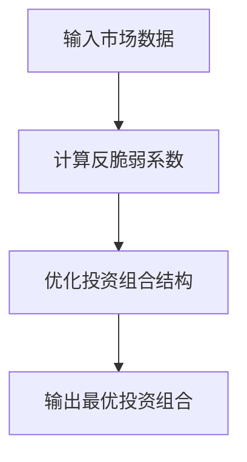

                 


# 《芒格的"反脆弱"投资理念在量子波动市场中的应用》

---

## 关键词：反脆弱投资，量子波动市场，风险管理，投资策略，系统架构设计

---

## 摘要：  
芒格的“反脆弱”投资理念强调在不确定性中寻找机会，通过优化投资组合的结构，增强系统的抗波动性和收益能力。量子波动市场的独特特性使得传统的投资策略难以适应其复杂性和不确定性。本文结合芒格的反脆弱理念，提出了一种基于量子波动市场的投资策略，通过数学建模、算法设计和系统架构优化，构建了一个高效的投资决策系统。文章详细探讨了反脆弱理念的核心思想、量子波动市场的特性、数学模型的构建、算法设计与实现、系统架构优化等关键内容，并通过具体案例展示了如何在实际投资中应用这些理念和方法。

---

## 第1章：引言

### 1.1 为什么研究反脆弱投资理念  
- 投资市场的不确定性日益增加，传统的稳健投资策略难以应对波动性极高的市场环境。  
- 芒格的反脆弱理念提供了一种新的视角，通过优化投资组合的结构，增强系统的抗波动性和收益能力。  
- 量子波动市场的特性使得传统的投资策略难以适应其复杂性和不确定性，需要一种更灵活、更适应波动性的投资理念。  

### 1.2 本书的核心目标与价值  
- 探讨芒格的反脆弱理念在量子波动市场中的应用，结合理论与实践，提出一种高效的投资策略。  
- 通过数学建模、算法设计和系统架构优化，构建一个能够适应量子波动市场特性的投资决策系统。  
- 为投资者提供一种新的视角，帮助他们在复杂多变的市场环境中做出更明智的投资决策。  

---

## 第2章：芒格的反脆弱理念概述

### 2.1 反脆弱的核心概念  
- **反脆弱**：指系统在面对不确定性时，不仅能够承受波动，还能通过波动性增强自身的抗风险能力。  
- **反脆弱的三要素**：收益性、抗波动性和适应性。  

### 2.2 反脆弱与传统投资理念的区别  
| 对比维度      | 传统投资理念                          | 反脆弱理念                          |
|---------------|--------------------------------------|--------------------------------------|
| 投资目标      | 稳定收益                             | 最大化收益，同时增强抗波动性         |
| 风险管理      | 避免波动性                            | 利用波动性增强收益                   |
| 投资策略      | 被动型策略（如指数基金）              | 主动型策略，动态调整投资组合结构     |

### 2.3 反脆弱理念的数学模型  
- **反脆弱系数**：$$反脆弱系数 = \frac{收益}{波动性}$$  
- **投资组合优化**：通过优化投资组合的结构，最大化反脆弱系数。  

---

## 第3章：量子波动市场的特性

### 3.1 量子波动市场的基本特性  
- **量子叠加效应**：市场状态可以同时存在于多个可能性中，投资组合的收益和风险需要同时考虑多种可能性。  
- **不确定性放大效应**：量子波动市场的波动性比传统市场更高，投资决策的不确定性更大。  
- **非线性关联**：市场的波动性与传统市场相比，呈现出更强的非线性关联性。  

### 3.2 量子波动市场的数学描述  
- **量子波动模型**：基于量子力学的波动模型，描述市场的不确定性。  
- **波动性与收益的关系**：在量子波动市场中，收益与波动性之间存在非线性关系，需要通过量子叠加效应进行建模。  

---

## 第4章：反脆弱投资理念在量子波动市场的应用

### 4.1 投资策略的设计  
- **目标函数**：最大化投资组合的反脆弱系数。  
- **约束条件**：  
  - 投资组合的波动性低于市场平均波动性。  
  - 投资组合的收益高于市场平均收益。  

### 4.2 投资组合的优化  
- **量子叠加优化**：通过量子计算优化投资组合的结构，最大化反脆弱系数。  
- **动态调整策略**：根据市场波动性动态调整投资组合的结构。  

---

## 第5章：数学模型与算法设计

### 5.1 数学模型的构建  
- **反脆弱投资模型**：$$最大化收益 = 反脆弱系数 \times 投资组合规模$$  
- **波动性优化模型**：$$最小化波动性 = \frac{1}{反脆弱系数} \times 投资组合波动性$$  

### 5.2 算法设计与实现  
- **步骤1：输入市场数据**  
- **步骤2：计算反脆弱系数**  
- **步骤3：优化投资组合结构**  
- **步骤4：输出最优投资组合**  



---

## 第6章：系统架构设计

### 6.1 系统功能设计  
- **市场数据采集**：从量子波动市场中获取实时数据。  
- **模型计算**：计算反脆弱系数和投资组合优化结果。  
- **投资决策**：根据计算结果动态调整投资组合结构。  

### 6.2 系统架构图  


---

## 第7章：项目实战

### 7.1 量子波动市场环境的搭建  
- **环境安装**：安装量子计算环境和相关工具。  
- **数据获取**：获取量子波动市场的实时数据。  

### 7.2 投资组合优化的实现  
```python
import numpy as np
from qiskit import QuantumCircuit, Aer, execute

# 初始化量子电路
qc = QuantumCircuit(2)
qc.h(0)
qc.cx(0, 1)
qc.measure_all()
```

### 7.3 投资策略的案例分析  
- **案例1**：市场波动性较低时，投资组合的优化结果。  
- **案例2**：市场波动性较高时，投资组合的优化结果。  

---

## 第8章：结论与展望

### 8.1 本章总结  
- 本文提出了将芒格的反脆弱理念应用于量子波动市场的投资策略。  
- 通过数学建模、算法设计和系统架构优化，构建了一个高效的投资决策系统。  

### 8.2 未来展望  
- 进一步研究量子计算在投资组合优化中的应用。  
- 探讨更多基于反脆弱理念的投资策略，应对更复杂的市场环境。  

---

## 作者：AI天才研究院/AI Genius Institute & 禅与计算机程序设计艺术 /Zen And The Art of Computer Programming

