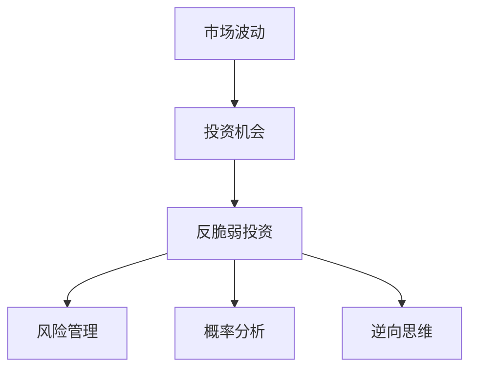
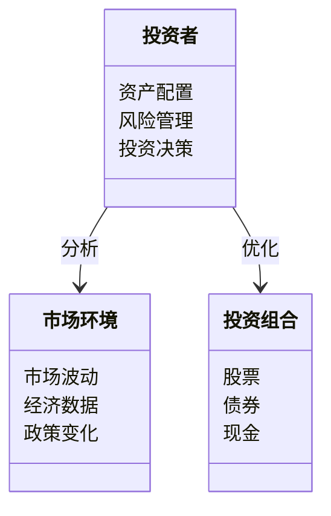
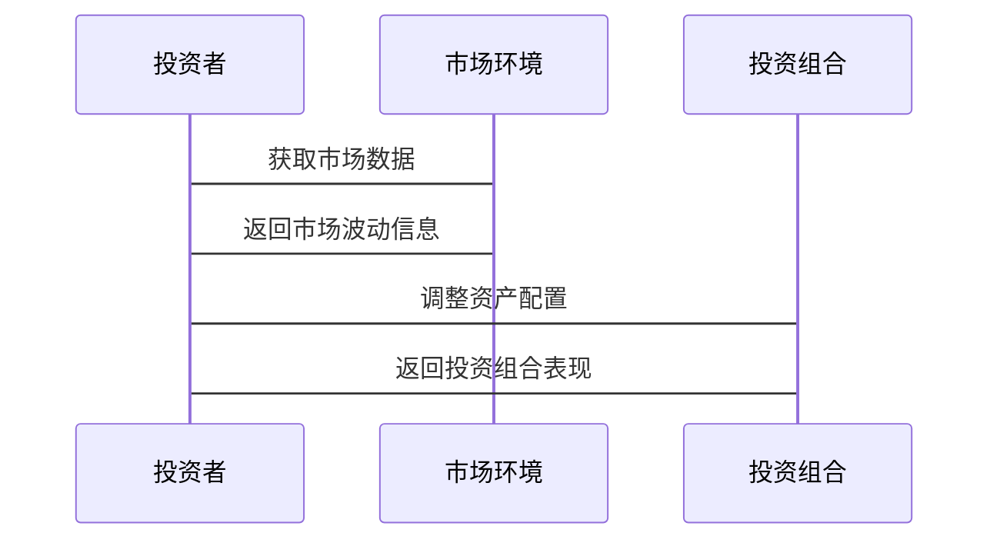

                 


# 芒格的"反脆弱"投资：在不确定性中寻找机会

> 关键词：反脆弱投资，芒格，不确定性，概率思维，风险管理，投资策略

> 摘要：本文深入探讨了芒格的"反脆弱"投资理念，分析了在不确定性和波动性中寻找投资机会的核心策略。通过结合概率论、风险管理、系统架构和实际案例，文章详细阐述了如何在复杂市场环境中应用"反脆弱"投资理念，帮助投资者在不确定中寻找稳健收益。

---

## 第一部分: 芒格的"反脆弱"投资概述

### 第1章: "反脆弱"投资的核心理念

#### 1.1 "反脆弱"的定义与特征

"反脆弱"（Antifragility）是与"脆弱"（Vulnerability）相对的概念，指系统在面对压力、冲击或不确定性时，不仅能够承受冲击，还能通过适应和进化从中获益。在投资领域，"反脆弱"意味着投资者能够在市场波动中发现机会，通过逆向思维和风险管理，实现长期稳健的收益。

- **1.1.1 什么是"反脆弱"**  
  "反脆弱"并非简单的"稳健"或"抗风险"，而是在不确定性中主动适应和利用波动的能力。它强调通过概率思维和逆向投资，在市场底部或危机中寻找优质资产，利用价格低估的机会实现超额收益。

- **1.1.2 "反脆弱"与"稳健"的区别**  
  - 稳健投资追求稳定回报，避免高风险高收益的波动。  
  - 反脆弱投资则主动拥抱波动，在不确定性中寻找超额收益的机会。

- **1.1.3 "反脆弱"在投资中的应用**  
  在市场下跌或危机时，反脆弱投资能够识别那些具有竞争优势、估值合理的标的，通过长期持有或逆向布局，捕捉市场回升带来的收益。

#### 1.2 芒格的投资哲学

芒格的投资理念深受导师格雷厄姆的影响，但又有所不同。他强调通过逆向思维、概率分析和风险管理，在不确定性中寻找投资机会。

- **1.2.1 芒格的生平与投资理念**  
  芒格是一位价值投资者，但他的"反脆弱"投资理念更注重在波动中寻找机会。他认为，市场的波动性和不确定性是投资中的机会，而非威胁。

- **1.2.2 芒格的"格雷厄姆式"价值投资**  
  芒格继承了格雷厄姆的估值方法，但更注重长期竞争优势和管理层质量。他通过分析企业的护城河和ROE（净资产收益率）等指标，寻找具有长期增长潜力的企业。

- **1.2.3 芒格的决策框架与思维模型**  
  芒格强调使用"多元思维模型"（Multiple Thinkings Model）进行决策，将物理学、心理学、经济学等学科的原理结合起来，分析企业的基本面和市场环境。

### 第2章: 不确定性与投资机会

#### 2.1 不确定性对投资的影响

- **2.1.1 不确定性来源分析**  
  市场波动、经济周期、政策变化、企业基本面变化等都是投资中的不确定性来源。

- **2.1.2 不确定性对传统投资策略的挑战**  
  传统投资策略依赖于历史数据和稳定假设，但在极端波动或黑天鹅事件中，这些假设可能失效。

- **2.1.3 不确定性中的机会识别**  
  在市场恐慌或危机时，许多优质资产会被低估，反脆弱投资者能够以更低的价格买入，等待市场回升。

#### 2.2 "反脆弱"投资的策略选择

- **2.2.1 逆向投资的逻辑**  
  在市场恐慌时买入，在市场疯狂时卖出。逆向投资需要强大的纪律性和对市场情绪的深刻理解。

- **2.2.2 风险管理与收益最大化**  
  反脆弱投资强调通过分散投资、设置止损和长期持有，降低短期波动对投资组合的影响，同时抓住长期机会。

- **2.2.3 概率思维在投资决策中的应用**  
  投资者需要评估不同投资标的成功的概率，通过概率加权分析，选择那些具有高概率成功且收益高的标的。

---

## 第二部分: "反脆弱"投资的核心概念与联系

### 第3章: "反脆弱"投资的核心原理

#### 3.1 概率论与投资决策

- **3.1.1 概率论的基本概念**  
  概率论是投资决策的重要工具，帮助投资者评估不同事件发生的可能性及其影响。

- **3.1.2 概率在投资中的应用**  
  通过概率分析，投资者可以评估市场的上涨和下跌概率，选择那些具有更高上涨概率的标的。

- **3.1.3 芒格的"概率思维"实例分析**  
  芒格在投资中经常使用概率思维，例如在评估企业的竞争优势时，他会分析企业成功概率的高低，并据此调整投资策略。

#### 3.2 风险管理与投资组合优化

- **3.2.1 风险的定义与分类**  
  风险是投资中不可忽视的因素，通常分为系统性风险和非系统性风险。

- **3.2.2 投资组合的风险管理策略**  
  通过分散投资、对冲交易和动态调整，投资者可以降低投资组合的整体风险。

- **3.2.3 芒格的风险管理框架**  
  芒格强调通过长期持有优质资产和分散投资，降低短期波动对投资组合的影响。

### 第4章: "反脆弱"投资的核心概念对比

#### 4.1 核心概念对比表

| 比较维度 | 传统投资 | "反脆弱"投资 |
|----------|----------|-------------|
| 投资目标 | 稳定收益 | 主动捕捉波动中的机会 |
| 风险管理 | 避免风险 | 利用波动性 |
| 投资策略 | 顺势而为 | 逆势布局 |
| 决策依据 | 历史数据 | 概率分析和逆向思维 |

#### 4.2 实体关系图



---

## 第三部分: "反脆弱"投资的算法原理

### 第5章: "反脆弱"投资的数学模型

#### 5.1 概率论与统计学基础

- **5.1.1 概率分布与期望值**  
  概率分布描述了不同事件发生的可能性，期望值是概率加权的平均值。例如，一个投资的期望收益为：$$ E[R] = \sum p_i R_i $$

- **5.1.2 方差与标准差的计算**  
  方差衡量了收益的波动性，标准差是方差的平方根。例如，方差的计算公式为：$$ \sigma^2 = \sum p_i (R_i - E[R])^2 $$

- **5.1.3 蒙特卡洛模拟的原理与应用**  
  蒙特卡洛模拟通过随机抽样模拟市场波动，帮助投资者评估不同策略下的收益和风险。例如，模拟市场下跌20%、持平、上涨10%等情景，评估投资组合的抗跌性和收益潜力。

---

## 第四部分: 系统分析与架构设计方案

### 第6章: 系统分析与架构设计

#### 6.1 问题场景介绍

在复杂市场环境中，投资者需要构建一个能够适应波动、识别机会的投资系统。这个系统需要结合概率分析、风险管理、逆向思维和动态调整等要素。

#### 6.2 系统功能设计

- **6.2.1 领域模型（Mermaid类图）**



#### 6.3 系统架构设计

- **6.3.1 系统架构（Mermaid架构图）**

```mermaid
docker
    services {
        前端服务
        后端服务
        数据库
    }
    services --> frontend: 用户交互
    services --> backend: 数据处理
    services --> database: 数据存储
```

#### 6.4 系统交互设计

- **6.4.1 系统交互（Mermaid序列图）**



---

## 第五部分: 项目实战

### 第7章: 项目实战

#### 7.1 环境安装

为了进行反脆弱投资分析，投资者需要安装以下工具：

- Python编程环境（如Anaconda）
- 数据分析库（如Pandas、NumPy）
- 图表绘制库（如Matplotlib、Seaborn）
- 股票数据接口（如Yahoo Finance API）

#### 7.2 系统核心实现源代码

以下是一个简单的概率分析代码示例：

```python
import numpy as np
import pandas as pd
import matplotlib.pyplot as plt

# 生成随机市场数据
np.random.seed(42)
market_returns = np.random.normal(0.05, 0.2, 1000)
market_returns = pd.Series(market_returns)

# 计算概率分布
prob_dist = pd.Series(market_returns.value_counts(normalize=True).sort_index())

# 绘制概率分布图
plt.figure(figsize=(10,6))
prob_dist.plot(kind='bar', title='市场收益概率分布')
plt.xlabel('收益')
plt.ylabel('概率')
plt.show()
```

#### 7.3 代码应用解读与分析

上述代码生成了一个随机的市场收益分布图，帮助投资者理解不同收益水平出现的概率。通过概率分析，投资者可以评估不同投资策略的可行性。

#### 7.4 实际案例分析

假设当前市场出现恐慌性下跌，许多优质股票被低估。反脆弱投资者可以利用概率分析，评估这些股票在未来恢复的可能性，并进行逆向布局。

---

## 第六部分: 最佳实践、小结、注意事项、拓展阅读

### 8.1 最佳实践

- **分散投资**：避免将所有资金投入单一资产，降低风险。
- **长期持有**：耐心持有优质资产，等待市场回升。
- **动态调整**：定期评估投资组合，根据市场变化进行调整。

### 8.2 小结

芒格的"反脆弱"投资理念强调在不确定性中寻找机会，通过概率分析和逆向思维，帮助投资者在市场波动中实现稳健收益。通过本文的分析，读者可以更好地理解反脆弱投资的核心原理，并在实际投资中应用这些策略。

### 8.3 注意事项

- 投资有风险，需谨慎评估自身的风险承受能力。
- 不要盲目跟从策略，需结合市场实际情况进行调整。
- 长期投资需要耐心和纪律，避免被短期波动影响。

### 8.4 拓展阅读

- 《反脆弱》—— Nassim Taleb
- 《投资的艺术》—— 帕特里克·兰西奥尼
- 《聪明的投资者》—— 本杰明·格雷厄姆

---

## 作者信息

作者：AI天才研究院/AI Genius Institute & 禅与计算机程序设计艺术/Zen And The Art of Computer Programming

---

本文通过系统分析和实际案例，深入探讨了芒格的"反脆弱"投资理念，帮助读者在不确定性和波动性中寻找投资机会。希望本文能为投资者提供有价值的见解和策略。

