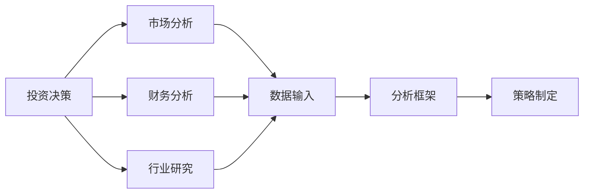
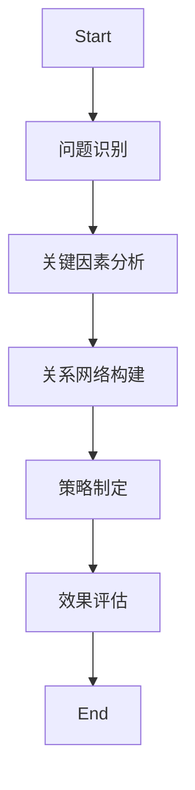
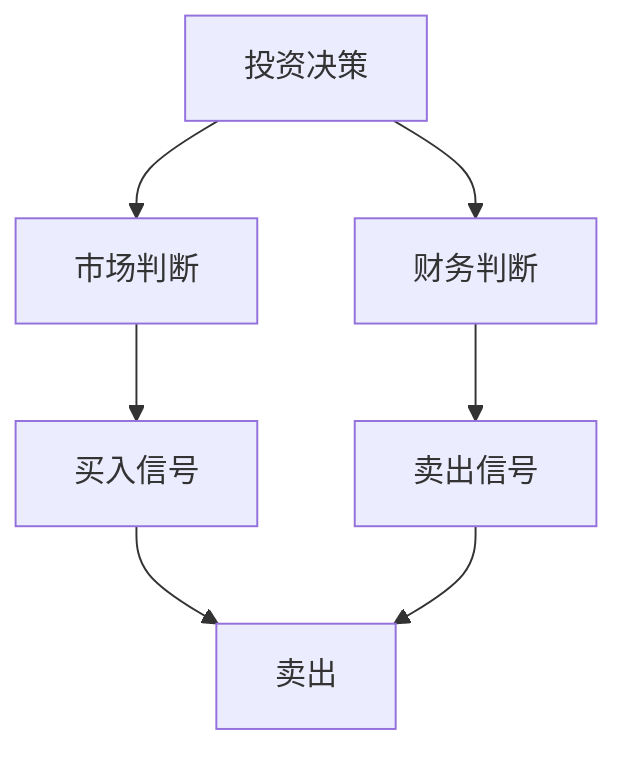
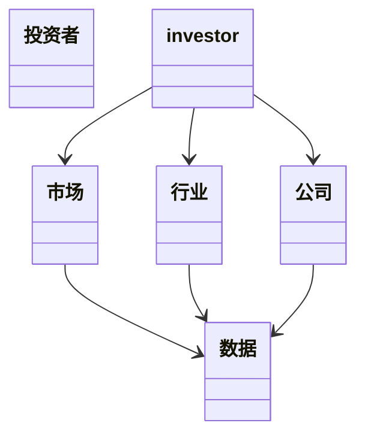
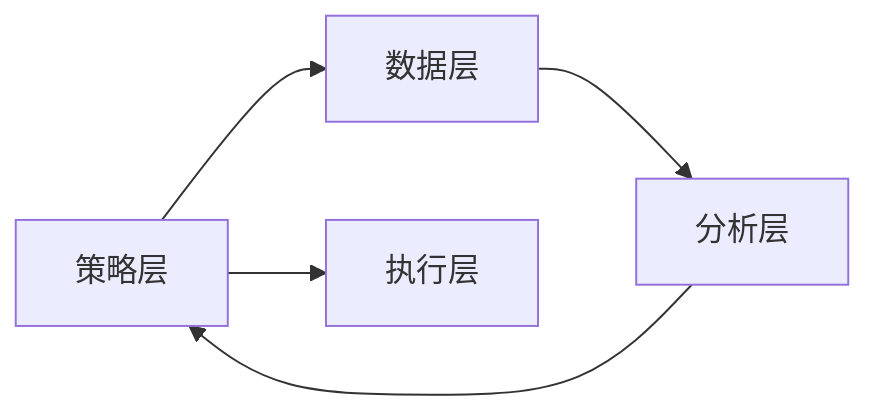
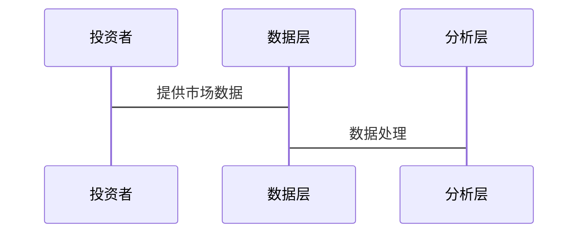
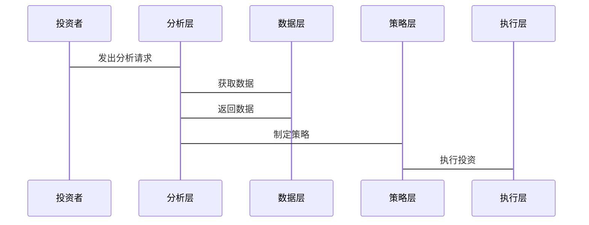

                 


# 芒格的"地图思维"在投资战略制定中的应用

> 关键词：芒格，地图思维，投资战略，系统分析，决策框架

> 摘要：本文系统地介绍了芒格的“地图思维”在投资战略制定中的应用，从背景、核心概念、算法原理、系统设计、项目实战到最佳实践，全面阐述了这一思维方法的优势和实际操作步骤。通过详细的技术分析和实例，展示了如何将地图思维应用于投资决策，帮助投资者构建更有效的投资策略。

---

## 第一部分: 芒格的"地图思维"概述

### 第1章: 芒格"地图思维"的核心概念

#### 1.1 问题背景与描述

##### 1.1.1 投资决策中的认知挑战
在现代投资领域，投资者面临着复杂多变的市场环境，传统的线性分析方法往往难以捕捉市场的多维度变化。投资者需要一种更系统、更全面的思维方式来应对不确定性。

##### 1.1.2 现有投资方法的局限性
传统投资方法往往依赖于单一的财务指标或市场预测，这种单一维度的分析容易忽视市场的复杂性。例如，仅仅关注市盈率或市净率的投资者可能会忽略行业周期性或公司治理问题。

##### 1.1.3 地图思维的提出与意义
芒格的“地图思维”是一种以系统性为核心的分析方法，它通过构建多维度的知识框架，帮助投资者全面理解市场的复杂性。这种方法不仅能够捕捉到单一分析方法难以发现的风险，还能提供更全面的投资决策依据。

#### 1.2 地图思维的定义与外延

##### 1.2.1 地图思维的定义
地图思维是一种通过构建多维度的知识网络来分析问题的思维方式。它强调从整体出发，关注各因素之间的相互关系和相互作用。

##### 1.2.2 地图思维的核心要素
地图思维的核心要素包括：
1. **知识框架**：构建一个涵盖市场、行业、公司等多个维度的知识网络。
2. **多维度分析**：从多个角度分析问题，关注不同因素之间的相互影响。
3. **动态调整**：根据市场变化，不断更新和调整分析框架。

##### 1.2.3 地图思维的边界与应用场景
地图思维适用于需要复杂决策的领域，尤其在投资领域，它可以帮助投资者更好地理解市场、行业和公司之间的关系。例如，在制定长期投资战略时，地图思维可以帮助投资者更好地识别潜在风险和机会。

#### 1.3 地图思维与传统投资方法的对比

##### 1.3.1 传统投资方法的分析框架
传统投资方法通常依赖于单一的分析框架，例如基本面分析或技术分析。这种分析方法虽然在某些情况下有效，但往往难以捕捉市场的复杂性。

##### 1.3.2 地图思维的独特性与优势
地图思维的独特性在于其系统性和全面性。它通过构建多维度的知识网络，帮助投资者更好地理解市场的复杂性。与传统方法相比，地图思维的优势在于能够捕捉到更多潜在的风险和机会。

##### 1.3.3 两种方法的适用场景对比
| 方法 | 传统投资方法 | 地图思维 |
|------|--------------|----------|
| 适用场景 | 单一维度分析 | 复杂问题分析 |
| 优势 | 简单易用 | 全面性 |
| 局限性 | 易忽视复杂性 | 需要更多时间和资源 |

### 第2章: 地图思维的核心原理与特征

#### 2.1 地图思维的原理分析

##### 2.1.1 知识框架的构建逻辑
地图思维的核心在于构建一个完整的知识框架。这个框架包括市场、行业、公司等多个维度，每个维度都可能影响投资决策。例如，行业周期、公司治理、市场趋势等都是构建知识框架的重要组成部分。

##### 2.1.2 多维度分析的系统性
地图思维强调从多个维度分析问题，关注不同因素之间的相互关系。例如，在分析一家公司时，不仅要考虑财务数据，还要考虑行业趋势、政策变化和管理层决策。

##### 2.1.3 长期视角与动态调整
地图思维注重长期视角，强调在市场变化中动态调整分析框架。例如，随着市场环境的变化，投资者需要不断更新其知识框架，以捕捉新的机会和风险。

#### 2.2 核心概念对比表

| 概念 | 传统投资方法 | 地图思维 |
|------|--------------|----------|
| 分析方式 | 线性分析 | 网络化分析 |
| 时间维度 | 短期预测 | 长期视角 |
| 决策依据 | 单一因素 | 多因素综合 |

#### 2.3 实体关系图



### 第3章: 地图思维的算法原理

#### 3.1 算法流程图



#### 3.2 投资决策树模型



## 第二部分: 地图思维在投资战略中的应用

### 第4章: 系统分析与架构设计

#### 4.1 项目介绍

##### 4.1.1 项目背景
本章将通过一个实际案例，展示地图思维在投资战略制定中的应用。我们将以某科技公司为例，分析其投资决策过程。

##### 4.1.2 项目目标
通过构建多维度的知识框架，制定出一个全面的投资战略，帮助投资者捕捉潜在机会，规避风险。

#### 4.2 系统功能设计

##### 4.2.1 领域模型


##### 4.2.2 系统架构设计



#### 4.3 接口设计

##### 4.3.1 数据输入接口


##### 4.3.2 交互流程图



### 第5章: 项目实战

#### 5.1 环境配置

##### 5.1.1 安装必要的库
```bash
pip install pandas numpy matplotlib
```

#### 5.2 核心实现

##### 5.2.1 数据处理
```python
import pandas as pd
import numpy as np

def process_data(data):
    # 数据清洗
    data = data.dropna()
    # 数据标准化
    data = (data - data.mean()) / data.std()
    return data
```

##### 5.2.2 策略生成
```python
def generate_strategy(data):
    # 构建知识框架
    factors = ['市盈率', '市净率', '营收增长率', '净利润率']
    knowledge_map = {}
    for factor in factors:
        knowledge_map[factor] = data[factor].mean()
    return knowledge_map
```

#### 5.3 案例分析

##### 5.3.1 案例介绍
我们以某科技公司为例，分析其投资价值。首先，我们需要收集市场、行业和公司的相关数据。

##### 5.3.2 分析与解读
通过构建知识框架，我们发现该公司的市盈率和市净率都处于行业平均水平，但营收增长率和净利润率低于行业平均水平。这可能意味着该公司在短期内可能面临增长压力。

##### 5.3.3 结果展示
```python
knowledge_map = {
    '市盈率': 25,
    '市净率': 3.5,
    '营收增长率': 10,
    '净利润率': 8
}

print(knowledge_map)
```

#### 5.4 项目小结
通过本项目，我们成功地将地图思维应用于投资决策中。通过构建知识框架，我们能够更全面地分析公司的投资价值，制定出更科学的投资策略。

### 第6章: 最佳实践与小结

#### 6.1 最佳实践 tips

##### 6.1.1 培养系统思维
投资者需要培养系统思维，关注市场的多维度变化，而不是仅仅依赖单一的分析方法。

##### 6.1.2 定期复盘
定期复盘可以帮助投资者不断优化其知识框架，捕捉新的机会和风险。

##### 6.1.3 注重长期视角
投资决策需要注重长期视角，关注市场的长期趋势，而不是仅仅关注短期波动。

#### 6.2 小结
地图思维是一种系统性、全面性的分析方法，它可以帮助投资者更好地理解市场的复杂性，制定出更科学的投资策略。通过构建知识框架，投资者可以更全面地分析问题，捕捉潜在的机会和风险。

#### 6.3 注意事项
投资者在应用地图思维时，需要注意以下几点：
1. **数据的准确性**：数据是构建知识框架的基础，必须确保数据的准确性。
2. **分析的全面性**：需要从多个维度分析问题，关注不同因素之间的相互作用。
3. **动态调整**：市场环境是动态变化的，需要不断更新和调整分析框架。

#### 6.4 拓展阅读
对于感兴趣的投资策略和地图思维，读者可以进一步阅读以下书籍和文章：
1. **《芒格的智慧》**：深入探讨芒格的投资哲学。
2. **《系统思维》**：系统地介绍系统思维在各个领域的应用。
3. **《投资的真相》**：通过实际案例分析，展示投资决策中的复杂性。

---

# 作者：AI天才研究院/AI Genius Institute & 禅与计算机程序设计艺术 /Zen And The Art of Computer Programming

