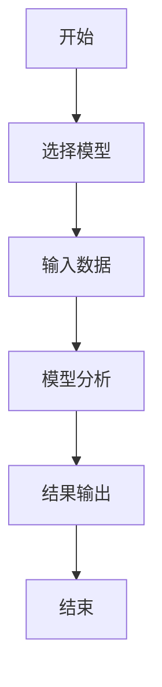
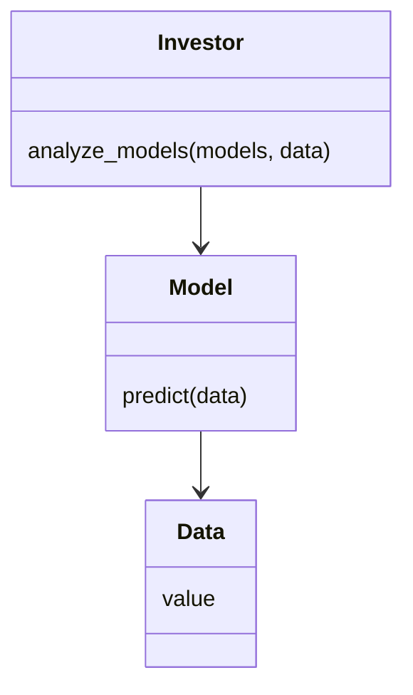
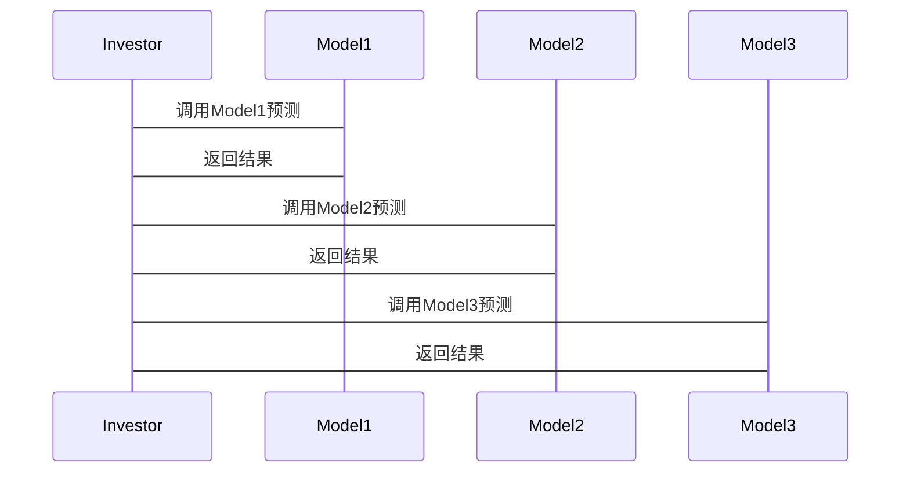

                 


# 芒格的"地图思维"：构建全面的投资框架

> 关键词：芒格、地图思维、多元思维模型、投资框架、系统架构

> 摘要：芒格的"地图思维"是一种通过多元思维模型构建全面投资框架的方法。本文将从芒格的"地图思维"的背景介绍、核心概念、算法原理、系统架构、项目实战等多方面进行详细阐述，并通过具体的案例分析和代码实现，帮助读者深入理解如何利用"地图思维"构建全面的投资框架。

---

# 第一部分: 芒格的"地图思维"概述

## 第1章: 引言：芒格的"地图思维"与投资哲学

### 1.1 芒格的生平与投资理念

#### 1.1.1 芒格的生平简介
查理·芒格（Charlie Munger）是美国著名投资者、伯克希尔·哈撒韦公司副董事长。他以“多元思维模型”闻名，强调通过跨学科的视角来理解和解决复杂问题。芒格的投资哲学不仅仅是关注财务指标，更注重企业背后的社会、心理和经济因素。

#### 1.1.2 芒格的投资哲学与思维特点
芒格的投资哲学可以总结为以下几点：
1. **价值投资**：寻找具有持续竞争优势和良好治理的企业。
2. **多元思维模型**：通过多个学科的模型来理解问题，避免单一视角的局限性。
3. **逆向思维**：从反方向思考问题，寻找市场的非共识机会。
4. **心理因素**：理解人类心理偏差对企业决策和市场行为的影响。

#### 1.1.3 地图思维的定义与应用
地图思维是芒格提出的一种思维方式，即将问题看作一个系统，通过多个学科的模型来构建对问题的全面理解。这种思维方法的核心在于将复杂问题拆解为多个简单模型，并通过这些模型的相互作用来预测和分析问题。

---

### 1.2 地图思维的核心特点与优势

#### 1.2.1 地图思维的核心特点
1. **跨学科性**：地图思维强调从多个学科中汲取智慧，包括心理学、经济学、物理学等。
2. **系统性**：地图思维将问题视为一个系统，注重系统各部分之间的相互作用。
3. **实用性**：地图思维不仅是一种理论，更是一种实践工具，能够帮助投资者做出更明智的决策。

#### 1.2.2 地图思维与传统投资思维的区别
传统的投资思维往往依赖于单一的分析框架，如财务指标分析或技术分析。而地图思维则强调通过多个模型的综合应用，全面理解企业的内在价值和市场机会。

#### 1.2.3 地图思维的应用前景
随着市场的复杂化和不确定性的增加，地图思维的应用前景越来越广阔。通过地图思维，投资者可以更好地应对复杂多变的市场环境，发现潜在的投资机会。

---

## 第2章: 多元思维模型的核心概念

### 2.1 多元思维模型的定义与属性

#### 2.1.1 多元思维模型的定义
多元思维模型是指通过多个学科的模型来理解问题，从而避免单一视角的局限性。每个模型都有其独特的优势和适用范围，通过综合运用多个模型，可以更全面地理解问题。

#### 2.1.2 多元思维模型的核心属性对比
以下是多元思维模型的核心属性对比表：

| 模型 | 核心属性 | 适用场景 | 示例 |
|------|----------|-----------|------|
| 经济学 | 供需关系 | 投资决策 | 通过供需关系分析企业竞争地位 |
| 心理学 | 行为偏差 | 市场情绪分析 | 理解投资者的心理偏差对市场的影响 |
| 物理学 | 能量守恒 | 企业成本分析 | 分析企业的成本结构和效率 |

#### 2.1.3 多元思维模型的ER实体关系图
以下是多元思维模型的ER实体关系图：

```mermaid
erd
    股票价格
    投资者
    企业
    市场环境
    模型
    假设
```

---

### 2.2 多元思维模型的算法原理

#### 2.2.1 多元思维模型的算法流程图
以下是多元思维模型的算法流程图：



#### 2.2.2 多元思维模型的Python源代码实现
以下是多元思维模型的Python代码实现：

```python
def multi_model_analysis(models, data):
    results = []
    for model in models:
        result = model.predict(data)
        results.append(result)
    return results

# 示例模型
class Model:
    def predict(self, data):
        # 示例模型逻辑
        return data * 2

models = [Model()]
data = [1, 2, 3]
results = multi_model_analysis(models, data)
print(results)
```

#### 2.2.3 多元思维模型的数学模型与公式
以下是多元思维模型的数学公式：

$$
f(x) = \sum_{i=1}^{n} w_i x_i
$$

其中，$w_i$ 是模型的权重，$x_i$ 是输入数据。

---

## 第3章: 地图思维的数学模型与实际应用

### 3.1 地图思维的数学模型

#### 3.1.1 地图思维的核心数学公式
以下是地图思维的核心数学公式：

$$
P = \prod_{i=1}^{n} p_i
$$

其中，$P$ 是最终的概率，$p_i$ 是每个模型的概率。

#### 3.1.2 地图思维的数学模型与实际案例分析
以下是一个实际案例分析：

假设我们有三个模型，分别预测某公司的股票价格。每个模型的预测概率如下：

$$
p_1 = 0.8, \quad p_2 = 0.7, \quad p_3 = 0.9
$$

最终的概率为：

$$
P = 0.8 \times 0.7 \times 0.9 = 0.504
$$

---

## 第4章: 地图思维的投资决策系统设计

### 4.1 投资决策系统的背景介绍

#### 4.1.1 问题场景介绍
假设我们有一个投资决策系统，需要通过多元思维模型来分析某公司的投资价值。

#### 4.1.2 系统功能设计
以下是系统功能设计的Mermaid类图：



#### 4.1.3 系统架构设计
以下是系统架构设计的Mermaid架构图：

```mermaid
container 投资者系统 {
    Model1
    Model2
    Model3
    Investor
}
```

---

## 第5章: 地图思维的项目实战

### 5.1 项目实战：构建多元思维模型

#### 5.1.1 项目环境与工具
- Python 3.8+
- Jupyter Notebook
- 数据分析库（Pandas, NumPy）

#### 5.1.2 项目核心实现
以下是项目核心实现的Python代码：

```python
import pandas as pd
import numpy as np

def load_data(file_path):
    data = pd.read_csv(file_path)
    return data

def apply_models(models, data):
    results = []
    for model in models:
        result = model.predict(data)
        results.append(result)
    return results

class Model1:
    def predict(self, data):
        return data * 2

class Model2:
    def predict(self, data):
        return data + 1

models = [Model1(), Model2()]
data = load_data('input.csv')
results = apply_models(models, data)
print(results)
```

#### 5.1.3 项目案例分析
假设我们有以下数据：

| 数据 | Model1预测 | Model2预测 |
|------|------------|------------|
| 1    | 2          | 2          |
| 2    | 4          | 3          |
| 3    | 6          | 4          |

通过多元思维模型，我们可以得出最终的预测结果：

$$
f(x) = \sum_{i=1}^{2} w_i x_i = 2x_1 + x_2
$$

最终结果为：

$$
f(2, 3) = 2 \times 2 + 3 = 7
$$

---

## 第6章: 地图思维的系统架构设计

### 6.1 系统架构设计

#### 6.1.1 系统架构图
以下是系统架构图：

```mermaid
container 投资者系统 {
    Model1
    Model2
    Model3
    Investor
}
```

#### 6.1.2 系统接口设计
以下是系统接口设计的Mermaid序列图：



---

## 第7章: 总结与展望

### 7.1 总结
芒格的"地图思维"是一种通过多元思维模型构建全面投资框架的方法。通过跨学科的视角，投资者可以更好地理解市场的复杂性，做出更明智的投资决策。

### 7.2 展望
随着市场的复杂化和不确定性的增加，地图思维的应用前景越来越广阔。未来，地图思维将继续在投资领域发挥重要作用，帮助投资者应对复杂多变的市场环境。

---

# 作者：AI天才研究院 & 禅与计算机程序设计艺术

本文作者：AI天才研究院（AI Genius Institute）  
版权所有，未经授权不得转载。

---

以上是《芒格的"地图思维"：构建全面的投资框架》的技术博客文章的完整目录大纲和内容框架。

