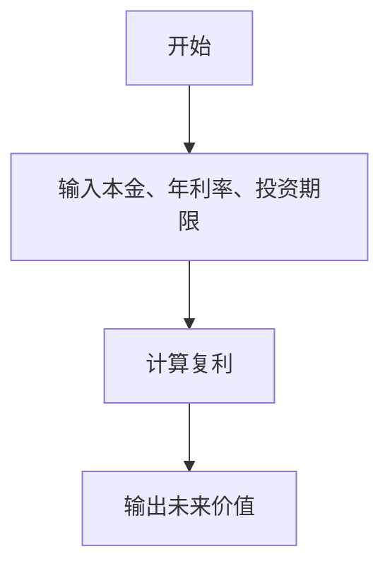
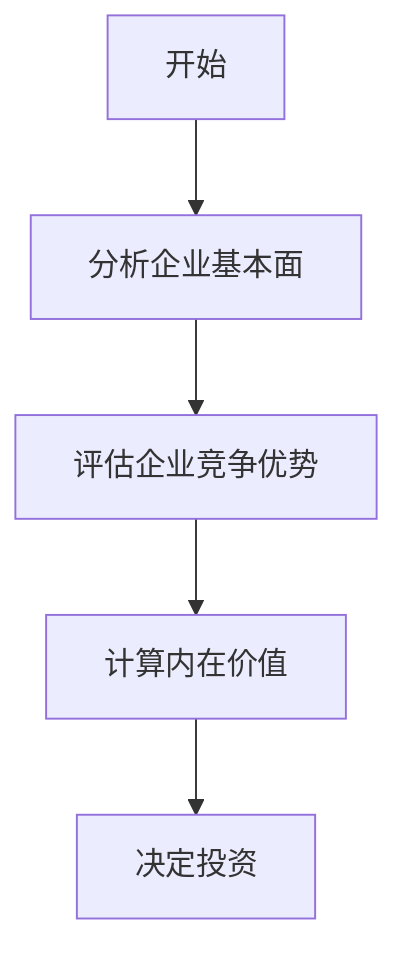
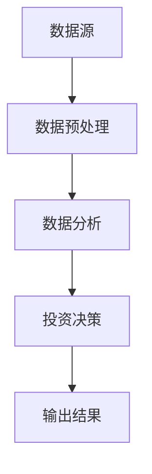

                 


# 芒格的"复利思维"在长期投资中的应用

## 关键词：复利思维、长期投资、芒格、投资策略、系统架构设计

## 摘要：  
芒格的复利思维是一种以时间价值为核心的投资哲学，强调通过长期价值投资实现财富的指数级增长。本文从复利思维的数学模型、算法原理、系统架构设计以及实际投资案例等多个维度，详细分析了芒格复利思维在长期投资中的应用，并结合技术语言和系统设计的方法，为读者提供一种全新的视角来理解投资与技术的结合。

---

## 第一部分：复利思维与长期投资基础

### 第1章：复利思维的核心概念与背景

#### 1.1 复利思维的基本概念

复利，即“利滚利”，是指在投资过程中，每期的利息或收益会再投资，从而产生更多的收益。其数学公式为：

$$ FV = PV \times (1 + r)^n $$

其中，FV为终值，PV为现值，r为年化收益率，n为投资年数。

复利的核心在于时间的价值，即投资的时间越长，复利效应越显著。简单利息的计算公式为：

$$ SI = PV \times r \times n $$

与复利不同，简单利息仅计算本金的利息，不考虑利息的再投资。

#### 1.2 芒格投资理念的背景

本章将介绍芒格的生平及其投资哲学的核心思想。芒格的复利思维不仅仅是数学上的概念，更是一种投资哲学，强调长期、价值和耐心。其投资理念的核心在于选择具有持续竞争优势的企业，并长期持有，以实现财富的指数级增长。

---

### 第2章：芒格复利思维的核心要素

#### 2.1 复利思维的数学模型与公式

复利的数学模型是理解其投资哲学的基础。以下是常用的复利相关公式：

1. **终值公式**：

$$ FV = PV \times (1 + r)^n $$

2. **年金公式**：

$$ PV = PMT \times \frac{1 - (1 + r)^{-n}}{r} $$

其中，PMT为每期支付的金额，r为利率，n为期限。

3. **复利与投资回报的关系**：

复利的计算可以帮助投资者估算未来投资的回报，从而做出更合理的投资决策。

#### 2.2 芒格复利思维的核心要素分析

1. **时间的价值**：复利的最重要因素是时间。投资的时间越长，复利效应越显著。

2. **投资的复利效应**：通过长期持有优质资产，投资者可以实现财富的指数级增长。

3. **风险与收益的平衡**：复利思维要求投资者在追求高收益的同时，注重风险控制，避免过度波动。

---

## 第二部分：复利思维的算法原理与系统架构

### 第3章：复利思维的算法原理

#### 3.1 复利计算的算法流程

以下是一个简单的复利计算流程图：



#### 3.2 投资决策的算法模型

以下是一个投资决策算法模型的流程图：



---

### 第4章：复利思维的系统架构与设计

#### 4.1 投资决策系统的模块划分

1. **数据收集模块**：收集企业的财务数据、市场数据等。

2. **数据分析模块**：对收集的数据进行清洗、分析和建模。

3. **投资决策模块**：根据分析结果，制定投资策略。

#### 4.2 系统架构设计

以下是一个投资决策系统的架构图：



---

### 第5章：复利思维的实战应用

#### 5.1 投资组合构建的实战案例

1. **投资目标设定**：明确投资目标和风险承受能力。

2. **资产配置策略**：根据目标，制定合理的资产配置方案。

3. **投资组合优化**：通过优化组合，实现风险与收益的最佳平衡。

#### 5.2 芒格风格投资的代码实现

以下是Python代码实现：

```python
def compound_interest(principal, rate, years):
    return principal * (1 + rate) ** years

# 示例计算
principal = 10000
rate = 0.07
years = 10

future_value = compound_interest(principal, rate, years)
print(f"未来价值：{future_value}")
```

---

## 第三部分：项目实战与总结

### 第6章：投资组合优化的代码实现

#### 6.1 环境安装与配置

1. 安装必要的库，如Pandas、NumPy等。

#### 6.2 系统核心实现源代码

以下是投资组合优化的代码示例：

```python
import pandas as pd
import numpy as np

def calculate_expected_return(returns):
    return np.mean(returns)

def calculate_risk(returns):
    return np.std(returns)

def portfolio_optimization(returns, weights):
    expected_return = calculate_expected_return(returns)
    risk = calculate_risk(returns)
    return expected_return, risk

# 示例数据
returns = pd.Series([0.05, 0.07, 0.03, 0.08, 0.06])
weights = pd.Series([0.4, 0.3, 0.2, 0.1, 0])

er, risk = portfolio_optimization(returns, weights)
print(f"预期回报：{er}")
print(f"风险：{risk}")
```

#### 6.3 案例分析与结果解读

通过上述代码，我们可以计算出投资组合的预期回报和风险，并根据结果进行调整。

### 第7章：总结与展望

芒格的复利思维不仅仅是一种投资策略，更是一种系统化的思考方式。通过将复利思维与技术相结合，投资者可以更好地理解和优化其投资决策过程。未来，随着技术的不断进步，复利思维的应用也将更加广泛和深入。

---

## 作者：AI天才研究院/AI Genius Institute & 禅与计算机程序设计艺术 /Zen And The Art of Computer Programming

---

这篇文章从复利思维的数学模型、算法原理、系统架构设计以及实际投资案例等多个维度，详细分析了芒格复利思维在长期投资中的应用，并结合技术语言和系统设计的方法，为读者提供了一种全新的视角来理解投资与技术的结合。

