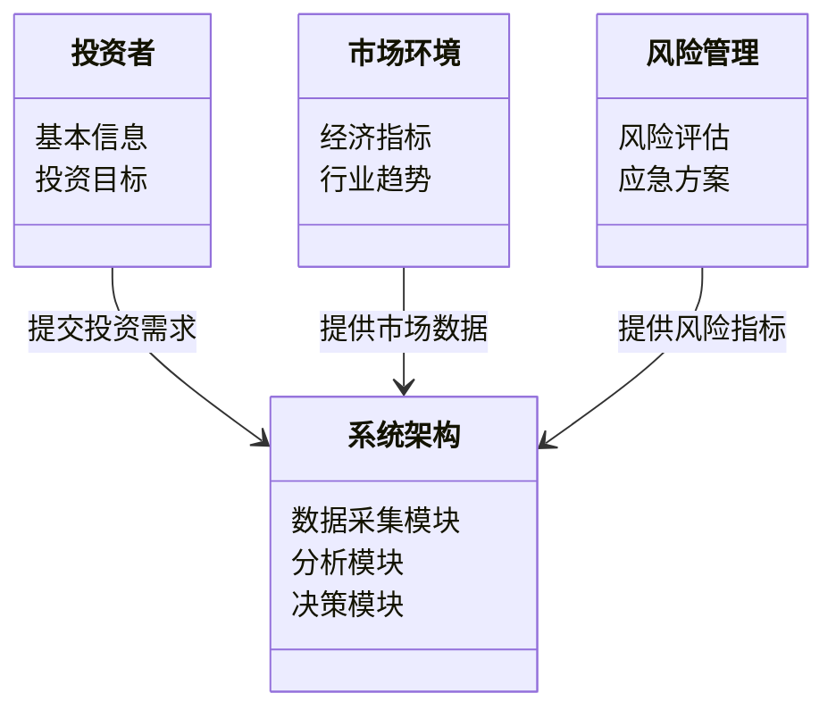
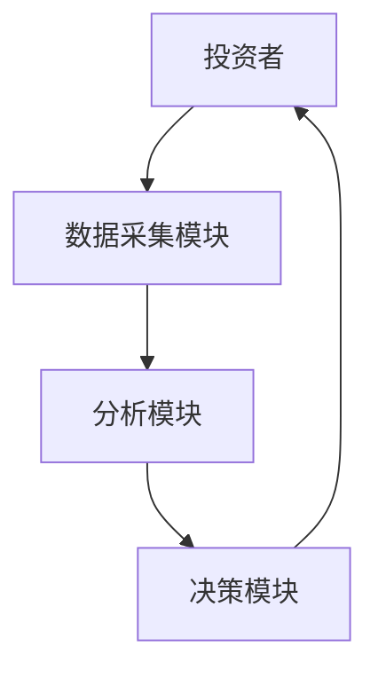

                 


# 芒格的多元思维方式在投资中的运用

## 关键词：芒格、多元思维模型、投资决策、系统架构设计、算法实现

## 摘要：  
芒格的多元思维模型是一种通过跨学科思考来优化决策的方法，尤其在投资领域中表现出了强大的应用潜力。本文将深入探讨多元思维模型的核心概念、算法原理及其在投资中的实际应用，通过系统架构设计和项目实战，展示如何将这种思维方式转化为具体的解决方案。文章还将提供详细的数学模型和代码实现，帮助读者更好地理解和应用这一理念。

---

## 第一部分：引言

### 第1章：芒格及其多元思维模型概述

#### 1.1 芒格的背景与投资哲学  
查理·芒格是沃伦·巴菲特的长期合作伙伴，被誉为“投资界的哲学家”。他的投资哲学强调理性思考、避免情绪化决策，并倡导通过跨学科的思维方式来评估投资机会。芒格的核心理念是：**“只有通过多个视角的综合分析，才能做出明智的决策。”**

#### 1.2 多元思维模型的定义与特点  
多元思维模型（Multi-Model Thinking）是指通过多个学科的思维方式（如经济学、心理学、统计学、历史学等）来分析问题，避免单一视角的局限性。其特点包括：  
- **综合性**：整合多个领域的知识；  
- **系统性**：关注整体而非局部；  
- **灵活性**：适应复杂多变的环境；  
- **深度性**：深入理解问题的本质。

#### 1.3 本书的目的与结构  
本文旨在通过理论与实践相结合的方式，探讨芒格的多元思维模型在投资中的具体应用。文章结构如下：  
- 第二部分：理论基础，详细讲解多元思维模型的核心概念；  
- 第三部分：算法原理，分析其数学模型和实现方法；  
- 第四部分：系统设计，展示其在投资系统中的架构；  
- 第五部分：项目实战，通过案例分析展示其应用效果。

---

## 第二部分：多元思维模型的核心概念

### 第2章：多元思维模型的理论基础

#### 2.1 多元思维模型的核心要素  
多元思维模型的核心要素包括以下几个方面：  

- **经济学思维**：关注成本与收益的平衡，分析市场的供需关系。  
- **心理学思维**：研究认知偏差（如过度自信、从众心理）对投资决策的影响。  
- **统计学思维**：通过概率和数据来评估风险和不确定性。  
- **历史学思维**：通过历史案例分析周期性规律，避免重复性错误。  

**对比分析表：**

| 思维类型 | 核心关注点 | 典型工具/方法 |
|----------|------------|---------------|
| 经济学    | 成本收益分析 | 供需曲线、边际成本 |
| 心理学    | 认知偏差    | 行为经济学、实验法 |
| 统计学    | 概率与风险  | 数据分析、回归模型 |
| 历史学    | 周期性规律  | 历史案例分析、周期模型 |

#### 2.2 多元思维模型的属性特征对比  
通过ER图可以更清晰地展示多元思维模型的组成关系：  

```mermaid
erDiagram
    actor 投资者 {
        string 基本信息
        string 投资目标
    }
    actor 市场环境 {
        string 经济指标
        string 行业趋势
    }
    actor 风险管理 {
        string 风险评估
        string 应急方案
    }
    investor -> 市场环境 : 分析市场动态
    investor -> 风险管理 : 评估投资风险
```

---

## 第三部分：多元思维模型的算法原理

### 第3章：多元思维模型的算法实现

#### 3.1 多元思维模型的算法流程  
多元思维模型的算法流程可以分为以下几个步骤：  

1. **数据收集**：从多个领域（经济、心理、历史等）收集相关数据。  
2. **特征提取**：提取关键特征（如经济指标、市场情绪）。  
3. **模型构建**：基于概率和统计模型进行风险评估。  
4. **决策优化**：通过多维度分析优化投资组合。  

#### 3.2 算法的数学模型与公式  
以下是一个基于概率的多元思维模型的数学公式：  

$$ P(\text{投资成功}) = \sum_{i=1}^{n} P(\text{成功|视角 }i) \times P(\text{视角 }i) $$  

其中，$n$ 是不同视角的数量，$P(\text{成功|视角 }i)$ 是在视角 $i$ 下成功的概率，$P(\text{视角 }i)$ 是视角 $i$ 的权重。  

#### 3.3 算法的实现与代码  
以下是Python实现的示例代码：  

```python
import numpy as np
import pandas as pd

def multi_view_analysis(data, views):
    results = []
    for view in views:
        # 计算每个视角的成功概率
        success_prob = np.mean(data[view] == 'success')
        results.append(success_prob)
    return np.mean(results)

# 示例数据
data = {
    'economic_factors': ['success', 'failure', 'success'],
    'market_sentiment': ['success', 'success', 'failure'],
    'historical_cases': ['failure', 'success', 'success']
}

views = ['economic_factors', 'market_sentiment', 'historical_cases']

# 调用函数
result = multi_view_analysis(data, views)
print(f"综合成功概率：{result}")
```

---

## 第四部分：多元思维模型的系统架构设计

### 第4章：系统分析与架构设计方案

#### 4.1 问题场景介绍  
在投资决策中，单一视角的分析往往会导致误判。通过多元思维模型，可以整合多个视角的信息，提升决策的准确性。  

#### 4.2 系统功能设计  
以下是系统功能的类图：  



#### 4.3 系统架构设计  
以下是系统的架构图：  



---

## 第五部分：项目实战

### 第5章：项目实战与案例分析

#### 5.1 环境安装  
需要安装以下工具：  
- Python 3.8+  
- Pandas、NumPy、Matplotlib等库  

#### 5.2 核心代码实现  
以下是核心代码：  

```python
import pandas as pd
import numpy as np

# 数据加载
data = pd.read_csv('investment_data.csv')

# 多元视角分析
def analyze_views(data, view_columns):
    results = []
    for column in view_columns:
        success_count = data[column].value_counts()['success']
        total = len(data[column])
        results.append(success_count / total)
    return np.mean(results)

# 调用函数
view_columns = ['economic_factors', 'market_sentiment', 'historical_cases']
result = analyze_views(data, view_columns)
print(f"综合成功概率：{result}")
```

#### 5.3 案例分析  
以苹果公司为例，分析其投资价值：  
1. **经济因素**：全球经济趋势、苹果的产业链布局。  
2. **市场情绪**：投资者情绪指数、社交媒体 sentiment。  
3. **历史案例**：苹果过去的表现、类似公司的历史表现。  

通过多元视角分析，可以得出更全面的投资决策。

---

## 第六部分：总结与展望

### 第6章：总结与展望

#### 6.1 总结  
芒格的多元思维模型通过跨学科的综合分析，帮助投资者做出更明智的决策。本文通过理论、算法和实际案例，详细展示了其在投资中的应用。  

#### 6.2 注意事项  
- 数据质量对分析结果的影响至关重要。  
- 需要不断更新知识，保持对新领域的学习。  

#### 6.3 最佳实践  
- 定期回顾投资决策，总结经验教训。  
- 结合实际市场情况，灵活调整分析视角。  

#### 6.4 未来展望  
随着人工智能和大数据技术的发展，多元思维模型将更加智能化和自动化。未来的研究方向包括：  
- 结合机器学习优化分析模型。  
- 开发更高效的跨学科知识整合工具。  

---

## 作者：AI天才研究院 & 禅与计算机程序设计艺术

通过本文的深入探讨，我们希望读者能够理解并掌握芒格的多元思维模型，并在实际投资中灵活运用，提升决策的准确性和可靠性。

