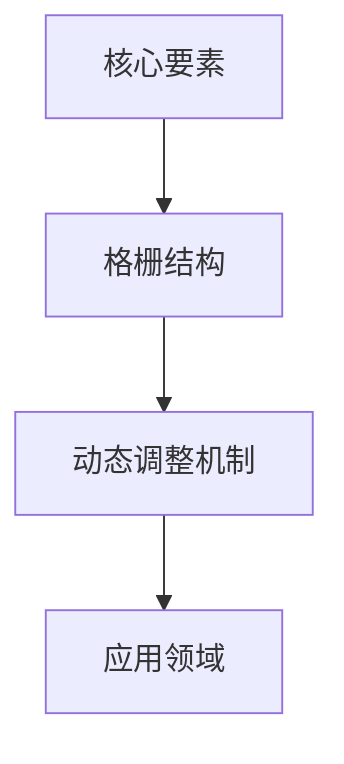
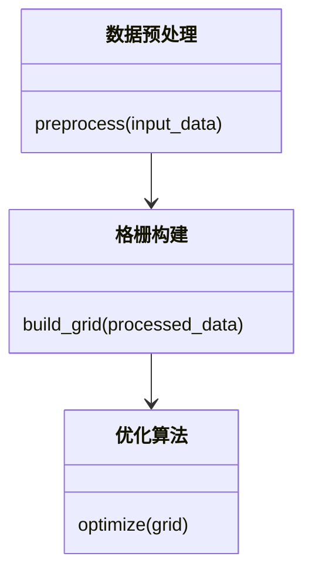
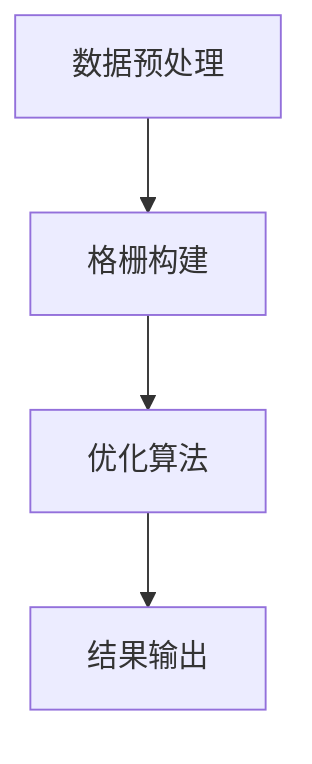
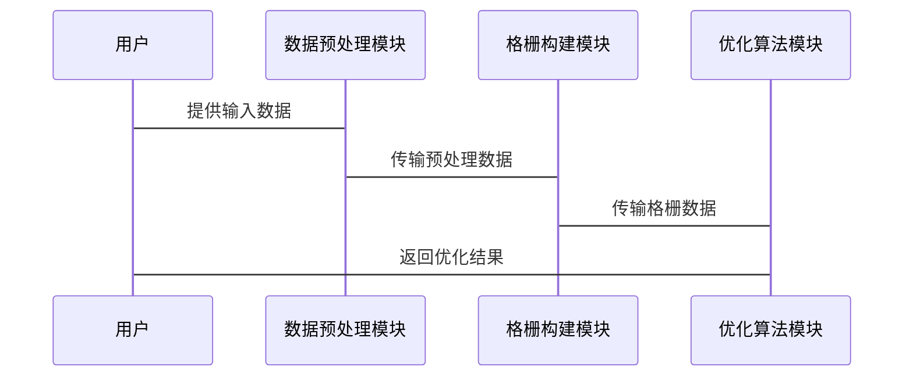

                 


# 芒格的"多元思维格栅"在跨学科技术融合中的应用

## 关键词：多元思维格栅，跨学科技术融合，芒格模型，算法原理，系统架构，技术博客

## 摘要：芒格的多元思维格栅是一种跨学科的思维方式，其核心在于通过多学科的交叉融合来解决复杂问题。本文将详细探讨多元思维格栅在跨学科技术融合中的应用，从背景介绍、核心概念、算法原理、系统架构到项目实战，层层深入，结合实际案例和代码实现，为读者提供全面的技术解读。

---

# 第1章: 多元思维格栅的背景与核心思想

## 1.1 芒格的多元思维模型简介

### 1.1.1 多元思维模型的起源
芒格的多元思维模型起源于他对投资和决策的深刻理解，其核心思想是通过多个学科的交叉融合来提升决策的准确性。

### 1.1.2 跨学科融合的背景
在当今的技术领域，单一学科的解决方案往往难以应对复杂的现实问题，因此，跨学科融合成为技术发展的必然趋势。

### 1.1.3 芒格模型的核心思想
芒格认为，通过建立一个由多个学科组成的“思维格栅”，可以更全面地分析问题，避免单一视角的局限性。

## 1.2 跨学科技术融合的现状与趋势

### 1.2.1 跨学科融合的现状分析
当前，跨学科技术融合已经在人工智能、大数据、生物技术等领域取得了显著成果。

### 1.2.2 跨学科融合的驱动因素
技术进步、社会需求、学科交叉研究的兴起是推动跨学科融合的主要因素。

### 1.2.3 跨学科融合的未来趋势
随着技术的进一步发展，跨学科融合将更加深入，成为解决复杂问题的关键。

## 1.3 多元思维格栅在技术融合中的应用前景

### 1.3.1 技术融合中的关键问题
单一学科方法的局限性、跨学科协作的困难、技术整合的复杂性等。

### 1.3.2 多元思维格栅的解决方案
通过构建一个多学科交叉的思维框架，整合不同领域的知识和方法，解决复杂问题。

### 1.3.3 应用领域的潜力与挑战
在人工智能、数据分析、医疗技术等领域具有巨大潜力，但也面临技术整合和协作的挑战。

## 1.4 本章小结

---

# 第2章: 多元思维格栅的核心概念与联系

## 2.1 多元思维格栅的核心要素

### 2.1.1 格栅的结构与功能
格栅由多个学科模块组成，每个模块代表一个学科的核心思想和方法。

### 2.1.2 格栅的核心要素分析
包括逻辑思维、数学模型、计算机科学、生物学等多学科的核心概念。

### 2.1.3 格栅的动态调整机制
根据实际问题的需求，动态调整各学科模块的权重和应用方式。

## 2.2 多元思维格栅与其他模型的对比

### 2.2.1 网络模型对比
对比传统的网络模型，格栅模型在复杂问题上的表现更加优异。

### 2.2.2 格栅模型的优缺点
优点：多学科交叉能力强；缺点：复杂性高，难以快速应用。

### 2.2.3 格栅模型在实际应用中的表现
通过实际案例，验证格栅模型在跨学科问题中的优势。

## 2.3 多元思维格栅的ER实体关系图



## 2.4 本章小结

---

# 第3章: 多元思维格栅的算法原理

## 3.1 格栅算法的基本原理

### 3.1.1 算法的基本思想
通过多学科模型的组合优化，解决复杂问题。

### 3.1.2 算法的核心步骤
数据预处理、模型构建、优化调整、结果输出。

### 3.1.3 算法的数学模型
$$ y = f(x) $$

## 3.2 格栅算法的实现流程

### 3.2.1 数据输入与预处理
对输入数据进行清洗和标准化处理。

### 3.2.2 格栅构建与优化
通过迭代优化算法，调整各学科模块的权重。

### 3.2.3 结果输出与反馈
输出最终结果，并根据反馈进行进一步优化。

## 3.3 格栅算法的数学模型与公式

### 3.3.1 基本公式
$$ y = f(x) $$

### 3.3.2 优化公式
$$ x_{n+1} = x_n - \alpha \cdot \frac{df}{dx} $$

## 3.4 算法实现的Python代码示例

```python
def grid_algorithm(input_data):
    # 数据预处理
    processed_data = preprocess(input_data)
    # 格栅构建
    grid = build_grid(processed_data)
    # 算法优化
    optimized_grid = optimize(grid)
    return optimized_grid
```

## 3.5 本章小结

---

# 第4章: 多元思维格栅的系统分析与架构设计

## 4.1 问题场景介绍

### 4.1.1 项目背景
以一个实际跨学科技术融合项目为例，说明系统设计的背景和需求。

### 4.1.2 项目介绍
项目目标、主要功能、技术要求。

## 4.2 系统功能设计

### 4.2.1 领域模型类图


### 4.2.2 系统架构设计


## 4.3 系统接口设计

### 4.3.1 接口描述
定义系统的主要接口及其功能。

### 4.3.2 交互流程图


## 4.4 本章小结

---

# 第5章: 多元思维格栅的项目实战

## 5.1 环境安装与配置

### 5.1.1 系统环境要求
操作系统、编程语言、开发工具的安装和配置。

### 5.1.2 依赖库的安装
Python库、数据处理工具的安装指令。

## 5.2 系统核心实现

### 5.2.1 核心代码实现
```python
def preprocess(input_data):
    # 数据预处理代码
    return processed_data

def build_grid(processed_data):
    # 格栅构建代码
    return grid

def optimize(grid):
    # 优化算法代码
    return optimized_grid
```

### 5.2.2 代码解读与分析
详细解读每部分代码的功能和实现原理。

## 5.3 实际案例分析

### 5.3.1 案例背景
介绍一个实际的跨学科技术融合案例。

### 5.3.2 案例实现
详细描述案例的实现过程，包括数据处理、模型构建、优化调整等步骤。

### 5.3.3 案例分析
分析案例的结果，总结经验与教训。

## 5.4 本章小结

---

# 第6章: 多元思维格栅的最佳实践与小结

## 6.1 最佳实践 tips

### 6.1.1 格栅模型的优化技巧
如何动态调整各学科模块的权重，提高模型的准确性。

### 6.1.2 跨学科协作的注意事项
团队协作、知识共享、沟通与协调。

## 6.2 本章小结

### 6.2.1 核心概念回顾
总结多元思维格栅的核心思想和应用方法。

### 6.2.2 未来展望
预测多元思维格栅在技术融合中的发展趋势和应用前景。

---

# 附录: 术语表与参考文献

## 附录A: 术语表

## 附录B: 参考文献

---

作者：AI天才研究院 & 禅与计算机程序设计艺术

