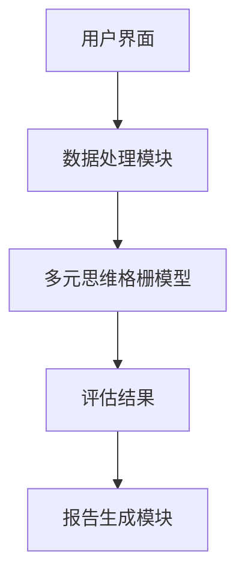

                 


# 芒格的"多元思维格栅"在跨学科量子技术融合评估中的应用

---

## 关键词  
芒格思维格栅, 量子技术, 跨学科融合, 技术评估, 系统架构

---

## 摘要  
本文探讨了芒格的"多元思维格栅"在跨学科量子技术融合评估中的应用。通过构建多元思维格栅模型，分析量子技术的跨学科特性，提出了一种基于多元思维格栅的量子技术融合评估方法。文章详细阐述了模型构建、评估方法、系统架构设计以及项目实战，为跨学科量子技术融合评估提供了理论和实践指导。

---

# 引言  

量子技术作为21世纪最具革命性的技术之一，正在改变我们对计算、通信和测量的认知。然而，量子技术的复杂性要求我们在评估其融合应用时，必须具备跨学科的视角。芒格的"多元思维格栅"是一种强大的思维工具，它通过多维度、多层次的分析，帮助我们更好地理解和评估复杂系统。本文将深入探讨如何将芒格的思维格栅应用于跨学科量子技术融合评估中，构建一个高效、系统的评估框架。

---

## 第1章: 芒格的多元思维格栅与量子技术基础  

### 1.1 多元思维格栅的核心概念  

#### 1.1.1 多元思维格栅的定义  
多元思维格栅是一种将多个学科、领域和维度有机结合的分析工具，通过构建多维度的框架，帮助我们在复杂问题中找到规律和联系。其核心在于将问题分解为多个维度，通过交叉分析来揭示问题的本质。

#### 1.1.2 多元思维格栅的特点  
1. **多维度性**：能够同时考虑多个维度的信息，如技术、经济、社会、环境等。  
2. **动态调整性**：根据实际情况灵活调整格栅的维度和权重。  
3. **系统性**：通过多维度的交叉分析，揭示系统的整体特性。  

#### 1.1.3 多元思维格栅的应用场景  
1. **跨学科研究**：帮助我们在多个学科间建立联系。  
2. **复杂系统评估**：用于评估复杂系统的性能和潜在风险。  
3. **创新设计**：通过多维度的交叉启发，促进创新思维。  

---

### 1.2 量子技术的基本概念  

#### 1.2.1 量子技术的定义  
量子技术是指利用量子力学原理进行信息处理、计算和通信的技术，包括量子计算、量子通信、量子传感等领域。  

#### 1.2.2 量子技术的核心原理  
1. **量子叠加**：量子系统可以同时处于多个状态的叠加态。  
2. **量子纠缠**：两个或多个量子系统之间形成强关联，一个系统的状态会直接影响另一个系统的状态。  
3. **量子测量**：测量会破坏量子叠加态，使系统 collapse 到特定状态。  

#### 1.2.3 量子技术的跨学科特性  
量子技术涉及物理学、计算机科学、数学、材料科学等多个学科，其发展需要多学科的协同合作。  

---

## 第2章: 多元思维格栅与跨学科融合  

### 2.1 多元思维格栅的模型结构  

#### 2.1.1 格栅模型的维度划分  
多元思维格栅的维度可以根据量子技术的特点进行划分，例如：  
1. **技术维度**：量子计算、量子通信、量子传感等。  
2. **学科维度**：物理学、数学、计算机科学、材料科学等。  
3. **应用维度**：信息安全、优化计算、传感器网络等。  

#### 2.1.2 格栅模型的层次结构  
1. **基础层**：量子技术的基本原理和数学模型。  
2. **中间层**：跨学科融合的关键技术。  
3. **应用层**：实际应用中的量子技术解决方案。  

#### 2.1.3 格栅模型的动态调整  
根据量子技术的发展和应用需求，动态调整格栅的维度和权重，以适应新的挑战和机会。  

---

### 2.2 跨学科融合的基本原理  

#### 2.2.1 跨学科融合的定义  
跨学科融合是指将不同学科的知识、方法和技术有机结合，以解决复杂问题或推动创新。  

#### 2.2.2 跨学科融合的关键要素  
1. **学科交叉点**：不同学科的交汇点是跨学科融合的核心。  
2. **知识整合**：将不同学科的知识有机结合起来。  
3. **协同创新**：通过跨学科合作，推动技术创新。  

#### 2.2.3 跨学科融合的实现方法  
1. **建立跨学科团队**：组建来自不同学科的专家团队。  
2. **构建知识共享平台**：促进知识和资源的共享。  
3. **制定协同创新机制**：明确合作流程和目标。  

---

## 第3章: 量子技术融合评估的背景与挑战  

### 3.1 量子技术融合评估的背景  

#### 3.1.1 量子技术的发展现状  
量子技术正在快速发展，特别是在量子计算和量子通信领域，已经取得了一些突破性进展。  

#### 3.1.2 跨学科融合的必要性  
随着量子技术的复杂性增加，跨学科融合已成为其发展的必然趋势。  

#### 3.1.3 量子技术融合评估的意义  
通过评估不同量子技术的融合效果，可以为技术创新和应用提供指导。  

---

### 3.2 量子技术融合评估的挑战  

#### 3.2.1 技术复杂性  
量子技术涉及复杂的物理原理和数学模型，评估难度较大。  

#### 3.2.2 跨学科协调性  
不同学科之间的协调和合作需要时间和资源，增加了评估的难度。  

#### 3.2.3 数据整合与分析的难度  
量子技术的数据具有特殊性，整合和分析需要专门的方法和技术。  

---

## 第4章: 多元思维格栅的模型构建  

### 4.1 多元思维格栅的构建步骤  

#### 4.1.1 确定核心维度  
根据量子技术的特点，确定格栅的核心维度，例如技术、学科、应用等。  

#### 4.1.2 设计模型结构  
构建多维度、多层次的格栅模型，确保各个维度之间的关联性。  

#### 4.1.3 定义评估指标  
根据格栅模型，定义具体的评估指标，例如技术成熟度、应用潜力等。  

---

### 4.2 多元思维格栅的属性特征对比  

#### 4.2.1 格栅维度的对比分析  
通过对比不同维度的属性，找出量子技术融合中的关键点。  

#### 4.2.2 格栅层次的对比分析  
分析不同层次之间的关系，确定评估的重点。  

#### 4.2.3 格栅动态调整的对比分析  
根据实际情况，动态调整格栅的维度和权重，确保评估的灵活性和适应性。  

---

## 第5章: 量子技术融合评估的方法论  

### 5.1 多元思维格栅在评估中的应用  

#### 5.1.1 评估步骤  
1. 确定评估目标和范围。  
2. 构建多元思维格栅模型。  
3. 收集和分析数据。  
4. 进行评估和优化。  

#### 5.1.2 评估指标体系  
根据格栅模型，设计一套科学的评估指标体系，例如技术性能、经济成本、社会影响等。  

#### 5.1.3 评估结果的解释  
通过分析评估结果，找出量子技术融合中的优势和不足，为后续优化提供依据。  

---

### 5.2 量子技术融合评估的案例分析  

#### 5.2.1 案例背景  
选择一个具体的量子技术融合项目，例如量子计算在优化问题中的应用。  

#### 5.2.2 案例分析  
1. 确定项目的各个维度和指标。  
2. 构建多元思维格栅模型。  
3. 进行数据收集和分析。  
4. 得出评估结果并提出改进建议。  

---

## 第6章: 系统分析与架构设计方案  

### 6.1 问题场景介绍  

#### 6.1.1 项目介绍  
本项目旨在评估不同量子技术的融合效果，构建一个高效的评估系统。  

#### 6.1.2 系统功能需求  
1. 支持多维度数据的输入和分析。  
2. 提供多元思维格栅模型的构建和调整功能。  
3. 实现评估结果的可视化和报告生成。  

---

### 6.2 系统架构设计  

#### 6.2.1 系统架构图  


#### 6.2.2 系统接口设计  
1. 用户界面：提供数据输入和模型调整的功能。  
2. 数据处理模块：负责数据的清洗和预处理。  
3. 多元思维格栅模型：实现格栅模型的构建和评估。  
4. 评估结果：输出评估结果和报告。  

---

## 第7章: 项目实战  

### 7.1 环境安装  

#### 7.1.1 安装Python环境  
```bash
python --version
pip install numpy
pip install matplotlib
```

#### 7.1.2 安装量子计算库  
```bash
pip install qiskit
```

---

### 7.2 系统核心实现源代码  

#### 7.2.1 多元思维格栅模型的实现  
```python
import numpy as np
import matplotlib.pyplot as plt

def build_grill(dims):
    # 构建多元思维格栅模型
    grill = {}
    for dim in dims:
        grill[dim] = {}
    return grill

def evaluate(technology, grill):
    # 评估量子技术在格栅中的表现
    scores = {}
    for dim in grill:
        scores[dim] = 0
    return scores

# 示例：评估量子计算
dims = ['技术', '学科', '应用']
grill = build_grill(dims)
scores = evaluate('量子计算', grill)
print(scores)
```

#### 7.2.2 数据分析与建模  
```python
from qiskit import QuantumCircuit, Aer, execute
from qiskit.visualization import plot_histogram

# 创建量子电路
qc = QuantumCircuit(2, 2)
qc.h(0)
qc.cx(0, 1)
qc.measure([0,1], [0,1])

# 模拟器
simulator = Aer.get_backend('qasm_simulator')
result = execute(qc, simulator).result()
counts = result.get_counts()

# 可视化结果
plot_histogram(counts)
plt.show()
```

---

### 7.3 案例分析与解读  

#### 7.3.1 案例背景  
选择一个量子计算优化问题，例如旅行商问题（TSP）。  

#### 7.3.2 实验结果  
通过多元思维格栅模型评估量子计算在TSP中的表现，分析其优缺点。  

#### 7.3.3 结果分析  
量子计算在某些情况下表现出色，但在其他情况下可能不如经典算法。通过格栅模型可以找到优化的方向。  

---

## 第8章: 总结与展望  

### 8.1 核心内容总结  
本文通过构建多元思维格栅模型，探讨了其在跨学科量子技术融合评估中的应用，提出了系统的评估方法和架构设计方案。  

### 8.2 未来研究方向  
1. 研究更复杂的量子技术融合场景。  
2. 开发更高效的多元思维格栅模型。  
3. 探索人工智能与多元思维格栅的结合。  

---

## 最佳实践 tips  

1. 在进行量子技术融合评估时，建议组建跨学科团队。  
2. 使用多元思维格栅模型可以提高评估的全面性和准确性。  
3. 定期更新模型以适应技术的发展和变化。  

---

## 小结  

本文通过理论与实践相结合的方式，深入探讨了芒格的多元思维格栅在跨学科量子技术融合评估中的应用，为相关领域的研究和实践提供了有益的参考。

---

## 注意事项  

1. 本文中的代码示例仅供参考，实际应用中需要根据具体需求进行调整。  
2. 在使用多元思维格栅模型时，应结合实际情况动态调整模型的维度和权重。  

---

## 拓展阅读  

1. 芒格《穷查理 Munger 的思维模型》  
2. 《量子计算入门》  
3. 《系统工程与架构设计》  

---

## 作者  

作者：AI天才研究院/AI Genius Institute & 禅与计算机程序设计艺术/Zen And The Art of Computer Programming

