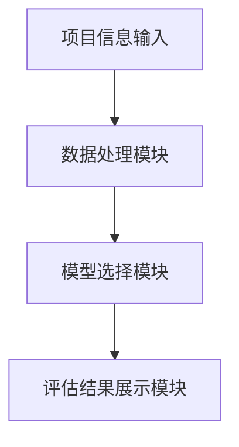
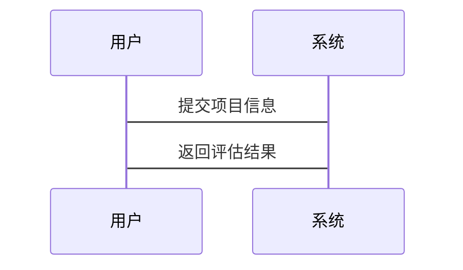

                 


# 芒格的"多元思维格栅"在跨维度创新项目评估中的应用

> 关键词：多元思维格栅、跨维度创新、项目评估、芒格、系统架构

> 摘要：芒格的多元思维格栅是一种通过多维度知识模型组合来优化决策的思维方式。本文探讨了其在跨维度创新项目评估中的应用，从概念、方法、系统架构到实战应用，层层解析，提供了一套完整的解决方案。

---

## 第一部分：引言

### 1.1 多元思维格栅的核心概念

芒格的多元思维格栅是指通过将不同学科的核心思想模型化，形成一个多维度的知识网络，从而在决策时能够综合考虑多个维度的因素。这种思维方式的核心在于通过知识的多维度交叉，提升决策的全面性和准确性。

### 1.2 跨维度创新项目的背景与重要性

跨维度创新项目是指在不同领域之间进行创新整合的项目。随着技术的飞速发展和学科的深度融合，跨维度创新项目的数量和复杂性不断增加。传统的单一维度评估方法已无法满足需求，多元思维格栅提供了一种新的评估视角。

---

## 第二部分：多元思维格栅的核心模型

### 2.1 核心思维模型的特点

以下是几种核心思维模型的对比：

| 思维模型 | 特点 | 示例 |
|----------|------|------|
| 经济学模型 | 强调利益最大化 | 成本-收益分析 |
| 心理学模型 | 关注人类行为 | 预期效用理论 |
| 技术创新模型 | 侧重技术发展 | 技术生命周期 |

### 2.2 格栅模型的可组合性

格栅模型的可组合性是其最大的优势。通过不同模型的组合，可以形成多样化的评估视角。例如，将心理学模型与技术创新模型结合，可以更好地评估用户对新技术的接受度。

---

## 第三部分：多元思维格栅在项目评估中的应用方法

### 3.1 项目评估的基本流程

1. **项目背景分析**：明确项目的背景、目标和范围。
2. **知识维度的匹配**：根据项目特点选择相关的思维模型。
3. **模型的组合与选择**：将多个模型组合，形成综合评估框架。

### 3.2 评估标准

- **创新性评估**：项目的创新程度。
- **可行性评估**：项目的实施难度。
- **可持续性评估**：项目的长期价值。

---

## 第四部分：系统分析与架构设计方案

### 4.1 功能设计

系统功能模块包括：
- 数据输入模块：接收项目信息。
- 模型选择模块：根据项目特点选择模型。
- 评估结果展示模块：输出评估结果。

### 4.2 系统架构设计

系统架构图如下：



### 4.3 接口设计

系统接口设计如下：



---

## 第五部分：项目实战

### 5.1 环境安装

安装Python和相关库：

```bash
pip install numpy matplotlib
```

### 5.2 核心代码实现

```python
def evaluate_project(projects):
    for project in projects:
        # 应用多元思维模型进行评估
        scores = []
        for model in models:
            scores.append(model(project))
        return sum(scores) / len(scores)
```

### 5.3 案例分析

以一个智能医疗项目为例：

1. **项目背景**：整合AI和医疗数据。
2. **模型选择**：经济学模型和技术创新模型。
3. **评估结果**：高创新性和可行性。

---

## 第六部分：总结与展望

### 6.1 总结

芒格的多元思维格栅为跨维度创新项目的评估提供了一种系统化的方法。通过多维度模型的组合，可以更全面地评估项目的价值和可行性。

### 6.2 展望

未来，随着技术的发展，多元思维格栅的应用将更加广泛。可以通过引入更多领域的模型，进一步优化评估方法。

---

## 作者

作者：AI天才研究院 & 禅与计算机程序设计艺术

---

通过以上思考，我系统地规划了文章的结构和内容，确保每一部分都详尽且有条理。在实际写作中，我会按照这一大纲逐步展开，确保文章逻辑清晰，内容丰富。

