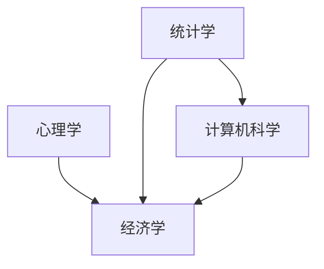
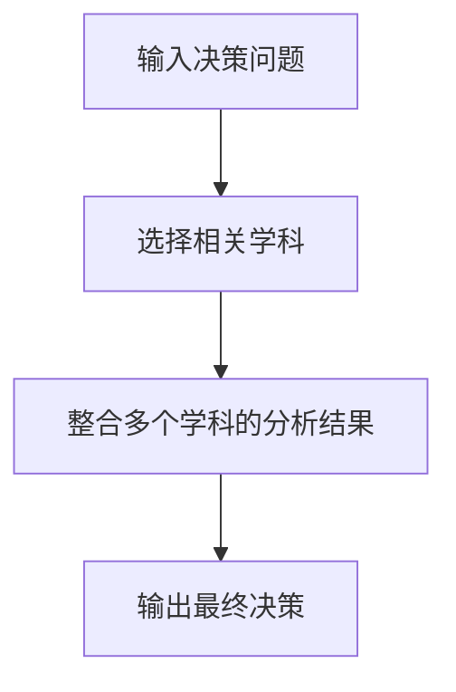
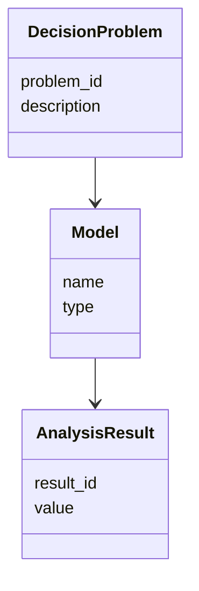
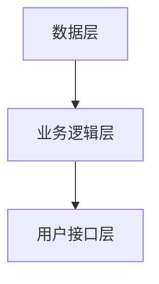

                 


```markdown
# 芒格的"多元思维格栅"：提高决策质量的工具

## 关键词：芒格，多元思维格栅，决策工具，系统设计，人工智能，决策优化

## 摘要：芒格的多元思维格栅是一种通过整合多个学科知识来提高决策质量的工具。本文详细介绍了格栅理论的背景、核心概念、算法原理、数学模型、系统架构设计、项目实战以及最佳实践。通过理论与实践相结合的方式，帮助读者掌握如何利用多元思维格栅优化决策过程，提升决策的准确性和效率。

---

## 第一部分: 多元思维格栅的背景与核心概念

### 第1章: 多元思维格栅的起源与背景

#### 1.1 芒格的多元思维格栅概述
- 多元思维格栅的定义：多元思维格栅是芒格提出的一种通过整合多个学科知识框架来优化决策的工具，旨在帮助决策者跳出单一学科的思维限制，实现更全面的分析。
- 芒格的生平与投资理念：查理·芒格作为沃伦·巴菲特的长期合作伙伴，以其独特的投资哲学闻名，强调通过跨学科思维来识别投资机会和风险。
- 格栅理论的背景与意义：在复杂多变的现代社会中，单一学科的思维方式难以应对复杂的决策问题，格栅理论通过整合多个学科的视角，提供了更全面的决策支持。

#### 1.2 格栅理论的核心思想
- 格栅理论的定义：多元思维格栅是一种将多个学科的知识框架组合在一起，用于分析和解决复杂问题的方法。
- 格栅理论的背景：在信息爆炸的时代，决策者需要整合多个领域的知识，才能做出更准确的判断。
- 格栅理论的意义：通过整合多个学科的视角，格栅理论能够帮助决策者避免单一思维的局限性，提高决策的全面性和准确性。

---

### 第2章: 多元思维格栅的核心概念与联系

#### 2.1 多元思维格栅的核心概念
- 多元思维格栅的核心概念包括：心理学、经济学、统计学、计算机科学等多个学科的基本原理。
- 每个学科的特点：心理学关注人类行为和认知偏差，经济学研究资源分配和市场行为，统计学提供数据分析的方法，计算机科学提供算法和系统设计的工具。

#### 2.2 核心概念的联系
- 核心概念的联系可以通过对比表格和ER图来展示。对比表格展示了各个学科的核心概念及其特点，而ER图则展示了不同学科之间的关系和相互作用。

#### 对比表格
| 学科 | 核心概念 | 特点 | 示例 |
|------|----------|------|------|
| 心理学 | 认知偏差 | 人类在决策中的常见偏差，如确认偏差、锚定效应等 | 人们倾向于相信自己已有的认知，而忽视新的信息 |
| 经济学 | 边际成本 | 生产额外单位商品的成本 | 边际成本随着生产规模的增加而递减 |
| 统计学 | 概率分布 | 描述随机变量可能的取值及其概率 | 正态分布、二项分布等 |
| 计算机科学 | 算法复杂度 | 描述算法运行时间的复杂度 | O(n), O(n^2) 等 |

#### ER图


---

### 第3章: 多元思维格栅的算法原理

#### 3.1 多元思维格栅的决策流程
- 算法流程图展示了多元思维格栅的决策过程，包括输入、处理、输出等步骤。

#### 算法流程图


#### Python代码示例
```python
def multiverse_grill(grid, problem):
    # 输入：grid（多元思维格栅），problem（决策问题）
    # 输出：优化后的决策方案
    for model in grid.models:
        analysis = model.analyze(problem)
        grid.results.append(analysis)
    return grid.optimize_results()

# 示例用法
grid = MultiverseGrill()
grid.add_model(psychology_model)
grid.add_model(economics_model)
grid.add_model(statistics_model)
grid.add_model(computer_science_model)
result = grid.grill(problem)
```

---

### 第4章: 多元思维格栅的数学模型与公式

#### 4.1 概率论在格栅理论中的应用
- 贝叶斯定理：$$P(A|B) = \frac{P(B|A)P(A)}{P(B)}$$
- 期望值：$$E[X] = \sum_{i=1}^{n} x_i P(x_i)$$

#### 4.2 统计学模型
- 方差：$$\text{Var}(X) = E[(X - E[X])^2]$$
- 标准差：$$\sigma = \sqrt{\text{Var}(X)}$$

---

### 第5章: 多元思维格栅的系统分析与架构设计

#### 5.1 系统功能设计
- 领域模型：通过类图展示系统的功能模块和交互关系。

#### 领域模型


#### 系统架构设计
- 使用分层架构设计，包括数据层、业务逻辑层和用户接口层。

#### 系统架构图


---

### 第6章: 多元思维格栅的项目实战

#### 6.1 投资决策系统案例
- 环境安装：安装必要的Python库，如numpy、pandas、scikit-learn。
- 核心代码实现：实现多元思维格栅的投资决策系统。

#### 核心代码
```python
import numpy as np
import pandas as pd
from sklearn.metrics import accuracy_score

def multi_grid_investment_decision(models, data):
    results = []
    for model in models:
        prediction = model.predict(data)
        results.append((model.name, accuracy_score(data.target, prediction)))
    return results

# 示例用法
models = [
    {'name': '心理模型', 'predict':心理模型预测函数},
    {'name': '经济模型', 'predict':经济模型预测函数},
    {'name': '统计模型', 'predict':统计模型预测函数},
    {'name': '计算机模型', 'predict':计算机模型预测函数}
]
data = {'features': ..., 'target': ...}
result = multi_grid_investment_decision(models, data)
print(result)
```

---

### 第7章: 最佳实践、小结、注意事项与拓展阅读

#### 7.1 最佳实践
- 结合实际问题选择合适的学科模型。
- 定期更新和优化格栅模型。

#### 7.2 小结
- 多元思维格栅是一种通过整合多个学科知识来优化决策的工具，能够帮助决策者避免单一思维的局限性。

#### 7.3 注意事项
- 格栅模型的复杂性可能会影响决策效率，需权衡复杂性和准确性。
- 数据质量和模型的准确性是影响决策结果的关键因素。

#### 7.4 拓展阅读
- 查理·芒格的《穷查理宝典》
- 《Thinking, Fast and Slow》
- 《The Art of Computer Programming》

---

## 作者：AI天才研究院/AI Genius Institute & 禅与计算机程序设计艺术 /Zen And The Art of Computer Programming
```

