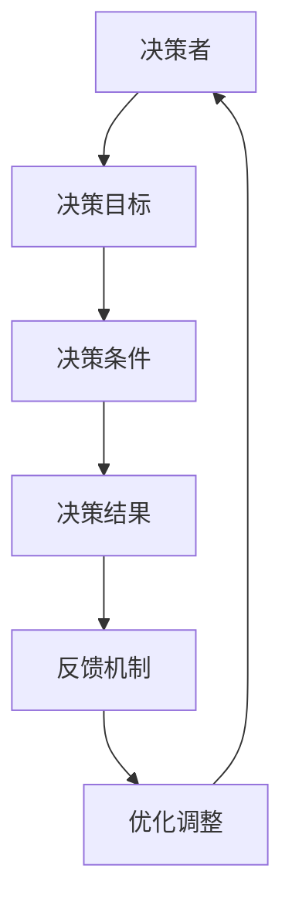
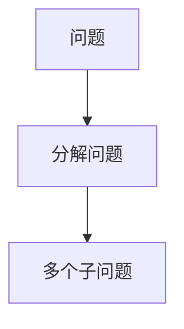
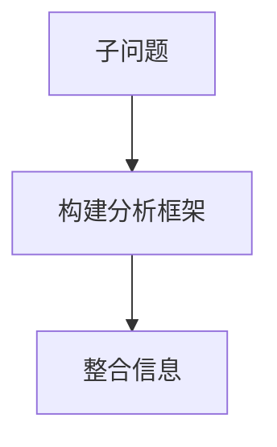
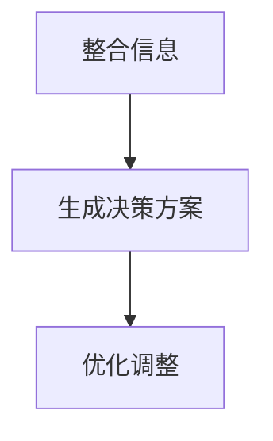
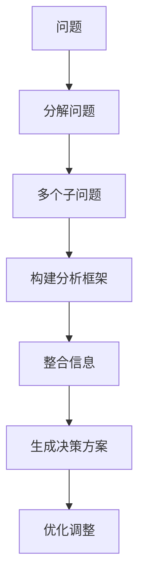

                 


#芒格的"多元思维格栅"：提高决策质量的系统方法

> 关键词：芒格，多元思维，决策系统，思维模型，决策优化

> 摘要：本文深入探讨了芒格的多元思维格栅模型，分析了其核心概念、算法原理、系统架构及实际应用。通过详细阐述芒格的生平与思想体系，多元思维模型的核心概念与联系，算法原理与数学模型，系统分析与架构设计，项目实战及最佳实践，帮助读者全面理解和掌握芒格的多元思维格栅方法。

---

# 第1章: 芒格的生平与思想体系

## 1.1 芒格的生平简介

### 1.1.1 芒格的基本经历

查理·芒格（Charlie Munger）是美国著名投资者、伯克希尔·哈撒韦公司（Berkshire Hathaway）的副主席，被誉为“投资界的哲学家”。他出生于1924年，早年在哈佛大学学习法律，后来转向投资领域。芒格的职业生涯从律师开始，但他在投资领域的成就使他闻名世界。

芒格的思维方式深受其法律背景影响，注重逻辑推理和系统性分析。他在投资实践中发现，仅仅依靠单一的思维方式是远远不够的，因此他提出了多元思维模型的概念，将多个学科的知识整合起来，以提高决策的准确性和全面性。

### 1.1.2 芒格的投资哲学与思维方式

芒格的投资哲学的核心是“逆向思维”（thinking inversely），即从问题的反面思考，避免从众和盲目跟风。他认为，投资者应该避免情绪化决策，而是应该基于事实和逻辑进行分析。芒格的思维方式强调跨学科的知识整合，他认为，决策者需要从多个角度审视问题，才能做出最优决策。

### 1.1.3 芒格对决策科学的贡献

芒格的多元思维模型不仅在投资领域取得了巨大成功，还在企业管理、个人决策等领域得到了广泛应用。他的思想对决策科学的发展产生了深远影响，为现代决策理论提供了新的视角和方法。

## 1.2 多元思维模型的起源与核心理念

### 1.2.1 多元思维模型的定义

多元思维模型（Multi-Model Thinking）是芒格提出的一种决策方法，强调通过整合多个学科的知识和思维方式，形成一个全面的决策框架。这种方法的核心在于，通过多个视角的交叉验证，避免单一思维的局限性，从而提高决策的准确性和可靠性。

### 1.2.2 多元思维模型的核心思想

多元思维模型的核心思想是“知识的整合与交叉验证”。芒格认为，决策者应该从多个学科的角度出发，包括心理学、经济学、社会学、物理学等，综合分析问题，从而避免单一视角的偏差。这种方法可以帮助决策者更全面地理解问题，制定出更优的决策方案。

### 1.2.3 多元思维模型与传统决策方法的区别

与传统决策方法相比，多元思维模型有以下几个显著特点：

1. **综合性**：多元思维模型强调多个学科知识的整合，而传统决策方法通常只关注单一领域的知识。
2. **交叉验证**：多元思维模型通过多个视角的交叉验证来提高决策的准确性，而传统决策方法通常只依赖单一的分析方法。
3. **动态性**：多元思维模型可以根据实际情况动态调整分析框架，而传统决策方法往往过于 rigid。

## 1.3 多元思维模型的现实意义

### 1.3.1 提高决策质量的重要性

在当今复杂多变的环境中，单一的思维方式已经无法应对各种挑战。多元思维模型通过整合多个学科的知识，可以帮助决策者更全面地理解问题，制定出更优的决策方案。

### 1.3.2 多元思维模型在实际中的应用领域

多元思维模型广泛应用于投资、企业管理、个人决策等领域。例如，在投资决策中，芒格通过整合心理学、经济学、社会学等多个学科的知识，帮助投资者做出更明智的投资决策。

### 1.3.3 多元思维模型对企业与个人决策的双重影响

对企业而言，多元思维模型可以帮助企业领导者更好地理解市场、竞争对手和内部管理，从而制定出更优的经营策略。对个人而言，多元思维模型可以帮助个人更全面地理解问题，做出更明智的个人决策。

---

# 第2章: 多元思维模型的核心概念与联系

## 2.1 多元思维模型的原理与特点

### 2.1.1 多元思维模型的构成要素

多元思维模型的构成要素包括以下几个方面：

1. **知识框架**：包括各个学科的基本原理和方法论。
2. **思维方式**：包括逻辑推理、逆向思维、批判性思维等。
3. **决策规则**：包括如何整合多个视角的信息，制定决策方案。

### 2.1.2 多元思维模型的系统性与关联性

多元思维模型是一个高度系统化的决策框架，各个学科的知识和思维方式之间相互关联、相互作用。通过系统的整合，决策者可以更全面地理解问题，制定出更优的决策方案。

### 2.1.3 多元思维模型的可扩展性与灵活性

多元思维模型具有很强的可扩展性，可以根据具体问题的需求，灵活地调整分析框架，增加或减少不同的视角和方法。这种灵活性使得多元思维模型能够适应各种不同的决策场景。

## 2.2 多元思维模型与其他决策方法的对比

### 2.2.1 理性决策模型与多元思维模型的对比

理性决策模型强调基于逻辑和事实的分析，但往往忽视了人类情感和认知偏差的影响。多元思维模型则通过整合心理学的知识，帮助决策者更好地理解和克服认知偏差，从而提高决策的理性水平。

### 2.2.2 哥德决策模型与多元思维模型的对比

哥德决策模型强调从多个角度审视问题，但通常局限于特定的领域知识。多元思维模型则通过整合多个学科的知识，提供了更广泛和深入的视角。

### 2.2.3 其他决策框架的优缺点分析

其他决策框架，如SWOT分析法、PEST分析法等，都有其特定的应用场景和优势。但与多元思维模型相比，这些方法往往过于单一，缺乏系统性和综合性。

## 2.3 多元思维模型的ER实体关系图



---

# 第3章: 多元思维模型的算法原理

## 3.1 多元思维模型的算法流程

### 3.1.1 问题分析与分解

多元思维模型的算法流程首先是从问题分析和分解开始。决策者需要将问题分解成多个子问题，每个子问题对应一个特定的学科视角。



### 3.1.2 多元视角的构建与整合

接下来，决策者需要从多个学科视角构建分析框架，并将这些视角的信息整合起来。



### 3.1.3 决策方案的生成与优化

最后，决策者根据整合后的信息生成决策方案，并通过优化调整提高决策的质量。



## 3.2 多元思维模型的数学模型

### 3.2.1 基于概率的决策模型

多元思维模型可以结合概率论的方法，对不同的决策方案进行评估和选择。例如，可以通过贝叶斯定理计算不同方案的概率，从而选择最优方案。

$$ P(A|B) = \frac{P(B|A)P(A)}{P(B)} $$

### 3.2.2 基于权重的决策模型

在多元思维模型中，决策者可以根据不同视角的重要性赋予不同的权重，从而对决策方案进行加权计算。

$$ W = \sum_{i=1}^{n} w_i x_i $$

### 3.2.3 基于层次分析法的决策模型

层次分析法（AHP）是一种常用的决策方法，可以结合多元思维模型进行决策分析。

$$ A_{ij} = \frac{\sum_{k=1}^{n} a_{ik} w_k}{\sum_{k=1}^{n} w_k} $$

## 3.3 多元思维模型的算法实现

### 3.3.1 算法实现的步骤与流程

1. **问题分析与分解**：将问题分解成多个子问题。
2. **构建分析框架**：从多个学科视角构建分析框架。
3. **整合信息**：将不同视角的信息进行整合。
4. **生成决策方案**：根据整合后的信息生成决策方案。
5. **优化调整**：对决策方案进行优化调整，提高决策质量。

### 3.3.2 算法实现的代码示例

以下是一个简单的多元思维模型算法实现的代码示例：

```python
def mult思维模型算法(问题):
    分解问题 = 分解问题(问题)
    构建分析框架 = 构建分析框架(分解问题)
    整合信息 = 整合信息(构建分析框架)
    生成决策方案 = 生成决策方案(整合信息)
    优化调整 = 优化调整(生成决策方案)
    返回 优化调整
```

---

# 第4章: 多元思维模型的系统分析与架构设计

## 4.1 系统功能设计

### 4.1.1 问题场景介绍

在实际应用中，多元思维模型可以用于企业战略决策、投资决策、个人决策等领域。例如，在企业战略决策中，决策者需要从市场、竞争、技术、财务等多个角度进行分析。

### 4.1.2 领域模型设计

以下是多元思维模型的领域模型设计：



### 4.1.3 系统架构设计

以下是多元思维模型的系统架构设计：


---

# 第5章: 多元思维模型的项目实战

## 5.1 环境安装

在实际应用中，多元思维模型可以通过多种工具和方法进行实现。例如，可以使用Excel、PowerPoint等工具进行分析和展示，也可以使用专业的决策分析软件。

## 5.2 系统核心实现源代码

以下是一个简单的多元思维模型实现的代码示例：

```python
def mult思维模型算法(问题):
    分解问题 = 分解问题(问题)
    构建分析框架 = 构建分析框架(分解问题)
    整合信息 = 整合信息(构建分析框架)
    生成决策方案 = 生成决策方案(整合信息)
    优化调整 = 优化调整(生成决策方案)
    返回 优化调整
```

## 5.3 代码应用解读与分析

通过上述代码，我们可以看到，多元思维模型的实现过程包括问题分析、分解问题、构建分析框架、整合信息、生成决策方案和优化调整等多个步骤。每个步骤都需要结合具体的决策问题进行调整和优化。

## 5.4 实际案例分析和详细讲解剖析

以企业战略决策为例，假设某公司面临市场进入的决策问题。通过多元思维模型，我们可以从市场、竞争、技术、财务等多个角度进行分析，最终制定出最优的市场进入策略。

---

# 第6章: 最佳实践 tips、小结、注意事项、拓展阅读

## 6.1 最佳实践 tips

1. **持续学习**：多元思维模型需要不断学习和积累多个学科的知识。
2. **动态调整**：根据实际情况动态调整分析框架和决策方案。
3. **团队合作**：在实际应用中，团队合作可以提高决策的质量和效率。

## 6.2 小结

芒格的多元思维格栅是一种通过整合多个学科的知识和思维方式，提高决策质量的系统方法。通过本文的详细阐述，我们可以看到，多元思维模型不仅在投资领域取得了巨大成功，还在企业管理、个人决策等领域得到了广泛应用。

## 6.3 注意事项

1. **避免过度复杂化**：多元思维模型虽然强调多个视角的分析，但不应过于复杂化，以免影响决策的效率。
2. **注重实际应用**：多元思维模型需要结合具体的决策问题进行实际应用，不能生搬硬套。
3. **保持灵活性**：在实际应用中，应根据具体情况动态调整分析框架和决策方案。

## 6.4 拓展阅读

1. 《穷查理宝典》（Poor Charlie's Almanack）：芒格的思想体系和决策方法的集大成之作。
2. 《思考，快与慢》（Thinking, Fast and Slow）：丹尼尔·卡尼曼（Daniel Kahneman）的经典著作，深入探讨了人类思维的快与慢及其对决策的影响。

---

# 作者：AI天才研究院/AI Genius Institute & 禅与计算机程序设计艺术/Zen And The Art of Computer Programming

