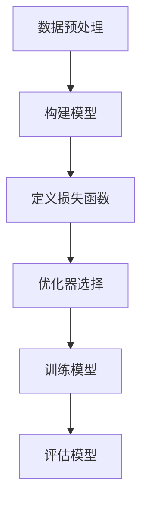
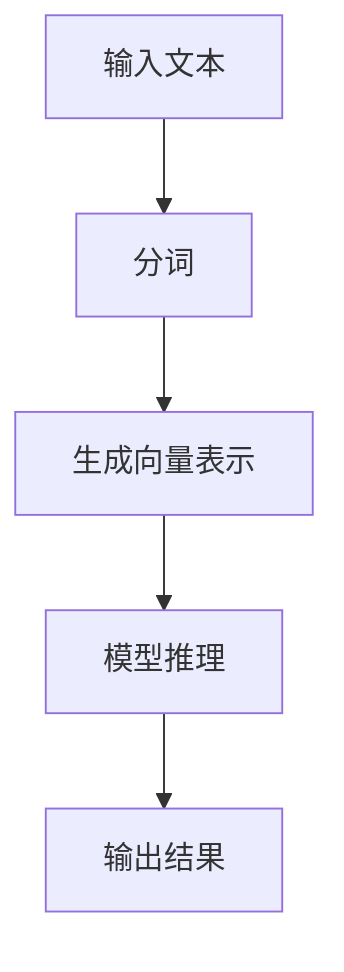
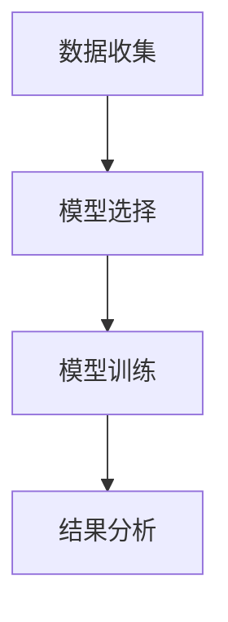
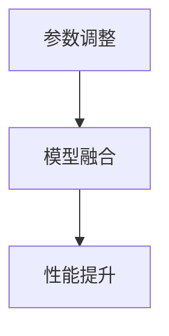
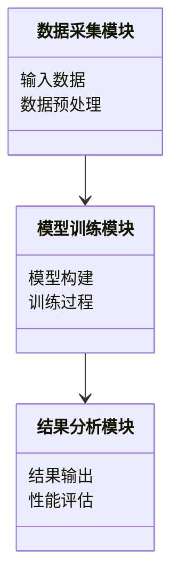
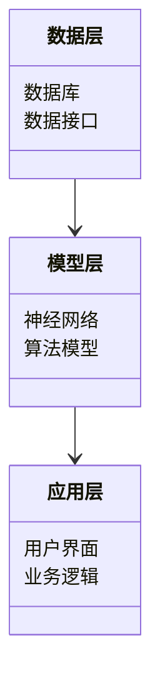
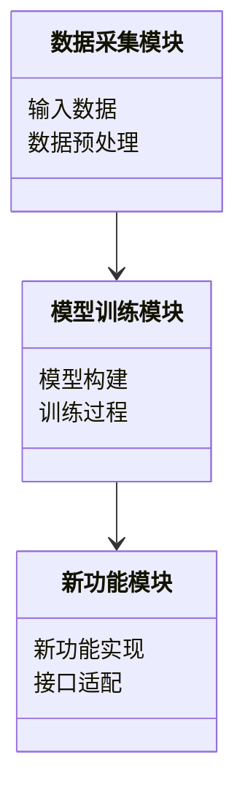

                 


# 芒格的"多元思维模型"在人工智能时代的升级

> 关键词：多元思维模型、人工智能、芒格、知识交叉、系统架构

> 摘要：芒格的多元思维模型强调通过多个学科的思维模型来帮助决策，避免单点思维的局限性。随着人工智能技术的飞速发展，多元思维模型在理论和实践中的应用也面临着新的挑战和机遇。本文将深入探讨多元思维模型在人工智能时代的升级，包括其核心概念、算法原理、系统架构设计、项目实战以及最佳实践。通过结合具体案例，我们分析了多元思维模型如何在AI时代实现创新升级，为未来的决策提供更加强大和灵活的支持。

---

## 第1章: 多元思维模型的起源与核心概念

### 1.1 多元思维模型的定义与背景

#### 1.1.1 多元思维模型的起源

芒格的多元思维模型起源于他对知识的广度和深度的追求。他认为，单一学科的思维模型往往具有局限性，而通过跨学科的思维模型可以更好地理解问题的本质。这种思想在现代人工智能的发展中得到了进一步的强化。

#### 1.1.2 多元思维模型的核心概念

多元思维模型的核心在于通过多个学科的交叉应用，构建一个完整的知识框架。这种模型不仅关注单一领域的解决方案，还强调从多个角度同时分析问题，从而避免单一思维的局限性。

#### 1.1.3 多元思维模型在决策中的作用

在决策过程中，多元思维模型可以帮助我们更好地理解问题的复杂性，预测可能的风险，并制定更加全面的解决方案。这种思维方式在AI时代尤为重要，因为复杂的问题往往需要多学科的协同解决。

### 1.2 多元思维模型的核心要素

#### 1.2.1 知识的广度与深度

多元思维模型强调知识的广度与深度的结合。广度意味着要广泛涉猎多个领域的知识，深度则要求在每个领域内有深入的理解。这种结合使得我们在面对复杂问题时能够有更多的视角去分析和解决。

#### 1.2.2 不同学科的交叉应用

多元思维模型的一个重要特点就是不同学科的交叉应用。例如，将经济学的边际成本概念与计算机科学的人工智能算法相结合，可以为商业决策提供更有力的支持。

#### 1.2.3 多元思维模型的结构化框架

芒格的多元思维模型是一个结构化的框架，它将多个学科的思维模型有机地结合在一起。这种结构化框架使得我们在面对复杂问题时能够有条不紊地进行分析和解决。

### 1.3 多元思维模型在AI时代的演变

#### 1.3.1 传统多元思维模型的特点

传统多元思维模型注重知识的广度和深度，但缺乏对技术的深度应用。随着人工智能技术的发展，传统的多元思维模型需要进行升级，以适应新的技术环境。

#### 1.3.2 AI时代对多元思维模型的挑战

AI时代的到来，带来了数据量的爆炸式增长和算法的复杂化。传统的多元思维模型在面对这些挑战时显得力不从心，需要进行创新性的升级。

#### 1.3.3 多元思维模型的升级方向

多元思维模型在AI时代的升级方向主要体现在以下几个方面：知识的结构化、算法的智能化、系统的模块化。这些升级使得多元思维模型能够更好地适应现代技术的发展需求。

---

## 第2章: 多元思维模型的核心概念与联系

### 2.1 多元思维模型的原理

#### 2.1.1 多元思维模型的数学基础

多元思维模型的数学基础主要包括概率论、线性代数和优化算法。这些数学工具为多元思维模型的构建和应用提供了理论支持。

#### 2.1.2 多元思维模型的逻辑结构

多元思维模型的逻辑结构是一个多层次的网络，每个节点代表一个思维模型，节点之间的关系则反映了不同模型之间的联系。

#### 2.1.3 多元思维模型的属性特征对比表

| 思维模型 | 输入 | 输出 | 关键属性 |
|----------|------|------|----------|
| 概率论   | 数据 | 概率 | 条件概率、贝叶斯定理 |
| 决策树   | 数据 | 决策 | 熵、信息增益 |
| 博弈论   | 策略 | 结果 | 纯策略、纳什均衡 |

### 2.2 多元思维模型的ER实体关系图

```mermaid
er
  entity(知识领域) {
    唯一标识符
    知识点
  }
  entity(思维模型) {
    唯一标识符
    名称
    描述
  }
  entity(问题) {
    唯一标识符
    描述
    解决方案
  }
  knowledge_area -|{多对多}->思维_model
  problem -|{多对多}->思维_model
```

---

## 第3章: 多元思维模型的算法原理

### 3.1 大语言模型的训练与推理

#### 3.1.1 大语言模型的训练过程

大语言模型的训练过程主要包括数据预处理、模型构建、损失函数优化等步骤。以下是具体的训练流程图：



#### 3.1.2 大语言模型的推理机制

大语言模型的推理机制基于概率论和上下文理解，以下是具体的推理流程：



#### 3.1.3 大语言模型的数学模型

大语言模型的数学模型主要基于Transformer架构，其核心公式包括：

$$ \text{Attention}(Q, K, V) = \text{softmax}(\frac{QK^T}{\sqrt{d_k}})V $$

其中，$Q$、$K$、$V$分别是查询、键和值向量，$d_k$是向量的维度。

### 3.2 多元思维模型的算法实现

#### 3.2.1 多元思维模型的算法流程

多元思维模型的算法流程主要包括数据收集、模型选择、模型训练、结果分析等步骤：



#### 3.2.2 多元思维模型的算法优化

多元思维模型的算法优化主要包括参数调整、模型融合、性能提升等步骤：



#### 3.2.3 多元思维模型的算法实现代码

以下是多元思维模型的一个简单实现代码示例：

```python
def多元思维模型算法():
    # 数据预处理
    data = preprocess_data()
    # 模型构建
    model = build_model()
    # 训练过程
    train_model(model, data)
    # 推理过程
    result = infer_model(model, data)
    return result
```

---

## 第4章: 多元思维模型的系统架构设计

### 4.1 系统功能设计

#### 4.1.1 系统功能模块划分

多元思维模型的系统功能模块主要包括数据采集、模型训练、结果分析等模块：



#### 4.1.2 系统功能模块的交互流程

数据采集模块首先将数据预处理后传递给模型训练模块，模型训练模块完成训练后将结果传递给结果分析模块，最后由结果分析模块输出最终结果。

#### 4.1.3 系统功能模块的实现方案

每个功能模块的具体实现方案需要根据实际需求进行定制，例如数据采集模块可以使用爬虫技术，模型训练模块可以使用深度学习框架等。

### 4.2 系统架构设计

#### 4.2.1 系统架构的分层设计

多元思维模型的系统架构通常采用分层设计，包括数据层、模型层和应用层：



#### 4.2.2 系统架构的模块化设计

系统架构的模块化设计使得各个模块之间相对独立，便于维护和升级：


#### 4.2.3 系统架构的可扩展性设计

系统架构的可扩展性设计使得在未来需要添加新的功能时，能够方便地进行扩展和升级：



### 4.3 系统接口设计

#### 4.3.1 系统接口的设计

系统接口设计需要考虑模块之间的交互方式，例如RESTful API：

```mermaid
sequenceDiagram
    用户请求 --> 数据采集模块
    数据采集模块 --> 模型训练模块
    模型训练模块 --> 结果分析模块
    结果分析模块 --> 用户返回结果
```

#### 4.3.2 系统接口的实现

系统接口的实现需要根据具体的接口规范进行，例如使用JSON格式传递数据：

```json
{
    "输入数据": "输入文本",
    "模型选择": "预训练模型",
    "训练参数": {
        "学习率": 0.001,
        "训练轮数": 10
    }
}
```

---

## 第5章: 多元思维模型的项目实战

### 5.1 项目环境安装与配置

#### 5.1.1 开发环境的搭建

开发环境的搭建通常包括安装Python、Jupyter Notebook、TensorFlow等工具：

```bash
pip install python
pip install jupyter-notebook
pip install tensorflow
```

#### 5.1.2 项目依赖的安装

项目依赖的安装需要根据具体的项目需求进行，例如安装自然语言处理库：

```bash
pip install nltk
pip install spacy
```

#### 5.1.3 项目配置文件的编写

项目配置文件通常包括运行参数、数据路径等配置信息：

```yaml
配置参数:
    模型路径: ./model
    数据路径: ./data
    训练轮数: 10
```

### 5.2 系统核心实现

#### 5.2.1 系统核心模块的实现

系统核心模块的实现需要根据具体的项目需求进行，例如实现一个自然语言处理模型：

```python
def核心模块实现():
    # 数据预处理
    data = preprocess_data()
    # 模型构建
    model = build_model()
    # 训练过程
    train_model(model, data)
    # 推理过程
    result = infer_model(model, data)
    return result
```

#### 5.2.2 系统核心模块的测试

系统核心模块的测试需要设计合适的测试用例，并验证模型的输出是否符合预期：

```python
def测试用例():
    input_data = "输入文本"
    expected_output = "预期输出"
    actual_output = 核心模块实现()
    assert actual_output == expected_output
```

#### 5.2.3 系统核心模块的优化

系统核心模块的优化可以通过调整模型参数、优化算法等方法进行：

```python
def优化算法():
    # 参数调整
    调整学习率
    # 算法优化
    使用Adam优化器
```

### 5.3 项目案例分析

#### 5.3.1 案例背景介绍

以一个智能投资顾问系统为例，我们需要构建一个能够根据市场数据和用户需求提供投资建议的系统。

#### 5.3.2 案例分析与解决

通过对市场数据的分析和用户需求的建模，我们可以利用多元思维模型提供更加精准的投资建议。

#### 5.3.3 案例总结与反思

案例分析表明，多元思维模型在实际应用中能够显著提高决策的准确性和效率，但也需要在具体实现中注意数据的质量和模型的可解释性。

---

## 第6章: 多元思维模型的最佳实践与注意事项

### 6.1 多元思维模型的最佳实践

#### 6.1.1 知识的广度与深度的平衡

在实际应用中，我们需要在知识的广度和深度之间找到平衡点，以充分发挥多元思维模型的优势。

#### 6.1.2 不同学科的交叉应用技巧

不同学科的交叉应用需要我们在实际项目中注重知识的整合和模型的融合。

#### 6.1.3 系统架构的模块化设计

系统架构的模块化设计能够提高系统的可维护性和可扩展性，是多元思维模型在AI时代升级的重要方向。

### 6.2 小结

多元思维模型在AI时代的发展离不开技术的进步和理论的创新。通过结合现代人工智能技术，多元思维模型能够为复杂的决策问题提供更加全面和高效的解决方案。

### 6.3 注意事项

在实际应用中，我们需要注意数据的质量、模型的可解释性以及系统的安全性等问题，以确保多元思维模型的稳定性和可靠性。

### 6.4 拓展阅读

建议读者进一步阅读相关领域的最新研究成果，例如《深度学习》、《算法导论》等书籍，以更好地理解多元思维模型在AI时代的应用和发展。

---

## 作者：AI天才研究院/AI Genius Institute & 禅与计算机程序设计艺术 /Zen And The Art of Computer Programming

