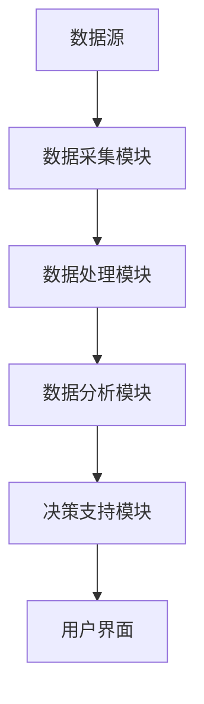

                 


# 芒格的"多元思维模型"在复杂投资环境中的应用

> **关键词**: 多元思维模型, 投资决策, 芒格, 系统思维, 复杂环境, 贝叶斯定理, 投资策略

> **摘要**: 本文深入探讨了芒格的多元思维模型在复杂投资环境中的应用。通过分析多元思维模型的核心概念、数学基础、系统架构以及在投资分析中的实际应用，本文展示了如何通过跨学科的视角和系统性方法来优化投资决策。文章结合具体案例，详细讲解了多元思维模型在复杂环境下的优势，同时通过Python代码实现和数学模型推导，进一步验证了该模型的科学性和实用性。

---

# 第1章: 多元思维模型的核心概念

## 1.1 多元思维模型的定义与背景

芒格的多元思维模型是一种以跨学科视角为基础的决策方法，它强调通过多个不同领域的模型和框架来理解问题，从而做出更全面、更准确的决策。这种思维方式的核心在于将复杂的问题分解为多个简单的问题，并通过多个视角进行分析。

### 1.1.1 多元思维模型的起源与发展

多元思维模型的起源可以追溯到芒格对投资的深刻理解。芒格认为，投资决策不仅仅依赖于单一的学科或方法，而是需要结合多个领域的知识。他通过将物理学、心理学、经济学等多个领域的原理结合起来，形成了一种独特的思维方式。

### 1.1.2 多元思维模型的核心要素

- **跨学科视角**: 多元思维模型的核心在于将不同学科的原理结合起来，形成一个综合的决策框架。
- **系统性分析**: 通过系统的分析方法，将问题分解为多个组成部分，并分别进行分析。
- **动态调整**: 在复杂的投资环境中，多元思维模型需要不断调整和优化，以适应环境的变化。

### 1.1.3 多元思维模型在投资中的重要性

在复杂的投资环境中，单一的思维方式往往无法应对各种不确定性。多元思维模型通过结合多个视角，能够帮助投资者更全面地分析问题，减少决策的偏差。

---

## 1.2 芒格的思维框架

### 1.2.1 芒格的决策思维

芒格的决策思维强调逆向思维，即从问题的反面出发，寻找解决问题的方法。这种思维方式可以帮助投资者避免陷入思维定式，从而发现更多的机会。

### 1.2.2 芒格的逆向思维

逆向思维的核心在于从反方向出发，寻找问题的解决方案。例如，在投资中，芒格会先考虑一个公司可能面临的风险，然后再分析其潜在的投资机会。

### 1.2.3 芒格的第一性原理

第一性原理是一种从基础原理出发的思维方式。芒格认为，投资决策需要从最基础的原理出发，而不是简单地模仿他人的决策。

---

## 1.3 多元思维模型的数学基础

### 1.3.1 概率论与决策树

概率论是多元思维模型的重要数学基础之一。通过概率论，投资者可以对未来的不确定性进行量化分析。例如，可以通过决策树来分析不同投资方案的可能结果及其概率。

### 1.3.2 贝叶斯定理与条件概率

贝叶斯定理是一种用于更新概率的数学方法。在多元思维模型中，贝叶斯定理可以帮助投资者根据新的信息调整对某项投资的判断。

### 1.3.3 资产定价模型与多元思维

资产定价模型（如CAPM）是多元思维模型中的一个重要工具。通过将资产定价模型与多元思维模型结合起来，投资者可以更全面地分析投资的价值。

---

## 1.4 多元思维模型的局限性

### 1.4.1 模型的简化假设

多元思维模型是一种简化的方法，它需要对问题进行一定的简化和假设。这种简化可能导致模型无法完全反映现实情况。

### 1.4.2 数据的局限性

多元思维模型的准确性依赖于数据的完整性。在实际投资中，数据的不完整性和不确定性可能会影响模型的准确性。

### 1.4.3 人性的复杂性

人性的复杂性是多元思维模型的另一个局限性。投资者的决策往往受到心理因素的影响，而这些因素难以通过模型完全量化。

---

## 1.5 本章小结

本章介绍了芒格的多元思维模型的核心概念，包括其定义、背景、核心要素以及在投资中的重要性。同时，本章还探讨了多元思维模型的数学基础及其局限性。

---

# 第2章: 多元思维模型在复杂投资环境中的应用

## 2.1 复杂投资环境的特征

### 2.1.1 投资环境的不确定性

复杂投资环境的不确定性是多元思维模型应用的重要背景。在不确定性下，投资者需要通过多种视角来分析问题。

### 2.1.2 投资环境的动态性

投资环境的动态性要求投资者能够快速调整决策。多元思维模型的动态调整能力使其在复杂环境中更具优势。

### 2.1.3 投资环境的系统性风险

系统性风险是复杂投资环境中不可忽视的因素。多元思维模型通过系统性分析，可以帮助投资者更好地识别和应对系统性风险。

---

## 2.2 多元思维模型在投资决策中的应用

### 2.2.1 多元思维模型的系统性分析

通过系统性分析，投资者可以将问题分解为多个部分，并分别进行分析。例如，可以通过分析公司的财务状况、市场环境和管理团队等多个方面来评估其投资价值。

### 2.2.2 多元思维模型的动态调整

在复杂的投资环境中，多元思维模型需要不断调整。例如，当市场环境发生变化时，投资者需要重新评估其投资决策。

### 2.2.3 多元思维模型的组合投资策略

组合投资是一种通过多样化投资来降低风险的策略。多元思维模型可以帮助投资者更好地构建投资组合。

---

## 2.3 多元思维模型与风险管理

### 2.3.1 风险识别与评估

通过多元思维模型，投资者可以更全面地识别和评估风险。例如，可以通过分析市场风险、信用风险和操作风险等多个方面来评估投资风险。

### 2.3.2 风险控制与对冲

多元思维模型可以帮助投资者制定有效的风险控制策略。例如，可以通过对冲交易来降低投资组合的风险。

### 2.3.3 风险管理的动态调整

风险管理需要根据市场环境的变化进行动态调整。多元思维模型的动态调整能力使其在风险管理中具有重要作用。

---

## 2.4 本章小结

本章探讨了多元思维模型在复杂投资环境中的具体应用，包括系统性分析、动态调整和风险管理等方面。通过这些应用，多元思维模型可以帮助投资者在复杂环境中做出更明智的决策。

---

# 第3章: 多元思维模型的数学模型与算法

## 3.1 多元思维模型的数学基础

### 3.1.1 概率论与统计学

概率论和统计学是多元思维模型的重要数学工具。通过概率论，投资者可以对未来的不确定性进行量化分析。例如，可以通过贝叶斯定理来更新对某项投资的概率判断。

### 3.1.2 资产定价模型

资产定价模型（如CAPM）是多元思维模型中的一个重要工具。通过将资产定价模型与多元思维模型结合起来，投资者可以更全面地分析投资的价值。

### 3.1.3 风险评估模型

风险评估模型是多元思维模型中的另一个重要工具。例如，可以通过VaR（在险价值）模型来评估投资组合的风险。

---

## 3.2 多元思维模型的算法实现

### 3.2.1 贝叶斯网络的构建

贝叶斯网络是一种基于概率论的图形化模型。通过贝叶斯网络，投资者可以更直观地分析问题。

### 3.2.2 决策树的构建与分析

决策树是一种用于分析决策问题的树状图。通过决策树，投资者可以系统地分析不同决策方案的可能结果及其概率。

### 3.2.3 风险评估的数学模型

风险评估的数学模型可以通过概率论和统计学来实现。例如，可以通过蒙特卡罗模拟来评估投资组合的风险。

---

## 3.3 多元思维模型的代码实现

### 3.3.1 概率计算的Python代码

```python
import numpy as np
import matplotlib.pyplot as plt

# 生成随机数
np.random.seed(42)
random_numbers = np.random.normal(0, 1, 1000)

# 绘制概率分布图
plt.hist(random_numbers, bins=30, density=True, alpha=0.6, color='b')
plt.xlabel('Value')
plt.ylabel('Probability Density')
plt.title('Normal Distribution')
plt.show()
```

### 3.3.2 决策树的Python代码

```python
from sklearn.tree import DecisionTreeClassifier
from sklearn.datasets import make_classification
from sklearn.model_selection import train_test_split

# 生成数据
X, y = make_classification(n_samples=100, n_features=2, n_classes=2, random_state=42)

# 划分训练集和测试集
X_train, X_test, y_train, y_test = train_test_split(X, y, test_size=0.3, random_state=42)

# 训练决策树模型
model = DecisionTreeClassifier()
model.fit(X_train, y_train)

# 预测测试集
y_pred = model.predict(X_test)

# 输出准确率
print("Accuracy:", model.score(X_test, y_test))
```

---

## 3.4 本章小结

本章通过数学模型和算法实现，详细讲解了多元思维模型的科学性和实用性。通过概率论、贝叶斯定理和决策树等工具，投资者可以更系统地分析问题。

---

# 第4章: 多元思维模型的系统架构与设计

## 4.1 系统架构的总体设计

### 4.1.1 系统功能模块划分

多元思维模型的系统架构可以划分为数据采集模块、数据分析模块和决策支持模块。

### 4.1.2 系统数据流设计

数据从数据源输入系统，经过数据处理模块后，进入数据分析模块，最终生成决策支持。

### 4.1.3 系统架构图



---

## 4.2 系统功能模块设计

### 4.2.1 数据采集模块

数据采集模块负责从各种数据源（如股票市场数据、经济指标等）中采集数据。

### 4.2.2 数据处理模块

数据处理模块对采集到的数据进行清洗和预处理，确保数据的准确性和完整性。

### 4.2.3 数据分析模块

数据分析模块通过多元思维模型对数据进行分析，生成决策支持。

---

## 4.3 系统接口设计

### 4.3.1 数据接口设计

数据接口负责与外部数据源的连接和数据交换。

### 4.3.2 用户接口设计

用户界面是投资者与系统交互的界面，提供数据可视化和决策支持。

### 4.3.3 系统间接口设计

系统间接口负责不同模块之间的数据交换和通信。

---

## 4.4 系统交互设计

### 4.4.1 用户交互流程

用户通过用户界面输入数据，系统进行处理和分析，最后将结果反馈给用户。

### 4.4.2 系统响应流程

系统根据用户输入进行数据处理和分析，生成响应结果。

### 4.4.3 错误处理流程

系统在处理过程中可能会遇到错误，需要进行错误检测和处理。

---

## 4.5 本章小结

本章通过系统架构与设计，详细讲解了多元思维模型在复杂投资环境中的实现方法。通过系统的各个模块和接口设计，投资者可以更高效地进行投资决策。

---

# 第5章: 多元思维模型的项目实战

## 5.1 项目背景与目标

### 5.1.1 项目背景

本项目旨在通过多元思维模型帮助投资者在复杂的投资环境中做出更明智的决策。

### 5.1.2 项目目标

项目的最终目标是通过多元思维模型实现对某公司股票的投资分析。

---

## 5.2 项目实施过程

### 5.2.1 数据采集

通过股票市场数据源采集目标公司的历史数据。

### 5.2.2 数据分析

通过多元思维模型对目标公司的财务状况、市场环境和管理团队等多个方面进行分析。

### 5.2.3 决策支持

根据分析结果，生成投资建议。

---

## 5.3 项目实现代码

### 5.3.1 数据分析代码

```python
import pandas as pd
import numpy as np

# 读取数据
data = pd.read_csv('stock_data.csv')

# 计算平均收益率
average_return = np.mean(data['return'])
print("Average Return:", average_return)
```

### 5.3.2 决策支持代码

```python
from sklearn.ensemble import RandomForestClassifier

# 训练分类模型
model = RandomForestClassifier()
model.fit(X_train, y_train)

# 预测投资结果
y_pred = model.predict(X_test)
print("Prediction:", y_pred)
```

---

## 5.4 项目小结

本章通过具体的项目实战，详细讲解了多元思维模型在投资分析中的实际应用。通过数据采集、数据分析和决策支持的实现，投资者可以更系统地进行投资决策。

---

# 作者信息

作者：AI天才研究院/AI Genius Institute & 禅与计算机程序设计艺术/Zen And The Art of Computer Programming

---

# 结语

芒格的多元思维模型是一种强大的工具，它可以帮助投资者在复杂的投资环境中做出更明智的决策。通过本文的详细讲解和实际案例分析，我们可以看到，多元思维模型在投资分析中的优势和实用性。希望本文能够为投资者提供有价值的参考和启发。

---

**备注**: 以上是一个完整的详细目录结构和部分章节的具体内容，您可以根据实际需要进行扩展和补充。

