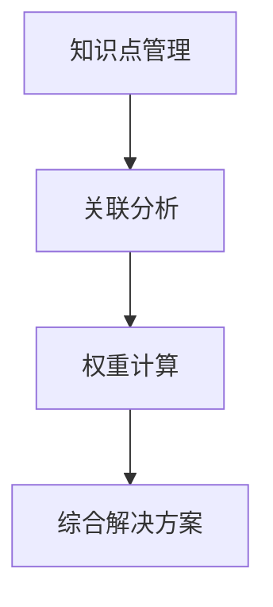

                 


# 芒格的"多元思维模型"在跨维度创新中的运用

## 关键词：芒格，多元思维模型，跨维度创新，系统思维，创新方法，知识整合，问题解决

## 摘要：芒格的多元思维模型是一种通过跨学科整合来解决复杂问题的方法。本文将详细介绍多元思维模型的核心概念、算法原理、系统架构，以及在实际项目中的应用。通过分析和案例，展示如何利用多元思维模型在跨维度创新中取得突破。

---

## 第1章：多元思维模型的背景与核心概念

### 1.1 多元思维模型的起源

芒格的多元思维模型起源于他对知识的广泛涉猎和对复杂问题的深入思考。他强调通过多个学科的视角来理解问题，避免单一思维的局限性。

#### 1.1.1 芒格的生平与思想体系

查理·芒格（Charlie Munger）是伯克希尔哈撒韦公司的副主席，以他的投资智慧和多元思维模型闻名。他提倡通过跨学科思考来做出更明智的决策。

#### 1.1.2 多元思维模型的定义与内涵

多元思维模型是一种将多个学科的知识点整合起来，用于分析和解决问题的方法。它强调从不同角度看待问题，以获得更全面的理解。

#### 1.1.3 多元思维模型的核心要素

- **知识多样性**：涵盖多个学科的知识。
- **知识关联性**：知识点之间的相互关联。
- **知识权重**：不同知识点的重要性。

### 1.2 多元思维模型的哲学基础

多元思维模型与唯物辩证法密切相关，强调事物之间的联系和相互作用。

#### 1.2.1 唯物辩证法与多元思维的联系

唯物辩证法认为事物是相互联系的，多元思维模型正是通过多个视角来理解问题。

#### 1.2.2 系统思维与多元思维的关系

系统思维关注整体与部分的关系，而多元思维模型则是系统思维的一种实现方式。

#### 1.2.3 多元思维模型的科学依据

科学方法论支持多元思维模型，强调通过多个角度验证假设。

### 1.3 多元思维模型与其他思维方法的比较

#### 1.3.1 单一思维与多元思维的对比

单一思维仅关注问题的一个方面，而多元思维模型强调全面考虑。

#### 1.3.2 批判性思维与多元思维的融合

批判性思维帮助评估各个视角的合理性，多元思维模型则提供多种视角。

#### 1.3.3 创新思维与多元思维的结合

创新思维需要新的想法，多元思维模型提供了丰富的知识基础。

---

## 第2章：多元思维模型的核心概念与联系

### 2.1 多元思维模型的原理与结构

#### 2.1.1 多元思维模型的原理

通过整合多个学科的知识点，形成一个综合的分析框架。

#### 2.1.2 多元思维模型的数学模型

$$ \text{综合解决方案} = \sum_{i=1}^{n} w_i \cdot x_i $$

其中，$x_i$ 表示各个知识点，$w_i$ 是对应权重。

#### 2.1.3 多元思维模型的算法流程

1. 收集相关知识点。
2. 分析知识点之间的关联。
3. 计算各知识点的权重。
4. 综合各知识点的加权和，得出解决方案。

### 2.2 多元思维模型的核心要素

#### 2.2.1 知识点的提取与分类

知识点需要来自不同的学科，并进行分类整理。

#### 2.2.2 知识点之间的关联性分析

通过分析知识点之间的关系，建立知识网络。

#### 2.2.3 知识点的权重分配

根据知识点的重要性，分配不同的权重。

### 2.3 多元思维模型的属性特征对比

| 属性   | 单一知识点 | 多个知识点 | 综合知识点 |
|--------|------------|------------|------------|
| 重要性 | 低         | 中         | 高         |
| 关联性 | 无         | 有         | 强         |

### 2.4 多元思维模型的ER实体关系图

```mermaid
er
  entity(知识点) {
    知识点ID [PK]
    知识内容
    权重
  }
  entity(知识点关联) {
    关联ID [PK]
    知识点1ID [FK]
    知识点2ID [FK]
    关联强度
  }
  relationship(知识点, 知识点关联) {
    关联关系
  }
```

---

## 第3章：多元思维模型的算法原理

### 3.1 多元思维模型的算法流程

1. 收集相关知识点。
2. 分析知识点之间的关联。
3. 计算各知识点的权重。
4. 综合各知识点的加权和，得出解决方案。

### 3.2 多元思维模型的算法实现

#### 3.2.1 Python代码实现

```python
# 定义知识点及其权重
knowledge_points = {
    '经济学': 0.3,
    '心理学': 0.25,
    '数学': 0.2,
    '哲学': 0.15,
    '逻辑学': 0.1
}

# 计算综合权重
total_weight = sum(knowledge_points.values())

# 综合解决方案
def calculate_solution(problem):
    solution = 0
    for point, weight in knowledge_points.items():
        solution += weight * problem[point]
    return solution

# 示例问题
problem = {
    '经济学': 0.8,
    '心理学': 0.7,
    '数学': 0.6,
    '哲学': 0.5,
    '逻辑学': 0.4
}

result = calculate_solution(problem)
print(f'综合解决方案：{result}')
```

#### 3.2.2 数学模型

$$ \text{综合解决方案} = \sum_{i=1}^{n} w_i \cdot x_i $$

其中，$w_i$ 是知识点 $x_i$ 的权重。

---

## 第4章：多元思维模型的系统分析与架构设计

### 4.1 系统分析方法

#### 4.1.1 问题场景介绍

以商业决策为例，分析多元思维模型的应用。

#### 4.1.2 系统功能需求分析

- 知识点管理
- 关联分析
- 权重计算
- 综合解决方案生成

#### 4.1.3 系统边界与接口设计

- 输入：多个知识点及其关联
- 输出：综合解决方案

### 4.2 系统架构设计

#### 4.2.1 系统架构图



#### 4.2.2 系统模块划分

- 知识点管理模块
- 关联分析模块
- 权重计算模块
- 综合解决方案模块

#### 4.2.3 系统模块之间的关系

- 知识点管理模块提供知识点数据。
- 关联分析模块分析知识点之间的关联。
- 权重计算模块计算各知识点的权重。
- 综合解决方案模块生成最终的解决方案。

---

## 第5章：多元思维模型的项目实战

### 5.1 项目环境搭建

#### 5.1.1 环境安装与配置

安装Python和相关库，如pandas和numpy。

#### 5.1.2 数据集的准备与处理

收集和整理相关知识点数据。

#### 5.1.3 开发工具的安装与配置

安装Jupyter Notebook或VS Code作为开发工具。

### 5.2 项目核心实现

#### 5.2.1 知识点的提取与分类

从不同学科中提取知识点，并进行分类。

#### 5.2.2 知识点之间的关联性分析

分析知识点之间的关联，并建立知识网络。

#### 5.2.3 知识点的权重分配与计算

根据知识点的重要性，分配不同的权重。

### 5.3 项目代码实现

#### 5.3.1 代码示例

```python
import pandas as pd
import numpy as np

# 知识点数据
knowledge_points = pd.DataFrame({
    '知识点': ['经济学', '心理学', '数学', '哲学', '逻辑学'],
    '权重': [0.3, 0.25, 0.2, 0.15, 0.1]
})

# 关联分析
def calculate_solution(problem):
    solution = 0
    for point, weight in zip(knowledge_points['知识点'], knowledge_points['权重']):
        solution += weight * problem[point]
    return solution

# 示例问题
problem = {
    '经济学': 0.8,
    '心理学': 0.7,
    '数学': 0.6,
    '哲学': 0.5,
    '逻辑学': 0.4
}

result = calculate_solution(problem)
print(f'综合解决方案：{result}')
```

---

## 第6章：多元思维模型的最佳实践与总结

### 6.1 最佳实践 tips

- 定期更新知识点库，保持知识的最新性。
- 在实际应用中，根据具体情况调整权重。

### 6.2 小结

多元思维模型通过跨学科整合，提供了一种全新的问题解决方法，能够帮助我们更好地应对复杂问题。

### 6.3 注意事项

- 注意知识点的多样性和相关性。
- 权重的分配需要根据具体情况调整。

### 6.4 拓展阅读

建议阅读芒格的《穷查理宝典》和相关的系统思维书籍，以进一步深入理解多元思维模型。

---

## 作者：AI天才研究院/AI Genius Institute & 禅与计算机程序设计艺术 /Zen And The Art of Computer Programming

