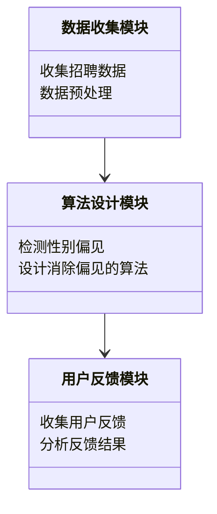
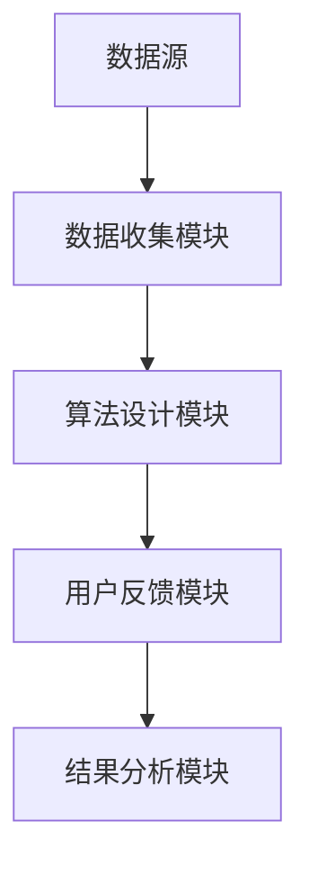
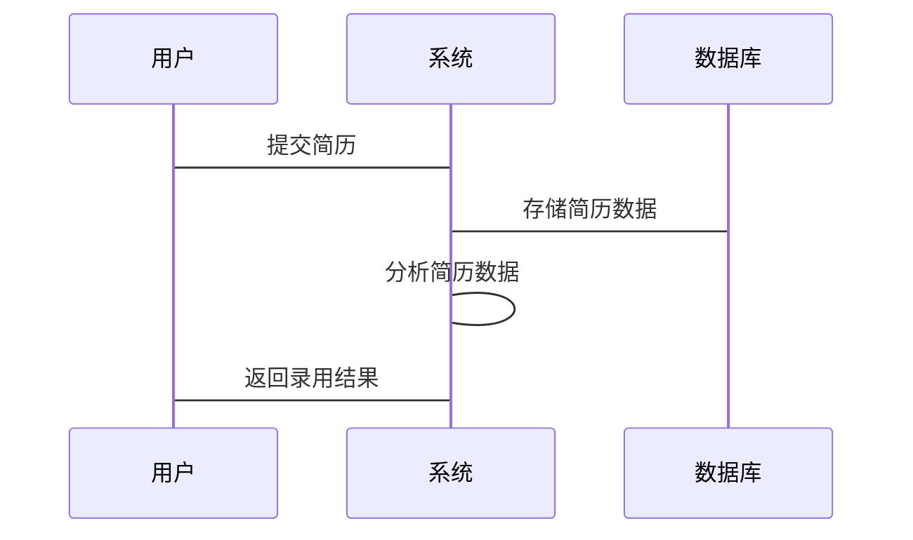

                 


# 芒格的"多元思维模型"在跨维度科技伦理中的运用

> **关键词**：多元思维模型，科技伦理，芒格，跨维度分析，AI伦理，数据隐私，系统架构

> **摘要**：  
芒格的“多元思维模型”是一种跨学科的思维方式，能够帮助我们更好地理解和解决复杂问题。在科技伦理领域，这种思维方式尤为重要，因为它可以帮助我们从多个维度分析技术对社会、伦理和环境的影响。本文将详细探讨芒格的多元思维模型在跨维度科技伦理中的应用，结合实际案例和系统架构设计，展示如何利用这种思维方式解决复杂的科技伦理问题。

---

## 目录大纲

1. **摘要**  
2. **关键词**  
3. **目录**

---

### 目录

1. **引言**  
   1.1 背景介绍  
   1.2 多元思维模型的核心概念  
   1.3 科技伦理的跨维度挑战  

2. **多元思维模型的核心原理**  
   2.1 多元思维模型的定义与特点  
   2.2 科技伦理中的跨维度问题  
   2.3 多元思维模型与科技伦理的结合  

3. **算法原理与数学模型**  
   3.1 多元思维模型的数学表达  
   3.2 科技伦理问题中的算法应用  
   3.3 实际案例中的公式推导  

4. **系统分析与架构设计**  
   4.1 问题场景介绍  
   4.2 项目介绍  
   4.3 系统功能设计（Mermaid类图）  
   4.4 系统架构设计（Mermaid架构图）  
   4.5 系统交互设计（Mermaid序列图）  

5. **项目实战：AI伦理中的偏见检测**  
   5.1 环境安装与配置  
   5.2 系统核心实现源代码  
   5.3 代码解读与分析  
   5.4 实际案例分析与结果展示  

6. **总结与展望**  
   6.1 最佳实践 tips  
   6.2 小结  
   6.3 注意事项  
   6.4 拓展阅读  

7. **作者信息**  

---

## 详细内容

### 1. 引言

#### 1.1 背景介绍
在科技迅速发展的今天，技术对社会、伦理和环境的影响日益显著。从人工智能（AI）算法的偏见到数据隐私问题，科技伦理已经成为一个跨学科的复杂领域。芒格的“多元思维模型”作为一种跨学科的思维方式，为我们提供了一个全新的视角来解决这些复杂问题。

#### 1.2 多元思维模型的核心概念
芒格的多元思维模型是一种通过多个学科的思维方式来解决问题的方法。它强调从物理学、心理学、经济学、生物学等多个学科的角度出发，全面分析问题的本质。这种思维方式的核心在于“反身性”——即通过多个维度的思考来避免单一视角的局限性。

#### 1.3 科技伦理的跨维度挑战
科技伦理问题往往涉及多个维度，例如技术对社会的影响、对环境的影响、对个人隐私的影响等。单一的思维方式难以全面解决这些问题，因此需要一种跨学科的思维方式来应对。

---

### 2. 多元思维模型的核心原理

#### 2.1 多元思维模型的定义与特点
芒格的多元思维模型是一种通过多个学科的思维方式来解决问题的方法。它具有以下特点：
- **跨学科性**：结合多个学科的理论和方法。
- **系统性**：从整体的角度分析问题。
- **实用性**：能够直接应用于实际问题的解决。

#### 2.2 科技伦理中的跨维度问题
科技伦理问题往往涉及多个维度，例如：
- **技术维度**：技术本身的实现方式。
- **社会维度**：技术对社会的影响。
- **伦理维度**：技术是否符合伦理规范。
- **环境维度**：技术对环境的影响。

#### 2.3 多元思维模型与科技伦理的结合
通过多元思维模型，我们可以从多个维度分析科技伦理问题，例如：
- 从心理学角度分析技术对用户行为的影响。
- 从经济学角度分析技术对社会资源分配的影响。
- 从生物学角度分析技术对生态系统的影响。

---

### 3. 算法原理与数学模型

#### 3.1 多元思维模型的数学表达
多元思维模型可以通过数学公式来表达。例如，假设我们有多个学科的思维方式，每个思维方式可以用一个函数表示：
$$ f_i(x) = y_i $$
其中，$x$ 是问题的输入，$y_i$ 是第 $i$ 个思维方式的输出。

通过结合多个思维方式的输出，我们可以得到一个综合的解决方案：
$$ y = \text{综合}(f_1(x), f_2(x), \dots, f_n(x)) $$

#### 3.2 科技伦理问题中的算法应用
以AI伦理中的偏见检测为例，我们可以使用多元思维模型来分析算法的公平性。例如：
- 从统计学角度分析数据的分布。
- 从心理学角度分析用户对算法结果的感知。
- 从法学角度分析算法是否符合相关法规。

#### 3.3 实际案例中的公式推导
假设我们有一个AI招聘系统，我们需要检测其是否存在性别偏见。我们可以使用多元思维模型来分析：
- 统计学角度：计算男性和女性的录用比例。
- 心理学角度：分析用户对性别因素的感知。
- 法学角度：检查是否符合反歧视法规。

---

### 4. 系统分析与架构设计

#### 4.1 问题场景介绍
假设我们正在设计一个AI招聘系统，我们需要确保该系统不存在性别偏见。问题场景包括：
- 数据来源：招聘数据是否均衡？
- 算法设计：是否存在性别相关的特征？
- 用户反馈：用户是否感知到性别偏见？

#### 4.2 项目介绍
- **项目目标**：检测并消除AI招聘系统中的性别偏见。
- **项目范围**：涵盖数据收集、算法设计和用户反馈三个阶段。
- **项目约束**：数据隐私保护，算法透明性。

#### 4.3 系统功能设计（Mermaid类图）


#### 4.4 系统架构设计（Mermaid架构图）


#### 4.5 系统交互设计（Mermaid序列图）


---

### 5. 项目实战：AI伦理中的偏见检测

#### 5.1 环境安装与配置
- **工具**：Python 3.8+
- **库**：scikit-learn, pandas, numpy
- **安装命令**：
  ```bash
  pip install scikit-learn pandas numpy
  ```

#### 5.2 系统核心实现源代码
```python
import numpy as np
from sklearn.metrics import accuracy_score
from sklearn.datasets import make_classification

# 生成模拟数据
X, y = make_classification(n_samples=1000, n_features=20, n_classes=2, random_state=42)

# 训练模型
from sklearn.svm import SVC
model = SVC()
model.fit(X, y)

# 检测性别偏见
# 假设X中包含性别特征
gender_feature_index = 5
gender_feature_values = X[:, gender_feature_index]

# 分析性别特征对结果的影响
from sklearn.inspection import permutation_importance
result = permutation_importance(model, X, y, n_repeats=10)
importances = result.importances_mean

# 打印结果
print(f"性别特征的重要性：{importances}")
```

#### 5.3 代码解读与分析
- **数据生成**：使用 `make_classification` 生成模拟数据。
- **模型训练**：使用支持向量机（SVM）训练模型。
- **偏见检测**：通过特征重要性分析，检测性别特征对结果的影响。

#### 5.4 实际案例分析与结果展示
- **数据生成**：生成1000个样本，20个特征，2个类别。
- **模型训练**：训练一个SVM模型。
- **偏见检测**：分析性别特征对模型结果的影响。

---

### 6. 总结与展望

#### 6.1 最佳实践 tips
- 在科技伦理问题中，始终关注跨学科的思维方式。
- 使用多元思维模型来分析问题的本质。
- 在实际应用中，结合具体案例进行分析。

#### 6.2 小结
芒格的多元思维模型为我们提供了一种跨学科的思维方式，能够帮助我们更好地解决科技伦理中的复杂问题。通过结合实际案例和系统架构设计，我们可以更有效地应对这些挑战。

#### 6.3 注意事项
- 在实际应用中，确保数据的隐私保护。
- 注意算法的透明性和可解释性。
- 定期更新模型，以应对新的伦理挑战。

#### 6.4 拓展阅读
- 《芒格的“多元思维模型”：决策者的必修课》
- 《科技伦理：从理论到实践》
- 《跨学科研究方法论》

---

### 7. 作者信息

作者：AI天才研究院/AI Genius Institute  
& 禅与计算机程序设计艺术/Zen And The Art of Computer Programming

