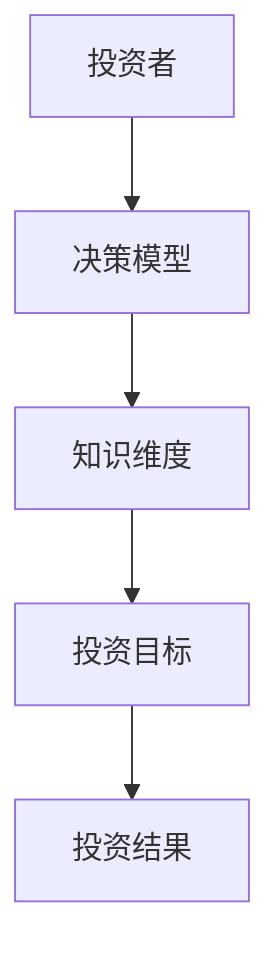
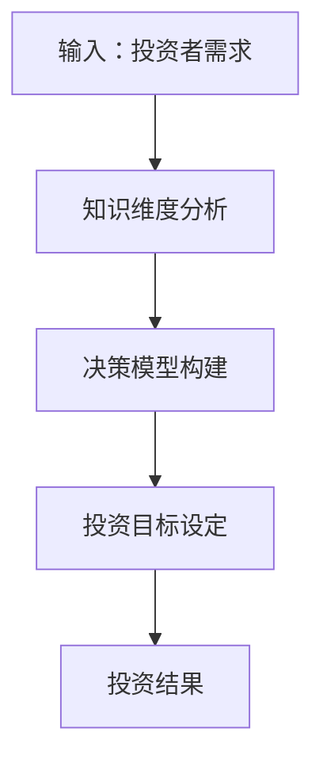
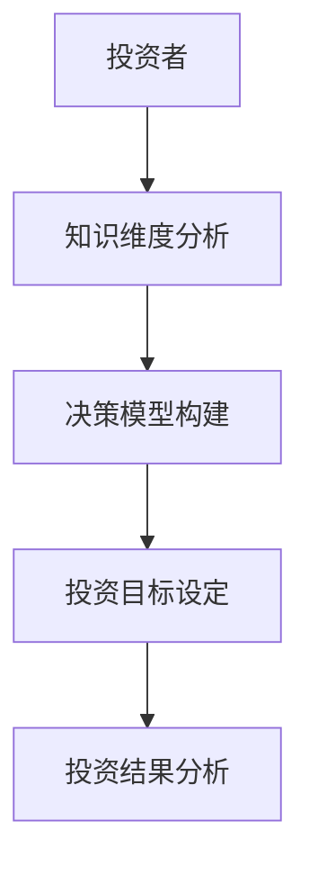

                 


# 目录大纲：芒格的多元思维模型：在投资中的实际应用

---

## 第1章：芒格的多元思维模型概述

### 1.1 多元思维模型的起源与背景
- 1.1.1 芒格的多元思维模型的提出
  - 多元思维模型的定义
  - 多元思维模型的哲学基础
  - 多元思维模型在投资中的重要性
- 1.1.2 多元思维模型的核心概念
  - 知识的多维度性
  - 思维模型的可组合性
  - 投资决策的全面性
- 1.1.3 多元思维模型与传统投资方法的区别
  - 传统投资方法的局限性
  - 多元思维模型的优势

### 1.2 多元思维模型的背景介绍
- 1.2.1 投资中的问题背景
  - 投资市场的复杂性
  - 投资者的认知偏差
  - 投资决策的不确定性
- 1.2.2 问题描述与解决思路
  - 投资者如何避免错误决策
  - 如何构建系统的决策框架
  - 多元思维模型的应用场景
- 1.2.3 多元思维模型的边界与外延
  - 多元思维模型的适用范围
  - 多元思维模型的局限性
  - 如何与其他投资方法结合
- 1.2.4 多元思维模型的概念结构与核心要素组成
  - 多元思维模型的核心要素
  - 要素之间的关系
  - 模型的整体架构

---

## 第2章：多元思维模型的核心概念与联系

### 2.1 多元思维模型的原理
- 2.1.1 多元思维模型的基本原理
  - 知识的多维度交叉应用
  - 思维模型的可组合性
  - 多元思维模型的系统性
- 2.1.2 多元思维模型的属性特征对比表格
  | 属性        | 特征描述                        |
  |-------------|---------------------------------|
  | 知识维度     | 包括经济学、心理学、物理学等     |
  | 可组合性     | 模型之间的组合可以产生新的见解   |
  | 系统性       | 强调整体性思考，避免单一视角     |

### 2.2 多元思维模型的ER实体关系图
- 2.2.1 实体关系图的构建
  - 投资者、决策模型、知识维度、投资目标之间的关系
- 2.2.2 实体关系图的解释与应用
  - 如何通过关系图理解投资决策的复杂性
  - 如何利用关系图优化投资策略

### 2.3 多元思维模型的Mermaid流程图
- 2.3.1 多元思维模型的流程图架构

- 2.3.2 流程图的详细说明与应用
  - 流程图的每一步骤含义
  - 如何通过流程图优化投资决策

---

## 第3章：多元思维模型的算法原理

### 3.1 多元思维模型的算法原理
- 3.1.1 多元思维模型的算法概述
  - 多元思维模型的算法特点
  - 算法的输入与输出
  - 算法的核心步骤
- 3.1.2 多元思维模型的算法流程图

- 3.1.3 多元思维模型的算法实现
  - 如何通过算法实现多元思维模型的构建
  - 如何通过算法优化投资决策

### 3.2 多元思维模型的Python源代码实现
- 3.2.1 环境安装与配置
  - Python版本要求
  - 需要安装的库
- 3.2.2 核心算法实现代码
```python
def multi思维模型(输入):
    # 知识维度分析
    分析结果 = 分析知识维度(输入)
    # 决策模型构建
    决策模型 = 构建决策模型(分析结果)
    # 投资目标设定
    投资目标 = 设定投资目标(决策模型)
    # 投资结果
    return 投资结果
```

---

## 第4章：多元思维模型的数学模型与公式

### 4.1 多元思维模型的数学模型
- 4.1.1 数学模型的构建
  - 多元思维模型的数学表达式
  - 模型的变量与参数
  - 模型的假设条件
- 4.1.2 数学模型的公式推导
  - 公式的详细推导过程
  - 公式的应用场景

### 4.2 多元思维模型的公式详细讲解
- 4.2.1 公式的数学推导
  - 从基本假设到最终公式的推导
  - 推导过程中的关键步骤
- 4.2.2 公式的实际应用案例
  - 具体案例中的公式应用
  - 如何通过公式优化投资决策

---

## 第5章：多元思维模型的系统架构设计

### 5.1 多元思维模型的系统分析
- 5.1.1 系统功能设计
  - 投资者需求分析
  - 知识维度分析模块
  - 决策模型构建模块
  - 投资目标设定模块
  - 投资结果分析模块
- 5.1.2 系统架构设计
  - 系统架构的总体设计
  - 各模块之间的关系
  - 系统的输入与输出

### 5.2 多元思维模型的Mermaid架构图


---

## 第6章：多元思维模型的项目实战

### 6.1 项目背景介绍
- 6.1.1 项目目标
  - 构建多元思维模型
  - 应用模型进行投资决策
- 6.1.2 项目需求
  - 知识维度分析
  - 决策模型构建
  - 投资目标设定

### 6.2 项目实现
- 6.2.1 环境安装与配置
  - Python环境搭建
  - 库的安装
- 6.2.2 核心代码实现
```python
def 分析知识维度(输入):
    return 分析结果

def 构建决策模型(分析结果):
    return 决策模型

def 设定投资目标(决策模型):
    return 投资目标
```
- 6.2.3 代码的应用解读与分析
  - 代码的运行过程
  - 代码的输出结果
  - 如何根据输出结果优化投资决策

---

## 第7章：多元思维模型的最佳实践

### 7.1 小结
- 本章小结
  - 多元思维模型的核心概念
  - 算法原理
  - 项目实战的应用

### 7.2 注意事项
- 7.2.1 投资决策中的注意事项
  - 如何避免认知偏差
  - 如何处理不确定性
  - 如何优化决策模型
- 7.2.2 系统设计中的注意事项
  - 如何确保系统稳定性
  - 如何优化系统性能
  - 如何确保数据安全

### 7.3 拓展阅读
- 7.3.1 推荐书籍
  - 芒格的《穷查理宝典》
  - 其他相关书籍
- 7.3.2 推荐资源
  - 相关论文
  - 在线课程
  - 投资博客

---

## 作者：AI天才研究院/AI Genius Institute & 禅与计算机程序设计艺术 /Zen And The Art of Computer Programming

