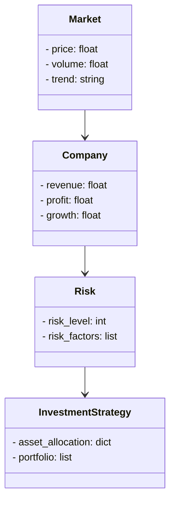

                 


# 芒格的多学科知识在投资决策中的作用

## 关键词
芒格、多学科知识、投资决策、多元思维模型、心理学、经济学、物理学

## 摘要
芒格的多元思维模型是一种将多个学科知识整合起来进行投资决策的方法。通过结合心理学、经济学、物理学等学科的核心概念，芒格能够更全面地分析投资问题，做出更明智的投资决策。本文将详细探讨芒格的多元思维模型在投资决策中的具体应用，分析其背后的数学原理和实际案例，帮助读者更好地理解如何利用多学科知识来优化投资策略。

---

## 第1章 芒格的多元思维模型概述

### 1.1 芒格的生平与投资理念
查理·芒格是美国著名投资家、伯克希尔·哈撒韦公司副董事长，被誉为“投资界的哲学家”。他提倡的多元思维模型是一种通过整合多个学科的知识来理解复杂问题的方法。

#### 1.1.1 芒格的生平简介
查理·芒格于1924年出生于美国密苏里州，拥有法律和心理学背景。他与沃伦·巴菲特共同创立了伯克希尔·哈撒韦公司，并通过长期的价值投资策略积累了巨额财富。

#### 1.1.2 芒格的投资哲学与核心思想
芒格的投资哲学以“安全边际”为核心，强调通过深入研究企业的基本面，寻找具有持续竞争优势的企业进行长期投资。他认为，投资的本质是寻找具有合理估值的优秀企业。

#### 1.1.3 多元思维模型的定义与特点
多元思维模型是一种通过整合多个学科的知识，形成对问题的全面理解的方法。其特点是注重跨学科整合、注重逻辑推理、注重实际应用。

### 1.2 多元思维模型的核心要素
多元思维模型的核心要素包括心理学、经济学、物理学等学科的知识。

#### 1.2.1 多元思维模型的定义
多元思维模型是通过整合多个学科的知识，形成对问题的全面理解的方法。

#### 1.2.2 多元思维模型的核心要素分析
多元思维模型的核心要素包括心理学、经济学、物理学等学科的知识。每个学科都有其独特的视角和方法，可以用来分析投资问题。

#### 1.2.3 多元思维模型与投资决策的关系
多元思维模型通过整合多个学科的知识，帮助投资者更全面地分析投资问题，做出更明智的投资决策。

### 1.3 多元思维模型在投资中的应用前景
多元思维模型在投资中的应用前景广阔，可以帮助投资者更好地理解市场、分析企业、制定投资策略。

#### 1.3.1 多元思维模型的潜在应用场景
多元思维模型可以应用于风险控制、投资策略制定、投资组合优化等领域。

#### 1.3.2 多元思维模型在投资中的优势
多元思维模型的优势在于其跨学科整合的能力，可以帮助投资者发现潜在的风险和机会。

#### 1.3.3 多元思维模型应用的挑战与机遇
应用多元思维模型的挑战在于需要深入学习多个学科的知识，而机遇在于可以更全面地理解投资问题。

---

## 第2章 多学科知识体系的构建

### 2.1 心理学在投资决策中的作用
心理学在投资决策中的作用不可忽视，投资者的心理偏差会影响其决策过程。

#### 2.1.1 心理学的基本概念与原理
心理学是研究人类行为和心理过程的科学。在投资决策中，心理学可以帮助投资者理解自己的心理偏差，从而做出更理性的决策。

#### 2.1.2 心理学在投资中的应用
心理学在投资中的应用包括理解投资者的心理偏差、分析市场情绪、制定投资策略等。

#### 2.1.3 心理学对投资决策的影响
心理学对投资决策的影响体现在投资者的行为偏差、市场情绪波动、投资策略制定等方面。

### 2.2 经济学在投资决策中的应用
经济学在投资决策中的应用可以帮助投资者理解市场机制、经济周期等。

#### 2.2.1 经济学的基本概念与原理
经济学是研究资源分配、生产消费等问题的科学。在投资决策中，经济学可以帮助投资者理解市场机制、经济周期等。

#### 2.2.2 经济学在投资中的应用
经济学在投资中的应用包括分析经济周期、理解市场机制、制定投资策略等。

#### 2.2.3 经济学对投资决策的影响
经济学对投资决策的影响体现在经济周期分析、市场趋势预测、投资策略制定等方面。

### 2.3 物理学在投资决策中的应用
物理学在投资决策中的应用可以帮助投资者理解市场效率、资产定价等。

#### 2.3.1 物理学的基本概念与原理
物理学是研究物质、能量及其相互作用的科学。在投资决策中，物理学可以帮助投资者理解市场效率、资产定价等。

#### 2.3.2 物理学在投资中的应用
物理学在投资中的应用包括分析市场效率、理解资产定价、制定投资策略等。

#### 2.3.3 物理学对投资决策的影响
物理学对投资决策的影响体现在市场效率分析、资产定价模型、投资策略制定等方面。

---

## 第3章 多学科知识体系的整合与应用

### 3.1 多学科知识的整合方法
多学科知识的整合方法包括逻辑推理、数学建模等。

#### 3.1.1 多学科知识整合的基本原则
多学科知识整合的基本原则包括逻辑性、系统性、实用性等。

#### 3.1.2 多学科知识整合的具体方法
多学科知识整合的具体方法包括逻辑推理、数学建模、案例分析等。

#### 3.1.3 多学科知识整合的注意事项
多学科知识整合的注意事项包括注重实际应用、避免过度简化、保持逻辑一致性等。

### 3.2 多学科知识在投资决策中的具体应用
多学科知识在投资决策中的具体应用包括风险控制、投资策略制定、投资组合优化等。

#### 3.2.1 多学科知识在风险控制中的应用
多学科知识在风险控制中的应用包括识别潜在风险、评估风险影响、制定风险控制策略等。

#### 3.2.2 多学科知识在投资策略制定中的应用
多学科知识在投资策略制定中的应用包括分析市场趋势、评估企业基本面、制定投资策略等。

#### 3.2.3 多学科知识在投资组合优化中的应用
多学科知识在投资组合优化中的应用包括分析资产配置、评估风险收益比、优化投资组合等。

---

## 第4章 多学科知识体系的数学模型与算法

### 4.1 多学科知识体系的数学模型
多学科知识体系的数学模型包括概率论模型、回归分析模型等。

#### 4.1.1 多学科知识体系的数学模型概述
多学科知识体系的数学模型是通过数学方法对多学科知识进行整合和分析的工具。

#### 4.1.2 多学科知识体系的数学模型构建
多学科知识体系的数学模型构建包括确定变量、建立方程、求解方程等步骤。

#### 4.1.3 多学科知识体系的数学模型应用
多学科知识体系的数学模型应用包括风险评估、市场预测、投资决策优化等。

### 4.2 多学科知识体系的算法实现
多学科知识体系的算法实现包括概率论算法、回归分析算法等。

#### 4.2.1 多学科知识体系的算法概述
多学科知识体系的算法是通过数学方法对多学科知识进行整合和分析的工具。

#### 4.2.2 多学科知识体系的算法实现
多学科知识体系的算法实现包括概率论算法、回归分析算法等。

#### 4.2.3 多学科知识体系的算法应用
多学科知识体系的算法应用包括风险评估、市场预测、投资决策优化等。

---

## 第5章 系统分析与架构设计方案

### 5.1 问题场景介绍
投资决策是一个复杂的系统性问题，需要整合多个学科的知识。

### 5.2 项目介绍
本项目旨在通过多元思维模型，构建一个基于多学科知识的投资决策支持系统。

### 5.3 系统功能设计
系统功能设计包括市场分析、企业分析、风险评估、投资策略制定等。

#### 5.3.1 领域模型mermaid类图


### 5.4 系统架构设计
系统架构设计包括数据采集层、数据处理层、用户界面层等。

#### 5.4.1 系统架构mermaid架构图
```mermaid
docker
    services {
        market_data {
            provides: market_data
        }
        company_data {
            provides: company_data
        }
        risk_assessment {
            uses: market_data, company_data
            provides: risk_assessment
        }
        investment_strategy {
            uses: risk_assessment
            provides: investment_strategy
        }
    }
```

### 5.5 系统接口设计
系统接口设计包括数据接口、用户接口等。

### 5.6 系统交互mermaid序列图
```mermaid
sequenceDiagram
    participant User
    participant Market_Data
    participant Company_Data
    participant Risk_Assessment
    participant Investment_Strategy

    User -> Market_Data: Request market data
    Market_Data -> User: Return market data

    User -> Company_Data: Request company data
    Company_Data -> User: Return company data

    User -> Risk_Assessment: Request risk assessment
    Risk_Assessment -> Market_Data, Company_Data: Analyze data
    Risk_Assessment -> User: Return risk assessment

    User -> Investment_Strategy: Request investment strategy
    Investment_Strategy -> Risk_Assessment: Analyze risk
    Investment_Strategy -> User: Return investment strategy
```

---

## 第6章 项目实战

### 6.1 环境安装
项目实战需要安装Python、Pandas、Matplotlib等工具。

#### 6.1.1 Python环境安装
```bash
pip install numpy pandas matplotlib seaborn scikit-learn
```

### 6.2 系统核心实现源代码
以下是系统核心实现的Python代码示例：

#### 6.2.1 数据预处理
```python
import pandas as pd

# 读取市场数据
market_data = pd.read_csv('market.csv')

# 读取公司数据
company_data = pd.read_csv('company.csv')

# 数据合并
combined_data = pd.merge(market_data, company_data, on='date')
```

#### 6.2.2 风险评估
```python
from sklearn import linear_model

# 训练风险评估模型
model = linear_model.LinearRegression()
model.fit(X, y)

# 预测风险
risk_predictions = model.predict(X_test)
```

#### 6.2.3 投资策略制定
```python
# 基于风险评估制定投资策略
investment_strategy = {
    'asset_allocation': {'equity': 60, 'bond': 30, 'cash': 10},
    'portfolio': ['AAPL', 'GOOG', 'MSFT']
}
```

### 6.3 案例分析
以某公司为例，分析其市场表现、财务状况、风险因素等，制定投资策略。

#### 6.3.1 案例分析
```python
# 分析某公司的市场表现
company = 'AAPL'
market_price = market_data[market_data['symbol'] == company]['price'].values
```

#### 6.3.2 投资策略优化
```python
# 优化投资策略
investment_strategy['asset_allocation']['equity'] = 70
investment_strategy['portfolio'].append('AMZN')
```

### 6.4 项目小结
通过项目实战，我们可以看到多元思维模型在投资决策中的实际应用，以及多学科知识整合的重要性。

---

## 第7章 总结与展望

### 7.1 总结
芒格的多元思维模型通过整合多个学科的知识，帮助投资者更全面地分析投资问题，做出更明智的投资决策。

### 7.2 展望
未来，随着技术的进步和学科的交叉，多元思维模型在投资决策中的应用将更加广泛和深入。

---

## 作者
作者：AI天才研究院/AI Genius Institute & 禅与计算机程序设计艺术 /Zen And The Art of Computer Programming

