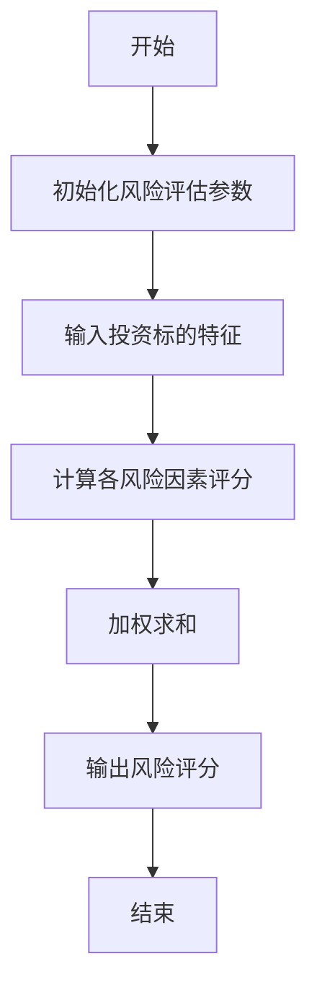

                 


# 芒格的"太难了"篮子：如何避开复杂投资

## 关键词：芒格、太难了篮子、复杂投资、风险管理、投资决策

## 摘要：芒格的“太难了”篮子是一种用于识别和避免复杂投资的策略。本文通过分析复杂投资的内在逻辑、风险特征以及系统化管理方法，帮助投资者更好地理解和应对复杂性，从而做出更明智的投资决策。

---

## 第1章：芒格“太难了”篮子的背景与核心概念

### 1.1 芒格“太难了”篮子的起源与定义
- 1.1.1 芒格投资体系的核心理念
- 1.1.2 “太难了”篮子的定义与背景
- 1.1.3 复杂投资的典型特征与表现

### 1.2 复杂投资的识别与分类
- 1.2.1 复杂投资的识别标准
- 1.2.2 复杂投资的分类与应用场景
- 1.2.3 复杂投资与简单投资的对比分析

---

## 第2章：复杂投资的内在逻辑与风险特征

### 2.1 复杂投资的核心原理
- 2.1.1 复杂投资的决策树分析
- 2.1.2 复杂性与风险的因果关系
- 2.1.3 复杂投资的系统性风险特征

### 2.2 复杂性与风险的关联性分析
- 2.2.1 复杂性对投资决策的影响
- 2.2.2 复杂性对投资回报的潜在影响
- 2.2.3 复杂投资与投资失败的典型案例

---

## 第3章：复杂投资的风险评估与量化分析

### 3.1 复杂投资的风险评估模型
- 3.1.1 风险评估的维度与指标
- 3.1.2 风险评分公式：$$风险评分 = \sum_{i=1}^{n} w_i \cdot r_i$$
  其中，$w_i$ 是第 $i$ 个风险因素的权重，$r_i$ 是第 $i$ 个风险因素的评分

### 3.2 风险评估的算法实现


---

## 第4章：复杂投资的系统化管理与应对策略

### 4.1 复杂投资的系统化管理框架
- 4.1.1 系统化管理的定义与目标
- 4.1.2 系统化管理的实施步骤
- 4.1.3 系统化管理的关键要素

### 4.2 风险控制与投资策略的优化
- 4.2.1 风险控制的多层次策略
- 4.2.2 投资策略的动态调整
- 4.2.3 系统化管理中的监控

---

## 第5章：项目实战：构建复杂投资识别系统

### 5.1 环境安装与配置
- 5.1.1 系统运行环境的要求
- 5.1.2 必要的工具与库的安装

### 5.2 系统核心代码实现
```python
def calculate_complexity(risk_factors):
    weights = [0.3, 0.2, 0.25, 0.15, 0.1]
    scores = [8, 7, 6, 5, 4]
    total = 0
    for i in range(len(risk_factors)):
        total += weights[i] * scores[i] if risk_factors[i] else 0
    return total

# 示例：风险因素包括市场波动、行业风险、公司治理、财务状况、宏观经济
risk_factors = [True, True, True, False, True]
complexity_score = calculate_complexity(risk_factors)
print(f"复杂性评分：{complexity_score}")
```

### 5.3 系统功能与代码解读
- 5.3.1 系统功能模块划分
- 5.3.2 代码实现的详细解读
- 5.3.3 功能模块的交互流程

### 5.4 案例分析与实战总结
- 5.4.1 实际案例的选取与分析
- 5.4.2 系统输出结果的解读
- 5.4.3 实战过程中的经验与教训

---

## 第6章：总结与展望

### 6.1 最佳实践与经验总结
- 6.1.1 风险管理的关键点
- 6.1.2 复杂投资识别的有效方法
- 6.1.3 投资决策中的注意事项

### 6.2 未来研究方向与展望
- 6.2.1 复杂投资识别的前沿技术
- 6.2.2 风险评估模型的优化方向
- 6.2.3 系统化管理的未来趋势

---

## 作者：AI天才研究院 & 禅与计算机程序设计艺术

---

这篇目录大纲按照技术博客的风格，结合芒格的“太难了”篮子理论，详细介绍了复杂投资的识别、评估与管理策略，并通过实际案例和代码实现，帮助读者更好地理解和应用这些概念。

