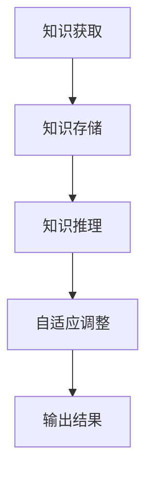

                 


# 芒格的"学习机器"理念在持续学习AI系统开发中的应用

> 关键词：芒格, 学习机器, 持续学习, AI系统开发, 知识表示, 自适应系统, 机器学习

> 摘要：本文深入探讨了芒格提出的“学习机器”理念在持续学习AI系统开发中的应用。通过分析“学习机器”的核心概念、算法原理、系统架构及实际案例，详细阐述了其在现代AI系统中的重要性。文章从背景介绍、核心概念、算法实现、系统设计、项目实战和总结等多个方面展开，旨在为AI开发者提供全面的理论和实践指导。

---

# 第一部分: 芒格的"学习机器"理念背景

## 第1章: "学习机器"的定义与核心概念

### 1.1 "学习机器"的定义与特点

"学习机器"是一种能够通过持续与环境交互，自动更新知识库并适应新任务的AI系统。与传统AI系统不同，它具备以下核心特点：

- **动态性**：能够实时更新知识库，适应新数据。
- **自适应性**：无需人工干预，自动调整模型参数。
- **持续性**：能够长期运行，持续优化性能。

### 1.2 "学习机器"的核心要素

| 核心要素 | 描述 |
|----------|------|
| 知识表示 | 知识的存储方式，如符号、向量等。 |
| 更新规则 | 知识库更新的算法，如梯度下降、强化学习。 |
| 推理引擎 | 基于现有知识进行推理的机制。 |
| 自适应模块 | 根据环境反馈调整系统行为的部分。 |

### 1.3 "学习机器"与传统AI的区别

| 方面     | 传统AI               | 学习机器           |
|----------|---------------------|-------------------|
| 知识来源 | 预先编程             | 动态学习           |
| 知识更新 | 定期人工更新         | 自动持续更新       |
| 适应性   | 有限                | 高度自适应         |

## 第2章: "学习机器"的理念背景

### 2.1 芒格的"学习机器"思想来源

芒格的“学习机器”理念源于对人类学习机制的模拟。他强调系统应具备类似于人类的学习能力，能够从经验中不断改进。

### 2.2 "学习机器"在现代AI中的地位

在当前AI领域，"学习机器"被视为实现AGI（人工通用智能）的重要途径之一。它结合了深度学习、强化学习和符号推理的优势。

### 2.3 "学习机器"的未来发展趋势

随着大数据和计算能力的提升，"学习机器"将更加普及，并在教育、医疗、金融等领域发挥重要作用。

---

# 第二部分: "学习机器"的核心概念与原理

## 第3章: "学习机器"的核心概念

### 3.1 知识表示与更新机制

知识表示是“学习机器”的基础。常用的表示方法包括符号表示、向量表示和图表示。更新机制则通过优化算法实现，如：

$$ \theta_{new} = \theta_{old} + \alpha (\theta_{target} - \theta_{old}) $$

### 3.2 知识关联与推理

通过关联规则和推理引擎，"学习机器"能够根据现有知识推导新的结论。例如：

$$ P(A|B) = \frac{P(B|A)P(A)}{P(B)} $$

### 3.3 知识记忆与遗忘

为了避免知识过载，"学习机器"需要合理管理知识的存储和遗忘。遗忘机制通常基于以下公式：

$$ \text{遗忘率} = 1 - \text{保留率} $$

## 第4章: "学习机器"的算法原理

### 4.1 知识更新算法

知识更新的核心算法是优化算法。常用的优化算法包括：

1. 随机梯度下降（SGD）：
$$ \theta_{new} = \theta_{old} - \eta \nabla J(\theta) $$
2. 动量优化器：
$$ v_t = \beta v_{t-1} + (1-\beta) \nabla J(\theta) $$
$$ \theta_{new} = \theta_{old} - \eta v_t $$

### 4.2 知识推理算法

知识推理通常基于规则推理或概率推理。例如：

- 规则推理：
$$ \text{如果} A \text{且} B，\text{则} C $$
- 概率推理：
$$ P(C|A,B) = \frac{P(C,A,B)}{P(A,B)} $$

---

# 第三部分: "学习机器"的系统架构与设计

## 第5章: "学习机器"的系统架构

### 5.1 系统功能设计

"学习机器"的系统功能模块包括：

- 知识获取模块
- 知识存储模块
- 知识推理模块
- 自适应调整模块

### 5.2 系统架构设计

系统架构通常采用分层设计，如下图所示：



### 5.3 系统接口设计

系统接口包括：

- 输入接口：接收新数据
- 输出接口：输出推理结果
- 管理接口：监控系统状态

---

# 第四部分: 项目实战

## 第6章: "学习机器"的实际应用

### 6.1 智能客服系统的实现

#### 6.1.1 环境安装

安装Python、TensorFlow和Keras库：

```bash
pip install python tensorflow keras
```

#### 6.1.2 核心代码实现

```python
class LearningMachine:
    def __init__(self):
        self.knowledge_base = {}

    def update_knowledge(self, data):
        # 更新知识库的逻辑
        pass

    def infer(self, query):
        # 基于知识库进行推理
        return result
```

#### 6.1.3 案例分析

通过智能客服系统的案例，详细分析“学习机器”的实现过程，包括数据流、模块交互和性能优化。

---

# 第五部分: 总结与展望

## 第7章: 总结

### 7.1 核心内容回顾

- "学习机器"的核心概念
- 算法原理
- 系统架构设计
- 项目实战经验

### 7.2 最佳实践

- 定期更新知识库
- 监控系统性能
- 优化推理算法

## 第8章: 展望

### 8.1 持续学习的未来

随着AI技术的发展，"学习机器"将在更多领域得到应用，推动AI系统向更智能、更自适应的方向发展。

### 8.2 作者总结

“学习机器”理念的提出为AI系统开发提供了新的思路，未来的研究方向应聚焦于如何提高系统的自适应能力和推理能力。

---

# 作者：AI天才研究院/AI Genius Institute & 禅与计算机程序设计艺术 /Zen And The Art of Computer Programming

---

本文通过系统地分析芒格的“学习机器”理念，结合理论与实践，为AI开发者提供了深入的指导。希望读者能够通过本文，更好地理解和应用这一理念，推动AI系统的发展。

