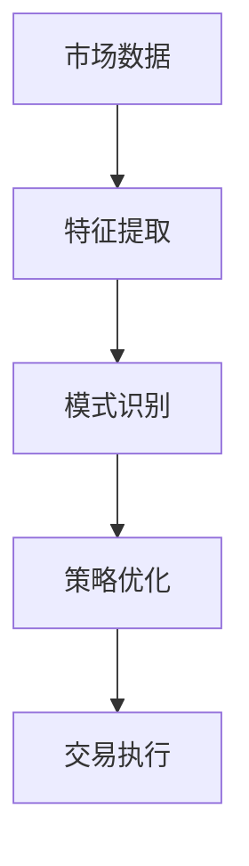
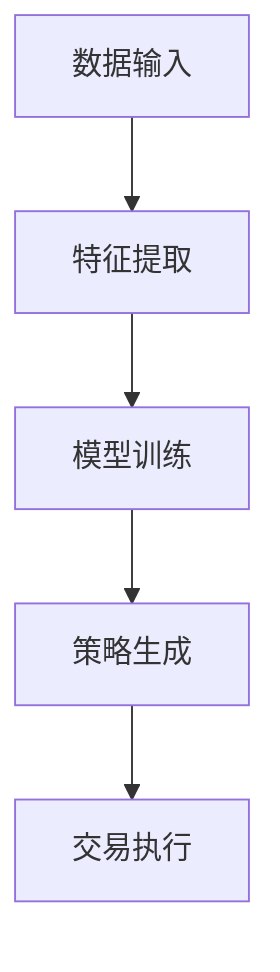
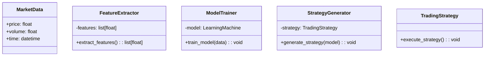
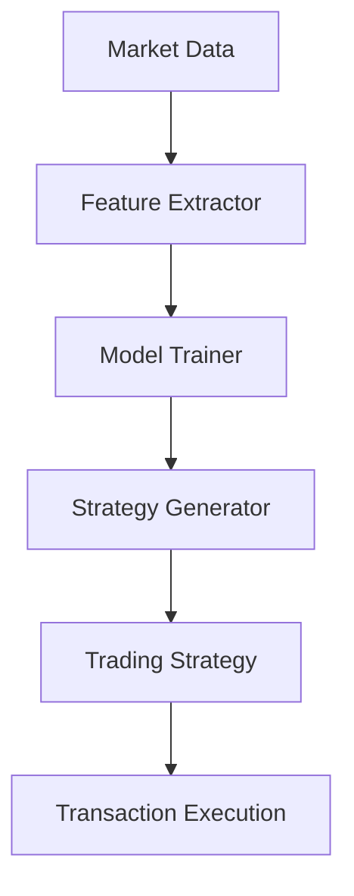

                 


# 引言：芒格的"学习机器"理念概述

## 1.1 学习机器的基本概念

### 1.1.1 什么是学习机器

学习机器是一种能够通过数据和经验不断优化自身算法和决策的智能系统。它基于数据驱动的方法，通过不断学习和适应，提升在复杂环境中的表现。

### 1.1.2 学习机器的核心特点

- **自适应性**：能够根据新的数据和环境变化自动调整模型参数。
- **数据驱动**：依赖大量数据进行训练和优化。
- **可扩展性**：能够处理不同类型和规模的数据，适用于多种应用场景。

### 1.1.3 学习机器与传统算法的区别

- **传统算法**：基于固定规则和逻辑，处理方式固定，难以适应变化。
- **学习机器**：通过数据学习，能够动态调整策略，适应环境变化。

## 1.2 芒格理念的背景与重要性

### 1.2.1 芒格的学习机器思想

芒格提出的学习机器理念强调系统能够自我学习和优化，特别是在复杂和不确定的环境中，能够通过经验不断改进决策和策略。

### 1.2.2 算法交易的现状与挑战

- **现状**：算法交易在金融市场中占据重要地位，但面对市场波动和策略过时的问题，传统算法难以适应。
- **挑战**：市场环境复杂多变，交易策略需要不断优化和调整。

### 1.2.3 学习机器在算法交易中的潜在价值

学习机器能够通过分析市场数据，识别模式和趋势，优化交易策略，提高交易效率和准确性，特别是在应对市场变化时表现优异。

## 1.3 本书的目的与结构

### 1.3.1 本书的核心目标

通过分析芒格的学习机器理念，探讨其在算法交易中的应用，展示如何利用学习机器提升算法交易的性能和适应性。

### 1.3.2 本书的章节安排

- 第二章：学习机器的理论基础
- 第三章：学习机器的核心概念与联系
- 第四章：学习机器的算法原理
- 第五章：学习机器的系统架构
- 第六章：学习机器的项目实战
- 第七章：总结与展望

### 1.3.3 本书的阅读方法

建议读者按照章节顺序阅读，结合理论与实践，理解学习机器的基本原理及其在算法交易中的具体应用。

---

# 第二章：学习机器的理论基础

## 2.1 芒格的学习机器理论

### 2.1.1 学习机器的核心原理

学习机器通过数据输入，利用算法进行特征提取和模式识别，逐步优化模型参数，提升预测和决策能力。

### 2.1.2 学习机器的特征与优势

- **特征**：自适应性、数据驱动、可扩展性。
- **优势**：能够适应复杂环境，优化决策，提高效率。

### 2.1.3 学习机器的局限性与挑战

- **局限性**：依赖数据质量和数量，模型可能过拟合。
- **挑战**：数据获取、计算资源、模型解释性。

## 2.2 算法交易的基本原理

### 2.2.1 算法交易的定义与分类

- **定义**：利用算法自动执行交易策略。
- **分类**：包括高频交易、套利策略、统计套利等。

### 2.2.2 算法交易的关键技术

- **数据处理**：实时数据获取与处理。
- **模型构建**：建立交易模型，预测市场走势。
- **执行策略**：根据模型结果自动执行交易。

### 2.2.3 算法交易的流程与实现

1. 数据采集与预处理
2. 模型训练与优化
3. 交易策略制定
4. 系统实现与测试

## 2.3 学习机器与算法交易的结合

### 2.3.1 学习机器在算法交易中的应用领域

- **预测市场走势**：利用学习机器分析历史数据，预测未来市场走势。
- **优化交易策略**：通过学习机器不断调整策略参数，提高交易效率。
- **风险控制**：利用学习机器识别市场风险，制定风险管理策略。

### 2.3.2 学习机器如何优化算法交易

- **动态调整策略**：根据市场变化，实时优化交易策略。
- **提高决策效率**：通过机器学习算法快速分析市场数据，做出最优决策。
- **降低人为干扰**：自动化交易减少人为情绪影响。

### 2.3.3 学习机器对算法交易未来的影响

- **提升交易效率**：通过自动化学习和优化，提高交易速度和准确性。
- **增强市场适应性**：学习机器能够快速适应市场变化，保持交易策略的有效性。
- **推动技术创新**：学习机器的应用将推动算法交易技术的不断进步。

---

# 第三章：学习机器的核心概念与联系

## 3.1 学习机器的原理分析

### 3.1.1 数据驱动的学习机制

学习机器通过大量数据训练，提取特征，识别模式，优化模型参数。

### 3.1.2 知识表示与更新

- **知识表示**：通过特征向量、权重矩阵等方式表示知识。
- **知识更新**：通过反馈机制，不断优化模型参数。

### 3.1.3 自适应优化算法

- **优化目标**：最大化预测准确性，最小化交易成本。
- **优化方法**：使用梯度下降、遗传算法等优化方法。

## 3.2 核心概念对比表

| 比较维度       | 学习机器                | 传统算法                |
|----------------|-------------------------|-------------------------|
| 决策方式       | 数据驱动，动态调整      | 固定规则，静态          |
| 适应性         | 强，能适应环境变化      | 弱，难以适应环境变化    |
| 数据依赖性     | 高，依赖大量数据        | 低，依赖固定规则        |
| 灵活性         | 高，适用于多种场景      | 低，适用于特定场景      |

## 3.3 实体关系图



---

# 第四章：学习机器的算法原理

## 4.1 算法原理分析

### 4.1.1 数学模型与公式

学习机器的核心算法通常基于以下数学模型：

$$
y = f(x) = \theta_0 + \theta_1x_1 + \theta_2x_2 + \dots + \theta_nx_n
$$

其中，$y$ 是预测结果，$\theta$ 是模型参数，$x$ 是输入特征。

### 4.1.2 优化目标函数

$$
\text{损失函数} = \sum_{i=1}^{n} (y_i - f(x_i))^2
$$

### 4.1.3 优化算法实现

使用梯度下降法优化模型参数：

$$
\theta_j := \theta_j - \alpha \frac{\partial L}{\partial \theta_j}
$$

其中，$\alpha$ 是学习率。

## 4.2 算法流程图



## 4.3 Python代码实现

```python
import numpy as np

class LearningMachine:
    def __init__(self, features):
        self.theta = np.zeros(len(features))
    
    def predict(self, X):
        return np.dot(X, self.theta)
    
    def train(self, X, y, alpha, iterations):
        for _ in range(iterations):
            y_pred = self.predict(X)
            gradient = (2 * np.dot(X.T, (y_pred - y)) ) / len(y)
            self.theta -= alpha * gradient
```

---

# 第五章：学习机器的系统架构

## 5.1 系统分析

### 5.1.1 问题场景介绍

系统需要在金融市场中实时处理数据，训练模型，生成交易策略，并执行交易。

### 5.1.2 项目介绍

本项目旨在构建一个基于学习机器的算法交易系统，实现自动化的市场分析和交易决策。

## 5.2 系统功能设计

### 5.2.1 领域模型类图



## 5.3 系统架构设计

### 5.3.1 系统架构图



### 5.3.2 接口设计

- **数据接口**：提供市场数据的获取和预处理接口。
- **模型接口**：提供模型训练和预测的API。
- **交易接口**：提供交易策略生成和执行的API。

### 5.3.3 交互流程

1. 获取市场数据。
2. 提取特征。
3. 训练模型。
4. 生成交易策略。
5. 执行交易。

---

# 第六章：学习机器的项目实战

## 6.1 环境安装

### 6.1.1 安装Python环境

使用Anaconda或PyCharm安装Python 3.8及以上版本。

### 6.1.2 安装依赖库

安装numpy、pandas、scikit-learn等库：

```bash
pip install numpy pandas scikit-learn
```

## 6.2 系统核心实现

### 6.2.1 数据获取与预处理

使用Yahoo Finance获取股票数据，并进行标准化处理。

### 6.2.2 模型训练与优化

训练机器学习模型，优化模型参数，提高预测准确性。

## 6.3 代码实现与解读

### 6.3.1 数据获取

```python
import pandas_datareader as pdr

def get_data(ticker, start, end):
    data = pdr.get_data_yahoo(ticker, start, end)
    return data['Close']
```

### 6.3.2 特征提取

```python
def extract_features(data, window_size=10):
    features = []
    for i in range(len(data) - window_size):
        window = data[i:i+window_size]
        features.append(window.mean())
    return features
```

### 6.3.3 模型训练

```python
from sklearn.linear_model import LinearRegression

model = LinearRegression()
features = extract_features(data)
labels = data[window_size:]
model.fit(features, labels)
```

## 6.4 实际案例分析

### 6.4.1 数据分析

分析历史股价数据，提取相关特征，识别市场趋势。

### 6.4.2 策略制定

根据模型预测结果，制定买入或卖出策略。

## 6.5 案例分析与解读

### 6.5.1 案例分析

通过实际交易数据，验证模型预测的准确性，评估交易策略的有效性。

### 6.5.2 优化建议

根据分析结果，调整模型参数，优化交易策略，提高收益。

## 6.6 项目小结

### 6.6.1 成果总结

总结项目实施成果，展示学习机器在算法交易中的实际应用效果。

### 6.6.2 经验总结

总结项目实施过程中的经验教训，为后续项目提供参考。

---

# 第七章：总结与展望

## 7.1 全文总结

### 7.1.1 学习机器的核心价值

学习机器通过数据驱动的方式，优化算法交易策略，提升交易效率和准确性。

### 7.1.2 本书的主要内容

系统介绍了学习机器的理论基础、算法原理、系统架构和项目实战。

## 7.2 未来展望

### 7.2.1 技术发展趋势

学习机器在算法交易中的应用将更加广泛，算法复杂度和计算能力将不断提升。

### 7.2.2 新的挑战与机遇

随着技术进步，学习机器在算法交易中的应用将面临新的挑战，同时也将带来新的机遇。

## 7.3 最佳实践

### 7.3.1 实践建议

建议读者结合理论与实践，积极参与项目，积累经验。

### 7.3.2 注意事项

注意数据质量和模型解释性，避免过拟合和模型黑箱问题。

## 7.4 拓展阅读

推荐相关书籍和论文，供读者深入学习。

---

# 作者信息

作者：AI天才研究院/AI Genius Institute & 禅与计算机程序设计艺术 /Zen And The Art of Computer Programming

