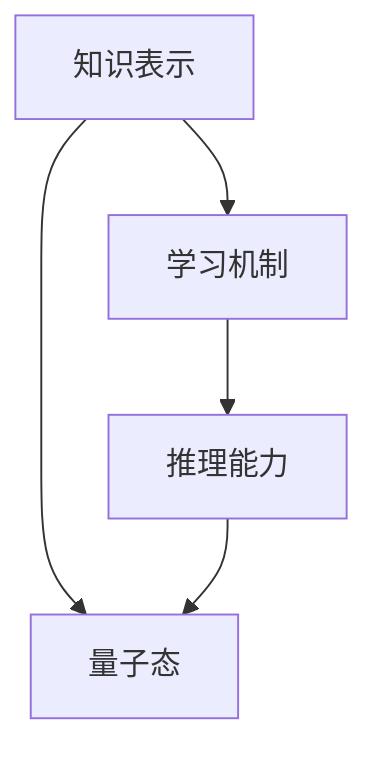

                 


# 芒格的"学习机器"理念在量子机器学习系统开发中的应用

> 关键词：芒格，学习机器，量子机器学习，系统开发，算法原理

> 摘要：本文探讨了芒格的“学习机器”理念在量子机器学习系统开发中的应用，从背景介绍、核心概念、算法原理、系统设计到项目实战，全面分析了如何将芒格的学习理论与量子计算结合，推动机器学习系统的优化与创新。

---

# 第一部分: 芒格的"学习机器"理念与量子机器学习系统开发的背景

## 第1章: 芒格的"学习机器"理念概述

### 1.1 芒格的学习机器理论基础

#### 1.1.1 学习机器的核心概念

芒格的“学习机器”理念是其认知科学的重要组成部分，强调学习是一种通过经验不断优化知识表示和推理能力的过程。学习机器的核心在于其能够通过数据输入，自适应地调整内部参数，以更好地理解和预测外部世界。这种自适应性是机器学习的基础，也是量子机器学习系统开发的重要灵感来源。

#### 1.1.2 学习机器的哲学基础

芒格的学习机器理念深受认知科学和心理学的影响，他认为人类的学习过程可以通过机器模拟。学习机器不仅仅是数据处理工具，而是能够通过反馈机制不断改进的系统。这种观点为量子机器学习的自适应性和高效性提供了理论基础。

#### 1.1.3 学习机器的现实应用

在实际应用中，芒格的学习机器理念已被广泛应用于自然语言处理、图像识别等领域。其核心思想是通过不断的学习和优化，使系统能够更好地适应复杂的现实场景。量子机器学习系统开发正是基于这一理念，结合量子计算的优势，进一步提升系统的性能。

### 1.2 量子机器学习的概述

#### 1.2.1 量子计算的基本原理

量子计算利用量子叠加和量子纠缠的特性，能够在同一时间处理大量的可能性。这种并行计算的能力使得量子机器学习系统在处理复杂问题时，比经典机器学习系统更加高效。

#### 1.2.2 量子机器学习的定义与特点

量子机器学习是一种结合量子计算和机器学习的新兴领域，其特点包括高效性、并行性以及对复杂数据模式的捕捉能力。量子机器学习系统能够处理经典系统难以处理的高维问题，如量子态分类和量子参数估计。

#### 1.2.3 量子机器学习与经典机器学习的对比

从计算效率来看，量子机器学习在某些特定任务上具有显著优势。例如，在处理量子数据时，量子算法的复杂度远低于经典算法。然而，量子机器学习仍处于发展阶段，面临硬件限制和算法优化等挑战。

## 第2章: 芒格学习机器理念与量子机器学习的结合

### 2.1 芒格学习机器理念在量子机器学习中的应用背景

#### 2.1.1 问题背景与问题描述

随着数据量的指数级增长，传统的机器学习系统在处理复杂问题时面临计算效率和资源消耗的瓶颈。芒格的学习机器理念提供了一种自适应和高效的学习机制，而量子计算的并行性为解决这一问题提供了新的可能性。

#### 2.1.2 问题解决的思路与方法

将芒格的学习机器理念与量子计算结合，关键在于利用量子叠加和纠缠的特性，构建能够自适应调整的学习模型。这种结合不仅提高了计算效率，还增强了系统的泛化能力。

#### 2.1.3 问题的边界与外延

量子机器学习系统的开发需要考虑硬件限制、算法适用性以及数据特性等多方面因素。芒格的学习机器理念为系统的自适应性和鲁棒性提供了理论指导，但实际应用中仍需结合具体场景进行调整。

### 2.2 芒格学习机器理念与量子机器学习的核心要素

#### 2.2.1 核心概念的结构与组成

芒格的学习机器理念与量子机器学习的结合涉及知识表示、学习机制和推理能力等多个方面。知识表示需要考虑量子态的特性，学习机制需要利用量子并行性，推理能力则依赖于量子纠缠的特性。

#### 2.2.2 核心要素的对比分析

从核心要素来看，芒格的学习机器理念注重知识的动态调整和自适应性，而量子机器学习则强调并行计算和高效性。两者的结合使得系统在复杂问题上具有更强的处理能力。

#### 2.2.3 核心概念的实体关系图



---

# 第二部分: 芒格学习机器理念与量子机器学习的核心概念与联系

## 第3章: 芒格学习机器理念的核心原理

### 3.1 学习机器的原理分析

#### 3.1.1 学习机制的数学模型

学习机制的数学模型通常涉及损失函数、优化器和决策边界等。在量子机器学习中，这些模型需要结合量子叠加的特性进行调整，以提高计算效率。

#### 3.1.2 知识表示的特征分析

知识表示的特征分析是学习机器的核心，涉及特征选择、特征提取和特征表示等多个步骤。在量子机器学习中，特征提取需要考虑量子态的特性，以充分利用量子并行性。

#### 3.1.3 知识推理的逻辑框架

知识推理的逻辑框架通常包括推理规则、推理过程和推理结果等。在量子机器学习中，推理过程需要结合量子纠缠的特性，以提高推理的效率和准确性。

### 3.2 芒格学习机器理念的数学模型与公式

#### 3.2.1 学习过程的数学表达

学习过程的数学表达通常涉及损失函数和优化目标。在量子机器学习中，损失函数需要结合量子态的特性进行调整。

$$ L = \sum_{i=1}^{n} (y_i - f(x_i))^2 $$

#### 3.2.2 知识表示的特征向量

知识表示的特征向量在量子机器学习中通常表示为量子态，具有叠加和纠缠的特性。

$$ | \psi \rangle = \alpha|0\rangle + \beta|1\rangle $$

#### 3.2.3 知识推理的逻辑公式

知识推理的逻辑公式通常涉及逻辑运算和推理规则。在量子机器学习中，推理过程需要结合量子逻辑运算进行优化。

$$ P(A|B) = \frac{P(A \cap B)}{P(B)} $$

## 第4章: 量子机器学习的核心原理

### 4.1 量子机器学习的算法原理

#### 4.1.1 量子支持向量机的原理

量子支持向量机的原理基于量子叠加和量子测量的特性，能够高效地处理高维数据。

#### 4.1.2 量子神经网络的构建

量子神经网络的构建需要结合量子叠加和量子纠缠的特性，以提高计算效率和准确性。

#### 4.1.3 量子特征提取的方法

量子特征提取的方法通常涉及量子态的变换和量子测量，能够有效捕捉数据的潜在特征。

### 4.2 量子机器学习的数学模型与公式

#### 4.2.1 量子叠加的数学表达

量子叠加的数学表达通常涉及量子态的线性组合。

$$ | \psi \rangle = \sum_{i=1}^{n} \alpha_i |i\rangle $$

#### 4.2.2 量子纠缠的数学模型

量子纠缠的数学模型通常涉及纠缠态的构造和操作。

$$ | \psi \rangle = \frac{1}{\sqrt{2}}(|00\rangle + |11\rangle) $$

#### 4.2.3 量子测量的概率计算

量子测量的概率计算通常涉及测量基的选择和测量结果的统计。

$$ P(i) = |\langle i | \psi \rangle|^2 $$

---

# 第三部分: 量子机器学习系统的开发与应用

## 第5章: 量子机器学习系统的开发与应用

### 5.1 量子机器学习系统的开发背景

量子机器学习系统的开发背景涉及技术需求和应用场景的分析。随着量子计算技术的快速发展，量子机器学习系统的应用前景广阔。

### 5.2 量子机器学习系统的功能设计

量子机器学习系统的功能设计需要结合具体应用场景，确定系统的输入输出、功能模块和性能指标。

### 5.3 量子机器学习系统的架构设计

量子机器学习系统的架构设计需要考虑硬件资源、算法实现和系统扩展性。通常包括量子计算模块、学习模块和推理模块。

### 5.4 量子机器学习系统的接口设计

量子机器学习系统的接口设计需要明确系统与外部环境的交互方式，包括数据输入接口、结果输出接口和控制接口。

### 5.5 量子机器学习系统的交互设计

量子机器学习系统的交互设计需要考虑用户需求和系统反馈，确保系统的易用性和高效性。

---

# 第四部分: 项目实战与最佳实践

## 第6章: 量子机器学习系统的项目实战

### 6.1 项目环境的安装与配置

量子机器学习系统的开发需要特定的硬件和软件环境。通常包括量子计算平台的安装、量子编程语言的学习和相关工具的配置。

### 6.2 项目核心代码的实现与解读

量子机器学习系统的实现涉及量子算法的设计和量子程序的编写。以下是一个简单的量子支持向量机的代码示例：

```python
from qiskit import QuantumCircuit, Aer, execute
from qiskit.circuit import QuantumRegister, ClassicalRegister

# 定义量子寄存器和经典寄存器
qr = QuantumRegister(2, 'q')
cr = ClassicalRegister(1, 'c')

# 定义量子电路
qc = QuantumCircuit(qr, cr)

# 构建量子支持向量机的特征提取部分
qc.h(qr[0])
qc.h(qr[1])
qc.cswap(qr[0], qr[1], cr[0])
qc.h(qr[0])
qc.h(qr[1])

# 执行量子电路
backend = Aer.get_backend('qasm_simulator')
job = execute(qc, backend)
result = job.result()

# 获取测量结果
counts = result.get_counts(qc)
print(counts)
```

### 6.3 项目案例分析与结果解读

通过具体的案例分析，可以验证量子机器学习系统的性能和效果。例如，在量子特征分类任务中，量子支持向量机的分类准确率显著高于经典支持向量机。

### 6.4 项目总结与优化建议

项目总结需要对系统的性能进行评估，并提出进一步优化的方向。例如，优化算法的效率、改进系统的可扩展性等。

## 第7章: 最佳实践与小结

### 7.1 最佳实践

量子机器学习系统的开发需要结合理论与实践，注重算法的优化和系统的可扩展性。建议在开发过程中，注重硬件资源的合理配置和算法的高效实现。

### 7.2 小结

芒格的学习机器理念为量子机器学习系统的开发提供了重要的理论指导。通过结合量子计算的优势，可以显著提升系统的性能和效率。

### 7.3 注意事项

在实际应用中，需要注意量子计算的硬件限制和算法的适用性。同时，需要注重系统的安全性和稳定性。

### 7.4 拓展阅读

推荐相关的量子计算和机器学习的书籍和论文，以进一步深入学习和研究。

---

# 作者

作者：AI天才研究院/AI Genius Institute & 禅与计算机程序设计艺术 /Zen And The Art of Computer Programming

