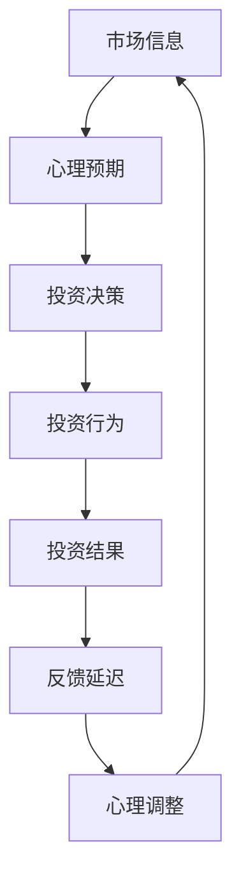

                 

# 《芒格的"延迟反馈"理论：长期投资的心理挑战》

---

## 关键词：  
芒格, 延迟反馈, 长期投资, 心理挑战, 投资心理, 双曲线贴现模型, 投资策略

---

## 摘要：  
芒格的“延迟反馈”理论揭示了在长期投资中，由于结果的延迟性，投资者往往会面临巨大的心理挑战。本文从理论背景、心理学分析、应对策略等多个角度，深入探讨了延迟反馈对投资决策的影响，并结合实际案例，提出了应对长期投资中延迟反馈的有效方法。通过本文的分析，读者可以更好地理解长期投资中的心理陷阱，并找到克服这些挑战的策略。

---

# 第1章：引言

## 1.1 芒格与延迟反馈理论  
芒格是巴菲特的长期合作伙伴，以其独特的投资理念和理性决策闻名。他提出的“延迟反馈”理论，强调了在长期投资中，由于结果的延迟性，投资者往往会面临巨大的心理挑战。本文将从芒格的理论出发，探讨这一理论的核心概念及其在投资实践中的应用。

## 1.2 本文的核心问题  
在长期投资中，延迟反馈为何会导致投资者心理上的困扰？如何克服这些困扰，制定有效的投资策略？本文将通过理论分析、案例研究和实证分析，逐一解答这些问题。

## 1.3 本文的结构安排  
本文分为以下几个部分：  
- 第2章：延迟反馈理论的定义与特点。  
- 第3章：投资心理学基础。  
- 第4章：延迟反馈的系统分析。  
- 第5章：应对延迟反馈的策略。  
- 第6章：案例分析与长期影响。  
- 第7章：未来展望。  

---

# 第2章：延迟反馈理论的定义与特点

## 2.1 延迟反馈的定义  
延迟反馈是指在行为之后，结果并不是立即显现的，而是经过一段时间后才呈现的反馈机制。在投资领域，延迟反馈的表现尤为明显，因为市场的波动、经济的变化都需要时间才能体现到投资回报中。

## 2.2 延迟反馈与即时反馈的对比  

| 对比维度         | 延迟反馈                  | 即时反馈                  |
|------------------|---------------------------|---------------------------|
| 反馈时间         | 长期                      | 短期                      |
| 反馈强度         | 较弱                      | 较强                      |
| 对决策的影响     | 不确定性高，心理压力大     | 确定性高，心理压力小       |
| 应用场景         | 长期投资、战略决策        | 短期交易、战术决策        |

## 2.3 延迟反馈在投资中的表现  
在投资中，延迟反馈主要表现为：  
- 市场波动导致投资回报的不确定性增加。  
- 投资者在短期内无法获得明确的反馈，难以判断投资决策的正确性。  
- 长期投资的复利效应需要时间才能体现。  

---

# 第3章：投资心理学基础

## 3.1 投资者心理概述  
投资者的行为往往受到心理因素的影响，如贪婪、恐惧、过度自信等。这些心理偏差会干扰投资者的理性决策，尤其是在延迟反馈的环境中。

## 3.2 心理预期与延迟反馈  
心理预期是投资者在延迟反馈环境中做出决策的核心因素。以下是心理预期的关键点：  
- 投资者倾向于低估未来市场的不确定性。  
- 过度关注短期市场波动，忽视长期趋势。  
- 高估自己的预测能力，低估市场的复杂性。  

## 3.3 双曲线贴现模型  
双曲线贴现模型（Holtzblatt's Hyperbolic Discounting Model）可以解释延迟反馈对投资者决策的影响。该模型认为，人类对未来的重视程度会随着时间的推移而迅速下降，导致投资者更关注短期收益，而忽视长期价值。

---

# 第4章：延迟反馈的系统分析

## 4.1 延迟反馈的系统结构  
延迟反馈系统可以分为以下几个部分：  
- 输入：市场信息、投资决策。  
- 处理：心理预期、投资行为。  
- 输出：投资结果。  
- 时间因素：反馈延迟的关键因素。  

## 4.2 延迟反馈的系统流程图  

---

# 第5章：应对延迟反馈的策略

## 5.1 制定明确的投资计划  
- 设定清晰的投资目标和时间框架。  
- 避免频繁调整投资策略，减少短期波动的干扰。  

## 5.2 建立心理防线  
- 了解延迟反馈的心理影响，增强心理抗压能力。  
- 定期复盘，调整心理预期。  

## 5.3 分散投资风险  
- 通过多元化投资降低风险。  
- 保持合理的资产配置比例。  

---

# 第6章：案例分析与长期影响

## 6.1 成功案例分析  
以巴菲特为例，他始终坚持长期投资，注重企业的内在价值，忽视短期市场波动。这种策略的成功证明了延迟反馈理论的有效性。

## 6.2 失败案例分析  
许多投资者因无法承受短期亏损的压力，频繁买卖，最终错失长期收益。这表明，克服延迟反馈的心理挑战至关重要。  

## 6.3 长期影响的数学模型  

$$
A = P \times (1 + r)^n
$$  

其中，\( A \) 为终值，\( P \) 为本金，\( r \) 为年化收益率，\( n \) 为投资时间。该公式展示了长期投资的复利效应。

---

# 第7章：未来展望

## 7.1 未来的投资环境  
随着科技的发展，市场信息的透明化和实时化将加剧延迟反馈的挑战。投资者需要更加注重长期价值，避免被短期信息干扰。

## 7.2 应对策略的调整  
未来，投资者需要结合技术手段（如大数据分析、人工智能）来优化投资决策，降低延迟反馈的影响。

---

# 结语  
芒格的延迟反馈理论为我们理解长期投资中的心理挑战提供了深刻的洞见。通过理论分析和实际案例，我们可以更好地应对延迟反馈带来的心理压力，制定科学的投资策略。

---

# 作者：  
AI天才研究院/AI Genius Institute & 禅与计算机程序设计艺术/Zen And The Art of Computer Programming

