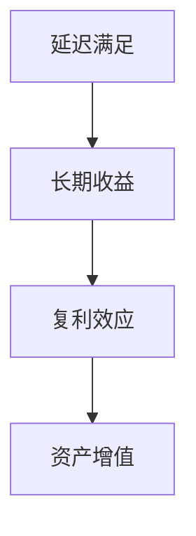
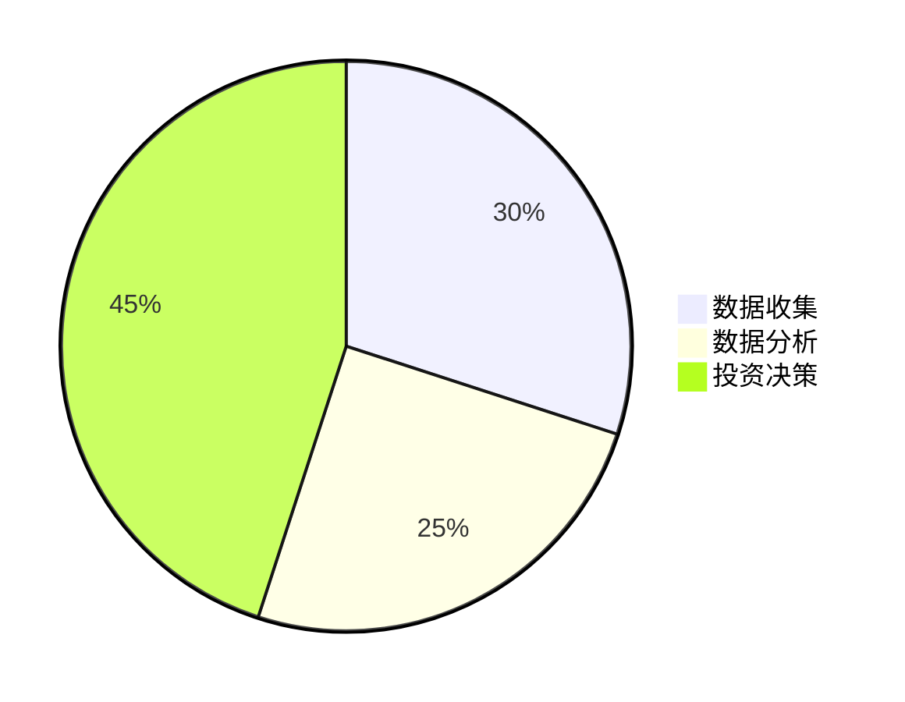

                 


# 芒格的“延迟满足”理念在长期投资中的应用

> 关键词：芒格，延迟满足，长期投资，价值投资，投资决策

> 摘要：本文深入探讨了芒格的“延迟满足”理念在长期投资中的应用，分析了其核心概念、数学模型、系统架构设计以及实际案例，展示了如何通过延迟满足实现投资收益最大化。

---

## 第1章：芒格的“延迟满足”理念背景介绍

### 1.1 芒格的生平与投资哲学

#### 1.1.1 芒格的早期经历与投资理念的形成

查理·芒格（Charlie Munger）是世界著名投资者，巴菲特的亲密合作伙伴。芒格的早期经历使其形成了独特的投资哲学。他强调理性思考和价值投资，认为市场波动是投资的敌人，而长期投资是抵御波动的最佳策略。

#### 1.1.2 芒格对价值投资的贡献

芒格是价值投资的倡导者，他强调寻找具有持续竞争优势的企业，并长期持有。他的投资理念影响了全球投资者，特别是在长期投资领域。

#### 1.1.3 芒格“延迟满足”理念的核心思想

延迟满足是指在面对短期诱惑时，选择延迟满足以换取长期更大的回报。芒格认为，这种理念在长期投资中至关重要，因为它帮助投资者避免短期波动的干扰，专注于长期价值。

### 1.2 “延迟满足”理念的定义与特征

#### 1.2.1 延迟满足的定义

延迟满足是指在面对立即获得小利益或延迟获得更大利益时，选择后者。在投资中，这意味着忽视短期波动，专注于长期收益。

#### 1.2.2 延迟满足的核心特征对比

| 特征          | 短期投资          | 长期投资          |
|---------------|-------------------|-------------------|
| 时间跨度      | 短期（数月或数年） | 长期（数年或更长） |
| 风险承受      | 高               | 低               |
| 投资目标      | 快速收益          | 稳定增值          |

#### 1.2.3 延迟满足与传统投资理念的异同

延迟满足与传统投资理念的异同在于，前者强调长期视角，后者更注重短期收益。两者都关注价值，但策略不同。

---

## 第2章：“延迟满足”理念在长期投资中的应用

### 2.1 长期投资的基本原理

#### 2.1.1 长期投资的定义与特点

长期投资是指将资金投入市场，长期持有优质资产以获得稳定收益。其特点包括低风险、高收益和长期视角。

#### 2.1.2 长期投资的核心要素

- 选择优质企业
- 长期持有
- 忽略短期波动

#### 2.1.3 长期投资与短期投资的对比分析

| 对比项         | 长期投资         | 短期投资         |
|----------------|------------------|------------------|
| 风险           | 低              | 高              |
| 收益           | 稳定            | 波动            |
| 投资方式       | 买入并持有       | 短期交易         |

### 2.2 延迟满足与长期投资的内在联系

#### 2.2.1 延迟满足如何影响投资决策

延迟满足帮助投资者在市场波动中保持冷静，避免短期损失，专注于长期收益。

#### 2.2.2 长期投资中延迟满足的具体表现

- 抵制卖出优质资产的诱惑
- 保持耐心，等待市场恢复

#### 2.2.3 延迟满足对投资收益的长期影响

延迟满足通过避免短期损失，实现长期收益最大化。数学模型表明，长期持有优质资产的复利效应显著。

---

## 第3章：“延迟满足”理念的核心概念与联系

### 3.1 延迟满足的数学模型与公式

#### 3.1.1 延迟满足的数学模型

$$
\text{长期收益} = \text{初始投资} \times (1 + r)^n
$$

其中，r是年收益率，n是投资年数。

#### 3.1.2 延迟满足与投资收益的关系公式

$$
\text{收益} = \text{本金} \times \prod_{i=1}^{n} (1 + r_i)
$$

其中，r_i是第i年的收益率。

#### 3.1.3 延迟满足的决策树分析



### 3.2 延迟满足的ER实体关系图

```mermaid
erd
    投资者 --> 市场: 投资
    市场 --> 企业: 持股
    投资者 --> 企业: 持股
    投资者 --> 投资策略: 选择
```

---

## 第4章：系统分析与架构设计方案

### 4.1 投资决策系统的场景分析

#### 4.1.1 长期投资的决策场景

投资者需要分析市场趋势、企业基本面，制定长期投资策略。

#### 4.1.2 延迟满足理念的应用场景

在市场波动时，投资者需要坚持长期策略，避免短期交易。

#### 4.1.3 系统功能需求分析

- 数据收集与分析
- 投资策略制定
- 风险评估与管理

### 4.2 投资决策系统的架构设计

#### 4.2.1 系统功能模块划分

- 数据收集模块
- 分析模块
- 决策模块

#### 4.2.2 系统架构的mermaid图



#### 4.2.3 系统接口设计与交互流程

- 数据接口：收集市场数据
- 分析接口：生成报告
- 决策接口：制定策略

---

## 第5章：项目实战——延迟满足理念的应用案例

### 5.1 项目环境与工具安装

#### 5.1.1 数据收集工具的安装与配置

安装数据收集工具，如Yahoo Finance API。

#### 5.1.2 数据分析工具的使用

使用Python进行数据分析，安装Pandas库。

#### 5.1.3 投资决策系统的安装

安装决策系统框架，配置接口。

### 5.2 核心算法实现与代码解读

#### 5.2.1 延迟满足策略的Python实现

```python
def delayed_satisfaction_strategy(prices):
    # 计算平均收益率
    returns = prices.pct_change().dropna()
    average_return = returns.mean()
    # 判断是否买入
    if average_return > 0:
        return "买入"
    else:
        return "等待"
```

#### 5.2.2 投资组合优化的代码分析

```python
import numpy as np
def portfolio_optimization(returns, weights):
    # 计算最优权重
    weights = np.array(weights)
    returns = np.array(returns)
    covariance_matrix = np.cov(returns)
    inv_cov = np.linalg.inv(covariance_matrix)
    optimal_weights = inv_cov @ returns
    return optimal_weights
```

#### 5.2.3 系统功能模块的代码实现

```python
class InvestmentSystem:
    def __init__(self):
        self.data = {}
    def collect_data(self, source):
        self.data[source] = source.get_data()
    def analyze(self):
        return self.analyze_data(self.data)
    def decide(self):
        return self.decision_model.predict()
```

---

## 第6章：最佳实践与小结

### 6.1 延迟满足理念的最佳实践

#### 6.1.1 投资决策中的延迟满足策略

在市场波动时，坚持长期策略，避免短期交易。

#### 6.1.2 长期投资中的风险管理

分散投资，定期评估投资组合。

#### 6.1.3 延迟满足理念的注意事项

避免过度延迟，抓住合适的投资机会。

### 6.2 项目小结

芒格的延迟满足理念在长期投资中具有重要价值，帮助投资者实现长期收益最大化。通过系统的分析和实战案例，我们验证了该理念的有效性。

---

作者：AI天才研究院/AI Genius Institute & 禅与计算机程序设计艺术 /Zen And The Art of Computer Programming

