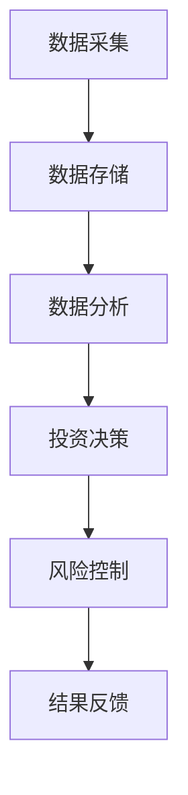
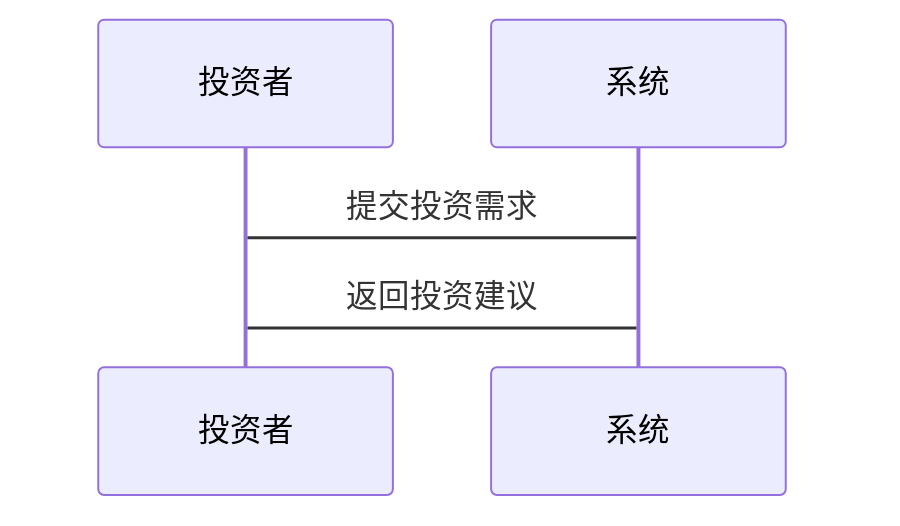

                 


# 芒格的"延迟满足"理念在长期科技投资组合中的应用

> 关键词：芒格、延迟满足、科技投资、投资组合、长期策略

> 摘要：本文深入探讨了芒格的“延迟满足”理念在长期科技投资组合中的应用。通过分析“延迟满足”的核心思想，结合科技投资的特点，提出了基于多元思维模型的投资策略，并详细讲解了如何构建长期科技投资组合。文章结合实际案例，给出了具体的实施方法和注意事项，为投资者提供了切实可行的指导。

---

## 第一部分：芒格的"延迟满足"理念

### 第1章：芒格的"延迟满足"理念

#### 1.1 核心概念与背景

“延迟满足”是芒格投资哲学中的一个核心理念，强调在面对不确定性时，投资者应具备延迟决策的能力，避免被短期波动所左右。这一理念与现代科技投资的高度不确定性相契合。

- **定义**：延迟满足是指在面对投资机会时，不急于做出决策，而是通过深入分析和等待，找到最优的投资时机和标的。
- **背景**：科技行业的特点是高度不确定性和快速变化，传统的短期投资策略往往难以应对这种波动。

#### 1.2 延迟满足的核心思想

- **长期视角**：芒格认为，投资的本质是寻找能够长期创造价值的企业。
- **安全边际**：通过延迟决策，投资者可以更好地评估风险，确保投资的安全性。
- **逆向思维**：在市场恐慌时寻找机会，在市场狂热时保持冷静。

#### 1.3 与传统投资策略的对比

| 对比维度         | 传统投资策略         | 延迟满足策略         |
|------------------|----------------------|----------------------|
| 投资周期         | 短期为主             | 长期为主             |
| 决策依据         | 市场波动、短期收益   | 企业基本面、长期价值 |
| 风险控制         | 依赖市场时机         | 强调安全边际         |

---

## 第二部分：科技投资的基本逻辑

### 第2章：科技投资的核心逻辑

#### 2.1 科技行业的特点

- **技术迭代快**：科技行业以技术驱动为核心，企业需要不断创新以保持竞争力。
- **市场波动大**：科技行业的市场波动往往比传统行业更大，这增加了投资的难度。
- **门槛高**：科技行业通常需要较高的技术壁垒，这使得竞争更加激烈。

#### 2.2 科技投资的周期与阶段

- **初期阶段**：技术创新驱动，投资者需要关注企业的技术优势和创新能力。
- **成熟阶段**：规模效应驱动，企业通过规模化生产降低成本，扩大市场份额。
- **衰退阶段**：成本优势驱动，企业通过优化成本结构延长生命周期。

#### 2.3 企业的核心评估标准

- **技术壁垒**：企业的核心技术是否具有不可替代性。
- **市场地位**：企业在市场中的占有率和品牌影响力。
- **财务健康状况**：企业的盈利能力、现金流和资产负债情况。

---

## 第三部分：芒格理念与科技投资的结合

### 第3章：多元思维模型在科技投资中的应用

#### 3.1 多元思维模型的定义

多元思维模型是指投资者通过多个维度（技术、市场、财务等）来分析企业，从而做出更全面的投资决策。芒格认为，投资者应该构建一个由多个学科知识组成的框架，以避免单一视角的局限性。

#### 3.2 多元思维模型的具体应用

- **技术分析**：评估企业的技术优势和创新潜力。
- **市场分析**：判断企业的市场定位和竞争优势。
- **财务分析**：评估企业的财务健康状况和盈利能力。

#### 3.3 投资决策中的具体应用

1. **技术壁垒分析**：通过技术专利数量、研发团队实力等指标，评估企业的技术优势。
2. **市场地位分析**：通过市场份额、品牌影响力等指标，评估企业在市场中的竞争力。
3. **财务健康分析**：通过利润表、资产负债表等财务报表，评估企业的财务状况。

---

### 第4章：延迟满足理念在科技投资中的具体应用

#### 4.1 长期视角下的投资策略

- **长期复利效应**：通过长期投资，投资者可以享受复利带来的收益增长。
- **耐心资本**：在科技投资中，投资者需要具备耐心，等待最佳的投资时机。

#### 4.2 逆向思维的应用

- **恐慌时买入**：在市场恐慌时，寻找被低估的投资机会。
- **冷静时卖出**：在市场狂热时，保持冷静，避免盲目追涨。

#### 4.3 安全边际的构建

- **估值分析**：通过合理的估值方法，确保投资的安全性。
- **风险控制**：通过分散投资、设置止损等方式，降低投资风险。

---

## 第四部分：投资组合的构建与优化

### 第5章：投资组合的构建方法

#### 5.1 资产配置策略

- **分散投资**：通过分散投资，降低单一资产的风险。
- **动态调整**：根据市场变化和企业情况，动态调整投资组合。

#### 5.2 风险管理策略

- **止损机制**：设定止损点，避免亏损过大。
- **风险分散**：通过投资不同领域的资产，降低整体风险。

#### 5.3 投资策略的选择

- **价值投资**：寻找被低估的企业进行长期投资。
- **成长投资**：投资于具有高成长潜力的企业。

---

### 第6章：系统分析与架构设计

#### 6.1 系统功能设计

- **功能模块**：包括数据采集、数据分析、投资决策、风险控制等模块。
- **功能流程**：数据采集→数据分析→投资决策→风险控制→结果反馈。

#### 6.2 系统架构设计



#### 6.3 接口设计

- **数据接口**：与外部数据源（如金融数据库）对接。
- **用户接口**：与投资者进行交互，提供投资建议。

#### 6.4 交互设计



---

## 第五部分：项目实战与总结

### 第7章：项目实战

#### 7.1 环境安装

- **工具安装**：安装数据分析工具（如Python、Pandas、Matplotlib）。
- **数据源获取**：获取科技企业的财务数据和市场数据。

#### 7.2 核心代码实现

```python
import pandas as pd
import numpy as np

# 示例代码：计算企业的市盈率
def calculate_pe_ratio(price, earnings):
    return price / earnings

# 数据加载
data = pd.read_csv('tech_stocks.csv')

# 计算市盈率
data['PE Ratio'] = data.apply(lambda x: calculate_pe_ratio(x['Price'], x['Earnings']), axis=1)
```

#### 7.3 案例分析

- **案例背景**：某科技企业在市场低迷时期被低估。
- **投资决策**：通过多元思维模型分析，发现该企业具有强大的技术壁垒和财务健康状况，决定进行长期投资。

---

### 第8章：总结与展望

#### 8.1 总结

芒格的“延迟满足”理念为科技投资提供了重要的指导思想。通过构建多元思维模型和长期投资策略，投资者可以在不确定的科技市场中找到优质的投资机会。

#### 8.2 展望

未来，随着科技行业的快速发展，芒格理念的应用将更加广泛。投资者需要不断学习和适应市场的变化，以实现长期的投资目标。

---

## 第六部分：最佳实践与注意事项

### 第9章：最佳实践

#### 9.1 投资建议

- **长期视角**：坚持长期投资，避免短期波动的影响。
- **分散投资**：通过分散投资降低整体风险。
- **持续学习**：不断更新知识，适应市场的变化。

#### 9.2 小结

芒格的“延迟满足”理念为科技投资提供了重要的指导思想。通过构建多元思维模型和长期投资策略，投资者可以在不确定的科技市场中找到优质的投资机会。

---

## 作者信息

作者：AI天才研究院/AI Genius Institute & 禅与计算机程序设计艺术 /Zen And The Art of Computer Programming

---

通过以上结构，我们可以系统地分析芒格的“延迟满足”理念在长期科技投资组合中的应用，并结合实际案例和系统设计，为投资者提供切实可行的指导。

